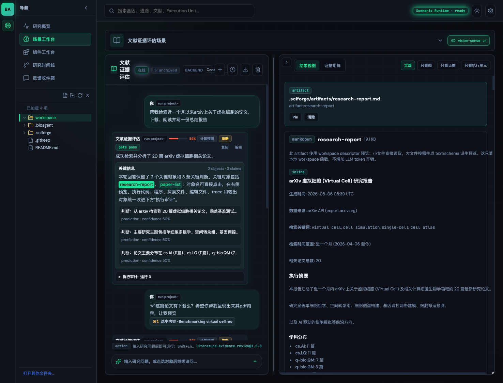

# SciForge

SciForge 是一个面向 AI4Science 的 scenario-first 科研工作台，用来把松散的科研问题转化为可审计的科学 artifact、可执行的 workspace task，以及可以沉淀复用的 skill。

它不是“一个聊天框 + 一堆临时回答”。SciForge 会把工作组织到具体研究场景里，例如文献证据评估、分子结构探索、组学差异分析、生物医学知识图谱，以及用户自己定义的 scenario package。每次运行都可以产生结构化 artifact、ExecutionUnit、证据 claim、UIManifest、日志和失败恢复诊断。

> 当前状态：活跃研发原型。项目优先服务本地 workspace-backed 科研实验、透明失败状态和 self-evolving skills，而不是把复杂自动化包装成黑盒。

## 为什么需要 SciForge

- **以科研场景为入口**：从文献评估、结构分析、组学探索等场景开始，而不是从空白 prompt 开始。
- **结构化科学产物**：支持报告、证据矩阵、论文列表、知识图谱、组学表格、图表、执行日志和 notebook timeline。
- **可审计执行链路**：真实任务可以记录 `ExecutionUnit`，包括代码引用、stdout/stderr 引用、输出引用、runtime profile 和 repair history。
- **AgentServer 后端推理**：正常用户可见回答由配置的 agent backend 理解和生成；SciForge 负责 contract、routing、持久化、恢复和展示。
- **Self-evolving skills**：任务代码先在当前 workspace 中生成、修复和验证；稳定后再由用户确认沉淀为可复用 skill。
- **组件注册表 UI**：artifact 通过已注册的科学组件渲染，而不是执行任意生成式 UI 代码。
- **失败是一等状态**：缺失输入、后端错误、context-window 压力、schema 失败和 repair hints 都会保留给下一轮。

## 产品截图

下面是从本地开发服务截取的真实产品界面，展示了 workspace 文件树、场景工作台、运行状态、artifact 预览和结构化结果视图。



## 后续绘图 Prompt

下面这些 prompt 可用于后续生成架构图、artifact gallery 或更完整的产品视觉素材。Prompt 保持英文，方便直接交给 AI 绘图工具。

```text
IMAGE PROMPT: A crisp product screenshot mockup of SciForge, a dark scientific workbench UI with a left workspace file explorer, center scenario chat, and right structured results panel showing an evidence matrix, execution units, and artifact cards. Style: realistic SaaS app screenshot, subtle teal/coral accents, dense but readable research UI, no fake brand logos, 16:9.
```

```text
IMAGE PROMPT: Editorial diagram showing the SciForge workflow: Research Scenario -> AgentServer reasoning -> workspace task code -> artifacts and ExecutionUnits -> registered scientific UI components -> reusable skill promotion. Style: clean technical architecture diagram, white background, precise labels, no cartoon characters.
```

```text
IMAGE PROMPT: Scientific artifact gallery for SciForge: paper cards, claim-evidence matrix, molecular 3D structure panel, volcano plot, UMAP plot, knowledge graph, notebook timeline. Style: premium product collage, dark UI panels, high legibility, realistic data visualization shapes, 16:9.
```

## 可以用 SciForge 做什么

- 文献证据评估：论文列表、claim/evidence map、冲突表、证据矩阵和研究报告。
- 分子结构探索：分子可视化、结合位点/配体摘要、结构质量指标和 provenance。
- 组学差异分析：火山图、热图、UMAP、数据表、QC 记录和运行日志。
- 生物医学知识图谱：节点、边、证据引用、claim 状态和更新历史。
- 自定义 scenario package：组合 skills、tools、artifact schemas、UI components 和 failure policies。

## 快速开始

环境要求：

- Node.js 20+
- npm
- 一个本地 workspace 目录，用于写入 `.sciforge/` 状态
- 可选但推荐：AgentServer endpoint，用于真实 agent-backed task generation

安装并启动完整本地应用：

```bash
npm install
npm run dev
```

打开：

```text
http://localhost:5173/
```

`npm run dev` 会同时启动 Vite UI 和 scenario chat 使用的 workspace runtime。只启动 UI：

```bash
npm run dev:ui
```

如果你单独启动 UI，但仍需要 workspace-backed runs 或持久化聊天记录，还需要启动：

```bash
npm run workspace:server
```

## 配置 Workspace

在应用的 Settings 中配置：

- `Workspace Path`：`.sciforge/` 状态、任务文件、日志、artifact 和 scenario packages 的存储目录。
- `AgentServer Base URL`：用于 agent 推理和任务生成的后端地址。
- `Agent Backend`：Codex、OpenTeam Agent、Claude Code、Gemini、Hermes、OpenClaw，或其它已配置后端。
- 模型 provider、base URL、model name、API key、request timeout 和 context-window budget。

SciForge 会把 workspace 状态写入：

```text
<workspace>/.sciforge/
```

常见生成路径：

```text
<workspace>/.sciforge/workspace-state.json
<workspace>/.sciforge/sessions/*.json
<workspace>/.sciforge/artifacts/*.json
<workspace>/.sciforge/tasks/*
<workspace>/.sciforge/task-results/*
<workspace>/.sciforge/logs/*
<workspace>/.sciforge/scenarios/*
```

## 核心概念

### Observe / Reason / Action / Verify

SciForge 的长期能力组织方式是 **Observe / Reason / Action / Verify**：

```text
senses      Observe：把截图、图像、文件、窗口状态等外部信息转成可审计文本结果
skills      Reason：描述 agent 的任务策略、领域知识、artifact contract 和失败模式
actions     Action：执行会改变环境的动作，例如 GUI 操作、文件编辑、kernel/notebook 执行
verifiers   Verify：检查结果、trace、artifact 和环境状态，输出 verdict/reward/critique
ui views    Present：把 artifact 渲染成可读、可交互、可引用的科学界面
```

这种拆分避免把所有能力都塞进“工具列表”。Agent 只拿到紧凑的 capability brief，需要时再懒加载被选中的 skill、sense、action 或 verifier。

### Scenario

Scenario 描述一个科研任务的边界：研究目标、input contract、预期 artifact 类型、可用 skill domain、UI component policy 和失败处理规则。当前内置 preset 包括：

- `literature-evidence-review`
- `structure-exploration`
- `omics-differential-exploration`
- `biomedical-knowledge-graph`

内置 specs 位于：

```text
src/ui/src/scenarioSpecs.ts
```

### Artifact

Artifact 是结构化输出，例如 `research-report`、`paper-list`、`evidence-matrix`、`knowledge-graph`、`omics-differential-expression` 或 `structure-summary`。它们可以被注册 UI 组件渲染，也可以在后续对话中通过引用复用。

### ExecutionUnit

`ExecutionUnit` 记录真实执行过什么：tool、代码引用、输入/输出引用、stdout/stderr 引用、状态、runtime profile、route decision、失败原因、恢复建议和 provenance。它是 SciForge 可复现性的核心。

### UIManifest

UIManifest 负责为 artifact 选择已注册组件。Agent 可以请求某些视图，但最终渲染仍限制在组件注册表内。未知组件会回退到 inspector，而不会执行任意 UI 代码。

### Skill

Skill 是 capability contract 和任务知识。SciForge 可以为某次运行生成 workspace-local task code，修复它、验证它，并在用户确认后把稳定能力提升为可复用 skill。

### Sense 与 vision-sense

Sense 是 Observe 层。它的输入是 `instruction + modality refs`，输出是可审计 `text-response`。例如视觉 sense 可以读取截图 ref，返回布局摘要、OCR、坐标候选、失败边界或下一步建议。

`packages/senses/vision-sense` 是当前视觉感官包。它不拥有桌面，不执行鼠标键盘，不读取 DOM/accessibility tree；它只回答视觉问题，并保持 file-ref-only 记忆。多轮视觉任务中的 `vision-trace.json`、focus-region refs、window metadata、pixel diff 和 verifier feedback 都通过 refs 和紧凑摘要进入上下文，避免把 base64 图片塞进长期对话。

### Computer Use

Computer Use 是 Action 层，不是 sense。当前实现分两部分：

- `packages/computer-use`：sense-agnostic Python action loop，定义 `ComputerUseRequest`、`Observation`、`ActionPlan`、`Grounding`、`ExecutionOutcome`、`Verification` 和 `ComputerUseResult` 等稳定 contract。
- `src/runtime/computer-use/*` 与 `src/runtime/vision-sense/*`：TypeScript runtime 负责窗口绑定、截图、坐标映射、executor adapter、scheduler lock、trace 写入和 UI 回传。

关键原则：Computer Use 可以消费 `vision-sense`、OCR、浏览器沙箱、远程桌面帧或窗口元数据，但不把某个 sense 实现硬编码进 action loop。高风险动作如发送、删除、支付、授权、发布、外部提交默认 fail closed，必须有明确用户确认或 verifier/human approval。

### 双实例 Agent 互修（规划中）

SciForge 不再采用单个应用内置 Repair Agent 的方案。新的方向是维护两个彼此独立、地位并列的 SciForge Agent/App 实例：一个实例作为当前稳定执行者，去修改另一个实例的代码；被修改的一方可以变化，正在执行修复的一方必须保持稳定。

反馈收件箱仍负责收集页面评论、元素定位、运行时上下文和 GitHub Issue 信息，但它只生成修复 handoff，不再直接启动内嵌 repair runner。后续 UI 会把修复请求交给另一个稳定实例处理，并展示目标实例、执行状态、diff、测试证据、人工核验结果和 GitHub 回写结果。

双实例互修的边界：

- Main Agent 与 Repair Agent 都是完整 SciForge 实例，拥有独立端口、Workspace Writer、状态目录、日志、配置和 git worktree。
- A 修复 B 时，A 的运行代码、执行器、权限策略和配置不得被本次任务修改；B 修复 A 时同理。
- 修复完成后必须提供测试结果和证据；证据不足时不能标记为已修复。
- 只有当双方都稳定、测试通过，并且用户显式确认后，才能把较新的稳定版本同步给落后的一方。同步必须保留备份和回滚点。

具体实施任务见 `PROJECT.md` 的 T092。

### Verifier

Verifier 是 Verify 层。它可以是人类、其它 agent、schema/test、环境观察、simulator 或 reward model。低风险草稿可以轻量验证或标记 `unverified`；高风险动作、科研结论、外部副作用和发布类任务必须进入强验证或 human approval。

### Interactive Views

`packages/ui-components` 是当前稳定 registry 名称；长期概念是 interactive artifact views/renderers。它们只负责把 artifact 渲染成可读、可操作、可引用的界面，并发出选择、评论、patch intent 等事件。它们不是 action provider，也不是 verifier provider。

## 典型工作流

1. 选择内置 scenario，或创建一个自定义 scenario package。
2. 在聊天框提出科研问题。
3. SciForge 用 scenario、artifact、refs、selected tools 和 runtime policy 生成紧凑 handoff。
4. AgentServer 理解请求，并返回直接结构化回答或生成 workspace task files。
5. SciForge 执行任务、验证 payload、持久化 artifacts/logs/refs，并渲染结果。
6. 如果失败，failureReason 和 recovery context 会保存到下一轮。
7. 如果某个能力稳定可复用，可以进一步提升为 skill/package candidate。

## 仓库结构

```text
src/ui/                  React + Vite 科研工作台
src/runtime/             Workspace server、gateway、task runner、skill registry
src/runtime/gateway/     Runtime gateway 模块：payload、context、diagnostics、repair
src/shared/              handoff、verification、capability 等共享 contract
packages/                design system、tools、object refs、UI components、skills
tests/smoke/             smoke tests 和 contract checks
tests/deep/              更长的回归工作流
docs/                    产品、架构、authoring 和测试 artifact 文档
workspace/               默认本地 runtime workspace，git 忽略
PROJECT.md               项目任务板和工程原则
```

## Scenario Builder 与 Library

SciForge 可以从已选择的 skills、tools、artifact schemas、UI components、validation gates 和 failure policies 编译 scenario packages。

发布后的 package 会写入：

```text
<workspace>/.sciforge/scenarios/<scenario-id>/
```

Package 文件包括：

```text
scenario.json
skill-plan.json
ui-plan.json
validation-report.json
quality-report.json
tests.json
versions.json
package.json
```

Authoring 文档：

```text
docs/ScenarioPackageAuthoring.md
```

示例 package：

```text
docs/examples/workspace-scenario/
```

## Runtime 架构

```text
Scenario / prompt / workspace refs
  -> SciForge gateway contract normalization
  -> AgentServer reasoning or workspace task generation
  -> task execution / repair / validation
  -> ToolPayload
  -> artifacts + ExecutionUnits + claims + UIManifest
  -> registered scientific UI components
```

当前 runtime gateway 已按职责拆成多个模块：

```text
src/runtime/gateway/gateway-request.ts              请求规范化
src/runtime/gateway/context-envelope.ts             handoff/context envelope
src/runtime/gateway/agentserver-context-window.ts   context window 与 compaction
src/runtime/gateway/agentserver-prompts.ts          AgentServer prompt/config/repair context
src/runtime/gateway/agentserver-run-output.ts       AgentServer run output 解析
src/runtime/gateway/direct-answer-payload.ts        直接回答与 ToolPayload 规范化
src/runtime/gateway/payload-validation.ts           payload schema、artifact 持久化、repair payload
src/runtime/gateway/artifact-reference-context.ts   多轮 artifact/ref 恢复
src/runtime/gateway/backend-failure-diagnostics.ts  后端失败诊断与恢复建议
```

本地开发常用 endpoint：

```text
POST http://127.0.0.1:5174/api/sciforge/tools/run
POST http://127.0.0.1:18080/api/agent-server/runs
POST http://127.0.0.1:18080/api/agent-server/runs/stream
```

如果 workspace runtime 或 AgentServer 不可用，SciForge 会记录用户消息并显示真实连接错误，不会伪造 demo artifacts 来假装任务成功。

## 结构化响应格式

SciForge task response 会被规范化为 `ToolPayload`：

```json
{
  "message": "Short user-facing summary",
  "confidence": 0.86,
  "claimType": "inference",
  "evidenceLevel": "database",
  "claims": [],
  "artifacts": [],
  "executionUnits": [],
  "uiManifest": []
}
```

常见已注册组件：

- `report-viewer`
- `paper-card-list`
- `evidence-matrix`
- `execution-unit-table`
- `notebook-timeline`
- `network-graph`
- `molecule-viewer`
- `volcano-plot`
- `heatmap-viewer`
- `umap-viewer`
- `data-table`
- `unknown-artifact-inspector`

## 开发与验证

常用检查：

```bash
npm run typecheck
npm run test
npm run smoke:all
npm run build
```

快速完整验证：

```bash
npm run verify
```

长文件治理：

```bash
npm run smoke:long-file-budget
```

Runtime gateway focused smoke：

```bash
npm run smoke:runtime-gateway-modules
```

## 工程原则

简短版本：

- 正常用户请求应交给配置的 agent backend 真实理解和回答，而不是本地预设模板。
- 真实任务应输出 artifact、日志、refs 和 execution units。
- 失败必须保留足够上下文，方便下一轮 repair。
- 长文件必须按职责拆分，不能机械拆成 `part1` / `part2`。
- 生成文件必须有明确豁免。
- Scenario contracts、artifact schemas 和 UI components 应跨领域复用。

更完整的项目任务板和工程规则见：

```text
PROJECT.md
```

## 参与贡献

适合入门的贡献方向：

- 添加或完善 scenario package 示例。
- 为科学 artifact 渲染补充 fixtures。
- 增强 runtime contract 的 smoke 覆盖。
- 为某个 skill 或 package 补文档。
- 在 watch-list 文件越过长文件阈值前，按职责继续拆分。

提交 PR 前建议运行：

```bash
npm run typecheck
npm run test
npm run smoke:long-file-budget
```

如果改动涉及 UI，也建议本地启动应用，手动检查对应 scenario/results view。

## License

当前仓库尚未最终确定 License。若要把 SciForge 作为正式产品或依赖分发，请先补充 `LICENSE` 文件。
