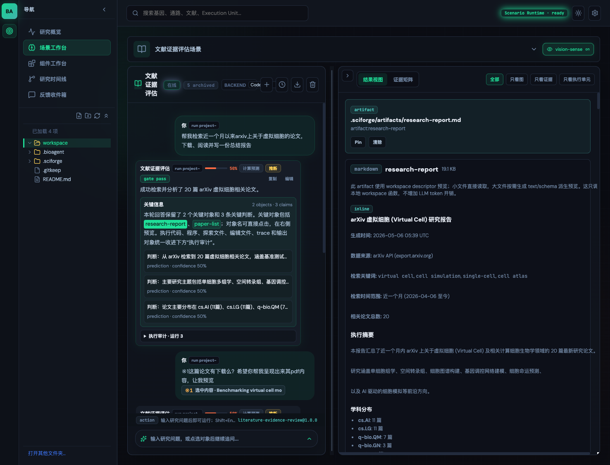

# SciForge

**为科学研究打造的自进化多模态 Agent 工作台。**

SciForge 不是“聊天框 + 工具列表”。它把科学数据、论文、代码、可交互 UI、执行轨迹和人类反馈组织成一个可以持续学习的研究系统：Agent 不只回答问题，还能看见科学对象、操作软件、生成可审计 artifact，并在双实例互修机制中迭代 SciForge 自己。

> 当前状态：活跃研发原型，架构主线已经完成 backend-first / contract-enforced / capability-driven cutover。SciForge 优先服务本地 workspace-backed 科研实验、透明执行轨迹、敏感数据保护和 self-evolving agent/software，而不是把复杂自动化包装成黑盒。



## 为什么是 SciForge

现代科研越来越像一组复杂的多模态操作：读论文、查数据库、复现实验、运行代码、检查图表、对比结构、追踪证据、修复流程、记录失败。通用 Agent 可以帮忙写一段答案，但科学工作需要更多东西：

- 科学对象需要专门的视觉和交互方式，而不是被压扁成 Markdown。
- 科学结论需要 provenance、执行日志、参数、失败原因和复现路径。
- 真实实验室和企业研发场景通常不能把敏感数据交给黑盒平台。
- Agent 系统本身需要被观察、评论、修复和升级，而不是一次性 prompt 工程。

SciForge 的目标是把 AI 从“研究聊天助手”推进到“可审计、可组合、可自我进化的科学工作台”。

## 产品定位：自由探索，专业沉淀

SciForge 不试图替代 Codex backend 的理解、规划和代码生成能力。相反，SciForge 应尽可能复用 Codex app-server / CLI / plugin / skill / MCP / custom provider 生态，把它接到一个面向科研的 GUI/workbench 增益层中。

核心定位是：**通用 Agent 能力做底座，专业科研 contract 和交互工作台做增益层。**

这意味着 SciForge 的体验必须同时保留两种能力：

- **入口和过程保持通用。** 用户可以像使用通用 Agent 一样直接提出开放问题，让 backend 自由探索、读文件、写代码、调用工具和试错，而不是先被模板、schema 或配置面板锁死。
- **关键节点专业收敛。** 当任务产生可复用科研资产时，SciForge 将过程收敛为结构化 artifact、ExecutionUnit、证据链、验证结果、失败归因、评论和修复上下文。
- **专业化不能窄化。** 科研 schema、viewer、verifier、scenario policy 和 capability bundle 应提供默认秩序，但必须保留 escape hatch：用户可以先快速探索，再逐步补齐证据、格式和验证。

因此，SciForge 的壁垒不在“比通用 Agent 更聪明”，而在于把强 Agent 的自由探索整理成可验证、可复用、可协作、可审计的科研资产。用户看到的是论文复现、证据评估、数据分析和失败修复；contract 是产品骨架，不是产品的脸。

## 独特性

### 1. 面向科学多模态：模块化感官系统

SciForge 用 Observe / Reason / Action / Verify 组织能力。视觉、文件、图像、窗口状态、科学数据和未来仪器信号都可以作为 `sense` 接入；Agent 只拿到紧凑、可审计的感官摘要，而不是被海量原始上下文淹没。

这让 SciForge 可以面向真正的科学对象工作：论文、表格、结构、序列、组学矩阵、显微图像、知识图谱、运行日志和桌面软件界面。

### 2. 面向自我进化 Agent：任何元素可评论，代码和软件也能迭代

SciForge 的反馈不是普通“点踩”。UI 中的 artifact、视图、运行结果、执行单元、页面元素和任务状态都可以成为评论对象。评论会带上定位、上下文、截图或对象引用，沉淀成可交接的修复任务。

更重要的是，SciForge 支持双实例 Agent 互修：A 实例保持稳定，去修复 B 实例；B 稳定后也可以反过来修复 A。修复完成必须带 diff、测试证据和人工核验，稳定版本再显式同步。这意味着进化对象不仅是 skills，也是 SciForge 的代码、界面、工作流和运行时本身。

### 3. 面向人类友好科研操作：可组合交互 UI 模块

科研不是只读答案。研究者需要点选、筛选、对比、标注、接受、拒绝、追问和复用结果。

SciForge 提供注册式科学 UI 组件和 interactive views，例如 evidence matrix、paper cards、molecular/structure viewer、sequence viewer、scientific plot、image annotation、knowledge graph、timeline、protocol editor、model evaluation view 等。Agent 输出结构化 artifact 和 `UIManifest`，SciForge 用可信组件渲染，而不是让 LLM 随机生成前端代码。

### 4. TUI CLI 优先：把成熟 Agent 接到同一个科研工作台

SciForge 的目标不是维护自己的 AgentServer，而是直接连接 Codex app-server；`codex exec --json`/CLI bridge 只作为迁移兼容路径，并可把 Claude Code stream-json 作为可选 backend。生产默认让 Codex 使用 DeepSeek `deepseek-v4-flash` 或用户配置的低成本 provider/proxy；OpenAI provider 只能显式 opt in。GUI 把用户动作翻译成终端等价文本，写入 agent host；再消费 Codex app-server、Codex JSONL 或 Claude stream-json 的结构化事件流来渲染过程。

Codex backend 负责理解、规划、工具调用、文件操作、修复和插件生态；SciForge 负责 GUI 输入、GUI 状态资源、UI 渲染、确认、反馈交接和科研 artifact 呈现。这样可以复用 Codex 的成熟能力，同时避免 SciForge 变成第二个 agent runtime。

历史代码或兼容 adapter 中仍可能出现 AgentServer/backend gateway 字段；它们只代表迁移来源或 shim，不是最终架构依赖，也不得作为新增 public surface。

### 5. GUI-as-extension：让成熟 TUI agent 拥有逻辑

新的架构方向是让 SciForge GUI 成为 Codex backend 的 GUI extension。GUI 把用户操作翻译成终端等价文本；Codex 继续使用原生 plugin/skill/tool/MCP 和 custom model provider 机制承载 capability discovery、harness/policy、provider route、verifier 和 workspace 操作。

SciForge 的长期模块范式是 Agent Host Semantic Pipeline：所有模块统一暴露 `module.describe/query/read/invoke`，Agent Host 负责编排 semantic pipeline 和 trace，GUI、skills、memory、capability、verifier、browser/computer-use 都是模块。GUI 模块提供只读虚拟 GUI resource tree 和展示/确认 intent；迁移期 `gui.*` alias 只能由 adapter shim 暴露，例如 `gui.present`、`gui.ask_user`、`gui.notify`、`gui.set_status` 和 `gui.apply_batch`。

当前设计真相源见 [`docs/Architecture.md`](docs/Architecture.md) 和 [`docs/TuiGuiProtocol.md`](docs/TuiGuiProtocol.md)。

迁移前的旧方案快照保存在 [`docs_old/README_SNAPSHOT.md`](docs_old/README_SNAPSHOT.md)，仅用于对照和迁移，不再作为当前设计入口。

### 6. 为什么需要自建 Agent

自建不是为了重复造一个聊天机器人，而是为了科学场景里的三件事：

- **完全透明和轨迹积累**：保留 prompt、工具调用、代码、参数、stdout/stderr、artifact、失败原因和修复历史，形成可复盘的科学轨迹数据。
- **敏感数据保护**：workspace-first，本地状态、数据引用、日志和任务文件都可以留在受控环境中。
- **复杂科研场景可定制**：不同实验室、疾病领域、模型评估、仪器流程和企业研发规范都需要自定义 scenario、UI、verifier、权限和失败策略。

## 可以用 SciForge 做什么

### 论文复现与教学

以科学数据为起点、以论文为蓝图，交互式提示 Agent 组合调用工具复现论文中的图表、结论或分析流程。这个过程既能帮助学生理解科学问题，也能积累“从论文到可执行证据”的轨迹数据。

### 科学证据评估

把论文列表、claim、evidence、冲突结果、数据引用和研究报告组织成可追踪 artifact。适合文献综述、项目立项、靶点评估、机制梳理和跨论文证据对齐。

### 自我进化修复

对任何界面元素或结果添加评论，生成结构化 issue bundle；由另一个稳定 SciForge 实例接手修复目标实例，输出 patch、测试日志、diff 和稳定版本同步计划。

### Computer Use

用视觉优先的方式观察窗口、定位界面元素，并通过 action loop 操作目标环境完成任务。当前严格边界是 package-owned / host-provided target-bound window execution：输入必须隔离到声明目标，result/trace/evidence 只写 refs，shared/system/global input 默认 fail closed。action package 已有 isolated desktop L1/L3 probe/evidence contract、executor command provenance validator、window-bound pointer proof validator 和 Linux/noVNC Docker bundle spec；Docker gate 支持 base image、Debian apt mirror/retry 和 host evidence dir override，并已产出真实 Linux/noVNC completed L1 run 与 same-session completed L3 run。L3 `--execute` 在 isolated session 中完成 source browser -> LibreOffice Writer GUI DOCX save -> Chromium/file-preview directory preview，并由 completed evidence validator 复验；partial/blocked refs 仍不能作为 completed refs。未来可以组合 OCR、窗口元数据、浏览器状态、远程桌面帧和更多 sense provider，真实完成声明仍必须有当前截图、target binding、trace/result refs 和文件证据支撑。

### 自定义科研场景

通过 scenario package 组合 skills、tools、artifact schemas、UI components、view presets、role policies、failure policies 和 validation gates，把一次临时任务沉淀成团队可复用的研究服务。

## 核心架构

```text
Scientific question / paper / dataset / UI feedback
  -> GUI translates input to terminal-equivalent text
  -> Codex app-server (preferred) / CLI JSON compatibility bridge
  -> Codex custom model provider
  -> DeepSeek deepseek-v4-flash / configured provider proxy by default
  -> native plugins / skills / tools / MCP
  -> workspace files / tool calls / computer use
  -> agent-native repair loop when needed
  -> artifacts + ExecutionUnits + traces
  -> registered interactive scientific views
  -> comments / verification / repair handoff
  -> native skill, plugin, MCP, or software update
```

能力分层：

```text
Observe   senses：视觉、图像、文件、窗口状态、未来仪器信号
Reason    TUI CLI + native skills：科研策略、任务规划、代码生成
Action    tools + computer use：文件、GUI、kernel、外部系统操作
Verify    verifiers：schema、测试、人类反馈、环境观察、agent critique
Present   interactive views：科学 artifact 的可读、可点选、可评论界面
```

关键产物：

- `Artifact`：结构化科学输出，例如 research report、paper list、evidence matrix、knowledge graph、omics result、structure summary。
- `ExecutionUnit`：记录真实执行过什么，包括代码、输入输出、日志、runtime profile、失败原因和 repair history。
- `UIManifest`：声明 artifact 用哪个已注册组件展示，以及如何高亮、对比、筛选、分面或组合。
- `Scenario Package`：把研究目标、输入契约、技能计划、UI 计划、测试和版本沉淀成可发布运行单元。

## 快速开始

环境要求：

- Node.js 20+
- npm
- 一个本地 workspace 目录
- Codex app-server 用于首选 agent-backed task execution；CLI JSON bridge 仅保留为迁移兼容路径
- DeepSeek `deepseek-v4-flash` 或 provider proxy，用于默认低成本 model provider

安装并启动完整本地应用：

```bash
npm install
npm run dev
```

打开：

```text
http://localhost:5173/
```

`npm run dev` 会同时启动 Vite UI 和 workspace runtime。只启动 UI：

```bash
npm run dev:ui
```

如果单独启动 UI，但仍需要 workspace-backed runs 或持久化聊天记录，再启动：

```bash
npm run workspace:server
```

在 Settings 中配置：

- `Workspace Path`：`.sciforge/` 状态、任务文件、日志、artifact 和 scenario packages 的存储目录。
- 迁移期设置里可能仍有 `AgentServer Base URL` / `Agent Backend` 字段；目标架构下应改为 Codex app-server 连接、CLI JSON 兼容路径、事件流、provider/model 和权限配置。默认 provider/model 应为 DeepSeek `deepseek-v4-flash` 或 provider proxy，不得静默 fallback 到 OpenAI。
- provider、base URL、model、API key、timeout 和 context-window budget。

## 使用说明

更完整的操作流程见：[docs/Usage.md](docs/Usage.md)。

这份说明会持续补充截图，当前覆盖：

- 论文复现工作流
- 自我进化修复工作流
- Computer Use 工作流
- Codex app-server 连接和 CLI JSON 兼容路径
- 双实例互修开发模式
- 常用验证命令

## 双实例互修

一键创建并启动两套隔离实例：

```bash
npm run worktree:dual -- create
npm run dev:dual
```

默认实例：

```text
A  UI http://127.0.0.1:5173  writer http://127.0.0.1:5174
B  UI http://127.0.0.1:5273  writer http://127.0.0.1:5274
```

常用检查：

```bash
npm run smoke:dual-instance
npm run smoke:dual-worktree-instance
npm run smoke:repair-handoff-runner
npm run smoke:stable-version-registry
```

更详细的 handoff、稳定同步和排障步骤见：[docs/Usage.md#双实例互修](docs/Usage.md#双实例互修)。

## 仓库结构

```text
src/ui/                  React + Vite 科研工作台
src/runtime/             Workspace server、gateway、task runner、host adapter glue
src/runtime/gateway/     Agent/backend handoff、payload、context、diagnostics、repair
packages/contracts/      跨 package/UI/runtime 稳定 contract
packages/reasoning/      Python 优先的确定性策略算法与 planner
packages/agent-harness/  规划中的 agent 行为治理策略、阶段 hooks 和 profile
packages/scenarios/      scenario 编译、校验和 runtime smoke fixtures
packages/observe/        只读观察能力：environment/modality -> observation
packages/actions/        会改变环境的 action provider
packages/actions/computer-use/   Computer Use action loop、target-bound window host、isolated executor、evidence/preflight/probe contracts
packages/presentation/components/  科学 artifact 交互视图注册表
packages/support/        preview/reference helpers 和迁移兼容支撑
packages/skills/         可复用科研 skill 与 skill catalog
packages/verifiers/      验证与 critique 能力
docs/                    产品、架构、使用和 authoring 文档
workspace/               默认本地 runtime workspace，git 忽略
PROJECT.md               项目任务板和工程原则
```

## 开发与验证

常用检查：

```bash
npm run typecheck
npm run test
npm run smoke:all
npm run build
```

快速完整验证：

```bash
npm run verify
```

完整文档索引见：[docs/README.md](docs/README.md)。

## License

当前仓库尚未最终确定 License。若要把 SciForge 作为正式产品或依赖分发，请先补充 `LICENSE` 文件。
