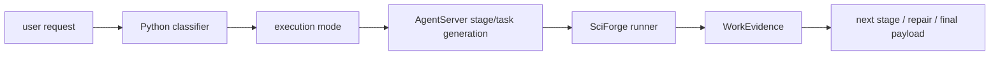

# SciForge 架构

最后更新：2026-05-09

本文合并原项目总文档、AgentServer 协议、多轮 session、CLI/UI handoff、时间线和互修说明。实现真相源优先看文中列出的代码路径。

## 当前边界

SciForge 当前是本地 workspace-backed 科研 Agent 工作台。它的职责不是维护一套硬编码回复模板，而是把用户请求、workspace 引用、scenario contract、能力 brief、backend stream、artifact、ExecutionUnit、反馈和修复证据组织成可审计系统。

核心原则来自 [`../PROJECT.md`](../PROJECT.md)：

- 正常用户请求必须交给 AgentServer/agent backend 真实理解和回答。
- Python conversation-policy package 是多轮对话策略算法主路径；其中 execution mode classifier 是 `direct-context-answer` / `thin-reproducible-adapter` / `single-stage-task` / `multi-stage-project` / `repair-or-continue-project` 的唯一策略源。
- TypeScript 保留 transport、runtime 执行边界、workspace writer 和 UI 渲染；只能透传 classifier 字段、执行 workspace shell、调用 guard、持久化 refs 和提供保守 UI fallback，不维护并行复杂度/执行模式推断算法。
- Agent 输出必须落到标准 `ToolPayload`、artifact、日志和 ExecutionUnit。
- 错误、缺失输入、失败原因和恢复建议必须进入下一轮上下文。
- 新增任务路由、证据和恢复能力必须是通用 contract，不为单一 provider、scenario、prompt、backend、站点或固定错误文本写特例。

## 模块地图

```text
src/ui/                         React + Vite 工作台
src/ui/src/api/sciforgeToolsClient.ts
                                UI -> workspace runtime handoff
src/runtime/workspace-server.ts Workspace writer HTTP API
src/runtime/generation-gateway.ts
                                Runtime gateway 主编排
src/runtime/gateway/*           AgentServer context、payload、repair、diagnostics 子模块
src/runtime/conversation-policy/*
                                TypeScript -> Python policy bridge
packages/reasoning/conversation-policy/
                                goal/context/memory/digest/capability/recovery 策略
packages/scenarios/core/         scenario package 与质量门禁
packages/contracts/runtime/      capability、observe、handoff、artifact、session 等共享 contract
src/runtime/observe/            observe provider 选择与调用编排
packages/presentation/components/         interactive artifact view registry
packages/skills/                skill registry 与 package skills
packages/observe/vision/   vision observe provider
packages/actions/computer-use/          sense-agnostic GUI action loop
```

## Runtime 请求链路

```text
User turn
  -> ChatPanel / runPromptOrchestrator
  -> sendSciForgeToolMessage
  -> workspace writer /api/sciforge/tools/run/stream
  -> runWorkspaceRuntimeGateway
  -> applyConversationPolicy
  -> tryRunVisionSenseRuntime, if selected and request looks like Computer Use
  -> loadSkillRegistry + agentserver.generate.<domain>
  -> request AgentServer /api/agent-server/runs/stream
  -> direct ToolPayload or generated workspace task
  -> runWorkspaceTask
  -> validate payload, repair if possible
  -> composeRuntimeUiManifest
  -> UI normalizes response and updates session state
```

T096/T097 升级后的可复现任务链路：



职责边界：

- Python 负责算法策略：任务分类、复杂度评分、不确定性判断、可复现等级、stage planning hints、repair/continuation 策略和可调 fixture 规则。实现入口是 `packages/reasoning/conversation-policy/src/sciforge_conversation/execution_classifier.py`，测试入口是 `packages/reasoning/conversation-policy/tests/test_execution_classifier.py`。
- TypeScript 负责 runtime execution shell：HTTP/stream transport、workspace project/stage 目录、生成代码落盘、命令执行、stdout/stderr/ref 持久化、backend tool stream 到 WorkEvidence 的通用字段适配、WorkEvidence/guidance guard 调用、UI 状态和 AgentServer 往返。TS 侧只读取 `executionModePlan` / `executionModeDecision` 的稳定字段，缺失时回退为 `unknown` / `backend-decides`，不得用 prompt regex 重新判定 execution mode。
- AgentServer 负责理解任务、选择通用能力、生成当前 stage/task 代码或 patch/spec；多阶段模式下只生成下一阶段，不一次性展开整条 pipeline。
- WorkEvidence 是执行事实的审计/恢复真相源；UI WorkEvent 可以从它投影摘要，但不替代它。

关键代码：

- UI request builder：[`../src/ui/src/api/sciforgeToolsClient.ts`](../src/ui/src/api/sciforgeToolsClient.ts)
- Runtime entry：[`../src/runtime/generation-gateway.ts`](../src/runtime/generation-gateway.ts)
- AgentServer prompt/handoff：[`../src/runtime/gateway/agentserver-prompts.ts`](../src/runtime/gateway/agentserver-prompts.ts)
- Generated task runner：[`../src/runtime/gateway/generated-task-runner.ts`](../src/runtime/gateway/generated-task-runner.ts)
- Payload validation：[`../src/runtime/gateway/payload-validation.ts`](../src/runtime/gateway/payload-validation.ts)
- UI manifest resolver：[`../src/runtime/runtime-ui-manifest.ts`](../src/runtime/runtime-ui-manifest.ts)

## AgentServer Contract

SciForge dispatch 到 AgentServer 的 stream endpoint：

```text
POST <agentServerBaseUrl>/api/agent-server/runs/stream
```

runtime payload 中包含：

- `agent`：backend、agent id、workspace、system prompt。
- `input.text`：由 context envelope、workspace tree、selected skills、artifact schema、UI contract 和当前 prompt 组成的生成提示。
- `runtime`：backend、cwd、用户侧 LLM endpoint、sandbox 和 context-window metadata。
- `metadata`：SciForge source、task purpose、context budget、重试策略。

AgentServer 可以返回两类成功结果：

- 直接 `ToolPayload`：用于已经由 backend 推理完的 report-only 或结构化答案。
- `AgentServerGenerationResponse`：包含 `taskFiles`、`entrypoint`、`environmentRequirements`、`validationCommand` 和 `expectedArtifacts`，随后由 SciForge 写入 workspace 并执行。

生成的 workspace task 必须通过 `inputPath` 和 `outputPath` argv 读写，最终输出合法 `ToolPayload`。如果 entrypoint 不是可执行代码，runtime 会进行严格重试；如果任务失败或 schema 不合格，runtime 会尝试 repair rerun，最后返回 `repair-needed` 或 `failed-with-reason`。

## Conversation Policy

会话策略的主路径是 Python package，默认开启：

- 算法参考：[`SciForgeConversationSessionRecovery.md`](SciForgeConversationSessionRecovery.md)
- Bridge：[`../src/runtime/conversation-policy/python-bridge.ts`](../src/runtime/conversation-policy/python-bridge.ts)
- TS request/response contract：[`../src/runtime/conversation-policy/contracts.ts`](../src/runtime/conversation-policy/contracts.ts)
- Python contract：[`../packages/reasoning/conversation-policy/src/sciforge_conversation/contracts.py`](../packages/reasoning/conversation-policy/src/sciforge_conversation/contracts.py)
- Python service：[`../packages/reasoning/conversation-policy/src/sciforge_conversation/service.py`](../packages/reasoning/conversation-policy/src/sciforge_conversation/service.py)

环境变量：

- `SCIFORGE_CONVERSATION_POLICY_MODE=active|off`，默认 `active`。
- `SCIFORGE_CONVERSATION_POLICY_PYTHON`，默认 `python3`。
- `SCIFORGE_CONVERSATION_POLICY_MODULE`，默认 `sciforge_conversation.service`。
- `SCIFORGE_CONVERSATION_POLICY_PYTHONPATH`，默认 `packages/reasoning/conversation-policy/src`。
- `SCIFORGE_CONVERSATION_POLICY_TIMEOUT_MS`，默认 3500ms。

Policy response 会写回 `GatewayRequest.uiState`：

- `goalSnapshot`
- `contextReusePolicy` / `contextIsolation`
- `memoryPlan`
- `currentReferences`
- `currentReferenceDigests`
- `artifactIndex`
- `capabilityBrief`
- `handoffPlan`
- `acceptancePlan`
- `recoveryPlan`
- `userVisiblePlan`

`executionModePlan` 字段边界：

- Python 输出：`executionMode`、`complexityScore`、`uncertaintyScore`、`reproducibilityLevel`、`stagePlanHint`、`reason`、`riskFlags`、`signals`。
- TS enrichment：`src/runtime/conversation-policy/apply.ts` 把 Python 字段映射为 `executionModeRecommendation`、`complexityScore`、`uncertaintyScore`、`reproducibilityLevel`、`stagePlanHint`、`executionModeReason`。
- Context envelope：`src/runtime/gateway/context-envelope.ts` 把这些字段放入 `sessionFacts` 和 `scenarioFacts`，只做裁剪、hash 和 fallback。
- AgentServer prompt：`src/runtime/gateway/agentserver-prompts.ts` 把字段放入 `CURRENT TURN SNAPSHOT`，并说明每种 mode 的执行边界。prompt 文案是 contract，不是 TS 策略算法。

如果 Python policy 失败，runtime 会发出 `conversation-policy` failed event，并继续用 transport-only fallback；这保证策略层问题不会阻塞普通运行。

## Task Project 与 WorkEvidence

T097 Task Project runtime 与 T096 WorkEvidence guard 是相邻但不同的两层：

- T097 回答“这轮怎么执行”：`direct-context-answer`、`thin-reproducible-adapter`、`single-stage-task`、`multi-stage-project` 或 `repair-or-continue-project`。它管理 project/stage 状态机、stage 输入输出、用户追加 guidance、阶段反馈、guidance adoption contract、repair/continue 锚点、stage adapter promotion proposal 和最终 payload 交付。
- T096 回答“执行事实是否可信”：统一 `WorkEvidence` schema，归一 search/fetch/read/write/command/validate 等执行结果，识别空结果、吞失败、无证据 claim、非零 exitCode、timeout/429、artifact 缺字段等假成功，并给出 `failureReason`、`recoverActions` 和 evidence refs。backend tool stream adapter 只按通用字段适配 search/fetch/read/command/validate，不按 provider、scenario、prompt 或固定错误文本写分支。
- T097 stage 边界必须消费 T096 的 WorkEvidence；T096 不决定是否拆 stage，T097 不重新定义证据和失败语义。

Task Project 的持久化形态以 `.sciforge/projects/<project-id>/` 为根，包含 `project.json`、`plan.json`、`stages/`、`src/`、`artifacts/`、`evidence/` 和 `logs/`。每个 stage 至少记录 `codeRef`、`inputRef`、`outputRef`、`stdoutRef`、`stderrRef`、`evidenceRefs`、`failureReason` 和 `nextStep`。当前 runtime 还记录 `workEvidence`、`diagnostics`、`recoverActions` 和 `artifactRefs`，用于 repair/continuation 的 bounded handoff。下一阶段 handoff 会携带 WorkEvidence 摘要、diagnostics/schema errors/verifier 摘要、artifact refs、recoverActions、failureReason、nextStep 和 queued/deferred guidance。raw stdout、HTTP body、网页正文和长日志保存在 refs 中；handoff 默认只携带结构化摘要和引用。

WorkEvidence 字段边界：

- 必填：`kind`、`status`、`evidenceRefs`、`recoverActions`。
- 常用可选：`provider`、`input`、`resultCount`、`outputSummary`、`failureReason`、`nextStep`、`diagnostics`、`rawRef`。
- `kind` 表示通用执行事实类型，例如 retrieval、fetch、read、write、command、validate、claim、artifact、other；不得编码 provider/scenario/prompt 专用类型。
- `status` 表示证据状态，例如 success、empty、failed、failed-with-reason、repair-needed、partial；不得把 timeout、429、空结果或非零 exitCode 包装成高置信 success。
- `resultCount` 只描述可计数检索/查询结果，未知时省略，不用字符串 `"0"` 伪装。
- `diagnostics` 是低噪声 provider/status/fallback 摘要；raw body、网页正文、完整 stdout/stderr 应放在 `rawRef` 或日志 refs。
- `nextStep` 和 `recoverActions` 是给下一轮 agent/user 的行动边界，不是 UI 文案特例。

TaskProject / TaskStage 字段边界：

- `TaskProject` 保存 project identity、goal、status、paths、stageRefs、latestStageRef、guidanceQueue 和 metadata。`guidanceQueue` 记录运行中追加指导及其 queued/adopted/deferred/rejected 状态，下一阶段 handoff 只携带 queued/deferred 的 bounded 摘要。
- `TaskStage` 保存 stage identity、kind、status、goal、code/input/output/stdout/stderr refs、artifact/evidence refs、WorkEvidence 摘要、diagnostics、failureReason、recoverActions、nextStep 和 timestamps。
- `TaskStage` 不是 WorkEvidence；`collectWorkEvidence` 显式跳过 `sciforge.task-*` schema，避免因为二者都有 `kind/status/evidenceRefs/recoverActions` 而误判。
- Task Project runtime 可以消费 WorkEvidence，但不得重新定义 WorkEvidence 字段或失败语义。
- 当 handoff 包含 queued/deferred guidance 时，AgentServer 必须在 `executionUnits[].guidanceDecisions` 中为每项声明 adopted/deferred/rejected 和 reason；runtime guard 会在缺失或无 reason 时 fail closed 到 `repair-needed`。

设计约束：

- 不能为单一 provider、scenario、prompt、论文站点、backend、DOM、固定文案或固定错误文本写特殊规则。
- 轻量 search/fetch/current-events 查询可以走薄 adapter 或单阶段 task，但仍必须留下 WorkEvidence；优化目标是避免重型 pipeline，不是绕过可复现证据。
- 多 provider 检索、多 artifact 产出、外部 I/O、高不确定性、长任务和用户中途纠偏默认倾向多阶段 project。
- repair/continuation 读取上一阶段的 WorkEvidence 摘要、attempt history、artifact refs 和用户 guidance，而不是从 raw logs 或自然语言历史里重新猜。

## Context 与恢复

SciForge 不把完整历史和大文件无界塞进 backend。当前 turn 优先使用显式 refs、bounded digest、artifact index 和最近 run summary。相关代码：

- Context envelope：[`../src/runtime/gateway/context-envelope.ts`](../src/runtime/gateway/context-envelope.ts)
- Context window / compaction：[`../src/runtime/gateway/agentserver-context-window.ts`](../src/runtime/gateway/agentserver-context-window.ts)
- Backend failure diagnostics：[`../src/runtime/gateway/backend-failure-diagnostics.ts`](../src/runtime/gateway/backend-failure-diagnostics.ts)
- Task attempt history：[`../src/runtime/task-attempt-history.ts`](../src/runtime/task-attempt-history.ts)

恢复策略包括：

- context-window preflight 和 handoff slimming。
- AgentServer rate limit / context exceeded 的一次紧凑重试。
- 当前引用 digest recovery。
- schema failure 后的 repair prompt 和 rerun。
- silent stream watchdog 与 timeout 诊断。

## 验收命令

T096/T097 相关的最小验收命令：

```bash
npx tsc --noEmit
node --import tsx --test src/runtime/gateway/work-evidence-guard.test.ts
node --import tsx --test src/runtime/gateway/backend-tool-work-evidence-adapter.test.ts
node --import tsx --test src/runtime/gateway/guidance-adoption-guard.test.ts
node --import tsx --test src/runtime/gateway/context-envelope.test.ts
node --import tsx --test src/runtime/task-projects.test.ts
npx tsx tests/smoke/smoke-agentserver-handoff-current-turn.ts
npx tsx tests/smoke/smoke-t096-work-evidence-provider-fixtures.ts
npx tsx tests/smoke/smoke-t097-execution-mode-matrix.ts
npx tsx tests/smoke/smoke-task-attempt-api.ts
python3 -m pytest packages/reasoning/conversation-policy/tests
```

更宽的 runtime 回归建议：

```bash
npm run smoke:runtime-gateway-modules
npm run smoke:agentserver-generation
npm run smoke:agentserver-repair
npm run smoke:agentserver-acceptance-repair
```

## 剩余风险

- Python classifier 的策略源已经集中，但真实 AgentServer backend 是否长期遵守 mode 边界仍需产品运行中持续观察，尤其是 multi-stage 不一次性生成完整 pipeline。
- WorkEvidence guard 已覆盖通用假成功模式，并有 runtime fixture 覆盖 provider 429、timeout、空结果、fallback 成功、fallback 耗尽和 AgentServer stream direct path；真实 provider 字段漂移仍需继续收敛到通用 adapter。
- Task Project stage feedback loop 已有 stage/handoff、diagnostics/recoverActions/WorkEvidence 摘要、guidance queue 和 guidance adoption guard；UI live ingestion 与可见 feedback 仍需产品级长任务观察。
- UI WorkEvent 已优先消费结构化 WorkEvidence/TaskStage，但没有结构化字段时仍有保守文本 fallback；长期应推动 backend/runtime 发送结构化 work hints，减少文本启发式。
- Stage adapter promotion proposal 已接入现有 skill-promotion safety gate 和验证入口；后续风险是人工确认、验收 smoke 与真实可复用 skill 生命周期仍需更多产品运行样本。

## Workspace Writer API

Workspace writer 是本地 HTTP API，默认端口 `5174`。入口是 [`../src/runtime/workspace-server.ts`](../src/runtime/workspace-server.ts)。

主要端点：

- `GET /health`
- `GET|POST /api/sciforge/config`
- `GET /api/sciforge/instance/manifest`
- `GET /api/sciforge/instance/stable-version`
- `POST /api/sciforge/instance/stable-version/promote`
- `POST /api/sciforge/instance/stable-version/sync-plan`
- `GET|POST /api/sciforge/workspace/snapshot`
- `GET|POST /api/sciforge/workspace/file`
- `POST /api/sciforge/workspace/file-action`
- `POST /api/sciforge/workspace/open`
- `GET /api/sciforge/preview/raw`
- `GET /api/sciforge/preview/descriptor`
- `GET /api/sciforge/preview/derivative`
- `GET|POST /api/sciforge/scenarios/*`
- `GET /api/sciforge/task-attempts/list`
- `GET /api/sciforge/task-attempts/get`
- `GET|POST /api/sciforge/skill-proposals/*`
- `GET|POST /api/sciforge/feedback/issues*`
- `POST /api/sciforge/repair-handoff/run`
- `POST /api/sciforge/tools/run`
- `POST /api/sciforge/tools/run/stream`

文件路径会经过 workspace root 约束；`open-external`、`reveal-in-folder` 等外部动作在 server 端做边界检查。

## Feedback 与双实例互修

反馈不是直接在单实例里启动内嵌 repair agent。当前实现是 peer instance handoff：

1. 目标实例收集 feedback comment / request / GitHub issue metadata。
2. 执行方实例在主聊天栏选择 target instance。
3. UI 根据自然语言里的 `feedback #id` 或 `GitHub #number` 调目标 writer 读取 issue bundle。
4. AgentServer payload 中带上 `repairHandoffRunner` contract。
5. `repair-handoff-runner` 在目标 repo 的隔离 worktree 中运行修复、测试和 diff 收集。
6. 结果写回目标实例 `/repair-result`，可同步到 GitHub Issue。

关键代码：

- Target selector：[`../src/ui/src/app/chat/TargetInstanceSelector.tsx`](../src/ui/src/app/chat/TargetInstanceSelector.tsx)
- Target issue lookup：[`../src/ui/src/app/chat/targetInstance.ts`](../src/ui/src/app/chat/targetInstance.ts)
- Repair runner：[`../src/runtime/repair-handoff-runner.ts`](../src/runtime/repair-handoff-runner.ts)
- GitHub sync：[`../src/runtime/github-repair-sync.ts`](../src/runtime/github-repair-sync.ts)
- Stable registry：[`../src/runtime/stable-version-registry.ts`](../src/runtime/stable-version-registry.ts)

## Timeline 与决策模型

Timeline、decision、belief graph 和 wet-lab summary 当前是 UI domain contract，不是独立后端服务。类型真相源在 [`../src/ui/src/domain.ts`](../src/ui/src/domain.ts)：

- `TimelineEventRecord`
- `ResearcherDecisionRecord`
- `BeliefDependencyGraph`
- `WetLabEvidenceSummary`

它们的定位是把 run、artifact、evidence、人工决定和外部实验摘要串成可复查研究记录。真实结论仍应通过 artifact refs、execution refs、verification result 和人工确认支撑。

## Vision Sense 与 Computer Use

`local.vision-sense` 是 Observe/sense 插件，runtime 入口是 [`../src/runtime/vision-sense-runtime.ts`](../src/runtime/vision-sense-runtime.ts)。它只在满足两个条件时短路普通 AgentServer 路径：

- request 中选择了 `local.vision-sense`。
- prompt 看起来是 Computer Use / GUI 操作请求。

如果 desktop bridge 未启用，runtime 返回 fail-closed diagnostic payload，不假装执行成功。实际图像理解、grounding、window-local 坐标、scheduler lock 和 trace 验证详见 vision-sense 与 computer-use 包 README。
