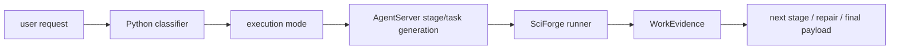

# SciForge 架构

最后更新：2026-05-14

本文描述 SciForge 的产品架构和关键边界。它优先解释 big idea：SciForge 不是第二个 agent，而是把 backend 推理、capability 执行、证据、refs、验证、恢复和 UI 投影收束到一条可 replay、可审计的 conversation kernel。

## 当前边界

SciForge 当前是本地 workspace-backed 科研 Agent 工作台。它的职责不是维护一套硬编码回复模板，而是把用户请求、workspace 引用、scenario contract、能力 brief、backend stream、artifact、ExecutionUnit、反馈和修复证据组织成可审计系统。

核心原则来自 [`../PROJECT.md`](../PROJECT.md)：

- SciForge 的根本定位是 downstream scenario adapter，不是第二套 agent；它应尽可能复用 agent backend 的通用推理、检索、文件读取、artifact 解析、工具选择、多轮恢复和胶水代码生成能力。
- 正常用户请求必须交给 AgentServer/agent backend 真实理解和回答。
- Python conversation-policy package 是多轮对话策略算法主路径；其中 execution mode classifier 是 `direct-context-answer` / `thin-reproducible-adapter` / `single-stage-task` / `multi-stage-project` / `repair-or-continue-project` 的唯一策略源。
- TypeScript 保留 transport、runtime 执行边界、workspace writer 和 UI 渲染；只能透传 classifier 字段、执行 workspace shell、调用 guard、持久化 refs 和提供诊断/显示级 fallback，不维护并行复杂度、执行模式或用户意图推断算法。
- Agent 输出必须落到标准 `ToolPayload`、artifact、日志、ExecutionUnit 和 conversation event。
- 错误、缺失输入、失败原因和恢复建议必须进入下一轮上下文。
- 新增任务路由、证据和恢复能力必须是通用 contract，不为单一 provider、scenario、prompt、backend、站点或固定错误文本写特例。

## 当前最终形态：Conversation Kernel v2

SciForge 的最终形态是 **Backend-first, Capability-driven, Harness-governed, Event-sourced**。一句话说：backend 负责理解和组合能力，SciForge 负责把每一轮对话变成可信事件账本，再从账本确定性投影出 UI、恢复上下文、后台 continuation 和审计导出。

核心链路是：

```text
User intent
  -> ConversationEventLog
  -> ConversationStateMachine
  -> Contract gates
  -> HarnessDecisionRecorded
  -> HarnessContract
  -> backend / capability dispatch
  -> materialized refs, artifacts and evidence
  -> validation and failure classification
  -> ConversationProjection
  -> UI, continuation and audit export
```

这条链路看起来长，但心智模型只有五个原语：

```text
Event -> State -> Contract -> Decision -> Projection
```

- **Event 是事实。** 用户输入、dispatch、backend stream、artifact materialization、verification、failure、background continuation、history edit 和 harness decision 都进入 append-only `ConversationEventLog`。刷新、恢复、跨标签同步和导出都从 event log replay，不信任临时 UI state。
- **State 是合法状态。** `ConversationStateMachine` 只回答当前会话是否 satisfied、external-blocked、repair-needed、needs-human、background-running 或 degraded；它不做领域推理，也不按 prompt、provider 或 artifact 文件名猜状态。
- **Contract 是可信边界。** Contract gates 检查 payload、refs、artifacts、verification evidence、background checkpoint 和 failure owner。完成态必须有可见结果或 empty-result 说明；失败态必须有 owner、reason、evidence refs 和 next step。
- **Decision 是事件化策略。** Harness hook 可以选择上下文、预算、能力倾向、验证强度、repair policy 和 progress policy，但首次决策必须记录为 `HarnessDecisionRecorded`。replay 时消费历史 decision，不重新运行依赖时间、token budget、provider health 或外部配置的 hook。
- **Projection 是只读视图。** `ConversationProjection` 是 UI 和下一轮 handoff 的主输入，包含 visible answer、active run、artifact refs、execution process、recover actions、verification、background 和 audit refs。Projection 可以被丢弃并从 event log 重建，不能成为新的事实来源。

这个形态下，SciForge 不通过前端关键词、场景 id、固定 prompt、最近 run、raw execution unit 或 UI fallback 猜用户想要什么。SciForge 只声明“有什么能力、协议是什么、策略边界是什么、怎么校验、在哪里执行、结果如何持久化和投影”。LLM/backend 的作用是读取 capability meta 和当前 contract，理解用户需求，选择能力、连接能力、生成必要胶水代码，执行后根据结构化错误继续修复。

当前架构边界：

- `CapabilityManifest` 是核心能力真相源，`CORE_CAPABILITY_MANIFESTS` 覆盖 AgentServer generation、artifact resolver/read/render、workspace read/write、command/python task、vision observe、computer-use action、report/evidence views 和 schema verifier。
- Capability broker 默认只给 backend compact brief；schema、examples、repair hints、providers、failure history 和 ledger refs 只在选中能力或 repair 时按需展开。
- Scenario package 已收敛为 policy-only：允许 artifact schema、默认 view、capability policy、domain vocabulary、verifier policy、privacy/safety boundaries；拒绝 execution code、prompt regex、provider branch、多轮 semantic judge、prompt special case 和 preset-answer/system-prompt 字段。
- UI 是 projection shell：主状态、主按钮、visible answer、verification tag 和 recovery focus 只消费 `ConversationProjection` 与 ref preview；raw runs、task attempts、executionUnits、backend stream 和 validation trace 只能进入 audit/debug channel。
- `ContractValidationFailure`、WorkEvidence、stable refs、failure owner、verification gate、background checkpoint 和 validation-to-repair loop 是失败恢复主路径。
- Export bundle 打包 event log、restored projection、refs manifest 和 audit-only raw attachments；它不维护第二套 replay 逻辑。

## Harness-governed Scientific Agent OS

Backend-first 解决“谁理解用户意图”，capability-driven 解决“系统能做什么”，harness-governed 解决“agent 在每个阶段如何被约束”。SciForge 不把 agent harness 散落在 gateway、prompt builder、conversation policy、UI 和 repair loop 里，而是把 harness 作为独立、可版本化、可切换的 policy 层维护。

核心原则：

- **Harness 是项目级策略资产，不是散落 prompt 片段。** 探索预算、上下文选择、工具使用约束、技能偏好、验证强度、恢复策略和用户可见进度都应来自统一 harness policy。
- **Runtime 负责阶段化 hook，harness 负责阶段决策。** 业务代码只定义稳定阶段和传入事实，不在各处拼接领域指令、探索规则或 prompt 特例。
- **Harness 输出结构化 contract，再由 prompt/transport 层渲染。** hook 返回探索深度、允许读取的 refs、禁止读取的 refs、tool budget、skill hints、verification level、progress plan 和 prompt directives；prompt builder 只负责把结构化决策渲染给 backend。
- **探索不是禁用，而是预算化、目的化和可审计。** fresh request 默认允许读取当前 scenario contract、capability brief、workspace root summary、配置摘要和必要 schema；只有 continuation、repair、audit、file-grounded 等模式才扩大到旧 attempts、task results、stdout/stderr 和历史 artifacts。
- **Harness profile 可切换。** 同一 runtime 可按任务和产品目标选择 `fast-answer`、`research-grade`、`debug-repair`、`low-cost`、`high-recall-literature`、`privacy-strict` 等 profile，而不改核心 runtime。
- **Skills 保持通用生态。** 文献检索、PDF 下载、全文抽取、批量总结、引用核验等应作为可组合 skills/capabilities 加入 registry；harness 可以偏好某类 skill，但不把单一案例固化成隐藏 workflow。

推荐分层：

```text
User request / refs / scenario
  -> request classifier
  -> harness profile selector
  -> staged harness hooks
  -> structured HarnessContract
  -> context envelope + capability broker + prompt renderer
  -> agent backend / capability execution
  -> validation, repair, ledger and UI progress
```

### Agent Harness Standard

[`AgentHarnessStandard.md`](AgentHarnessStandard.md) 是 agent harness 的唯一编程标准。它采用 Lightning-style callback 分层，定义主运行循环、分级 hooks、`HarnessContract` schema、decision merge 规则、最小实验案例和 `packages/agent-harness` 建议布局。

Architecture 只保留边界原则：

- `HarnessRuntime` 负责生命周期调用、decision merge、trace 记录和 runtime enforcement。
- `HarnessProfile` 组合 callbacks、默认预算和 merge policy。
- `HarnessCallback` 只能读取稳定 `HarnessContext` 并返回结构化 `HarnessDecision`。
- `HarnessContract` 是 context builder、capability broker、prompt renderer、validator、repair loop 和 UI 共同消费的唯一行为契约。
- `HarnessTrace` 是后续 agent harness 研究、profile 比较、失败复盘和 capability promotion 的事实依据。

后续新增 hook、profile、merge rule 或最小实验案例时，必须先更新 [`AgentHarnessStandard.md`](AgentHarnessStandard.md)，再落代码。

### Agent Harness 与 Capability 的关系

Harness 不替代 capability。Capability 声明“能做什么、输入输出是什么、如何校验”；harness 决定“这一轮应该以多大预算、哪些上下文、哪些能力倾向和哪些安全边界使用这些 capability”。

```text
Capability registry = ability truth source
Harness policy      = behavior governance source
Runtime gateway     = lifecycle and enforcement source
Agent backend       = reasoning and composition source
```

因此 harness package 应避免写死某个站点、某个 prompt、某个 scenario 的结果。它可以声明通用策略，例如：

- fresh request 只读 compact workspace/scenario/capability brief。
- continuation request 可以读取当前 session selected refs 和最近成功 artifact digest。
- repair request 可以读取相关 failed run 的 stdout/stderr/log refs。
- audit request 可以扩大到 ledger、历史 attempts 和 verification records。
- high-recall research profile 可以提高检索/下载/验证预算。
- low-cost profile 可以限制全文下载、并行度和后台任务。

### 角色边界

- Agent backend：负责用户意图理解、多轮指代、能力选择、任务规划、胶水代码生成、artifact 内容读取、失败诊断、继续执行和修复。
- SciForge runtime：负责 capability registry、capability broker、workspace refs、权限边界、执行 sandbox、stream events、日志、artifact 持久化、contract validation、verifier 调用和错误回传。
- Agent harness policy：负责按阶段约束 backend 行为，包括 intent mode、探索预算、上下文选择、skill hints、tool-use policy、验证强度、repair policy 和用户可见进度；它是独立策略层，不散落在 runtime 或 UI 分支中。
- Scenario package：只声明领域定制内容，例如 artifact schemas、默认 views、可用 capabilities、领域词表、verifier policy、隐私/安全边界；不写多轮语义判断和 prompt 特例。
- Packages：不只是代码复用单元，而是 capability contract 单元。每个 package 都应能声明自己暴露的能力、输入输出协议、side effects、validator、repair hints 和 provider variants。
- UI：只负责把 session、artifact、object refs、views、execution units、validation errors 和 recover actions 可视化；不作为语义路由层或第二个 agent。

### Agent Harness 与 Conversation Policy 的关系

Conversation policy 是 harness 的输入之一，不是 harness 本身。它应定位为低层上下文与运行安全策略编译器：产出 current-turn facts、引用/历史隔离、bounded digest、handoff 压缩、acceptance/recovery/cache/latency 的保守默认值。Harness profile 可以采纳、覆盖或收紧这些建议，并形成最终 `HarnessContract`。

保留在 conversation policy 的职责：

- context isolation、explicit refs first、pollution guard、repair evidence inclusion。
- bounded memory plan、current reference digest、artifact index 和 clickable refs。
- handoff budget、large string/data URL 省略、refs-first compaction。
- protocol-level acceptance/recovery signals，例如 missing output、missing artifact ref、silent stream、retryability。
- latency/cache/response/background 的保守默认值。

上移到 harness hook/profile 的职责：

- `intentMode` / `executionMode` 的最终选择；conversation classifier 只提供 `TurnIntentSignals` 和 recommendation。
- context、tool、capability、verification、repair、progress budget 的最终 merge 与 enforcement。
- capability profile、skill hints、tool-use policy、side-effect allowance 和 provider constraints。
- repair executor 选择：patch/rerun、supplement、peer handoff、ask user、needs-human、fail-closed。
- UI interaction policy：progress、clarification、human approval、mid-run guidance、cancelled/failed 区分。

因此，未来不应继续在 conversation-policy 模块里扩大 keyword intent、任务 workflow 或 UI 文案。若需要新增行为策略，应进入 harness callback/profile；若需要新增能力，应进入 capability manifest/package。

### src 与 packages 边界：固定平台 vs 插拔能力

最终版本采用清晰的工程边界：

```text
src/
  fixed platform logic
  owns: lifecycle, loading, routing shell, validation loop, persistence, safety

packages/
  pluggable capabilities
  owns: manifests, schemas, validators, providers, examples, repair hints
```

判断规则：

- 如果逻辑回答“系统怎么运行”，放 `src/`。
- 如果逻辑回答“系统能做什么”，放 `packages/`。
- 如果高频稳定逻辑是平台秩序，放 `src/`；如果是能力组合，放 `packages/` 作为 composed capability。

`src/` 是产品固定逻辑和运行时骨架，适合写死：

- app shell、UI 状态管理、workspace writer、runtime server。
- request/stream transport、backend run 生命周期、stream resume/poll。
- capability registry loader、capability broker 主流程、provider dispatch。
- contract validation / repair loop 编排、`ContractValidationFailure` 生成。
- workspace ref resolver 主流程、artifact persistence、materialization。
- permission / safety boundary、sandbox、外部动作确认。
- Capability Evolution Ledger 写入、module boundary smoke、no-legacy-paths guard。

`packages/` 是即插即用能力生态，适合承载：

- observe providers、skills、actions、verifiers、views。
- importers/exporters、domain scenario packages、mock/test fixtures。
- capability manifests、schemas、validators、examples、repair hints。
- provider-specific adapters，例如 external API、本地 Python、browser/computer-use provider。
- composed capabilities，例如 `artifact_to_markdown_report`、`paper_search_to_evidence_matrix`、`failed_run_repair_loop`。

示例边界：

- `read_artifact` 的权限、路径约束、ref resolver 生命周期属于 `src/`。
- `render_research_report_to_markdown` 属于 `packages/` capability。
- capability broker 的筛选框架属于 `src/`。
- biomedical 文献检索能力的 manifest、schema、provider 和 validator 属于 `packages/`。
- validation loop 编排属于 `src/`。
- evidence matrix schema validator 属于 `packages/`。

backend 主要理解 `packages/` 暴露的 capability meta 和 `src/` 暴露的 runtime contract；不需要理解 `src/` 内部实现。`src/` 不应硬编码某个 package 的领域语义，`packages/` 不应绕过 `src/` 的安全、refs、validation 和 persistence 边界。

固定平台和插拔能力的当前 inventory 维护在 [`boundary-inventory.md`](boundary-inventory.md)，机器可读来源是 [`../tools/check-boundary-inventory.ts`](../tools/check-boundary-inventory.ts)。该 inventory 只记录 ownership 和拆分计划；实际 enforcement 仍由 `smoke:fixed-platform-boundary`、`packages:check`、`smoke:module-boundaries`、`smoke:no-src-capability-semantics` 和 `smoke:long-file-budget` 执行。

最终 cutover 的旧链路清单维护在 [`legacy-cutover-inventory.md`](legacy-cutover-inventory.md)，`smoke:no-legacy-paths` 负责冻结 UI 语义 fallback、provider/scenario/prompt 特例和 legacy facade/re-export 基线。当前清单已经是 closed inventory：没有剩余可容忍的 legacy baseline；若未来某个 guard 面被重新打开，必须在同一变更中记录 owner、truth source、删除条件和 smoke 证据。

### 一切模块都是 Capability

以下模块都应收敛到统一 capability contract，而不是散落成隐式调用约定：

- Observe / 感官：vision、browser、computer use、file watcher、workspace scanner。
- Skills：文献检索、结构分析、统计建模、Python task、报告生成、数据转换。
- Actions：写文件、运行命令、调用 API、修改 workspace、下载/导出。
- Verifiers：schema 校验、事实核查、artifact 质量检查、UI smoke、acceptance repair。
- Views：report viewer、evidence matrix、graph、table、molecule viewer、unknown artifact inspector。
- Memory / context：session summary、artifact index、failure history、current references、context compaction。
- Importers / exporters：PDF、Markdown、JSON、PPT、CSV、package import/export。

每个 capability 至少应有：

- `name` / `version` / owner package。
- `brief`：几十 token 的用途摘要，供 broker 默认暴露给 backend。
- `inputSchema` / `outputSchema`：机器可校验协议。
- `sideEffects`：读写 workspace、网络、进程、UI、外部账号等边界。
- `safety`：权限、隐私、人工确认和 sandbox 要求。
- `examples`：少量典型调用，按需展开。
- `validator`：输出、refs、artifact、evidence 和 side effect 校验。
- `repairHints`：失败时给 backend 的结构化修复提示。
- `providers`：local Python、AgentServer、browser、external API、mock/test fixture、future cloud executor 等可替换实现。

### Meta 暴露与热路径固化

为了避免 token 开销失控，capability meta 必须分层暴露：

- 默认只给 backend `brief` 和少量 routing tags。
- broker 根据当前 prompt、object refs、artifact index、failure history 和 scenario policy 筛出相关 capability。
- backend 决定调用某个 capability 时，再展开 contract summary。
- validation failed 或需要修复时，才展开 full schema、examples、repair hints，以及与被选 capability 相关的 failure/log refs。

频繁使用、稳定、token 开销大的组合可以固化为 composed/compiled capability，例如 `artifact_to_markdown_report`、`paper_search_to_evidence_matrix`、`python_task_generate_run_verify`。但固化不能变成隐藏 UI 分支；固化后的热路径仍必须暴露 capability contract、validator、repair hints 和 fallback。失败时 backend 可以下钻到底层原子能力，重新生成胶水代码或修复实现。

判断是否固化的原则：

- 稳定重复性工作交给代码。
- 不确定性、跨能力组合和异常修复交给 backend。
- 固化的是“可声明、可验证、可替换的组合能力”，不是不可见的业务特例。

### Composed Capability Fallback and Evolution Ledger

Composed capability 失败时是否回退到原子能力，不由 LLM 主观判断，而由代码校验、failure classifier 和 capability manifest 中的 fallback policy 共同决定。backend 决定“回退后如何重组”，SciForge runtime 决定“是否允许回退、暴露哪些原子能力、携带哪些失败上下文”。

推荐流程：

```text
run composed capability
  -> validator checks output
  -> failure classifier assigns failureCode
  -> fallbackPolicy decides fallbackable / non-fallbackable
  -> if fallbackable and retry budget remains:
       expose atomicCapabilities + contract summaries + failure context
       backend writes new glue code or selects alternate provider
       runtime executes and validates again
     else if needs user/action/safety:
       return needs-human with recoverActions
     else:
       return structured ContractValidationFailure
  -> append success/failure trace to Capability Evolution Ledger
```

每个 composed capability manifest 应声明：

- `atomicCapabilities`：可下钻的原子能力列表。
- `fallbackPolicy.fallbackToAtomicWhen`：允许下钻的失败类型，例如 `schema_invalid`、`missing_required_artifact`、`invalid_ref`、`empty_result`、`partial_result_below_threshold`、`provider_timeout`、`verifier_failed`、`repair_attempts_exhausted`。
- `fallbackPolicy.doNotFallbackWhen`：不应自动下钻的失败类型，例如 `permission_denied`、`missing_user_input`、`safety_blocked`、`quota_exceeded`、`unsupported_task`。
- `retryBudget`：最大下钻次数、最大耗时、最大外部调用次数和可接受成本。
- `fallbackContext`：下钻时必须交给 backend 的 related refs、partial artifacts、stdout/stderr/log refs、failureReason、recoverActions 和 validator details。

capability result 至少应能表达：

- `status`: `success` / `partial` / `failed` / `needs-human`。
- `failureCode` 和 `failureReason`。
- `fallbackable`。
- `confidence` / `coverage`，用于判断部分成功是否可接受。
- `recoverActions`。
- `atomicTrace` / `executionUnitRefs`。
- `relatedArtifactRefs` / `relatedRunRefs`。

胶水代码和修复轨迹本身是项目资产，应进入 **Capability Evolution Ledger**。每次 backend 为能力组合生成胶水代码、执行 composed capability、下钻原子能力或完成 repair loop，都应记录：

- user goal summary。
- selected capabilities 和 provider。
- input/output schema refs。
- glue code ref / patch ref / generated task ref。
- execution trace、stdoutRef、stderrRef、logRef。
- validation result、failureCode、recoverActions。
- repair attempts 和最终状态。
- produced artifacts / views / WorkEvidence refs。
- latency、外部调用次数、可选成本摘要。
- 是否建议沉淀为 composed capability、改进 validator 或更新 repair hints。

Ledger 的作用不是让 backend 每轮读取全部历史，而是为 capability broker、文档、测试和后续固化提供事实依据：

- 高频且稳定成功的胶水代码可以提议晋升为 composed capability。
- 高频失败模式可以改进 validator、fallbackPolicy 和 repair hints。
- 常见能力组合可以形成 capability graph，帮助 broker 更快筛选相关能力。
- 已固化能力失败时，ledger 可以提供历史成功路径和失败边界，但仍只通过 refs/digests/briefs 分层暴露。

### Validation and Repair Loop

SciForge 的核心稳定性来自 contract validation，而不是前端兜底：

```text
Backend response / capability result
  -> schema validation
  -> ref resolution validation
  -> artifact and UIManifest validation
  -> WorkEvidence / verifier validation
  -> if valid: persist and render
  -> if invalid: return ContractValidationFailure to backend
```

`ContractValidationFailure` 应是机器可读对象，至少包含：

- schema path / contract id / capability id。
- expected vs actual。
- missing fields / invalid refs / unresolved URI。
- stdoutRef / stderrRef / logRef / rawRef。
- failureReason。
- recoverActions。
- nextStep。
- related artifact refs、executionUnit refs、run refs。

backend 收到 validation failure 后应优先修复输出、补读 artifact、重写胶水代码或继续同一 run。SciForge 不应把不合法输出改写成看似成功的 UI 结果；`completed` 必须表示已经真实交付文本、artifact 或稳定 object ref。

### Backend-first 多轮 Artifact 使用

多轮对话的长期事实来源是 workspace refs，而不是自然语言历史。用户说“给我 markdown 报告”“继续刚才那个结果”“按失败原因修一下”时，backend 应通过通用工具读取事实：

- `list_session_artifacts(sessionId)`
- `resolve_object_reference(ref)`
- `read_artifact(ref, format)`
- `render_artifact(ref, markdown|json|text)`
- `resume_run(runId)`

SciForge 每轮只传必要上下文：最近消息、当前 selection、visible object refs、artifact descriptors、execution history 摘要、failure/recover records、capability brief 和 scenario contract refs。大文件、网页正文、stdout/stderr、长 report 和 raw payload 默认只传 ref、digest 和 preview。

`agentserver://.../output` 等 backend 临时 URI 必须可被 resolver 读取，或在 run completed 前 materialize 成 `.sciforge/task-results/*.json|md` 稳定 workspace ref。UI 只应依赖稳定 refs 重建结果面板。

### 已落地的收敛路径

最终形态按以下路径落地，后续回归应优先对照这些边界定位：

1. backend artifact resolver/read/render/resume 工具成为多轮 artifact 使用主路径。
2. SciForge request payload 稳定传 artifact descriptors、object refs、failure records 和 compact capability broker brief。
3. completed contract 收紧：计划句、空 artifact、无效 refs、schema 不合格都进入 `ContractValidationFailure` repair loop。
4. backend 输出 materialize 为稳定 `.sciforge/task-results` refs 或 artifact/object refs。
5. UI/场景层 natural-language fallback 被移除，只保留诊断、显示和安全边界。
6. stream 断开时优先 poll/resume backend run，只有 backend 明确失败才追加 failed event。
7. report 追问、上一轮 artifact 继续处理、失败后修复、scenario policy-only、broker compact/lazy expansion 都走同一 refs-first / projection-first 边界。

## 模块地图

```text
src/ui/                         React + Vite 工作台
src/ui/src/api/sciforgeToolsClient.ts
                                UI -> workspace runtime handoff
src/runtime/workspace-server.ts Workspace writer HTTP API
src/runtime/generation-gateway.ts
                                Runtime gateway 主编排
src/runtime/gateway/*           AgentServer context、payload、repair、diagnostics 子模块
src/runtime/conversation-policy/*
                                TypeScript -> Python policy bridge
packages/reasoning/conversation-policy/
                                goal/context/memory/digest/capability/recovery 策略
packages/scenarios/core/         scenario package 与质量门禁
packages/contracts/runtime/      capability、observe、handoff、artifact、session 等共享 contract
src/runtime/observe/            observe adapter 接入壳；provider 语义留在 packages
packages/presentation/components/         interactive artifact view registry
packages/skills/                skill registry 与 package skills
packages/observe/vision/        vision observe provider
packages/actions/computer-use/  sense-agnostic GUI action loop
```

## Runtime 请求链路

```text
User turn
  -> ChatPanel / runPromptOrchestrator
  -> sendSciForgeToolMessage
  -> workspace writer /api/sciforge/tools/run/stream
  -> runWorkspaceRuntimeGateway
  -> append ConversationEventLog
  -> applyConversationPolicy
  -> build HarnessContract + context envelope + capability broker brief
  -> optional observe/action adapter only when explicitly selected and allowed
  -> AgentServer backend owns reasoning / planning / capability selection
  -> request AgentServer /api/agent-server/runs/stream
  -> direct ToolPayload or generated workspace task
  -> runWorkspaceTask
  -> validate payload / refs / artifacts / UIManifest / WorkEvidence
  -> append success/failure/verification/background events
  -> restore ConversationProjection
  -> UI renders projection + ref previews
```

T096/T097 升级后的可复现任务链路：



职责边界：

- Python 负责算法策略：任务分类、复杂度评分、不确定性判断、可复现等级、stage planning hints、repair/continuation 策略和可调 fixture 规则。实现入口是 `packages/reasoning/conversation-policy/src/sciforge_conversation/execution_classifier.py`，测试入口是 `packages/reasoning/conversation-policy/tests/test_execution_classifier.py`。
- TypeScript 负责 runtime execution shell：HTTP/stream transport、workspace project/stage 目录、生成代码落盘、命令执行、stdout/stderr/ref 持久化、backend tool stream 到 WorkEvidence 的通用字段适配、WorkEvidence/guidance guard 调用、UI 状态和 AgentServer 往返。TS 侧只读取 `executionModePlan` / `executionModeDecision` 的稳定字段，缺失时回退为 `unknown` / `backend-decides`，不得用 prompt regex 重新判定 execution mode。
- AgentServer 负责理解任务、选择通用能力、生成当前 stage/task 代码或 patch/spec；多阶段模式下只生成下一阶段，不一次性展开整条 pipeline。
- WorkEvidence 是执行事实的审计/恢复真相源；UI WorkEvent 可以从它投影摘要，但不替代它。最终展示仍以 `ConversationProjection` 为准。

## AgentServer Contract

SciForge dispatch 到 AgentServer 的 stream endpoint：

```text
POST <agentServerBaseUrl>/api/agent-server/runs/stream
```

runtime payload 中包含：

- `agent`：backend、agent id、workspace、system prompt。
- `input.text`：由 context envelope、workspace tree、compact capability broker brief、artifact schema、UI contract、repair context 和当前 prompt 组成的生成提示。
- `runtime`：backend、cwd、用户侧 LLM endpoint、sandbox 和 context-window metadata。
- `metadata`：SciForge source、task purpose、context budget、重试策略。

默认 handoff 只传紧凑能力摘要：

- `contextEnvelope.scenarioFacts.capabilityBrokerBrief.schemaVersion === "sciforge.agentserver.capability-broker-brief.v1"`。
- `availableRuntimeCapabilities` 来自 `buildCapabilityBrokerBriefForAgentServer`。
- `availableSkills` 保留为空兼容字段，不再承载 capability list。
- 旧 full skill/tool/runtime catalog 即使被误传给 prompt builder，也不会进入默认 AgentServer prompt。

AgentServer 可以返回两类成功结果：

- 直接 `ToolPayload`：用于已经由 backend 推理完的 report-only 或结构化答案。
- `AgentServerGenerationResponse`：包含 `taskFiles`、`entrypoint`、`environmentRequirements`、`validationCommand` 和 `expectedArtifacts`，随后由 SciForge 写入 workspace 并执行。

stream 过程会透传 AgentServer normalized events。SciForge 支持标准 `{ "event": ... }` envelope，也兼容 AgentServer/上游 backend 直接输出的顶层 `status`、`text-delta`/`text_delta`、`tool-call`、`tool-result`、`usage-update`、`contextWindowState` 等 NDJSON 事件。非最终 `result` 的进度事件会先经过 `normalizeAgentServerWorkspaceEvent`，再作为 workspace runtime event 进入 UI worklog；这样用户可以看到 backend 正在检索、写文件、调用工具、等待权限或仍在运行，而不是只看到 HTTP stream silent wait。

生成的 workspace task 必须通过 `inputPath` 和 `outputPath` argv 读写，最终输出合法 `ToolPayload`。如果 entrypoint 不是可执行代码，runtime 会进行严格重试；如果任务失败或 schema 不合格，runtime 会尝试 repair rerun，最后返回 `repair-needed` 或 `failed-with-reason`。

## Conversation Policy

会话策略的主路径是 Python package，默认开启：

- 算法参考：[`SciForgeConversationSessionRecovery.md`](SciForgeConversationSessionRecovery.md)
- Bridge：[`../src/runtime/conversation-policy/python-bridge.ts`](../src/runtime/conversation-policy/python-bridge.ts)
- TS request/response contract：[`../src/runtime/conversation-policy/contracts.ts`](../src/runtime/conversation-policy/contracts.ts)
- Python contract：[`../packages/reasoning/conversation-policy/src/sciforge_conversation/contracts.py`](../packages/reasoning/conversation-policy/src/sciforge_conversation/contracts.py)
- Python service：[`../packages/reasoning/conversation-policy/src/sciforge_conversation/service.py`](../packages/reasoning/conversation-policy/src/sciforge_conversation/service.py)

环境变量：

- `SCIFORGE_CONVERSATION_POLICY_MODE=active|off`，默认 `active`。
- `SCIFORGE_CONVERSATION_POLICY_PYTHON`，默认 `python3`。
- `SCIFORGE_CONVERSATION_POLICY_MODULE`，默认 `sciforge_conversation.service`。
- `SCIFORGE_CONVERSATION_POLICY_PYTHONPATH`，默认 `packages/reasoning/conversation-policy/src`。
- `SCIFORGE_CONVERSATION_POLICY_TIMEOUT_MS`，默认 3500ms。

Policy response 会写回 `GatewayRequest.uiState`：

- `goalSnapshot`
- `contextReusePolicy` / `contextIsolation`
- `memoryPlan`
- `currentReferences`
- `currentReferenceDigests`
- `artifactIndex`
- `capabilityBrief`
- `handoffPlan`
- `acceptancePlan`
- `recoveryPlan`
- `userVisiblePlan`

`executionModePlan` 字段边界：

- Python 输出：`executionMode`、`complexityScore`、`uncertaintyScore`、`reproducibilityLevel`、`stagePlanHint`、`reason`、`riskFlags`、`signals`。
- TS enrichment：`src/runtime/conversation-policy/apply.ts` 把 Python 字段映射为 `executionModeRecommendation`、`complexityScore`、`uncertaintyScore`、`reproducibilityLevel`、`stagePlanHint`、`executionModeReason`。
- Context envelope：`src/runtime/gateway/context-envelope.ts` 把这些字段放入 `sessionFacts` 和 `scenarioFacts`，只做裁剪、hash 和 fallback。
- AgentServer prompt：`src/runtime/gateway/agentserver-prompts.ts` 把字段放入 `CURRENT TURN SNAPSHOT`，并说明每种 mode 的执行边界。prompt 文案是 contract，不是 TS 策略算法。

如果 Python policy 失败，runtime 会发出 `conversation-policy` failed event，并继续用 transport-only fallback；这保证策略层问题不会阻塞普通运行。

## Task Project 与 WorkEvidence

T097 Task Project runtime 与 T096 WorkEvidence guard 是相邻但不同的两层：

- T097 回答“这轮怎么执行”：`direct-context-answer`、`thin-reproducible-adapter`、`single-stage-task`、`multi-stage-project` 或 `repair-or-continue-project`。它管理 project/stage 状态机、stage 输入输出、用户追加 guidance、阶段反馈、guidance adoption contract、repair/continue 锚点、stage adapter promotion proposal 和最终 payload 交付。
- T096 回答“执行事实是否可信”：统一 `WorkEvidence` schema，归一 search/fetch/read/write/command/validate 等执行结果，识别空结果、吞失败、无证据 claim、非零 exitCode、timeout/429、artifact 缺字段等假成功，并给出 `failureReason`、`recoverActions` 和 evidence refs。backend tool stream adapter 只按通用字段适配 search/fetch/read/command/validate，不按 provider、scenario、prompt 或固定错误文本写分支。
- T097 stage 边界必须消费 T096 的 WorkEvidence；T096 不决定是否拆 stage，T097 不重新定义证据和失败语义。

Task Project 的持久化形态以 `.sciforge/projects/<project-id>/` 为根，包含 `project.json`、`plan.json`、`stages/`、`src/`、`artifacts/`、`evidence/` 和 `logs/`。每个 stage 至少记录 `codeRef`、`inputRef`、`outputRef`、`stdoutRef`、`stderrRef`、`evidenceRefs`、`failureReason` 和 `nextStep`。当前 runtime 还记录 `workEvidence`、`diagnostics`、`recoverActions` 和 `artifactRefs`，用于 repair/continuation 的 bounded handoff。下一阶段 handoff 会携带 WorkEvidence 摘要、diagnostics/schema errors/verifier 摘要、artifact refs、recoverActions、failureReason、nextStep 和 queued/deferred guidance。raw stdout、HTTP body、网页正文和长日志保存在 refs 中；handoff 默认只携带结构化摘要和引用。

WorkEvidence 字段边界：

- 必填：`kind`、`status`、`evidenceRefs`、`recoverActions`。
- 常用可选：`provider`、`input`、`resultCount`、`outputSummary`、`failureReason`、`nextStep`、`diagnostics`、`rawRef`。
- `kind` 表示通用执行事实类型，例如 retrieval、fetch、read、write、command、validate、claim、artifact、other；不得编码 provider/scenario/prompt 专用类型。
- `status` 表示证据状态，例如 success、empty、failed、failed-with-reason、repair-needed、partial；不得把 timeout、429、空结果或非零 exitCode 包装成高置信 success。
- `resultCount` 只描述可计数检索/查询结果，未知时省略，不用字符串 `"0"` 伪装。
- `diagnostics` 是低噪声 provider/status/fallback 摘要；raw body、网页正文、完整 stdout/stderr 应放在 `rawRef` 或日志 refs。
- `nextStep` 和 `recoverActions` 是给下一轮 agent/user 的行动边界，不是 UI 文案特例。

TaskProject / TaskStage 字段边界：

- `TaskProject` 保存 project identity、goal、status、paths、stageRefs、latestStageRef、guidanceQueue 和 metadata。`guidanceQueue` 记录运行中追加指导及其 queued/adopted/deferred/rejected 状态，下一阶段 handoff 只携带 queued/deferred 的 bounded 摘要。
- `TaskStage` 保存 stage identity、kind、status、goal、code/input/output/stdout/stderr refs、artifact/evidence refs、WorkEvidence 摘要、diagnostics、failureReason、recoverActions、nextStep 和 timestamps。
- `TaskStage` 不是 WorkEvidence；`collectWorkEvidence` 显式跳过 `sciforge.task-*` schema，避免因为二者都有 `kind/status/evidenceRefs/recoverActions` 而误判。
- Task Project runtime 可以消费 WorkEvidence，但不得重新定义 WorkEvidence 字段或失败语义。
- 当 handoff 包含 queued/deferred guidance 时，AgentServer 必须在 `executionUnits[].guidanceDecisions` 中为每项声明 adopted/deferred/rejected 和 reason；runtime guard 会在缺失或无 reason 时 fail closed 到 `repair-needed`。

设计约束：

- 不能为单一 provider、scenario、prompt、论文站点、backend、DOM、固定文案或固定错误文本写特殊规则。
- 轻量 search/fetch/current-events 查询可以走薄 adapter 或单阶段 task，但仍必须留下 WorkEvidence；优化目标是避免重型 pipeline，不是绕过可复现证据。
- 多 provider 检索、多 artifact 产出、外部 I/O、高不确定性、长任务和用户中途纠偏默认倾向多阶段 project。
- repair/continuation 读取上一阶段的 WorkEvidence 摘要、attempt history、artifact refs 和用户 guidance，而不是从 raw logs 或自然语言历史里重新猜。

## Context 与恢复

SciForge 不把完整历史和大文件无界塞进 backend。当前 turn 优先使用显式 refs、bounded digest、artifact index、最近 projection summary 和 audit refs。大内容只通过 ref、digest、preview 和 checkpoint 进入上下文。

恢复策略包括：

- context-window preflight 和 handoff slimming。
- AgentServer rate limit / context exceeded 的一次紧凑重试。
- 当前引用 digest recovery。
- schema failure 后的 repair prompt 和 rerun。
- silent stream watchdog 与 timeout 诊断。

## 守门状态与运行观察项

最终形态的边界由 smoke 和 package checks 锁住。守门重点不是覆盖每个文件路径，而是持续防止四类回流：

- UI semantic fallback、provider/scenario/prompt special case 和旧 validation fallback 回流。
- `src/**` 重新持有 package-owned artifact/component/provider/scenario/domain 语义。
- 默认 handoff 泄露 full catalog、ledger full logs 或大 raw payload。
- 主 UI 绕过 `ConversationProjection`，重新从 raw run、task attempt、ExecutionUnit 或 backend stream 推断状态。

仍需产品运行中持续观察的是运营质量，而不是架构迁移缺口：

- 真实 AgentServer backend 是否稳定遵守 execution mode、stage boundary 和 structured repair contract。
- 外部 provider 字段漂移是否继续能被通用 WorkEvidence adapter 吸收，而不是诱导新增 provider 特例。
- 长任务中用户 guidance、stage feedback、repair continuation 和 artifact reuse 的可见体验是否足够清晰。
- skill promotion / composed capability 晋升是否有足够样本支持，避免把偶发胶水代码过早固化。

## Workspace Writer API

Workspace writer 是本地 HTTP API，承载 workspace snapshot、file read/write、preview、scenario metadata、feedback、repair handoff 和 tool stream。它的架构职责是把文件系统、外部动作和 runtime gateway 放在同一个 workspace root 边界内；`open-external`、`reveal-in-folder` 等动作必须在 server 端做路径和权限检查。

## Feedback 与双实例互修

反馈不是直接在单实例里启动内嵌 repair agent。当前实现是 peer instance handoff：

1. 目标实例收集 feedback comment / request / GitHub issue metadata。
2. 执行方实例在主聊天栏选择 target instance。
3. UI 根据自然语言里的 `feedback #id` 或 `GitHub #number` 调目标 writer 读取 issue bundle。
4. AgentServer payload 中带上 `repairHandoffRunner` contract。
5. `repair-handoff-runner` 在目标 repo 的隔离 worktree 中运行修复、测试和 diff 收集。
6. 结果写回目标实例 `/repair-result`，可同步到 GitHub Issue。

## Timeline 与决策模型

Timeline、decision、belief graph 和 wet-lab summary 当前是 UI domain contract，不是独立后端服务。类型真相源在 [`../src/ui/src/domain.ts`](../src/ui/src/domain.ts)：

- `TimelineEventRecord`
- `ResearcherDecisionRecord`
- `BeliefDependencyGraph`
- `WetLabEvidenceSummary`

它们的定位是把 run、artifact、evidence、人工决定和外部实验摘要串成可复查研究记录。真实结论仍应通过 artifact refs、execution refs、verification result 和人工确认支撑。

## Vision Observe 兼容面与 Computer Use

`local.vision-sense` 是保留给旧会话和已有 fixture 的兼容 id。新的能力描述、provider 实现和测试落在 [`../packages/observe/vision/README.md`](../packages/observe/vision/README.md) 与 [`../packages/actions/computer-use/README.md`](../packages/actions/computer-use/README.md)；runtime 入口 [`../src/runtime/vision-sense-runtime.ts`](../src/runtime/vision-sense-runtime.ts) 只做 SciForge Gateway adapter、workspace refs、runtime event 和 fail-closed guard 接入。

兼容 adapter 只能在 request 已选择对应 observe/action capability，且 action boundary 允许时接管普通 AgentServer 路径。它不能用 prompt 文案扩展新的语义路由，也不能把 `packages/senses` 重新作为新增能力落点。

如果 desktop bridge 未启用，runtime 返回 fail-closed diagnostic payload，不假装执行成功。实际图像理解、grounding、window-local 坐标、scheduler lock 和 trace 验证详见 vision-sense 与 computer-use 包 README。
