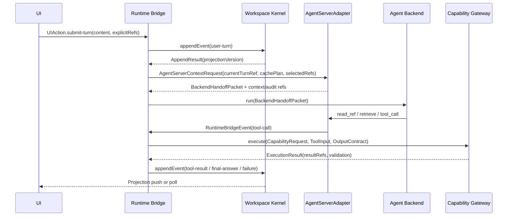

# SciForge Single-Agent Multiturn Architecture

最后更新：2026-05-16

---

## 文档分层阅读

这份文档故意保持单文件，但按三层阅读：

| 层级 | 面向对象 | 建议阅读范围 | 目的 |
|---|---|---|---|
| 第一层：设计理念速读 | 产品、架构评审、领域用户 | 总体原则、架构总览、端到端主链路速读、长期演进防污染评估 | 快速 get 为什么这样设计，以及什么边界不能破 |
| 第二层：实现 contract | Agent、工程实现者 | Workspace Kernel、Capability Gateway、AgentServer Context Core、Runtime Bridge、Backend 工具调用路径、完整运行逻辑 | 按 contract 写代码，不靠口头约定 |
| 第三层：Conformance / Operations | 测试、运维、安全、长期维护者 | 长期稳定机制、安全权限与保留策略、Core Conformance Suite、完整验收用例、防腐 checklist | 防回归、防膨胀、定位线上问题 |

第一层回答“这个系统为什么不会变成 prompt 拼接器”；第二层回答“每个模块应该怎么实现”；第三层回答“如何证明未来迭代没有污染边界”。

## 总体原则

```
Workspace Kernel       = 事实持久化 / Refs 寻址 / Projection 派生
AgentServer Context Core = 上下文编排 / current work / compaction / BackendHandoffPacket
Agent Backend          = 理解意图 / 规划任务 / 选择 capability / 修复失败
Capability Gateway     = 能力声明 / Provider 授权与解析 / 执行 / 验证
Runtime Bridge         = AgentServer transport / Run 生命周期 / 事件中继 / 失败归一化
```

SciForge 运行时的职责边界只有一句话：**Workspace 保存可恢复事实，AgentServer 编排上下文，Backend 做推理和修复，SciForge 本地只做持久化、受控执行、校验和 UI 投影。**

因此 SciForge 不做第二套 context orchestrator。SciForge 只把 ledger、refs、projection、capability brief、failure evidence 交给 AgentServer Context Core；由 AgentServer 生成 backend-specific `BackendHandoffPacket`，backend 再按需通过受控工具读取 ref、检索和调用能力。

---

## 架构总览

```
┌──────────────────────────────────────────────────────────┐
│                     Agent Backend                        │
│   理解意图 · 规划 · 选择 capability · 修复失败            │
│   按需调用 read_ref / retrieve / capability tools         │
└────────────────────┬─────────────────────────────────────┘
                     │  BackendHandoffPacket / RuntimeBridgeEvent stream
                     ▼
┌──────────────────────────────────────────────────────────┐
│              AgentServer Context Core                    │
│   current work · recent turns · compaction · retrieval    │
│   backend-specific harness / handoff packet               │
└────────────────────┬─────────────────────────────────────┘
                     │ AgentServer run stream / context refs
                     ▼
┌──────────────────────────────────────────────────────────┐
│                    Runtime Bridge                        │
│   transport · run lease/checkpoint · event relay          │
│   idempotency · failure normalization                     │
└──────┬─────────────────────────────────┬─────────────────┘
       │ appendEvent / readRef           │ Gateway.execute
       ▼                                 ▼
┌─────────────────────┐   ┌─────────────────────────────────┐
│   Workspace Kernel  │   │       Capability Gateway        │
│  事实存储 · Refs     │   │  Registry · Execute            │
│  Projection 派生    │   │  route/preflight/invoke         │
│  Ledger append-only │   │  materialize/validate           │
└─────────────────────┘   └─────────────────────────────────┘
       │ Projection (read-only)
       ▼
      UI
```

数据流方向：
- **Runtime Bridge** 从 Kernel 和 Gateway 取 bounded facts，作为 context refs 和 capability brief 交给 AgentServer
- **AgentServer Context Core** 负责 current work、recent turns、compaction、retrieval audit 和 `BackendHandoffPacket`
- **Backend** 通过 AgentServer 暴露的受控工具读取 refs、检索和请求 capability
- **Runtime Bridge** 中继 stream、执行 Gateway 调用、落盘 refs、归一化失败并写回 Kernel
- **UI** 只消费 Kernel 派生的 Projection，不直接读 runs 或 refs 原始内容

### 端到端主链路速读



这条链路有三个长期稳定点：

- 当前 turn 是本轮唯一语义中心；旧内容只能通过 explicit refs、bounded indexes 或 retrieval evidence 进入。
- Runtime Bridge 只中继结构化事件和调用 `Gateway.execute`，不拼 prompt、不猜意图、不直接执行工具。
- UI 的最终事实只来自 Projection；stream delta 只是临时显示。

---

## 模块一：Workspace Kernel

### 职责

Workspace Kernel 是整个系统的事实源。它只负责两件事：**让事实持久且不可篡改**，以及**提供可寻址的读取入口**。

它不理解用户意图，不选择 refs，不做语义推断，不接受外部写入 Projection。

### 核心约束

- Ledger 是唯一事实源，**只追加，不原地改写**。任何压缩、删除、历史编辑都必须成为新的 ledger 事件。
- Projection 是 Kernel 根据 ledger 自动派生的只读视图，**不接受外部写入**。
- 大内容（artifact 正文、stdout、stderr、raw output）默认只进 ref，**不进 Projection 或 prompt**。
- Backend / AgentServer 按需调用 `readRef` 获取正文，Kernel 不做预加载或语义筛选。
- `retrieve` 语义查询**不属于 Kernel**，语义检索应走 AgentServer retrieval primitive 或 Capability Gateway 的 `semantic_search` capability。
- `listRefs` 必须分页、可过滤、可按 retention/scope 裁剪；任何 handoff 默认只携带 bounded index，不携带完整 session ref 列表。

### 对外 API

```typescript
// 事件追加
appendEvent(event: WorkspaceEvent): AppendResult

// Ref 管理
registerRef(content: Buffer | string, meta: RefMeta): ProjectMemoryRef
readRef(ref: ProjectMemoryRef, options?: ReadOptions): RefContent
listRefs(scope: RefScope, filter?: RefFilter, page?: PageOptions): RefPage<RefDescriptor>
// RefDescriptor 只含元数据（id / kind / size / digest / mime / producerRunId）
// 不含正文，正文通过 readRef 按需获取；长会话必须分页

// Projection（只读，自动派生）
restoreProjection(sessionId: string): ConversationProjection
```

`appendEvent` 必须是 synchronous-on-write：事件写入 ledger 的同时，同步更新 materialized `ConversationProjection` 并递增 `projectionVersion`。常规读路径读取 materialized Projection；ledger replay 只用于冷启动、审计、恢复和一致性测试。

### 写入模型与 inline/ref 边界

SciForge 默认是本地 single-writer runtime：同一 workspace 同一时刻只有一个 Kernel writer。若未来允许多个 Runtime Bridge 或多个进程写入同一 session，必须先取得 writer lease，并在 `appendEvent` 时做 `expectedProjectionVersion` compare-and-swap；CAS 失败必须重读 Projection 后重试，不允许最后写入者覆盖前者。

不是所有结构化数据都应该 ref 化。规则是：**小而结构化、频繁读取、直接影响 Projection 的事实内联到 `WorkspaceEvent`；大正文、长日志、可复用上下文快照和二进制/多媒体产物才进入 `ProjectMemoryRef`。**

默认边界：

| 数据 | 位置 |
|---|---|
| failure owner/reason/signature/recoverability | event payload 内联 |
| agentserver health 状态、degraded reason 摘要 | event payload 内联，长 detail 可挂 `detailRef` |
| capability changelog 摘要 | event payload 内联，完整 diff 可挂 ref |
| artifact 正文、stdout/stderr、raw output、长 audit bundle | `ProjectMemoryRef` |
| context snapshot、handoff packet、run audit | `ProjectMemoryRef` |

这样 Kernel 仍是唯一事实源，但调试一次 run 不需要为每个小状态反复 `readRef`。

### 类型定义

```typescript
type AppendResult = {
  eventId: EventId
  projection: ConversationProjection
  projectionVersion: number
}

type WorkspaceEvent =
  | { type: 'user-turn';      turnId: string; content: UserTurn }
  | { type: 'stable-goal-recorded'; sessionId: string; goalRef: ProjectMemoryRef; source: 'user' | 'backend-proposal' }
  | { type: 'context-snapshot'; runId: string; snapshotRef: ProjectMemoryRef }
  | { type: 'agentserver-health'; status: AgentServerHealthSummary; detailRef?: ProjectMemoryRef }
  | { type: 'capability-changed'; changelog: CapabilityChangelog; detailRef?: ProjectMemoryRef }
  | { type: 'progress-summary'; runId: string; summary: string }
  | { type: 'tool-call';      runId: string;  call: ToolCall }
  | { type: 'tool-result';    runId: string;  resultRef: ProjectMemoryRef }
  | { type: 'answer-delta';   runId: string;  text: string }
  | { type: 'final-answer';   runId: string;  answerRef: ProjectMemoryRef }
  | { type: 'failure';        runId: string;  failure: ClassifiedFailure }
  | { type: 'run-status';     runId: string;  from?: RunStatus; to: RunStatus; trigger: string; createdAt: number }

type AgentServerHealthSummary = {
  checkedAt: number
  status: 'healthy' | 'degraded' | 'unavailable'
  reason?: string
}

type ProjectMemoryRef = {
  id:            string
  sessionId:     string
  kind:
    | 'user-turn'
    | 'projection'
    | 'stable-goal'
    | 'capability-brief'
    | 'capability-changelog'
    | 'handoff-packet'
    | 'artifact'
    | 'log'
    | 'stdout'
    | 'stderr'
    | 'raw-output'
    | 'context-snapshot'
    | 'compaction-audit'
    | 'retrieval-audit'
    | 'degraded-reason'
    | 'agentserver-health'
    | 'verification-record'
    | 'event-log'
    | 'run-audit'
    | 'checkpoint'
  group: RefKindGroup
  digest:        string         // SHA-256，内容变化时可检测
  size:          number
  mime:          string
  producerRunId: string
  createdAt:     number
  retention:     Retention      // derived from group, not caller supplied
}

type RefKindGroup = 'prompt-material' | 'failure-evidence' | 'audit' | 'execution-artifact' | 'checkpoint'
type Retention = 'hot' | 'warm' | 'cold' | 'audit-only'

const RETENTION_BY_GROUP: Record<RefKindGroup, Retention> = {
  'prompt-material': 'hot',
  'failure-evidence': 'warm',
  'audit': 'cold',
  'execution-artifact': 'warm',
  'checkpoint': 'hot',
}

type ConversationProjection = {
  sessionId:        string
  status:           'running' | 'satisfied' | 'repair-needed' | 'needs-human' | 'failed-with-reason'
  projectionVersion: number
  stableGoalRef?:   ProjectMemoryRef
  visibleAnswer?:   string
  primaryArtifacts: ArtifactDescriptor[]
  activeRun?:       RunSummary
  backgroundRuns:   RunSummary[]
  verification?:    VerificationSummary
  recoverActions:   RecoverAction[]
  auditRefs:        ProjectMemoryRef[]
  contextRefs:      ProjectMemoryRef[]     // AgentServer handoff / compaction / retrieval audit refs
}

type RecoverAction = {
  actionId: string
  label: string
  trigger: 'new-turn-with-context' | 'retry-repair' | 'provide-input' | 'cancel-run'
  contextOverride?: {
    mode: 'repair'
    failureRef: ProjectMemoryRef
    additionalRefs?: RefDescriptor[]
  }
}
```

### Projection 一致性模型

Projection 采用 synchronous-on-write materialized view：

```
Kernel.appendEvent(event)
  -> append ledger
  -> update materialized ConversationProjection
  -> projectionVersion += 1
  -> return AppendResult(eventId, projection, projectionVersion)
```

UI push/poll 看到的 Projection 可能短暂落后于 stream delta，但不会与已完成的 `appendEvent` 结果冲突。`answer-delta` 只能作为 transient display；如果 transient display 与更新后的 Projection 冲突，Projection 胜出。terminal state、recover actions、primary artifacts 和 visible answer 都只以 Projection 为准。

不同状态下的 Projection 规则：

| status | visibleAnswer | recoverActions |
|---|---|---|
| `running` | 最新稳定答案或空；stream delta 只在 UI transient layer 显示 | 可包含 cancel / attach guidance |
| `satisfied` | final-answer ref 的可读投影 | 空或后续建议 |
| `repair-needed` | 失败摘要 + 上一次稳定答案（如果有） | 来自 ClassifiedFailure 和 RepairPolicy |
| `needs-human` | 需要用户补充的信息 | provide-input / cancel |
| `failed-with-reason` | failure reason 的用户可读摘要 | retry/fork/report debug，按 RepairPolicy 限制 |

### Session 生命周期

Session 本身也有生命周期，独立于 run：

```typescript
type SessionStatus = 'active' | 'paused' | 'archived'

type CrossSessionRef = {
  sourceSessionId: string
  ref: ProjectMemoryRef
  importedAs?: ProjectMemoryRef
}
```

规则：

- `active`：允许新 turn、foreground run 和 background run。
- `paused`：不启动新 run，但 refs 和 Projection 可读。
- `archived`：默认只读；hot refs 可按 group retention 转 warm/cold/audit-only。
- ref retention 转换由 `RefKindGroup` 和 session status 驱动，不由调用方临时决定。
- 跨 session 引用必须通过 `CrossSessionRef` 或显式 import 记录来源，不能复制裸路径。
- 跨 session memory 提炼、永久删除、敏感内容清理和跨 workspace 导出都必须由用户确认，并写入 append-only event；SciForge 不自动把一个 session 的稳定目标或 artifact 升级成全局记忆。

### 可调试点

- **Ledger replay**：冷启动或审计时从任意历史 EventId 重放，验证 materialized Projection 结果一致
- **Ref digest 校验**：内容变化时 digest 变化可检测，防止静默损坏
- **Projection diff**：对比两个 projectionVersion，精确定位状态变化原因

---

## 模块二：Capability Gateway

### 职责

Capability Gateway 是 SciForge 对工具和执行能力的**唯一入口**，任何工具调用都必须经过它。它不替 Backend 规划任务，也不做用户意图判断，只负责**声明能力、解析受控 provider route、执行能力、验证产出**。

Backend 在 toolCall 中声明要使用的 capability、输入、约束和可选 provider 偏好。Gateway 根据 provider policy、健康状态、权限、allowed roots 和 rate limit 解析 canonical route，然后通过单一 `execute` 入口完成 route resolution → preflight → invoke → materialize → structural validate。

### 内部四层结构

Gateway 对外是一个统一模块，内部分四层，每层可独立测试：

```
┌─────────────────────────────────────────┐
│           Capability Gateway            │
│                                         │
│  ┌─────────────────────────────────┐    │
│  │       Registry Layer            │    │
│  │  listCapabilities               │    │
│  │  listProviders                  │    │
│  │  getCapabilityBrief/Manifest    │    │
│  └─────────────────────────────────┘    │
│                                         │
│  ┌─────────────────────────────────┐    │
│  │       Route Resolver Layer      │    │
│  │  resolveRoute (policy/health)   │    │
│  └─────────────────────────────────┘    │
│                                         │
│  ┌─────────────────────────────────┐    │
│  │       Preflight Layer           │    │
│  │  preflight (auth/perm/limits)   │    │
│  └─────────────────────────────────┘    │
│                                         │
│  ┌─────────────────────────────────┐    │
│  │       Execution Layer           │    │
│  │  execute                        │    │
│  │  (invoke/materialize/validate)  │    │
│  └─────────────────────────────────┘    │
└─────────────────────────────────────────┘
```

**Registry Layer** 提供能力声明和 compact brief。AgentServer / Backend 可以按需展开 schema、examples、repair hints 和 provider metadata，但默认 handoff 只带紧凑能力摘要。

能力声明不是静态假设。provider 上线、下线、权限变化、schema 变化、默认 route 变化都必须生成 `CapabilityChangelog`，并通过 `capability-changed` event 写入 Kernel。Runtime Bridge 在新 turn 到来时必须检查 capability brief digest 是否仍然有效；失效时重新生成 `capabilityBriefRef`，避免 Backend 基于过期能力规划任务。

**Route Resolver Layer** 只做确定性 provider 解析和边界控制，不做任务规划：它可以拒绝不可用 provider、按权限和 allowed roots 收紧 route、把 backend 的 provider 偏好解析成 canonical route，或在 policy 允许时选择默认 provider。它不能根据用户文本猜任务，也不能重写 backend 的能力组合。

**Preflight Layer** 在 invoke 前独立运行，检查 provider 健康、鉴权、权限、allowed roots、rate limit。Preflight 失败直接返回 `provider-unavailable`，不进入执行。

**Execution Layer** 对外只暴露 `execute`。内部仍按 invoke → materialize → structural validate 分步实现并可独立测试，但 Runtime Bridge 不管理中间状态，避免把部分失败和 raw output 泄漏到桥接层。

### 对外 API

```typescript
// Registry Layer
listCapabilities(): CapabilityManifest[]
listProviders(capabilityId?: string): ProviderManifest[]
getCapabilityBrief(options?: BriefOptions): CapabilityBrief
getCapabilityManifest(capabilityId: string): CapabilityManifest
getCapabilityChangelog(sinceEventId?: EventId): CapabilityChangelog[]

// Execution Layer
execute(request: CapabilityRequest, input: ToolInput, contract: OutputContract): ExecutionResult
```

`resolveRoute`、`preflight`、`invoke`、`materialize`、`validate` 是 Gateway 内部阶段，可以独立单元测试，但不是 Runtime Bridge 的 public API。Runtime Bridge 只能调用 `execute`，避免中间状态泄漏。

### 类型定义

```typescript
type ProviderRoute = {
  capabilityId: string
  providerId:   string
  routeDigest:  string
  // Gateway 解析出的 canonical route；Backend 可以声明偏好，但不能绕过边界控制
}

type CapabilityRequest = {
  capabilityId: string
  inputDigest:  string
  preferredProviderId?: string
  constraints?: {
    sideEffectClass?: 'read-only' | 'workspace-write' | 'external-write'
    allowedRoots?: string[]
    maxCostClass?: 'free' | 'low' | 'medium' | 'high'
  }
}

type PreflightResult =
  | { ok: true }
  | { ok: false; reason: 'provider-unavailable' | 'auth-failed' | 'permission-denied' | 'rate-limited'; detail: string }

type GatewayFailure = {
  stage:        'route-resolution' | 'preflight' | 'execution' | 'materialization' | 'validation'
  reason:       string
  providerStatus?: number
  missingFields?:  string[]
  invalidRefs?:    string[]
}

type ValidationResult =
  | { valid: true;  materializedRefs: ProjectMemoryRef[] }
  | { valid: false; failure: GatewayFailure }

type ExecutionResult =
  | { ok: true; route: ProviderRoute; refs: ProjectMemoryRef[]; validation: ValidationResult }
  | { ok: false; failure: GatewayFailure; evidenceRefs: ProjectMemoryRef[] }

type ArtifactDelivery = {
  ref: ProjectMemoryRef
  role: 'primary-deliverable' | 'supporting-evidence' | 'audit' | 'diagnostic' | 'internal'
  declaredMediaType: string
  declaredExtension?: string
  contentShape: 'text' | 'markdown' | 'json' | 'table' | 'image' | 'html' | 'binary' | 'unknown'
  readableRef?: ProjectMemoryRef
  rawRef: ProjectMemoryRef
  previewPolicy: 'inline' | 'open-system' | 'audit-only' | 'unsupported'
}

type CapabilityChangelog = {
  changedAt: number
  capabilityId: string
  previousDigest?: string
  nextDigest: string
  reason: 'provider-added' | 'provider-removed' | 'schema-changed' | 'permission-changed' | 'route-policy-changed'
  affectedProviders: string[]
}
```

### 核心约束

- **Skill ≠ Capability ≠ Provider**：Skill 是工作流说明；Capability 是抽象能力 contract；Provider 是具体执行来源。三者分层，不混用。
- **Capability 选择归 Backend，Provider route 归边界控制**：Backend 选择 capability 和约束；Gateway/AgentServer policy 解析 provider route，Gateway 最终执行和审计。
- **Scenario package 只能是 policy**：scenario 可以声明 artifact schema、默认 view、capability policy、domain vocabulary、verifier policy、privacy/safety boundary；不能携带 execution code、prompt regex、provider branch、多轮 semantic judge、preset answer 或 system prompt。
- **Preflight 必须在 invoke 前独立运行**：provider 不可用时不进入执行层，避免副作用。
- **Materialize 必须在 validate 前完成**：`execute` 内部先把产出落盘成 refs，再做 schema 校验，失败时有证据可查。
- **ArtifactDelivery 决定可见性**：只有 `primary-deliverable` 和 `supporting-evidence` 能进入 Projection 的用户可见结果；`audit`、`diagnostic`、`internal` 默认只进入 debug/audit channel。
- **Gateway.validate 只做结构校验**：schema、必填字段、ref 可读性、artifact delivery、side-effect contract 属于 Gateway；实验结论是否合理、报告论证是否充分等语义验证不属于 Gateway。
- **语义验证必须显式化**：如果需要语义/科学判断，应由 Backend 或独立 verifier capability 产出 `verification-record` ref；Gateway 只记录验证结果和证据，不做领域判断。
- **Tool call 必须幂等**：每次调用必须带 `callId`、`inputDigest`、`routeDigest`；重复调用优先复用已 materialized refs 或产生明确 replay record。

### Provider / Worker 发现边界

AgentServer 和 Gateway 可以从本地、MCP、HTTP、SSH、container 或 remote-service 发现 provider，但发现结果必须归一成 `ProviderManifest`，不能把单个 worker endpoint shape 泄漏给 Backend 或 Runtime Bridge。

最小 worker discovery 面：

```text
GET  /.well-known/sciforge-worker.json
GET  /health
POST /tools/:toolId/invoke
GET  /runs/:runId/events
POST /runs/:runId/cancel
```

`/.well-known/sciforge-worker.json` 必须声明 worker id/version/protocol version、transport、capabilities、providers、workspace roots、auth scope、network boundary、health/readiness、rate-limit metadata 和 fallback eligibility。新增机器如果只提供系统已认识的 capability，应只改 provider/worker 配置；新增全新工具类型必须先注册 capability contract，再允许 Backend 选择它。

### 可调试点

- **Registry Layer**：mock provider，验证 manifest 输出格式，不依赖真实 provider
- **Capability Changelog**：provider/schema/permission 变化时写入 `capability-changed` event，并使旧 capability brief digest 失效
- **Route Resolver Layer**：给定相同 request + policy，输出相同 canonical route；权限不足时返回 `permission-denied`
- **Preflight Layer**：断开 provider，验证返回 `provider-unavailable` 而不是执行错误
- **Execution Layer**：给定相同 input，replay 验证 `execute` 返回 refs 一致，并保留内部 invoke/materialize/validate 阶段诊断

---

## 复用模块：AgentServer Context Core

### 职责

AgentServer Context Core 是 SciForge 应复用的通用能力，不在 SciForge 本地重做。它负责把 workspace ledger/ref/projection 变成 backend-specific handoff：

1. 管理 current work、recent turns、persistent/memory layers 和 context-window state
2. 执行 compaction preview/apply，记录 source refs 和 decision owner
3. 暴露 `retrieve`、`read_ref`、`workspace_search`、`list_session_artifacts` 等 retrieval primitives
4. 生成 backend-specific `BackendHandoffPacket`
5. 记录 handoff 的 `contextRefs`、retrieval audit、compaction audit 和 budget metadata
6. 暴露 health / context-window / compaction 可观测性，不能成为不可审计黑盒

SciForge 的职责是给 AgentServer 提供可恢复事实来源：当前 user turn ref、`ConversationProjection`、bounded artifact/failure index、capability brief、selected refs 和 failure evidence。SciForge 不把这些材料直接拼成 backend prompt，也不在 AgentServer 不可用时把完整本地历史塞给 backend。

### AgentServer 集成模型

SciForge 不直接依赖任意第三方 agent API。所有 AgentServer 集成都必须通过 `AgentServerAdapter`，由 adapter 把上游能力转换成 SciForge 的 context、handoff、audit 和 degraded contract。

```typescript
type AgentServerIntegrationMode =
  | 'owned-agentserver'          // SciForge 自研 AgentServer，直接控制 compaction/retrieval/handoff
  | 'third-party-adapter'        // 第三方 agent API，通过 adapter 合成 SciForge contract
  | 'owned-orchestrator-third-party-backend' // 自研编排层 + 第三方 LLM/backend

type AgentServerAdapter = {
  mode: AgentServerIntegrationMode
  buildContext(request: AgentServerContextRequest): Promise<AgentServerContextResponse | DegradedHandoffPacket>
  resumeRun(runId: string, cursor?: StreamCursor): Promise<RuntimeBridgeEventStream>
  health(): Promise<AgentServerHealthRecord>
}
```

集成规则：

- 默认主路径是 `owned-orchestrator-third-party-backend`：SciForge/AgentServer 自己控制 context orchestration、compaction、retrieval、audit 和 handoff contract；底层 LLM/backend 可以是第三方。这样最关键的上下文策略不受第三方 agent API 黑盒控制。
- `owned-agentserver`：`compactionAuditRefs`、`retrievalAuditRefs`、`handoffPacketRef` 是硬要求。
- `third-party-adapter`：兼容模式，不是默认主路径。上游 API 不提供 audit 时，adapter 必须生成 best-effort synthetic audit ref；如果连最小审计和降级语义都无法满足，返回 `agentserver-context-unavailable`。
- `owned-orchestrator-third-party-backend`：AgentServer 仍负责 context orchestration 和 audit；BackendHandoffPacket 再适配成各 backend 的 prompt/tool schema。
- `BackendHandoffPacket` schema 由 SciForge / AgentServer contract 定义和演进，第三方 backend 格式只能存在于 adapter 内部。

Synthetic audit 不能伪装成上游真实审计。只要 audit 不是 AgentServer 原生产出，必须带显式标记：

```typescript
type SyntheticAuditMeta = {
  synthetic: true
  source: 'adapter'
  upstream: string
  reason: 'upstream-missing-audit' | 'upstream-partial-audit' | 'upstream-non-deterministic-format'
  confidence: 'low' | 'medium' | 'high'
  sourceRefs: ProjectMemoryRef[]
}
```

规则：

- synthetic audit 只能说明 adapter 如何解释上游输入/输出，不能声称知道上游真实 compaction 或 retrieval 决策。
- UI debug panel 和 RunAudit 必须把 synthetic audit 明确标记为 best-effort。
- 如果 synthetic audit 无法回答“哪些 refs 进入了 handoff、为什么进入、预算如何变化”，adapter 必须返回 degraded/failure，而不是生成看似完整的审计。

### 交互 contract

```typescript
type AgentServerContextRequest = {
  _contractVersion: string
  sessionId:        string
  turnId:           string

  // KV cache plan: stable blocks first, dynamic current-turn payload last.
  cachePlan: {
    stablePrefixRefs: ProjectMemoryRef[]  // immutable contract, workspace identity, capability brief, stable session state
    perTurnPayloadRefs: ProjectMemoryRef[] // current turn, explicit refs, bounded indexes, failure packet, retrieval evidence
  }

  // Current task anchor: the only semantic center of this turn.
  currentTask: {
    currentTurnRef: ProjectMemoryRef
    stableGoalRef?: ProjectMemoryRef
    mode: 'fresh' | 'continue' | 'repair' | 'answer-from-registry'
    explicitRefs: RefDescriptor[]
    selectedRefs: SelectedRefDescriptor[] // bounded, source-tagged refs from RefSelectionPolicy
    userVisibleSelectionDigest?: string
    failureRef?: ProjectMemoryRef
  }

  retrievalPolicy: {
    tools: Array<'read_ref' | 'retrieve' | 'workspace_search' | 'list_session_artifacts'>
    scope: 'current-session' | 'workspace'
    preferExplicitRefs: true
    requireEvidenceForClaims: boolean
    maxTailEvidenceBytes: number
  }

  refSelectionAudit: {
    policyDigest: string
    selectedRefCount: number
    selectedRefBytes: number
    truncated: boolean
    sourceCounts: {
      explicit: number
      projectionPrimary: number
      failureEvidence: number
      contextIndex: number
    }
  }

  contextPolicy: {
    mode: 'fresh' | 'continue' | 'repair' | 'answer-from-registry'
    includeCurrentWork: boolean
    includeRecentTurns: boolean
    persistRunSummary: boolean
    maxContextTokens: number
  }
}

type SelectedRefDescriptor = RefDescriptor & {
  source: 'explicit' | 'projection-primary' | 'failure-evidence' | 'context-index'
  priority: number
}

type AgentServerContextResponse = {
  _contractVersion: string
  agentId:          string
  backend:          string
  handoffPacketRef: ProjectMemoryRef       // BackendHandoffPacket snapshot
  contextSnapshotRef: ProjectMemoryRef     // AgentServer current work / memory / compaction snapshot
  contextRefs:      ProjectMemoryRef[]     // projection blocks, retrieval audit, compaction records
  compactionAuditRefs: ProjectMemoryRef[]  // what was compacted, why, source refs, budget trigger
  retrievalAuditRefs: ProjectMemoryRef[]   // query/scope/tool/source refs; no secret/raw body leakage
  degradedReason?: DegradedReason          // required when context API or compaction is degraded
  degradedReasonRef?: ProjectMemoryRef     // optional long detail
  retrievalTools:   string[]               // read_ref / retrieve / workspace_search / list_session_artifacts
  contextBudget: {
    maxContextTokens: number
    estimatedStablePrefixTokens: number
    estimatedPerTurnPayloadTokens: number
    compactionTriggered: boolean
    triggerReason?: 'budget' | 'health' | 'policy' | 'manual'
  }
  cacheBlocks?:     ContextProjectionBlock[]
}

type DegradedReason = {
  owner: FailureOwner
  reason: string
  recoverability: Recoverability
}
```

**关键设计**：

- Backend 接收的是 AgentServer 生成的 `BackendHandoffPacket`，不是 SciForge 自己组装的本地上下文包
- `currentTask.currentTurnRef` 是本轮唯一语义中心；旧会话、旧 artifact、旧 failure 只能作为 index/ref/evidence，不得覆盖当前用户问题
- `currentTask.stableGoalRef` 可以作为跨轮高层目标进入 stable prefix，但只能来自用户显式设置或 Backend 结构化 proposal 落盘；SciForge 不自己总结目标
- `currentTask.explicitRefs` 和 UI selection 是强锚点；没有 explicit refs 时，Runtime Bridge 不猜“最相关 artifact”，只提供 bounded indexes 和 retrieval policy
- `selectedRefs` 和 index blocks 必须 bounded 且 source-tagged；完整 ref 列表通过 retrieval/list API 分页读取
- fresh turn 默认隔离旧 recent turns；continue/repair 才显式打开 current work 和 recent turns
- context/compaction/retrieval 的每次决策都要落成 `context-snapshot`、`compaction-audit` 或 `retrieval-audit` ref
- `cachePlan.stablePrefixRefs` 不允许包含 `turnId`、`runId`、timestamp、latest error、progress 或 current failure；动态内容必须进入 `perTurnPayloadRefs`
- AgentServer context API 不可用时，Runtime Bridge 只能生成 refs-first degraded packet，并在 Projection 中展示降级状态；degraded packet 必须包含内联 `degradedReason`、当前 turn、stable goal、capability brief、bounded indexes 和 retrieval tools，长 detail 可挂 `degradedReasonRef`，不能把 raw 历史升级成 prompt 记忆替代品

### AgentServer 可观测性 contract

AgentServer Context Core 每次 context response 都必须给 SciForge 足够证据来回答“为什么这轮给 backend 的上下文是这样”：

```typescript
type CompactionAudit = {
  compactedTurnRefs: ProjectMemoryRef[]
  preservedRefs: ProjectMemoryRef[]
  summaryRef: ProjectMemoryRef
  triggerReason: 'budget' | 'health' | 'policy' | 'manual'
  tokenBefore: number
  tokenAfter: number
  decisionOwner: 'agentserver'
}

type AgentServerHealthRecord = {
  checkedAt: number
  status: 'healthy' | 'degraded' | 'unavailable'
  contextApiAvailable: boolean
  compactApiAvailable: boolean
  retrievalAvailable: boolean
  detailRef?: ProjectMemoryRef
}
```

### 降级包 contract

AgentServer context API 不可用时，Runtime Bridge 只能生成严格 refs-first 的 `DegradedHandoffPacket`。该 packet 是正式 contract，不是临时 prompt fallback。

```typescript
type DegradedHandoffPacket = {
  _contractVersion: string
  degradedReason: DegradedReason
  degradedReasonRef?: ProjectMemoryRef
  currentTurnRef: ProjectMemoryRef
  stableGoalRef?: ProjectMemoryRef
  capabilityBriefRef: ProjectMemoryRef
  boundedArtifactIndex: RefDescriptor[]   // hard limit from RefSelectionPolicy
  boundedFailureIndex: RefDescriptor[]    // hard limit from RefSelectionPolicy
  availableRetrievalTools: Array<'read_ref' | 'retrieve' | 'workspace_search' | 'list_session_artifacts'>

  // Explicitly forbidden:
  // no recentTurns
  // no fullRefList
  // no rawHistory
  // no compactionState
}
```

Runtime Bridge 应在请求失败时记录 health，同时可以按轻量心跳 probe AgentServer 并写入 `agentserver-health` event。健康记录不参与语义推理，只用于降级判断、debug 和 RunAudit。

### Token 预算执行模型

SciForge 和 AgentServer 分工明确：

- SciForge 负责 byte/ref 预算：`RefSelectionPolicy.maxTotalRefBytes`、selected ref count、bounded indexes。
- AgentServer 负责 backend-specific token 预算：具体 tokenizer、context window、prompt/render 截断和 compaction。
- 如果 AgentServer 估算 `perTurnPayloadRefs` 超过 `contextBudget.maxContextTokens`，它必须裁剪 per-turn payload、触发 compaction，或返回 budget failure；不得静默超限。
- Runtime Bridge 只审计 `contextBudget` 和 refs，不根据 token 估算重写 prompt。

### 数据格式与传输协议

最终架构固定使用以下传输形态，避免 contract 只停留在 TypeScript 类型：

| 通道 | 协议 |
|---|---|
| control request/response | canonical JSON over HTTP |
| run stream | NDJSON over HTTP streaming |
| ref/blob content | Kernel readRef resolver，本地文件或 HTTP resolver 均可，但必须返回 digest/size/mime |
| export/debug bundle | canonical JSON manifest + ref blobs |

规则：

- 所有 control payload 必须 canonical JSON：字段顺序稳定，数组排序规则稳定，空值策略固定。
- 所有 NDJSON stream event 必须包含 `_contractVersion`、`runId`、`producerSeq` 和 `cursor`；缺失时归类 `contract-incompatible`。
- `cursor` 是 resume 的唯一位置语义；`producerSeq` 用于同一 run 内幂等去重。
- 二进制、大文本和 artifact 正文不进入 NDJSON event，只通过 ref resolver 读取。

---

## 模块三：Runtime Bridge

### 职责

Runtime Bridge 是 SciForge 与 AgentServer / Backend 的本地边界壳。它**不做推断，不做策略，不判断用户意图，不做上下文编排**，只负责以下五件事：

1. 把 user turn、projection、capability brief、failure evidence 注册为 refs，并请求 AgentServer 生成 handoff
2. 管理 AgentRun 投影的完整生命周期（创建、lease、checkpoint、重连、超时、取消）
3. 把 AgentServer / Backend stream 事件幂等中继写回 Kernel
4. 通过 Capability Gateway 执行受控工具调用并落盘结果
5. 把各种失败归一化成机器可读的 ClassifiedFailure

### 内部四个子组件

```
┌─────────────────────────────────────────────┐
│              Runtime Bridge                 │
│                                             │
│  ┌──────────────────┐  ┌─────────────────┐  │
│  │ Context Bridge   │  │ Run State       │  │
│  │                  │  │ Machine         │  │
│  │ buildContextReq  │  │ createRun       │  │
│  │ recordSnapshot   │  │ checkpointRun   │  │
│  └──────────────────┘  │ cancelRun       │  │
│                        └─────────────────┘  │
│  ┌──────────────────┐  ┌─────────────────┐  │
│  │ Idempotent Event │  │ Failure         │  │
│  │ Relay            │  │ Normalizer      │  │
│  │ consumeEvent     │  │ classify        │  │
│  │ resumeFromCursor │  │                 │  │
│  └──────────────────┘  └─────────────────┘  │
└─────────────────────────────────────────────┘
```

### 对外 API

```typescript
// 主入口：声明式 turn pipeline。executor 只执行步骤、捕获错误、记录 rollback。
runTurnPipeline(sessionId: string, userTurn: UserTurn, pipeline?: PipelineStep[]): Promise<void>

type PipelineStep = {
  name: 'registerTurn' | 'requestContext' | 'driveRun' | 'finalizeRun'
  fn: (ctx: PipelineContext) => Promise<PipelineContext>
  rollback?: (ctx: PipelineContext) => Promise<void>
}

type RepairPolicy = {
  maxAutoRecoveryAttempts: number
  maxSameOwnerRetries: number
  maxSameFailureSignatureRetries: number
  escalateOnCanAutoRecoverFalse: true
}

type SessionRunConcurrencyPolicy = {
  maxForegroundRuns: 1
  allowBackgroundRuns: boolean
  onNewTurnWhileActive: 'attach' | 'wait' | 'cancel-active' | 'fork-new-session'
}

// Context Bridge：只生成 AgentServer context request，不生成 backend prompt
contextBridge.buildContextRequest(input: ContextBridgeInput, policy: RefSelectionPolicy): AgentServerContextRequest
contextBridge.recordContextResponse(response: AgentServerContextResponse): ProjectMemoryRef

runStateMachine.createRun(turnId: string, leasePolicy: RunLeasePolicy): EventId
runStateMachine.transition(runId: string, to: RunStatus, trigger: string): EventId
runStateMachine.checkpointRun(runId: string, checkpoint: RunCheckpoint): EventId
runStateMachine.getRunProjection(runId: string): AgentRunProjection

eventRelay.consumeEvent(event: RuntimeBridgeEvent): Promise<void>
eventRelay.resumeFromCursor(runId: string, cursor: StreamCursor): Promise<void>
eventRelay.finalizeRun(runId: string): Promise<void>

failureNormalizer.classify(
  source: GatewayFailure | BackendFailureEvent | RunTimeoutEvent | StreamFailureEvent | ContractFailureEvent
): ClassifiedFailure
```

### UI → Runtime Bridge contract

UI 不能直接写 Kernel，也不能从 raw run/backend stream 推断状态。所有 UI 写操作都进入 Runtime Bridge，并最终落成 WorkspaceEvent。

```typescript
type UIAction =
  | { type: 'submit-turn'; content: UserTurn; explicitRefs?: string[] }
  | { type: 'trigger-recover'; actionId: string }
  | { type: 'cancel-run'; runId: string }
  | { type: 'concurrency-decision'; decision: 'attach' | 'wait' | 'cancel-active' | 'fork-new-session' }
  | { type: 'open-debug-audit'; runId: string }

handleUIAction(sessionId: string, action: UIAction): Promise<AppendResult | RunAudit | void>
```

`trigger-recover` 只能触发 Projection 中已有的 `RecoverAction`；UI 不能自行拼 repair context。`submit-turn.explicitRefs` 是 reanchor 的最高优先级信号，必须进入 `currentTask.explicitRefs`。

### LLM-gated Direct Context

低延迟 direct-context fast path 可以存在，但不能变成本地模板回答器。它只能回答“当前 Projection 已经有足够 typed facts”的只读问题，例如当前 run 状态、失败原因、已有 artifact 引用、上一次可见结果和 recover action。

```typescript
type DirectContextDecision = {
  decisionRef: ProjectMemoryRef
  mode: 'answer-from-projection' | 'route-to-agentserver'
  requiredTypedContext: Array<'visible-answer' | 'artifact-index' | 'failure-evidence' | 'run-status' | 'capability-status'>
  usedRefs: ProjectMemoryRef[]
  sufficiency: 'sufficient' | 'insufficient'
  decisionOwner: 'agentserver' | 'backend' | 'harness-policy'
}
```

规则：

- direct-context decision 必须来自 AgentServer / Backend / harness policy 的结构化输出，并落盘为 decision/audit ref；Runtime Bridge 不用关键词或 artifact kind 自行判断。
- `answer-from-projection` 不访问新工具、不读取未展开正文、不查询外部网络、不扩大 context；需要这些能力时必须 `route-to-agentserver`。
- 输出必须引用 supporting refs；无法给出 supporting refs 时视为 insufficient。
- capability/provider/skill 状态查询必须走 Capability Registry / ProviderManifest / AgentServer worker registry，而不是从 UI 配置或 prompt 文案猜测。

### Harness policy 放置

如果 SciForge 使用 harness/profile/callback 机制，它属于 AgentServer/Backend 前的策略层，不属于 Runtime Bridge 主流程。Harness 只能输出结构化 decision 和 contract refs：

```typescript
type HarnessPolicyDecision = {
  decisionRef: ProjectMemoryRef
  stages: Array<'intent' | 'context' | 'capability' | 'budget' | 'verification' | 'repair' | 'progress'>
  contractRef: ProjectMemoryRef
  traceRef: ProjectMemoryRef
  promptDirectiveRefs: ProjectMemoryRef[]
}
```

边界：

- Harness callback 不读写 workspace、不调用 provider、不直接拼最终 prompt、不修改 React state。
- 首次策略决策必须事件化；replay 时消费历史 decision，不重新运行依赖时间、provider health、token budget 或外部配置的 hook。
- Prompt renderer 只能渲染 bounded `promptDirectiveRefs` / render plan summary；不能把完整 contract、trace 或 callback 过程塞进 prompt。
- Runtime Bridge 只能把 harness decision 当作 AgentServer context request 的输入 ref，不解释其中的领域语义。

### 声明式 TurnPipeline

`RuntimeBridge` 不提供可任意扩展的 `handleTurn` 协调函数。主流程必须声明成固定 pipeline，executor 本身不允许包含业务条件分支；任何 `if userText`、`if failure.canAutoRecover`、`if artifact kind` 都必须下沉到 AgentServer、Backend、Gateway contract 或独立 policy 输出。

```typescript
const turnPipeline: PipelineStep[] = [
  { name: 'registerTurn',   fn: ctx => contextPort.registerTurn(ctx) },
  { name: 'requestContext', fn: ctx => contextPort.buildAndSendRequest(ctx) },
  { name: 'driveRun',       fn: ctx => runStateMachine.drive(ctx) },
  { name: 'finalizeRun',    fn: ctx => eventRelay.finalizeRun(ctx) },
]
```

Pipeline executor 只允许做三件事：按顺序执行步骤、把步骤失败转成 `ClassifiedFailure`、执行声明式 rollback。这样 Runtime Bridge 的主干没有空间生长出 prompt 特例、repair 策略或用户意图判断。

### RepairPolicy 与修复熔断

自动修复必须有终止条件。`TurnPipeline.onFailure(classified)` 是唯一消费 `RepairPolicy` 的位置，Failure Normalizer 只分类，不决定是否重试。

规则：

- `classified.canAutoRecover === false` 时，立即追加 `needs-human-input` / `waiting-human` 状态，不自动进入 repair。
- `maxAutoRecoveryAttempts` 达到上限时，追加 `failed-with-reason`，并把最后一次 failure 和 repair audit refs 暴露给 UI。
- 同一个 `owner` 连续超过 `maxSameOwnerRetries` 时熔断，避免同类错误无限循环。
- 同一个 `failureSignature` 连续超过 `maxSameFailureSignatureRetries` 时熔断，即使 reason 文本略有变化也不继续重试。
- 每次 repair attempt 都必须写入 run audit，包含 previousFailureRef、newFailureRef、attemptIndex 和 decision。

```typescript
type RepairAttemptRecord = {
  runId: string
  attemptIndex: number
  previousFailureRef: ProjectMemoryRef
  newFailureRef?: ProjectMemoryRef
  owner: FailureOwner
  failureSignature: string
  decision: 'auto-repair' | 'needs-human' | 'failed-with-reason'
  reason: string
}
```

### Session run 并发模型

Single-agent 多轮默认采用 **每个 session 同一时刻最多一个 foreground active run**。`background-running` 允许存在，但不能隐式与新的 foreground run 竞争同一 workspace 写集。

新 turn 到来时，如果已有 active run：

| 策略 | 行为 |
|---|---|
| `attach` | 新 turn 作为 guidance/clarification 追加到当前 run，不新建 run |
| `wait` | 新 turn 进入 pending，直到当前 foreground run terminal |
| `cancel-active` | 追加 cancel transition，当前 run terminal 后再启动新 run |
| `fork-new-session` | 新建 session，禁止两个 foreground run 写同一 session |

默认策略是 `wait`。任何允许后台 run 的 profile 都必须声明 read/write scope；如果新 turn 需要写入相同 workspace scope，必须先 wait/cancel/fork，不能默默并发写。

---

### 子组件一：Context Bridge

**职责**：纯函数式生成 AgentServer context request 和记录 response refs，不含用户意图判断。输入只来自 Kernel、Gateway brief 和显式 runtime config。

```typescript
type ContextBridgeInput = {
  sessionId: string
  turnId: string
  currentTurnRef: ProjectMemoryRef
  projection: ConversationProjection
  capabilityBrief: CapabilityBrief
  explicitRefs: RefDescriptor[]
  recentFailure?: ClassifiedFailure
}

type RefSelectionPolicy = {
  maxSelectedRefs: number
  maxTotalRefBytes: number
  allowedRetention: Array<'hot' | 'warm' | 'cold' | 'audit-only'>
  budgets: Array<{
    source: 'explicit' | 'projection-primary' | 'failure-evidence' | 'context-index'
    maxCount: number        // 0 means excluded
    priority: number        // lower number wins
  }>
  fallbackOrder: Array<'explicit' | 'active-artifact' | 'latest-primary-artifact' | 'latest-failure-evidence' | 'recent-context-index'>
}
```

#### buildContextRequest 防漂移算法

`buildContextRequest` 是确定性的上下文索引编译器，不做语义猜测。它按固定优先级生成 request：

1. 注册 `currentTurnRef`，把当前用户问题放入 `currentTask`，作为本轮唯一语义中心。
2. 复制用户显式选择和 UI selection 到 `currentTask.explicitRefs`，计算 `userVisibleSelectionDigest`。
3. 根据 mode 收紧上下文：`fresh` 默认不带 recent turns；`continue` 才允许 current work；`repair` 只允许 `failureRef`、evidence refs 和当前 projection refs。
4. 用 `RefSelectionPolicy` 从 explicit refs、primary artifacts、failure evidence、context index 中生成 bounded `selectedRefs`。
5. 构造 `cachePlan`：真正稳定的合约、workspace identity、capability brief、stable goal/session state 进入 `stablePrefixRefs`；其他 bounded indexes、当前 turn、explicit refs、failure packet 和 retrieval evidence 进入 `perTurnPayloadRefs`。
6. 构造 `retrievalPolicy`，把动态语义选择交给 AgentServer retrieval primitives。
7. 写入 `refSelectionAudit`，记录 policy digest、source counts、bytes 和是否截断。

防漂移优先级固定为：

```text
1. currentTask.currentTurnRef
2. currentTask.explicitRefs / user-visible selection
3. currentTask.failureRef, only in repair mode
4. bounded primary artifact index
5. bounded recent failure index
6. stable session state block
7. retrieval tools and budget
```

旧上下文只能通过 bounded index 或 retrieval 进入本轮；Runtime Bridge 不能把旧 summary、旧 artifact 正文或旧 recent turns 直接提升成当前任务语义中心。

当 AgentServer retrieval 不可用时，Runtime Bridge 仍不能使用语义函数谓词；只能使用确定性 fallback 排序：

```text
explicit refs
  -> active artifact
  -> latest primary artifact
  -> latest failure evidence
  -> recent context index
```

fallback 结果必须受 `maxSelectedRefs` 和 `maxTotalRefBytes` 约束，并写入 `refSelectionAudit.truncated/sourceCounts`。

#### KV cache 分层

`cachePlan` 的目标是稳定前缀字节级复用，而不是简单减少总 token。只有真正不随 turn 变化的内容进入 stable prefix，其余都进入 per-turn payload，并通过 block-level dedup 复用：

```text
stablePrefixRefs:
  immutable runtime contract
  workspace identity
  capability brief
  stable session state

perTurnPayloadRefs:
  current turn
  explicit refs
  artifact / failure / decision indexes
  failure packet
  retrieval evidence
  run ids / timestamps / progress
```

工程规则：

- stable prefix 中禁止出现 `turnId`、`runId`、timestamp、usage、latest error、progress 和当前 blocker。
- 所有 JSON block 必须 canonical serialize：字段顺序固定，数组稳定排序，空值策略固定。
- capability brief 内容不变时复用同一个 `capabilityBriefRef`。
- artifact/failure/decision index 用 `blockId + sha256 + sourceEventIds`，只 append/supersede，不整段重写。
- retrieval 结果永远进入 per-turn payload，本轮结束后再由 AgentServer / Backend 提炼进 stable state。

**关键设计**：

- Context Bridge 不生成 backend prompt 或本地上下文包，只生成 `AgentServerContextRequest`
- `selectedRefs` 必须由 `RefSelectionPolicy` 纯函数生成，来源只允许是用户显式选择、当前 Projection、failure evidence 和 bounded context refs
- `RefSelectionPolicy` 只允许声明式字段，不允许 `(ref) => boolean` 这类函数字段；任何动态 ref 选择必须走 AgentServer retrieval primitives
- `maxSelectedRefs` 和 `maxTotalRefBytes` 是硬上限，超过时截断并记录 selection audit，不能继续扩大 handoff
- `cachePlan` 必须把稳定 refs 和 per-turn payload refs 分开，保证 current turn 不污染 stable prefix
- `retrievalPolicy.preferExplicitRefs` 必须为 true，AgentServer 应优先围绕当前用户问题和显式 refs 取证
- 每次 AgentServer context response 都序列化存档到 Kernel（`context-snapshot`），供 replay 和 diff
- 给定相同 input refs + context policy + ref selection policy，SciForge 侧 request 输出字节级确定；AgentServer 内部 compaction decision 通过 response refs 审计

**可调试点**：mock Kernel/Gateway/AgentServer，验证 context request 不包含 raw 历史和 ref 正文；对比同一 turn 的 context response 和 handoff snapshot 差异；长会话 fixture 验证 `selectedRefs` 和总 bytes 不随轮数线性增长。

---

### 子组件二：Run State Machine

**职责**：管理 AgentRun 从创建到结束的完整生命周期，包含 lease、checkpoint、重连和超时。Run State Machine **不维护内存状态**；所有状态转换都写成 append-only `run-status` event，当前状态只从 Kernel Projection 恢复。

```typescript
type AgentRunProjection = {
  runId:       string
  sessionId:   string
  turnId:      string
  agentId:     string
  status:
    | 'pending'
    | 'running'
    | 'waiting-provider'
    | 'waiting-human'
    | 'background-running'
    | 'completed'
    | 'timed-out'
    | 'cancelled'
    | 'failed'
    | 'degraded'
  startedAt:   number
  leaseUntil:  number
  retryCount:  number
  lastEventAt: number
  lastCursor?: StreamCursor
  leasePolicy: RunLeasePolicy
}

type RunStatusTransition = {
  runId: string
  from?: RunStatus
  to: RunStatus
  trigger: string
  createdAt: number
  checkpointRef?: ProjectMemoryRef
}

type RunLeasePolicy = {
  hardTimeoutMs:      number  // run 绝对最长时间，超过直接 cancel
  activityTimeoutMs:  number  // 最后一个 event 距现在超过此值，进入失活处理
  streamReconnectMs:  number  // stream 断开后重连等待
  leaseHeartbeatMs:   number  // 后台长任务续租心跳
  maxReconnects:      number
}
```

状态转换只能通过事件完成：

```typescript
async function transition(runId: string, to: RunStatus, trigger: string): Promise<EventId> {
  const from = kernel.restoreProjection(runId).activeRun?.status
  return kernel.appendEvent({
    type: 'run-status',
    runId,
    from,
    to,
    trigger,
    createdAt: Date.now(),
  })
}
```

`AgentRunProjection` 是从 ledger 派生的只读视图，不是可变对象。进程崩溃、窗口刷新或 Runtime Bridge 重启后，run 状态必须能仅通过 replay `run-status`、checkpoint 和 terminal events 恢复。

**状态说明**：

| 状态 | 含义 |
|---|---|
| `running` | AgentServer / Backend 正在产出事件 |
| `waiting-provider` | 工具/provider 正在执行或排队，仍有有效 lease |
| `waiting-human` | 需要用户确认、权限或补充输入 |
| `background-running` | 允许跨前端会话继续运行，有 checkpoint 可恢复 |
| `degraded` | AgentServer context/stream 能力不可用，使用 refs-first 降级包 |

所有 lease、timeout、reconnect 和 checkpoint 决策都写入 `run-status` 或 `checkpoint` 事件。调试时应能用 `listEvents({ runId, type: 'run-status' })` 回答“为什么这轮被取消、重连、降级或转后台”。

**可调试点**：Run 状态机转换日志，按 runId 过滤，精确复现任意 run 的生命周期。

---

### 子组件三：Idempotent Event Relay

**职责**：把 AgentServer / Backend stream 事件可靠写回 Kernel。目标不是假设 transport 支持 exactly-once ack，而是实现 **at-least-once 接收 + 幂等落盘 + cursor 重连**。

**写入顺序**：

```
RuntimeBridgeEvent arrives
  → validate contract version and producerSeq
  → bounded in-process spool if Kernel is temporarily unavailable
  → Kernel.appendEvent(event with idempotencyKey)
  → record EventId and stream cursor
  → update Projection from Kernel replay
```

Kernel 写入失败时，Relay 只能使用 bounded in-process spool。spool 不是持久化事实源，进程退出时内容丢失是预期风险；它只是为了吸收极短暂的 Kernel 不可用。超过硬上限后，run 必须进入 `failed` 并归类为 `storage-unavailable`，不能继续标记为 `degraded`。

```typescript
type WriteAheadSpool = {
  scope: 'in-process-only'
  maxBufferedEvents: number
  maxBufferAgeMs: number
  currentDepth: number
  oldestEventAgeMs: number
}
```

`degraded` 只表示 AgentServer context/stream 能力降级但仍能保证事实落盘；spool 耗尽表示已经不能保证幂等性和可恢复性，必须 fail closed。

**事件分类与落盘策略**：

```typescript
type RuntimeBridgeEvent =
  | { type: 'progress-summary'; summary: string; producerSeq: number; cursor?: StreamCursor }
  | { type: 'tool-call';        call: ToolCall; producerSeq: number; idempotencyKey: string }
  | { type: 'tool-result';      resultRef: ProjectMemoryRef; producerSeq: number; idempotencyKey: string }
  | { type: 'answer-delta';     text: string; producerSeq: number; cursor?: StreamCursor }
  | { type: 'final-answer';     answerRef: ProjectMemoryRef; producerSeq: number }
  | { type: 'failure';          failure: BackendFailureEvent; producerSeq: number }
  | { type: 'usage-update';     usage: UsageSummary; producerSeq: number }
  | { type: 'context-window-state'; stateRef: ProjectMemoryRef; producerSeq: number }
```

`progress-summary` 只能保存 backend/provider 可公开的进度摘要，不保存 raw chain-of-thought。`answer-delta` 可聚合后落盘，`tool-call`、`tool-result`、`final-answer`、`failure` 必须逐条幂等落盘。

**可调试点**：按 runId 和 producerSeq 过滤 event log，验证重复事件不会重复执行工具；断流后能从 last cursor 恢复或明确失败；Kernel 不可用 fixture 验证 spool 超过 depth/age 上限时产生 `storage-unavailable`，并包含 `spoolDepth`。

---

### 子组件四：Failure Normalizer

**职责**：把来自 Gateway、AgentServer、Backend stream、Run lifecycle、Contract gate 和 Kernel 的失败统一分类成机器可读的 `ClassifiedFailure`，供 AgentServer / Backend 修复使用。

**失败来源**：
- Gateway 返回的 `GatewayFailure`（capability / execution 类）
- AgentServer context / compaction / stream 返回的失败
- Run State Machine 的状态变化（lease、超时、取消、重连失败）
- Backend 自己返回的 `failure` 事件（context / output 类）
- Contract 版本、schema、refs、artifact delivery 校验失败
- Kernel / ref store 写入失败或恢复失败

```typescript
type FailureOwner =
  | 'backend-output-invalid'   // Backend 返回格式不符合 contract
  | 'contract-incompatible'    // 双侧 contract 版本不兼容，不能安全解析
  | 'agentserver-context-unavailable' // AgentServer context/compact API 不可用
  | 'provider-unavailable'     // Provider health / auth / permission 失败
  | 'permission-denied'        // provider / allowed roots / human approval 拒绝
  | 'capability-missing'       // 请求的 capability 不在 registry 中
  | 'artifact-missing'         // 期望的 artifact ref 未被 materialize
  | 'execution-failed'         // 工具执行本身报错
  | 'verification-failed'      // Backend/verifier capability 判定语义验证失败；Gateway 只记录结构化验证结果
  | 'run-timed-out'            // Run 超时（含 hard/activity/stream/lease）
  | 'stream-disconnected'      // stream 断开且无法从 cursor 恢复
  | 'storage-unavailable'      // Kernel/ref store 无法写入或恢复
  | 'context-insufficient'     // Backend 报告上下文不足以完成任务
  | 'needs-human-input'        // 需要用户补充信息

type FailureClass =
  | 'infrastructure' // storage, stream, contract transport, AgentServer availability
  | 'contract'       // schema/version/ref/artifact delivery boundary
  | 'provider'       // provider health/auth/permission/rate limit
  | 'execution'      // tool/runtime execution failed after accepted request
  | 'verification'   // Backend/verifier capability judged semantic output invalid
  | 'interaction'    // normal human input/approval needed

type Recoverability =
  | 'transient'       // retry may succeed without changing input
  | 'auto-repairable' // Backend can repair output/tool plan
  | 'needs-human'    // requires user decision/input/permission
  | 'terminal'       // fail closed; do not auto retry

type ClassifiedFailure = {
  failureClass:   FailureClass
  recoverability: Recoverability
  owner:          FailureOwner
  failureSignature: string
  reason:         string
  evidenceRefs:   ProjectMemoryRef[]   // 来自 Kernel，指向 stderr / logs / raw-output
  structuralInfo: {
    missingFields?:  string[]    // backend-output-invalid
    invalidRefs?:    string[]    // artifact-missing
    providerStatus?: number      // provider-unavailable
    timeoutKind?:    'hard' | 'activity' | 'stream' | 'lease'
    expectedContractVersion?: string
    actualContractVersion?:   string
    streamCursor?:   StreamCursor
    producerSeq?:    number
    spoolDepth?:     number
    oldestSpoolAgeMs?: number
    callId?:         string
    inputDigest?:    string
    routeDigest?:    string
  }
  recoverHints:    string[]      // 给 Backend 的提示，不是修复策略
  canAutoRecover:  boolean       // 是否可自动重试，不需要人介入
}
```

Failure Normalizer 先判定 `failureClass` 和 `recoverability`，再填充细粒度 `owner`。`RepairPolicy` 只消费 class/recoverability/signature，避免对 14 个 owner 写平铺分支；owner 用于诊断、UI 文案和 golden fixture。

**依赖方向**：

Failure Normalizer 永远不直接调用 Run State Machine。它只把输入事实归类成 `ClassifiedFailure`；后续是否进入 `waiting-human`、`repair-needed`、`failed` 或 `degraded`，由 TurnPipeline 的 failure handler 追加 run-status event。

```text
RunStateMachine emits RunLifecycleEvent
  -> FailureNormalizer.classify()
  -> ClassifiedFailure
  -> TurnPipeline.onFailure(classified)
  -> RunStateMachine.transition(...)
```

这样 Failure Normalizer 可以用历史事件独立 replay，Run State Machine 也可以只用 transition fixture 独立测试，二者之间没有循环依赖。

**`recoverHints` 的边界**：hints 是对失败现象的描述，不是对修复方式的指令。

```
OK:  "expected artifact ref not found in materialized output"
OK:  "provider returned HTTP 503, may be temporarily unavailable"
BAD: "retry with a different prompt"
BAD: "ask the user to clarify their intent"
```

**可调试点**：给定任意历史 run 的 failure event，可独立重新分类，验证 ClassifiedFailure 的 owner 和 structuralInfo 是否正确。每次新增 FailureOwner 类型必须同时新增对应的 golden fixture。

---

## Backend 工具调用路径

Backend 可用工具分三类，控制权、超时和失败路径不同，不能混用。

### 路径 A：读取已有 ref

```
Backend read_ref / list_session_artifacts
  -> AgentServer retrieval primitive
  -> Kernel.readRef / Kernel.listRefs
  -> retrieval-audit ref
  -> content or ref descriptors returned to Backend
```

读取路径只访问已存在事实，不产生 capability side effect。失败归类为 `artifact-missing`、`context-insufficient` 或 `storage-unavailable`。

### 路径 B：语义检索

```
Backend retrieve / workspace_search
  -> AgentServer retrieval primitive
  -> semantic index / workspace search provider
  -> evidence refs materialized
  -> retrieval-audit ref
  -> evidence refs returned to Backend
```

语义检索由 AgentServer 或 retrieval provider 执行，Runtime Bridge 只审计 refs 和预算，不解释查询语义。

### 路径 C：执行 capability

```
Backend tool_call event
  -> AgentServer stream
  -> Runtime Bridge Idempotent Event Relay
  -> Capability Gateway.execute
       -> resolve route
       -> preflight
       -> invoke
       -> materialize refs
       -> structural validate
  -> Kernel.appendEvent(tool-result)
  -> RuntimeBridgeEvent tool-result returned through AgentServer stream
  -> Backend continues
```

执行路径必须有 `callId + inputDigest + routeDigest`。Runtime Bridge 不直接执行工具，只调用 Gateway。Gateway failure 必须带 stage 和 evidence refs，随后进入 Failure Normalizer。

---

## 完整运行逻辑

### 正常轮次

```
User Turn
  ↓
RuntimeBridge.runTurnPipeline()
  ├── Kernel.appendEvent(user-turn)
  ├── Kernel.restoreProjection()
  ├── Gateway.getCapabilityBrief()
  ├── TurnPipeline(registerTurn → requestContext → driveRun → finalizeRun)
  ├── ContextBridge.buildContextRequest()
  │     ├── Kernel.restoreProjection()
  │     ├── RefSelectionPolicy → bounded selectedRefs / artifactIndex / failureIndex
  │     ├── cachePlan → stablePrefixRefs / perTurnPayloadRefs
  │     ├── currentTask → currentTurnRef / explicitRefs / selectedRefs
  │     ├── retrievalPolicy + refSelectionAudit
  │     └── → AgentServerContextRequest
  │
  ↓
AgentServer Context Core
  ├── current work / recent turns / compaction
  ├── BackendHandoffPacket snapshot
  └── contextRefs / retrieval audit
  │
  ↓
Agent Backend.run(BackendHandoffPacket)
  ├── 按需调用 read_ref / retrieve / workspace_search
  └── 请求 capability tool call
        ├── Gateway.execute()
        └── Kernel.registerRef() / appendEvent(tool-result)
  │
  ↓
Idempotent Event Relay.consumeEvent(final-answer)
  ├── Kernel.appendEvent(final-answer)
  └── Run State Machine.transition(completed, trigger='final-answer')
  │
  ↓
Kernel 自动更新 Projection
  └── UI 消费 Projection
```

### 失败与修复轮次

```
GatewayFailure / BackendFailureEvent / RunTimeout
  ↓
Failure Normalizer.classify()
  └── → ClassifiedFailure (evidenceRefs 指向 Kernel 中的 logs / stderr)
  ↓
Kernel.appendEvent(failure)
  ↓
TurnPipeline.onFailure(classified)
  └── Run State Machine.transition(...)
  ↓
ContextBridge.buildContextRequest(mode='repair', failureRef)
  └── → AgentServerContextRequest (只含 failureRef + 当前 projection refs)
  ↓
AgentServer Context Core.buildRecoveryHandoff()
  └── → BackendHandoffPacket
  ↓
Agent Backend.run(BackendHandoffPacket)   ← 修复策略由 Backend / AgentServer 判断
```

---

## 安全、权限与保留策略

这些规则属于第三层 contract：不是业务功能，但任何长期运行的本地 agent 都会被它们决定上限。

### 权限与副作用边界

- Capability manifest 必须声明 `readScopes`、`writeScopes`、`networkScopes`、`sideEffectLevel` 和 `requiresHumanApproval`。
- Runtime Bridge 不直接执行文件、网络或 provider 操作；所有副作用必须走 `Gateway.execute`，由 Gateway 做 route、preflight、审计和 materialize。
- 写 workspace 文件必须绑定 `writeScope`，越界写入返回 `permission-denied`；外部路径写入默认需要 human approval。
- 任何 provider token、API key、cookie、连接串都不能进入 `WorkspaceEvent`、`ProjectMemoryRef`、RunAudit、context snapshot 或 handoff packet。需要引用密钥时只能使用 secret handle。
- `registerRef`、Gateway materialize、debug/export bundle 都必须做 secret redaction；redaction 失败归类 `contract-incompatible` 或 `permission-denied`，不能 best-effort 继续。

### Ref retention 触发器

Retention 由 `RefKindGroup` 派生，但状态转换由事件触发，不由调用方逐个声明：

| 触发器 | 行为 |
|---|---|
| session active | `prompt-material` 保持 hot；`execution-artifact` / `failure-evidence` 默认 warm；`audit` 默认 cold |
| session paused | 不改变事实，只停止 foreground run；后台 run 必须 checkpoint |
| session archived | `prompt-material` 从 hot 降为 warm；未 pin 的 `execution-artifact` 可转 cold；`audit` 可转 audit-only |
| ref pinned | 保留在 hot/warm，不被自动降级；pin/unpin 必须 append event |
| stable goal superseded | 旧 `stableGoalRef` 转 warm，仍保留审计链 |
| capability brief superseded | 旧 brief 转 audit-only；新 turn 只使用最新 digest |
| export/debug bundle created | 写入 export manifest event，记录被导出的 ref digest；不复制 secret |
| user delete requested | 追加 tombstone event，Projection 隐藏该 ref；物理清理由 storage adapter 执行并保留 delete audit |
| storage pressure | 只能清理 cold/audit-only 且未 pinned 的正文；ledger event 和 tombstone 不可静默删除 |

删除语义必须是 append-only：先写 `ref-tombstoned` event，再异步清理正文。任何 Projection、RunAudit、debug panel 读取到 tombstone ref 时，必须显示 deleted 状态，而不是尝试重新读取正文。

### StorageAdapter contract

Kernel 逻辑与底层存储解耦，但 adapter 必须满足同一组语义：

```typescript
type StorageAdapter = {
  appendLedgerEvent(event: WorkspaceEvent, expectedProjectionVersion?: number): Promise<AppendCommit>
  putRef(content: Buffer | string, meta: RefMeta): Promise<ProjectMemoryRef>
  getRef(ref: ProjectMemoryRef, options?: ReadOptions): Promise<RefContent>
  markRefTombstoned(refId: string, reason: string): Promise<void>
  loadProjection(sessionId: string): Promise<ConversationProjection | null>
  saveProjection(sessionId: string, projection: ConversationProjection, expectedVersion?: number): Promise<void>
}
```

本地单进程可以用 SQLite / filesystem adapter；测试可以用 in-memory adapter。无论底层是什么，`appendEvent` 对外都必须表现为 synchronous-on-write。

---

## 长期稳定机制

### 机制一：可观测性与审计

每次 Runtime Bridge 请求 AgentServer context，都把 request、response、`BackendHandoffPacket` 和 context snapshot 序列化存档到 Kernel 作为 `context-snapshot` 类型的 ref。AgentServer Context Core 不能是黑盒：每次 context response 必须携带 handoff snapshot、context snapshot、compaction audit、retrieval audit 和 budget metadata。降级时必须有内联 `degradedReason`，长 detail 可挂 `degradedReasonRef`。Runtime Bridge 记录 `agentserver-health` event，RunAudit 引用这些 refs。

每个 AgentRun 结束后，Run State Machine 生成 RunAudit 存入 Kernel：

```typescript
type RunAudit = {
  runId:                string
  contextSnapshotRef:   ProjectMemoryRef
  handoffPacketRef:     ProjectMemoryRef
  eventLogRef:          ProjectMemoryRef
  gatewayInvocations:   GatewayCall[]       // callId / inputDigest / routeDigest / resultRefs
  repairAttempts:       RepairAttemptRecord[]
  classifiedFailure?:   ClassifiedFailure
  duration:             number
  finalStatus:          AgentRunProjection['status']
  lastCursor?:          StreamCursor
  checkpoints:          RunCheckpoint[]
}
```

UI 的 debug panel 直接消费 RunAudit，"为什么这轮失败了"变成可查询的问题。

### 机制二：事件可靠性与 contract fail closed

AgentServerContextRequest、AgentServerContextResponse、BackendHandoffPacket、RuntimeBridgeEvent、ToolPayload 都必须带 contract version。版本不匹配时先走兼容矩阵；不能安全解析时归类为 `contract-incompatible`，不做静默容错解析。

```typescript
// AgentServerContextRequest._contractVersion = "sciforge.context-request.v1"
// RuntimeBridgeEvent._contractVersion = "sciforge.runtime-event.v1"
// BackendHandoffPacket._contractVersion = "agentserver.handoff.v1"
```

所有 stream event 必须有 `producerSeq` 或可恢复 cursor。所有 tool call 必须有 `callId`、`inputDigest`、`routeDigest`。重复事件不能重复执行有副作用工具；重复 tool call 必须复用已 materialized refs 或生成 replay record。

Write-ahead spool 只是本地进程内短暂缓冲，不是第二事实源。它必须有 `maxBufferedEvents` 和 `maxBufferAgeMs`；超过任一上限后归类 `storage-unavailable` 并终止 run。spool 不可持久化，避免破坏 Kernel 作为唯一事实源的边界。

长任务不能只靠 HTTP stream 存活。每个 run 都有 lease、heartbeat、checkpoint 和 terminal event。前端刷新、stream 断开或 AgentServer 重连后，Runtime Bridge 通过 `runId + lastCursor + checkpoint` 恢复；恢复失败才进入 `stream-disconnected` 或 `run-timed-out`。

### 机制三：上下文控制与 Runtime Bridge 防膨胀

SciForge 只提供 stable projection blocks、artifact/failure indexes 和 refs。`buildContextRequest.cachePlan` 必须把稳定前缀和 per-turn payload 明确分层。动态字段后置，完整正文和完整历史只通过 `read_ref` / `retrieve` 进入本轮 evidence。Context block 必须有 `blockId + sha256 + sourceEventIds`，内容不变时字节级复用，避免长会话每轮重渲染。

Context Bridge 只能通过 `RefSelectionPolicy` 选择 refs。Policy 使用 source budgets、数字预算、retention/scope 枚举等声明式字段，不允许函数字段。所有动态 ref 选择和语义检索都交给 AgentServer retrieval primitives。`currentTask.currentTurnRef` 和 `explicitRefs` 永远优先于旧 artifact index，避免上下文漂移。

主流程只能由 `PipelineStep[]` 声明，executor 本身不能写业务条件分支。新增恢复、降级、等待用户或后台继续能力时，先新增 event、policy output 或 pipeline step，而不是在主流程里追加 ad hoc `if`。

### 机制四：运行安全边界

自动修复由 `RepairPolicy` 熔断。达到总尝试上限、同 owner 上限、同 failure signature 上限，或 `canAutoRecover=false` 时，TurnPipeline 必须停止自动 repair，转为 `needs-human-input` 或 `failed-with-reason`。

同一 session 默认最多一个 foreground active run。后台 run 必须有 scope 和 checkpoint；新 turn 遇到 active/background run 时必须按 `SessionRunConcurrencyPolicy` 明确 attach/wait/cancel/fork，禁止隐式并发写同一 session。

### 机制五：状态一致性与生命周期

Projection 是 UI 的事实视图，由 Kernel 在 `appendEvent` 时同步更新并通过 `projectionVersion` 单调递增；ledger replay 只用于冷启动、审计和恢复。UI 可以临时消费 `answer-delta` stream 做 optimistic display，但这只是 transient view；最终可见答案、状态、artifact 和 recover actions 必须以最新 Projection 为准。Projection 更新可以 push 给 UI，也可以由 UI poll，但 UI 不得从 raw run/task/backend stream 重新推断 terminal state。

Capability brief 有 digest 和 changelog。provider/schema/permission/route policy 变化必须追加 `capability-changed` event；新 turn 前 Runtime Bridge 检查 digest，失效则生成新的 `capabilityBriefRef` 并让 AgentServer 使用最新 brief。

长科学任务可以有 `stableGoalRef`，并进入 stable prefix。该 goal 只能来自用户显式设置或 Backend 结构化 proposal 经事件落盘；SciForge 不根据聊天内容自行总结目标。更新 goal 必须 append 新 `stable-goal-recorded` event，可用 `supersedes` 关系保留审计链。

---

## 长期演进防污染评估

当前方案能长期稳定运行的前提不是“模块足够多”，而是以下不变量不能被破坏：

1. **Runtime Bridge 不拥有策略**：新增需求必须落到 Backend reasoning、AgentServer policy output、Capability contract、Projection contract 或 UIAction contract，不能在 pipeline executor 里写业务分支。
2. **Context 不随轮数线性增长**：`buildContextRequest` 只传 current task、stable prefix 和 bounded per-turn payload；完整历史只能通过 retrieval/read_ref 按需进入。
3. **小事实内联，大内容 ref**：避免 ref 间接层无限膨胀；只有大正文、长日志、artifact、snapshot、audit bundle 才 ref 化。
4. **Gateway public API 不扩张**：Runtime Bridge 只调用 `execute`；route/preflight/invoke/materialize/validate 是内部阶段。新增 provider 不新增 Runtime Bridge 分支。
5. **Failure 先分层再细分**：新增 failure owner 必须归入已有 `FailureClass` 和 `Recoverability`，RepairPolicy 不对 owner 平铺分支。
6. **Projection 是唯一 UI 事实视图**：stream delta、debug audit、run log 都不能成为 terminal state 来源。
7. **AgentServer 可观测**：context、compaction、retrieval 和 degraded 必须有 audit 或 synthetic audit；没有可观测性就 fail/degrade，而不是静默相信黑盒。

如果未来迭代遵守这些不变量，系统会保持稳定：功能会通过新 capability、新 retrieval primitive、新 UIAction、新 Projection 字段增长，而不是污染 Runtime Bridge 或把历史塞回 prompt。最容易膨胀的风险点是 `ProjectMemoryRef.kind`、`FailureOwner` 和 `RefSelectionPolicy.source`；它们每次新增都必须证明无法通过现有 group/class/source 表达，并新增 conformance fixture。

长期稳定性结论：**方案可以稳定运行，但稳定性来自强制 contract、bounded context、single-writer/CAS 写入、Gateway API 收口和 AgentServer 可观测性；如果这些约束被放松，架构会退化成 prompt builder + ad hoc tool router。**

---

## 职责边界判断规则

### Runtime Bridge 防腐 checklist

在 Runtime Bridge 中新增逻辑前，逐条检查：

- [ ] 这段逻辑是否在猜用户意图？→ 归 AgentServer / Backend
- [ ] 这段逻辑是否给 pipeline executor 增加业务条件分支？→ 改成 PipelineStep、event 或 policy output
- [ ] 这段逻辑是否在组装 backend prompt 或压缩历史？→ 归 AgentServer Context Core
- [ ] 这段逻辑是否包含 `if (userInput.includes(...))` 类文本判断？→ 归 Backend 或可测试 policy
- [ ] Handoff 大小是否随会话轮数线性增长？→ 只传 bounded refs/index blocks，正文走 read_ref/retrieve
- [ ] ref 选择是否需要函数谓词？→ 禁止，改成声明式 `RefSelectionPolicy` 或 AgentServer retrieval
- [ ] 旧 artifact、旧 summary 或旧 failure 是否可能覆盖当前用户问题？→ 禁止，`currentTask.currentTurnRef` 必须是唯一语义中心
- [ ] 动态字段是否进入 stable prefix？→ 禁止，必须放入 `cachePlan.perTurnPayloadRefs`
- [ ] JSON block 是否非 canonical serialize？→ 禁止，字段顺序和数组排序必须稳定
- [ ] 这段逻辑是否在生成领域答案而不是组装结构化 contract？→ 归 Backend
- [ ] 这段逻辑是否绕过 Capability Gateway 直接执行工具？→ 必须走 Gateway
- [ ] 这段逻辑是否把 run 状态写入内存对象？→ 禁止，必须 append `run-status` event
- [ ] 自动 repair 是否没有上限？→ 禁止，必须通过 `RepairPolicy` 熔断
- [ ] 新 turn 是否可能隐式启动第二个 foreground run？→ 禁止，必须走 `SessionRunConcurrencyPolicy`
- [ ] AgentServer context/compaction 是否没有 audit refs？→ 禁止，必须要求 handoff/context/compaction/retrieval audit
- [ ] Gateway 是否在做领域/科学语义判断？→ 禁止，语义验证必须来自 Backend 或 verifier capability
- [ ] Runtime Bridge 是否调用 Gateway 内部阶段？→ 禁止，只能调用 `Gateway.execute`
- [ ] 小状态是否被拆成独立 ref？→ 优先内联 event payload，只有大内容/长审计/snapshot 才 ref
- [ ] 新 failure owner 是否没有 class/recoverability？→ 禁止，必须先归类再细分
- [ ] stream/control 是否使用非 canonical 协议？→ 禁止，必须符合 canonical JSON / NDJSON contract
- [ ] Capability brief 是否可能过期？→ 必须检查 `capability-changed` changelog 和 digest
- [ ] 这段逻辑是否把 AgentServer 不可用时的 raw 历史塞给 backend？→ 禁止，只能 refs-first degraded packet
- [ ] 新增 FailureOwner 类型是否同时新增了 golden fixture？→ 必须同步新增

### 模块通用边界

任何新增逻辑满足以下任一条，说明它不应该放在对应模块：

| 模块 | 不属于它的逻辑 |
|---|---|
| Workspace Kernel | 语义查询、intent 推断、ref 筛选策略 |
| AgentServer Context Core | SciForge 本地实现；它应作为通用服务复用 |
| Capability Gateway | 用户意图判断、任务规划、repair 策略 |
| Runtime Bridge | context orchestration、prompt 文本特例、领域答案生成、直接工具执行 |
| UI | 从 raw run/task/backend stream 重新推断主状态 |
| AgentServer Context Core | 不提供 compaction/retrieval/handoff 可观测 refs |

### 正向放置指南

| 需求 | 正确放置方式 |
|---|---|
| 需要判断用户意图或任务类型 | 让 Backend 推理，或新增 AgentServer policy output；Runtime Bridge 只消费结构化结果 |
| 需要新上下文来源 | 新增 AgentServer retrieval primitive 或 context block，不在 Runtime Bridge 拼 prompt |
| 需要新工具能力 | 新增 CapabilityManifest、provider 和 Gateway `execute` contract |
| 需要新 repair 行为 | 新增 `RecoverAction` / `RepairPolicy` 字段，由 TurnPipeline.onFailure 消费 |
| 需要 UI 新按钮 | 新增 `UIAction` 和 Projection 字段，不直接读写 Kernel |
| 需要长期记住目标 | 写入 `stable-goal-recorded` event，由 stableGoalRef 进入 stable prefix |
| 需要更多历史证据 | 通过 retrieval/list refs 分页读取，不扩大 buildContextRequest 的 raw context |

---

## Core Conformance Suite

完整验收用例可以很大，但每次架构变更、Runtime Bridge 变更、AgentServerAdapter 变更都必须先通过这组核心约束。它们是第三层的“防污染哨兵”。

| 编号 | 不变量 | 必须证明 |
|---|---|---|
| C01 | `appendEvent` synchronous-on-write | 成功返回时 ledger 已写入，Projection 已更新，`projectionVersion` 单调递增 |
| C02 | Context bounded | `AgentServerContextRequest` 不含 raw history、raw artifact body 或完整 ref list |
| C03 | Current turn anchor | 每个 request 必须有 `currentTask.currentTurnRef`，旧 artifact/index 不得覆盖当前问题 |
| C04 | KV cache stable prefix | `stablePrefixRefs` 不含 turnId/runId/timestamp/progress/latest error/current failure |
| C05 | Degraded packet minimal | `DegradedHandoffPacket` 不含 `recentTurns`、`fullRefList`、`rawHistory`、`compactionState` |
| C06 | Runtime Bridge no strategy | Pipeline executor 中无业务条件分支；新增行为只能通过 step、event 或 policy output 表达 |
| C07 | Gateway API 收口 | Runtime Bridge 只能调用 `Gateway.execute`，不能调用 route/preflight/invoke/materialize/validate 内部阶段 |
| C08 | Tool call idempotency | 重复 `callId + inputDigest + routeDigest` 不重复执行副作用工具 |
| C09 | Failure 分层 | 每个 `ClassifiedFailure` 必须有 `failureClass`、`recoverability`、`owner`、`failureSignature` |
| C10 | Repair 熔断 | 超过总次数、同 owner、同 signature 或 `canAutoRecover=false` 时停止自动修复 |
| C11 | Session 并发 | 同一 session 默认只有一个 foreground active run；新 turn 必须显式 attach/wait/cancel/fork |
| C12 | Projection 胜过 stream | `answer-delta` 只做 transient display；terminal state 必须以 Projection 为准 |
| C13 | AgentServer 可观测 | context response 必须有真实 audit 或带 `synthetic: true` 的 best-effort audit；否则 degraded/failure |
| C14 | Secret redaction | secrets 不得进入 event/ref/audit/handoff/export；redaction 失败必须 fail closed |
| C15 | Retention append-only | archive/pin/delete/tombstone 都由 event 驱动；不得静默删除 ledger fact |
| C16 | Direct context gated | `answer-from-projection` 必须有 decision ref、typed context sufficiency 和 supporting refs；否则 route-to-agentserver |
| C17 | ArtifactDelivery 可见性 | 只有 `primary-deliverable` / `supporting-evidence` 进入 Projection 可见结果；audit/internal 不可伪装为主结果 |
| C18 | Scenario/worker 边界 | scenario package 不含 execution/prompt/provider 特例；worker discovery 必须归一成 ProviderManifest |

---

## 最小验收用例

每个模块都有独立可运行的验收用例，不依赖其他模块。

### Workspace Kernel

| 用例 | 预期结果 |
|---|---|
| Ledger replay 到任意历史 EventId | Projection 结果与原始一致 |
| appendEvent 成功 | 同步返回新 Projection 和递增的 projectionVersion |
| 多 writer 写入 | 无 writer lease/CAS 时拒绝；projectionVersion 冲突必须重试 |
| Ref 内容变化 | digest 发生变化，可检测 |
| registerRef 指定 kind | group/retention 由 `RETENTION_BY_GROUP` 派生，不接受调用方任意 retention |
| 小型 health/degraded/failure 摘要 | 内联在 WorkspaceEvent；长 detail 才挂 detailRef |
| 大内容注册为 ref | Projection 中不出现正文，只有 RefDescriptor |
| listRefs 长会话分页 | handoff 不携带完整 session ref 列表 |
| session archived | hot refs 按 group retention 转 warm/cold/audit-only，Projection 只读 |
| cross-session ref | 必须记录 `CrossSessionRef` 来源或显式 import |
| appendEvent 失败 | 抛出错误，不产生部分写入 |

### Capability Gateway

| 用例 | 预期结果 |
|---|---|
| mock provider，调用 listCapabilities | 返回 manifest，格式正确 |
| provider/schema/permission 变化 | 追加 `capability-changed` event，旧 capabilityBriefRef digest 失效 |
| 相同 CapabilityRequest + ProviderPolicy | resolveRoute 返回相同 routeDigest |
| provider 偏好越权 | resolveRoute 返回 `permission-denied` |
| 断开 provider，调用 preflight | 返回 `provider-unavailable`，不进入执行 |
| 给定相同 input，replay execute | result refs 一致，内部 stage 诊断可查 |
| Runtime Bridge 尝试调用 resolveRoute/preflight | contract/lint test 失败，只允许 public `execute` |
| 产出不符合 contract | execute 返回 validation failure，含 missingFields |
| ArtifactDelivery role 为 audit/internal | 不进入 Projection 用户可见结果，只进入 debug/audit channel |
| scenario package 携带 execution code/prompt regex/provider branch | contract test 失败，scenario 只能表达 policy |
| worker discovery 返回 endpoint-specific shape | Gateway 归一成 ProviderManifest；无法归一则 provider-unavailable |
| 语义验证失败 | Gateway 不做领域判断，只记录 Backend/verifier capability 的 `verification-record` |

### AgentServer Context Core 交互

| 用例 | 预期结果 |
|---|---|
| buildContextRequest | 只含 refs/index/brief，不含 raw 历史或正文 |
| buildContextRequest current task anchor | `currentTask.currentTurnRef` 存在，且旧 context 不能成为语义中心 |
| buildContextRequest cachePlan | stablePrefixRefs 不含 turnId/runId/timestamp/progress/latest error |
| cachePlan 结构 | 只有 stablePrefixRefs 和 perTurnPayloadRefs，block-level digest 负责复用 |
| buildContextRequest explicit refs | explicitRefs 优先进入 currentTask，AgentServer retrieval 优先围绕它取证 |
| buildContextRequest 无 explicit refs | Runtime Bridge 不猜 artifact，只提供 bounded indexes 和 retrievalPolicy |
| canonical serialization | 相同输入 refs + policy 生成字节级相同 request |
| cache block 复用 | capability brief / stable session state 内容不变时 ref digest 不变 |
| RefSelectionPolicy 超预算 | selectedRefs 被硬截断，并记录 selection audit |
| RefSelectionPolicy budgets | source maxCount=0 时不包含该 source；priority 决定截断顺序 |
| RefSelectionPolicy 含函数字段 | contract/type test 失败 |
| AgentServer retrieval 不可用 | 按 fallbackOrder 确定性选择 refs，不执行语义谓词 |
| retrieval evidence | 只能进入 perTurnPayloadRefs，本轮结束后才可提炼进 stable state |
| AgentServerAdapter third-party | 缺少 audit 的上游返回必须被 adapter 转成 synthetic audit 或 degraded/failure |
| AgentServer integration default | 默认模式为 `owned-orchestrator-third-party-backend` |
| AgentServer context response | handoffPacketRef、contextSnapshotRef、contextRefs 全部落盘 |
| AgentServer compaction 触发 | 返回 `compactionAuditRefs`，含 source refs、trigger、tokenBefore/tokenAfter |
| AgentServer retrieval 执行 | 返回 `retrievalAuditRefs`，可审计 query/scope/tool/source refs |
| AgentServer degraded | 返回内联 `degradedReason`，degraded packet 满足最小 refs-first contract |
| DegradedHandoffPacket 禁止字段 | 不包含 recentTurns/fullRefList/rawHistory/compactionState |
| token budget 超限 | AgentServer 裁剪/compaction/返回 budget failure，不静默超限 |
| transport contract | control payload 为 canonical JSON；stream 为 NDJSON 且含 producerSeq/cursor |
| AgentServer health probe | 写入 `agentserver-health` event，RunAudit 可引用 |
| fresh turn | 默认不包含旧 recent turns |
| repair turn | 只包含 failureRef、当前 projection refs 和必要 evidence refs |
| AgentServer context API 不可用 | Runtime Bridge 进入 `degraded`，不把完整历史塞给 backend |

### Runtime Bridge

| 用例 | 预期结果 |
|---|---|
| TurnPipeline executor 出现业务 if 分支 | lint/contract test 失败 |
| UI submit-turn | 只能通过 `UIAction` 进入 Runtime Bridge，并落成 user-turn event |
| UI trigger-recover | 只能触发 Projection 中已有 RecoverAction，不自行拼 repair context |
| UI cancel-run | 追加 run-status transition，不直接修改 run 内存状态 |
| direct-context sufficient | 必须有 DirectContextDecision、supporting refs，并只从 Projection/registry typed facts 回答 |
| direct-context insufficient | 必须 route-to-agentserver，不允许本地模板 fallback |
| harness policy decision replay | 使用已记录 decision/contract refs，不重新运行依赖时间/provider health 的 hook |
| context request 序列化后 replay | AgentServer 拿到相同输入 refs |
| stableGoalRef 存在 | 进入 stablePrefixRefs；来源必须是用户显式设置或 Backend proposal |
| 重复 RuntimeBridgeEvent | Kernel 只产生一个有效事件或明确 replay record |
| 重复 tool-call | 不重复执行副作用工具，复用 resultRefs |
| stream 断开后 resumeFromCursor | 从 lastCursor 恢复或归类 `stream-disconnected` |
| Kernel 短暂不可用 | 事件进入 bounded in-process spool，恢复后按序落盘 |
| spool 超过 depth/age 上限 | run 进入 failed，归类 `storage-unavailable`，含 spoolDepth |
| activity timeout 触发 | 写入 `run-timed-out` failure，含 timeoutKind: 'activity' |
| run 状态转换 | 只追加 `run-status` event，不修改内存状态源 |
| FailureNormalizer 输出 needs-human-input | 不直接改 run 状态，由 TurnPipeline.onFailure 追加 transition |
| FailureNormalizer 分类 | 每个 failure 必须有 failureClass、recoverability、owner 和 signature |
| canAutoRecover=false | TurnPipeline 不自动 repair，转入 `needs-human-input` / `waiting-human` |
| repair 超过 maxAutoRecoveryAttempts | 停止 repair，转 `failed-with-reason` |
| 同 owner/signature 连续失败 | 触发 repair 熔断，不继续自动重试 |
| foreground run 已存在时新 turn 到来 | 按 `SessionRunConcurrencyPolicy` attach/wait/cancel/fork，不隐式并发 |
| UI 显示 answer-delta | 只能作为 transient display，terminal state 以 Projection 为准 |
| Projection 与 transient delta 冲突 | Projection 胜出，UI 丢弃冲突 transient display |
| contract 版本不兼容 | Failure Normalizer 归类 `contract-incompatible`，不容错解析 |
| 历史 failure event 重新分类 | ClassifiedFailure owner 和 structuralInfo 正确 |
