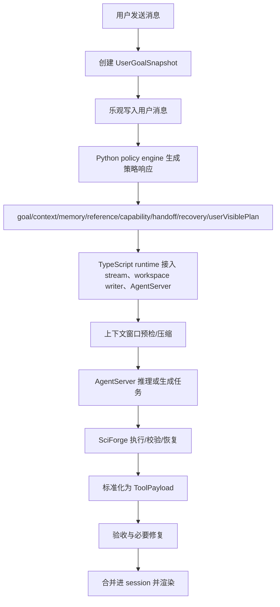
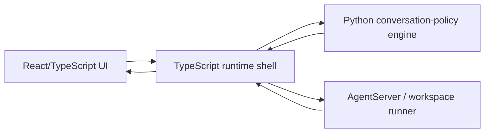
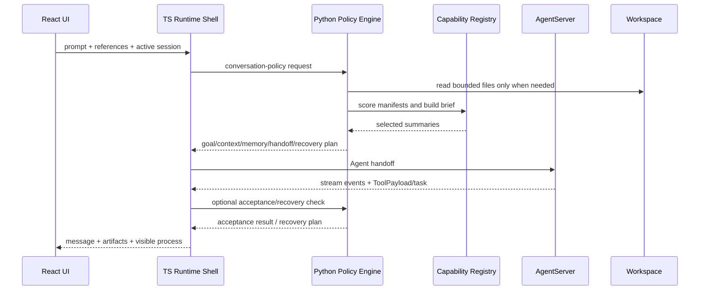

# SciForge 多轮对话与 Session 恢复机制

本文面向重新设计对话机制的人。它不追踪每个函数的实现细节，而是解释当前 SciForge 怎么理解一轮对话、怎么带上历史、怎么恢复旧 session，以及当前已经落地的 Python conversation-policy 策略层。尚未完成的部分统一放在后面的“修改建议”里。

## 一句话模型

SciForge 当前把对话看成一条可恢复的研究时间线：

> 用户每发一条消息，系统先记录当前目标，再通过 Python conversation-policy engine 产出目标、上下文、引用、能力、handoff、验收、恢复和用户可见过程计划；TypeScript runtime 负责把这些计划接入 stream、workspace writer、AgentServer 和 UI；运行结果再被标准化为消息、run、artifact、execution unit 和可点击引用，回写到 session。

这里最重要的原则是：**当前用户请求永远是主语，历史只能当证据，不能反客为主。**

## 核心对象

| 对象 | 用户可理解的含义 | 当前用途 |
|---|---|---|
| Session | 一个场景里的聊天工作区 | 保存消息、运行、产物、执行记录、版本快照 |
| Message | 聊天栏里的用户/系统/场景消息 | 表达当前轮输入和最终回复 |
| Run | 一次后端运行 | 连接 prompt、结果、状态、refs、acceptance |
| Artifact | 运行产物 | 报告、论文列表、图表、日志索引等 |
| ExecutionUnit | 可审计执行单元 | 记录代码、命令、stdout/stderr、状态 |
| Reference | 用户显式点选或提到的对象 | 文件、artifact、UI 选区、上传文件、run |
| Conversation Ledger | 历史对话账本 | 长 session 的轻量连续性记录 |
| Current Reference Digest | 当前引用摘要 | 大文件的 bounded 摘要，避免全文塞进模型 |
| Capability Brief | 当前轮可用能力摘要 | Python broker 从 sense/skill/tool/verifier/ui-component manifest 中筛出的少量候选能力 |
| Process Progress | 用户可见工作过程 | Python 将底层事件归纳为“读、写、执行、等待、下一步”等阶段，前端只负责渲染 |
| Acceptance | 结果验收 | 判断是否缺报告、缺 artifact、缺引用、是否需要修复 |

## 当前一轮对话的生命线



### 1. 先记录目标，而不是先猜任务

每轮都会生成一个 goal snapshot。当前实现由 `packages/reasoning/conversation-policy/src/sciforge_conversation/goal_snapshot.py` 负责，保存：

- 用户原始 prompt
- 这轮像是报告、表格、代码、文件预览还是修复
- 可能需要的 artifact 类型
- 可能需要的输出格式，例如 markdown/json
- 显式引用了哪些对象
- 验收时要检查什么

这个 snapshot 的价值是让后续 handoff、acceptance 和 recovery 不再凭感觉修，而是围绕“这一轮到底承诺了什么”修。

### 2. 乐观写入用户消息

前端先把用户消息加入当前 session。这样即使后端还没返回，UI 也能立刻显示“已提交”，并把本轮消息纳入后续上下文。

如果用户在运行中继续输入，这条输入会被当作“运行中引导”排队，而不是丢失。

### 3. 判断历史要不要带上

当前策略不是每次都无脑带全历史，而是由 Python `context_policy.py` 和 `memory.py` 判断这轮请求属于哪一种：

| 情况 | 处理 |
|---|---|
| 明确引用了当前对象或文件 | 以当前引用为主，必要时隔离旧历史 |
| 继续、修复、重试、基于已有结果 | 带上相关历史、run、artifact、execution refs |
| 新检索、新主题、明显偏离旧任务 | 隔离旧历史，避免旧 session 污染 |
| 不确定 | 发送精简历史摘要，让 AgentServer 决策 |

这一步已经从散落的 UI/runtime 启发式中抽成可测试模块。后续如果要继续优化，应优先改 Python fixture 和策略模块，而不是在 TypeScript 里再加一套判断。

### 4. Handoff 里传摘要和引用，不传大段全文

发给 AgentServer 的不是整个 UI 状态，而是一个 contract：

- 当前 prompt 是权威请求
- recent conversation 是短期意图窗口
- conversation ledger 是长期账本
- artifacts 和 execution units 以 ref/summary 方式提供
- 当前点选或 prompt 中提到的文件成为 current references
- 大文件优先生成 current reference digest
- workspace 的 `.sciforge` 目录是可审计事实源

这套设计的目标是：**让 AgentServer 知道有哪些证据可用，但不要把所有证据全文塞进上下文。** 当前 Python `handoff_planner.py` 负责预算、ref-first 和大对象摘要策略；TypeScript 只负责 transport 与 runtime fallback。

### 5. 大文件走 digest，而不是全文回放

如果用户说“基于 `research-report.md` 和 `paper-list.json` 总结”，Python `reference_digest.py` 会：

1. 从 prompt 中抽取路径。
2. 解析相对 workspace 的真实文件。
3. 对文本、Markdown、JSON、CSV 等生成 bounded digest；PDF 当前记录 hash、大小和 unsupported 状态，完整文本抽取放在后续修改建议。
4. 把 digest ref 放进 handoff。

这样 AgentServer 首先看到的是“够用的摘要、计数、head/tail、关键段落”，而不是几十万字符的大文件。

### 6. 后端运行时必须持续给用户可见过程

当前 Python `process_events.py` 会把底层事件整理成 `process-progress`，前端只负责渲染用户可读工作过程，例如：

- 当前计划
- 已加载多少历史 artifacts/refs
- artifact 访问策略
- AgentServer dispatch 和 handoff 路径
- 工具调用和命令
- stdout/stderr/output refs
- token 使用
- 上下文压缩
- guard 或 recovery

原则是：**用户不一定要看全部日志，但必须感知系统在做什么、为什么等、哪里出错。** 前端不再维护一套 raw stream 进度推断算法，避免和 Python 过程归纳形成双重真相源。

### 7. 结果必须回到统一对象模型

无论 AgentServer 直接回答、生成代码、执行 workspace task，还是触发恢复，最终都要归一成：

- `message`
- `claims`
- `uiManifest`
- `executionUnits`
- `artifacts`
- `objectReferences`

这样右侧结果视图、报告渲染、证据矩阵、notebook timeline、执行审计都可以用同一套数据工作。

### 8. 验收不通过时，优先修承诺

当前验收策略由 Python `acceptance.py` 表达，主要检查：

- 是否有用户可读回复
- 是否错误地展示了 raw JSON
- 要求的 report/table/file 是否存在
- markdown 报告是否能作为报告渲染
- 显式引用是否被保留
- 多轮上下文是否被考虑

如果不通过，会进入 repair/recovery 计划，让后端只修缺失项，不重新做无关研究。

### 9. 长任务有 guard 和恢复

复杂任务常见失败是 AgentServer 反复读大文件或长时间无输出。当前 Python `recovery.py` 的通用策略是：

- token 超过阈值时触发 convergence guard
- 流长时间没有新事件时触发 silent stream guard
- 如果已有 current reference digest，则用 digest recovery 生成可读结果
- 如果还不能恢复，就返回结构化 failure reason 和下一步

这条原则很重要：**失败也要成为可恢复的状态，而不是让用户看到永久 running。**

## Session 恢复机制

### Active session

每个 scenario 有一个 active session。用户打开场景时，系统恢复该场景最近的 active session。

### Archived session

新建聊天或删除当前聊天时，旧 active session 会进入 archived sessions。恢复归档 session 时：

- 当前 active session 如果有内容，会先 version/归档
- 被恢复的 session 成为新的 active session
- 更新时间会刷新，但历史内容保持

### Version snapshot

重要变更会生成 session version。它像轻量快照，用来解释“这个 session 之前是什么状态”。

### Durable workspace audit

浏览器 localStorage 是快速恢复缓存；真正可审计的工作资料在 workspace 的 `.sciforge/` 下：

- `.sciforge/workspace-state.json`
- `.sciforge/sessions/`
- `.sciforge/versions/`
- `.sciforge/artifacts/`
- `.sciforge/tasks/`
- `.sciforge/task-results/`
- `.sciforge/logs/`
- `.sciforge/handoffs/`

未来重设计时建议把 localStorage 进一步弱化成 UI cache，让 workspace state 成为唯一主存储。

## 当前设计的几个原则

1. **当前请求优先**  
   不管历史里有什么，本轮用户原话最重要。

2. **历史是证据，不是命令**  
   历史 run、artifact、消息只能帮助解释当前请求，不能覆盖当前请求。

3. **显式引用优先**  
   用户点选、上传、粘贴路径、写在 prompt 里的文件，优先级高于普通历史。

4. **引用优先，全文靠后**  
   默认传 ref、summary、digest；只有当前任务确实需要，才读取文件正文。

5. **短期窗口 + 长期账本**  
   recent conversation 用于理解当前意图；conversation ledger 用于保持长期连续性。

6. **运行过程可见**  
   多轮任务不应只有“running”；用户要能看到正在读什么、调用什么、等待什么。

7. **失败可审计**  
   失败必须给出 execution unit、failure reason、stdout/stderr/code/output refs。

8. **不要把修复伪装成成功**  
   如果 repair 无法满足验收，应明确失败，而不是展示部分结果。

## 当前已落地的 Python 策略层方案

当前已经把“所有非 UI 的策略、选择、摘要、验收、恢复算法”收束到 `packages/reasoning/conversation-policy/`。这个 package 是多轮对话策略的唯一算法真相源；TypeScript 不再维护与它等价的 goal/context/memory/capability/progress 推断算法。

不迁到 Python 的部分：

- React 状态管理
- DOM 点选和输入框交互
- 浏览器流式事件渲染
- TypeScript 类型到组件 props 的绑定
- 前端本地交互延迟敏感逻辑

已经落地到 Python 的模块：

| Python 模块 | 职责 |
|---|---|
| `goal_snapshot.py` | 从 prompt/references 推断目标、格式、artifact 期望 |
| `context_policy.py` | 判断本轮是否隔离历史、继续历史、修复历史 |
| `memory.py` | 构建 recent window、ledger、历史检索排序 |
| `reference_digest.py` | 文件路径抽取、Markdown/JSON/CSV 解析、bounded digest；PDF 暂记录 metadata |
| `artifact_index.py` | 建立 artifact/ref/execution 索引 |
| `capability_broker.py` | 从 capability manifest 中筛选 top-k brief，并解释 selected/excluded |
| `handoff_planner.py` | 决定 handoff 中放哪些 refs、summary、budget |
| `acceptance.py` | 检查结果是否满足本轮承诺 |
| `recovery.py` | 决定何时 repair、何时 digest recovery、何时 failed-with-reason |
| `process_events.py` | 把低层事件归纳成用户可读阶段 |
| `service.py` | 唯一策略编排入口，提供 CLI/stdio JSON bridge |

当前形态是：



TypeScript 保留“壳”：

- 接收 UI 输入
- 发 HTTP/stream
- 管理 AbortController
- 渲染消息和结果
- 调 workspace writer

Python 承担“脑内策略”：

- 读 JSON 输入
- 输出 JSON 决策
- 保持纯函数优先
- 所有算法都能用普通 pytest 测

TypeScript runtime 通过 `src/runtime/conversation-policy/` 组装 JSON request、调用 Python service，并把 response 写回当前 `GatewayRequest` 的 `uiState`、handoff、current reference digest、capability brief、acceptance/recovery plan。浏览器端只运输 session 事实和引用，不再本地计算 goal/context/memory/digest/acceptance。

## 当前 JSON Contract

TS 和 Python 不互相 import 内部对象，只通过稳定 JSON contract 交互：

```json
{
  "schemaVersion": "sciforge.conversation-policy.request.v1",
  "turn": {
    "turnId": "turn-xxx",
    "prompt": "用户当前请求",
    "references": []
  },
  "session": {
    "sessionId": "session-xxx",
    "scenarioId": "literature-evidence-review",
    "messages": [],
    "runs": [],
    "artifacts": [],
    "executionUnits": []
  },
  "workspace": {
    "root": "/path/to/workspace",
    "sciforgeDir": ".sciforge"
  },
  "limits": {
    "maxContextWindowTokens": 200000,
    "maxInlineChars": 2400
  },
  "capabilities": [],
  "tsDecisions": {}
}
```

Python 输出：

```json
{
  "schemaVersion": "sciforge.conversation-policy.response.v1",
  "goalSnapshot": {},
  "contextPolicy": {},
  "memoryPlan": {},
  "currentReferences": [],
  "currentReferenceDigests": [],
  "artifactIndex": {},
  "capabilityBrief": {},
  "handoffPlan": {},
  "acceptancePlan": {},
  "recoveryPlan": {},
  "userVisiblePlan": [],
  "diagnostics": {}
}
```

这样前端和 runtime 不关心算法如何实现，只关心 JSON 结果。

## 当前接入状态

- `service.py` 是唯一策略编排入口。
- TypeScript bridge 会自动设置本地 `packages/reasoning/conversation-policy/src` 为 `PYTHONPATH`。
- runtime 目前以 active mode 调用 Python policy engine，主路径使用 Python response 影响 context、handoff、digest、capability、acceptance 和 recovery。
- Python `process_events.py` 是工作过程阶段归纳真相源；前端只渲染 `process-progress`，不再对普通 raw stream 维护第二套推断算法。
- capability broker 已进入 Python package；根目录不保留第二份 broker。

## 修改建议：仍需继续完善的地方

| 区域 | 当前状态 | 后续修改建议 |
|---|---|---|
| Python policy 主路径接管 | 已接入 runtime active path，旧 TS 策略文件已删除 | 继续补充端到端 fixtures，覆盖更多真实多轮 session |
| PDF digest | 当前记录 hash、大小和 unsupported 状态 | 增加 PDF 文本抽取、页级摘要和引用定位 |
| 历史检索与排序 | 已有 recent window、ledger、污染防护 | 增加可解释 scoring、confidence、同主题聚类和跨 session retrieval |
| capability manifest 来源 | 已能处理传入 manifest 和 selected runtime capability | 接入完整 skill/tool/sense/verifier/ui-component registry，并持续生成 compact brief |
| acceptance/recovery 主链路 | Python 已表达 acceptance/recovery plan，浏览器端 TurnAcceptance 算法已删除 | 继续让 workspace runner 更完整地消费 Python recovery plan |
| session 存储 | localStorage 和 workspace state 仍然双轨 | 让 workspace `.sciforge/` 成为主存储，前端 localStorage 只做 cache |
| 用户过程事件 | Python 已有 process event model，前端能渲染 | 让 backend/workspace runner 更稳定地发 `process-progress`，减少只靠普通日志展示过程 |

## 修改建议：新对话机制设计

### 1. 把 session 分成三层

- **UI session**：用户看到的消息、折叠状态、选中对象。
- **Memory session**：对话 ledger、goal snapshots、artifact/ref 索引。
- **Execution session**：run、execution unit、task attempt、logs、handoff。

三层可以关联，但不要混成一个大对象。

### 2. 每轮都生成一张“任务卡”

任务卡应包含：

- 当前用户请求
- 是否新任务/继续/修复/追问
- 使用哪些历史
- 使用哪些显式引用
- 预期产物
- 成功标准
- 失败后的恢复策略

用户可以理解任务卡，开发者也可以调试。

### 3. 让历史选择可解释

不要只告诉用户“读取上下文”。应该能说：

- 为什么带上上一轮 artifact
- 为什么忽略更早历史
- 为什么认为这是新任务
- 为什么只读 digest 不读全文

### 4. 把 recovery 当成正常路径

复杂 agent 任务一定会遇到超长上下文、长时间无输出、生成不合约、缺 artifact。新设计里，recovery 不应是补丁，而应是状态机中的一等公民。

### 5. 把用户可见过程设计成产品能力

建议把过程分为固定阶段：

1. 理解任务
2. 选择上下文
3. 准备引用/摘要
4. 后端推理或生成
5. 执行/读取/验证
6. 修复或恢复
7. 产出结果

每阶段都有一句用户能懂的话，并可展开看详细日志。

## 当前方案结论

SciForge 当前机制已经具备多轮对话的关键骨架：session、ledger、artifact refs、Python policy engine、digest、capability brief、acceptance、recovery、stream visibility。当前方案的分工是：

- Python conversation-policy package 负责非 UI 策略算法。
- TypeScript runtime 负责交互、HTTP/stream、workspace writer、AgentServer 调用、Python bridge 和 UI 渲染。
- 两边只通过版本化 JSON contract 交互。
- 已完成的策略模块和测试都集中在 `packages/reasoning/conversation-policy/`，不再保留根目录散落算法文件。
- 尚未真正主路径接管的部分，放在上面的“修改建议”里继续推进。

这让多轮对话机制从“散落在 UI/runtime 的规则”，升级为“可分工、可解释、可测试的 Python 策略系统”。

## 附录：当前 Python 策略包结构

当前 package 结构如下：

```text
packages/reasoning/conversation-policy/
  pyproject.toml
  src/sciforge_conversation/
    __init__.py
    contracts.py
    goal_snapshot.py
    context_policy.py
    memory.py
    reference_digest.py
    artifact_index.py
    capability_broker.py
    handoff_planner.py
    acceptance.py
    recovery.py
    process_events.py
    service.py
  tests/
    test_acceptance.py
    test_artifact_index.py
    test_capability_broker.py
    test_contracts.py
    test_goal_snapshot.py
    test_context_policy.py
    test_memory.py
    test_reference_digest.py
    test_handoff_planner.py
    test_process_events.py
    test_recovery.py
    fixtures/
```

### 模块职责

| 模块 | 职责 | 输入 | 输出 |
|---|---|---|---|
| `contracts.py` | 定义 schema、dataclass contract 和版本号 | raw JSON | typed request/response |
| `goal_snapshot.py` | 判断用户这轮想要什么 | prompt, refs, scenario | goal snapshot |
| `context_policy.py` | 判断历史是否复用、隔离、修复、继续 | prompt, session summary | context policy |
| `memory.py` | 选择 recent conversation 和 ledger | messages, runs | recent window, ledger |
| `artifact_index.py` | 建立 artifact/ref/execution 索引 | artifacts, execution units | searchable refs |
| `reference_digest.py` | 抽取 prompt 路径、生成 bounded digest | prompt, refs, workspace | current refs + digests |
| `capability_broker.py` | 从 sense/skill/tool/ui-component registry 中选出本轮候选能力 | prompt, goal, refs, manifests | capability brief + audit |
| `handoff_planner.py` | 决定 handoff 放什么、不放什么 | goal, policy, memory, digests | handoff plan |
| `acceptance.py` | 检查结果是否满足本轮承诺 | goal, response, session | pass/fail + failures |
| `recovery.py` | 决定 repair、digest recovery、failed-with-reason | failure, digests, attempts | recovery plan |
| `process_events.py` | 把底层事件转成用户可懂阶段 | raw stream events | progress timeline |
| `service.py` | 提供 CLI/HTTP/stdio bridge | JSON request | JSON response |

每个模块都可以单独测试和替换，不需要所有人同时理解完整前端和 runtime。

### 当前数据流



### 分工方式

可以按模块把人分成几组：

1. **意图与上下文组**  
   负责 `goal_snapshot.py`、`context_policy.py`、`memory.py`。他们定义“这轮到底是什么任务”和“历史怎么选”。

2. **文档与引用组**  
   负责 `reference_digest.py`、`artifact_index.py`。他们优化 PDF/Markdown/JSON/CSV 解析和摘要质量。

3. **执行协议组**  
   负责 `handoff_planner.py`。他们决定 handoff budget、refs 排序、哪些字段发给 AgentServer。

4. **能力编排组**  
   负责 `capability_broker.py` 和 capability manifest schema。他们决定主 agent 在本轮能看到哪些 sense、skill、tool、verifier、ui-component 摘要。

5. **验收与恢复组**  
   负责 `acceptance.py`、`recovery.py`。他们保证失败可解释、可修复，不把部分结果伪装成成功。

6. **用户过程体验组**  
   负责 `process_events.py` 和 TS 显示对接。他们把 raw event 变成用户可理解的阶段。

这种分法能让算法、人机交互、工程协议并行推进。

### 每个模块的最低验收标准

每个 Python 模块都应该满足：

- 有独立 fixture，不依赖真实 AgentServer。
- 输入输出都是 JSON 可序列化对象。
- 没有隐式全局状态。
- 不直接改 workspace，除非模块职责就是生成 digest/artifact。
- 失败时返回结构化 error，不抛给 UI 一段不可读 traceback。
- 有“为什么这么判断”的 `reason` 字段。

例如 context policy 的输出不应只有：

```json
{ "mode": "reuse" }
```

而应该是：

```json
{
  "mode": "reuse",
  "reason": "prompt contains 基于 and references prior report artifact",
  "usedSignals": ["continuation_keyword", "prior_artifact_overlap"],
  "confidence": 0.82
}
```

这会让调试和用户解释都容易很多。

### 测试策略

当前测试分为四类：

| 测试类型 | 目的 |
|---|---|
| fixture unit tests | 每个算法模块的纯函数测试 |
| golden tests | 同一个 session 输入，输出必须稳定 |
| regression tests | 覆盖过去失败案例，比如旧历史污染、新任务误判、报告不渲染 |
| integration smoke | TS 调 Python，再跑一次最小 workspace handoff |

真实问题应继续沉淀成 fixtures：

- “继续上一轮任务”
- “新检索任务，不应复用旧 artifact”
- “基于显式 Markdown/JSON 文件总结”
- “后端 silent stream 后 digest recovery”
- “缺 markdown report 时 acceptance repair”
- “用户运行中追加引导”

## 附录：Capability Broker 与模块化能力感知

当系统里有很多模块化的 senses、skills、tools、verifiers、ui-components 时，不让主 agent 直接阅读完整 registry，也不让每个模块默认内置一个小 LLM。当前原则是：

- **主 agent 负责目标、策略和取舍**：它看到的是本轮任务相关的少量 capability brief，而不是所有模块细节。
- **Capability Broker 负责感知能力空间**：它读取 manifest，按任务目标、显式引用、场景、风险、成本和历史成功率筛出 top-k 能力。
- **模块默认是 typed service/adapter**：大部分 sense、skill、tool、verifier 只需要稳定输入输出 schema，不需要自己思考。
- **内部小 agent 只用于开放式复杂模块**：例如 GUI/vision/computer-use、复杂文献检索、代码修复、多步实验设计。这类模块可以声明 `internalAgent: optional|required`，但必须被包在 typed interface 后面。
- **UI components 不内置 LLM**：UI component 只负责按 schema 渲染 artifact、trace、表格、图、报告和交互控件。选择哪个 component 应由 broker/runtime 决定。

每个 capability manifest 至少声明：

```json
{
  "id": "literature.arxiv.search",
  "kind": "skill | tool | sense | verifier | ui-component",
  "domain": ["literature", "research"],
  "summary": "Search and normalize recent arXiv papers.",
  "inputSchema": {},
  "outputSchema": {},
  "triggers": ["arxiv", "paper", "recent literature"],
  "antiTriggers": ["private database only"],
  "artifacts": ["markdown", "json", "pdf"],
  "cost": "low | medium | high",
  "latency": "interactive | batch",
  "risk": ["network", "writes-workspace"],
  "sideEffects": ["download-files"],
  "adapter": "python:function or ts:endpoint",
  "internalAgent": "none | optional | required"
}
```

`capability_broker.py` 的输出短小、可审计，例如：

```json
{
  "selected": [
    {
      "id": "literature.arxiv.search",
      "kind": "skill",
      "why": "prompt asks for recent arXiv agent papers",
      "allowedOperations": ["search", "download", "summarize"],
      "expectedArtifacts": ["research-report.md", "papers.json"]
    }
  ],
  "excluded": [
    {
      "id": "ui.table.viewer",
      "why": "not needed until structured table artifact exists"
    }
  ],
  "needsMoreDiscovery": false
}
```

这样主 agent 的工作方式是：

1. 读取当前请求、显式引用和 session 摘要。
2. 读取 broker 给出的少量 capability brief。
3. 选择一两个能力组合成执行计划。
4. 通过 adapter 调用模块。
5. 由 runtime/acceptance 验证输出是否满足用户目标。

这个分层避免两个极端：一端是主 agent 背着完整 registry 自己猜，容易上下文爆炸；另一端是每个模块都塞一个 agent，容易行为不可控、成本上升、调试困难。当前中间形态是：**broker 缩小注意力，主 agent 做决策，adapter 做执行，runtime 做验收；模块内小 agent 是例外能力，不是默认形态。**
