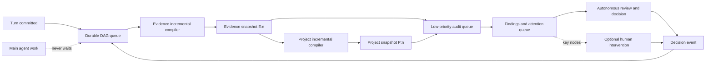

# SciForge 科研 Evidence DAG 与 Project DAG 设计

Last updated: 2026-08-05

## 文档状态

本文记录 SciForge 科研证据图的目标设计，覆盖线程级 Evidence DAG、项目级 Project DAG、原始证据溯源、后台更新、异步审计、人机交互和科研发布门禁。

本文中的产品原则已经确认，可作为后续实现、测试和验收的基线。批处理等待时间、并发数、缓存容量等运行参数不在本文中固定，应根据真实负载测试配置。

输入、代码、环境、参数、工具、审批、Artifact、Evidence 与 Conclusion 的 v3
可复跑扩展见 [`reproducible-dag-v3.zh-CN.md`](./reproducible-dag-v3.zh-CN.md)。本文继续定义
Evidence/Project 的总体所有权、审计与自治边界；扩展文档定义 execution event、完整
Conclusion lineage、canonical rerun spec 和重跑差异判定。

规范用语：

- “必须”表示实现不可缺少的行为。
- “应该”表示默认采用的行为，除非存在明确理由。
- “可以”表示可选扩展。

## 结论

SciForge 使用两个相互连接、职责不同的证据层：

- **Evidence DAG**：以一个 agent session 为边界，记录该 session 中出现的来源、推理和 claim，以及它们之间的支持、冲突和推导关系。
- **Project DAG**：以当前科研项目为边界，消费多个 Evidence DAG 的不可变快照，合并重复结论、识别独立证据和冲突，并将结论关联到项目 Goal。

审计不是第三套写图链路。审计是只读侧链，只消费已经提交的 DAG 快照并生成 Finding。审计不能直接修改 DAG；AI 或人的确认、驳回、合并和风险覆盖必须写成 Decision Event，再由统一编译链路处理。

主 agent 工作永远不等待 DAG 更新或普通审计。AI 默认可以自主完成研究、复核和内部决策，人可以检查关键节点、覆盖 AI 决定或完全不干预。只有认证发布或外部高风险动作才根据项目自治策略和 Runtime 权限等待额外授权。

## 已确认的产品决策

1. 根 Goal 表达用户给定的研究意图。AI 可以自主创建和调整 Question、Hypothesis 与子 Goal；需要重写根研究意图时必须创建可见的 reframe proposal，不能静默覆盖原始目标。
2. Evidence DAG 在 turn 完成后自动增量更新；Project DAG 在 Evidence 快照提交后合并触发后台增量编译。
3. 审计侧链异步、低优先级、只读，不影响普通对话和 agent 执行。
4. 用户不直接手绘节点或边。AI 与人的所有决策和修正都通过结构化 Decision Event 进入统一编译链路。
5. Project DAG 默认纳入同一 workspace 下的 session，并允许用户排除、隔离或重新纳入。
6. Project Snapshot 必须固化实际使用的 session 集合及对应 Evidence digest。
7. 原始工件采用**引用优先的轻量混合保管**，默认不复制所有文件。
8. 系统自动检测文件移动、缺失和内容变化；项目可以选择自动重新摄取，或由用户确认后更新 DAG。
9. critical 审计 Finding 不阻断内部研究或草稿生成。认证发布时必须解决或按项目策略显式覆盖；覆盖必须记录理由、actor 和自治策略。
10. claim 的证据状态与溯源等级分开表达，不能用一个 confidence 数字代替。
11. `刷新`、`立即更新`、`重建`是三个不同操作，不能共用模糊语义。
12. `周报`、`时间日志`、`时间机器`不属于 DAG 核心，不在 DAG 产品表面保留。
13. 项目默认支持 `autonomous` 自治模式。人类确认是可配置控制点，不是 DAG 推进的固有前提。
14. 外部发布、资金支出、数据删除、真实仪器控制等动作由 Runtime 权限治理；DAG 只记录依据、决策和结果，不能绕过该边界。

## 目标与非目标

### 目标

- 让任何重要科研结论都能解释“为什么相信它”。
- 从 Project Claim 回溯到 session claim、推理步骤、原始片段和科研工件。
- 对文献、数据、代码、实验运行和人工判断建立统一来源链。
- 跨 session 合并相同发现，同时保留每一条独立来源路径。
- 保留冲突、负结果、失效来源和历史版本，不通过覆盖或删除伪造一致性。
- 在不干扰主工作的前提下持续维护 DAG 新鲜度。
- 支持 AI 在无人干预时完成研究规划、证据复核、决策、实验迭代和候选成果生成。
- 支持审计、复核、what-if 分析和可解释发布。
- 保持通用科研模型，不为单个项目、学科或示例写硬编码规则。

### 非目标

- 不把 DAG 做成需要用户手工维护的绘图工具。
- 不保存或展示模型隐藏的 chain-of-thought。Reasoning 节点只能来自可见解释、结构化分析步骤或工具运行记录。
- 不让审计 worker 直接修改 claim、edge 或状态。
- 不为自动更新和手动更新维护两套编译实现。
- 不默认复制所有 PDF、大型数据集和受限科研数据。
- 不在第一阶段建立覆盖所有学科的庞大本体；领域字段通过扩展 metadata/profile 表达。
- 不把周报生成、时间追踪或活动日志混入 DAG 核心职责。

## 总体架构



### 单一工作链路

所有触发方式最终都进入同一个调度与编译入口：

```text
automatic trigger ─┐
manual update ─────┼─> enqueue/update desired watermark
goal change ───────┤          |
artifact change ───┘          v
                         shared compiler
                              |
                              v
                       immutable snapshot
```

UI、定时器、文件监听器和导出门禁不能直接调用不同的内部编译步骤。它们只提交目标 watermark、优先级和原因。

## 图模型边界

科研系统整体不是所有关系都严格无环的单一图。

- `supports`、`derived_from`、`generated_by`、`prerequisite` 等来源和推导关系必须保持无环，以支持拓扑排序和可靠回溯。
- `contradicts`、`same_as`、`replicates`、`fails_to_replicate` 等关系天然可能双向或成环。
- 产品表面可以继续使用 DAG 名称，但存储和分析层必须对不同 edge family 分别施加约束。

推荐将模型理解为“认识层 Evidence DAG + 来源关系图 + 审计侧链”。

## 科研对象模型

### 认识层节点

| 节点 | 含义 | 所有者 |
| --- | --- | --- |
| `Goal` | 用户希望项目解决的问题和成功标准 | 用户意图；AI 可自主分解 |
| `Question` | 可研究的问题 | AI 或人 |
| `Hypothesis` | 尚待验证的可检验假设 | AI 或人 |
| `Claim` | 一个明确、可支持或反驳的陈述 | 编译器提取 |
| `Finding` | 文献、分析或实验得到的结果 | 编译器提取 |
| `Assumption` | 推导依赖但尚未验证的前提 | 编译器提取 |
| `Reasoning` | 可见、可复核的分析或推导步骤 | agent、人或工具 |
| `Decision` | AI 或人对冲突、合并、实验路线和风险作出的决定 | AI 或人；必须记录 actor |

### 来源层节点

| 节点 | 含义 | 示例 |
| --- | --- | --- |
| `SourceAssertion` | 来源中与当前 claim 相关的具体陈述 | 论文报告某效应 |
| `SourceAnchor` | 原始内容中的精确定位 | PDF 页码、表格、代码行、数据切片 |
| `Artifact` | 可识别、可校验的科研对象 | PDF、CSV、notebook、模型文件 |
| `DatasetVersion` | 数据集的确定版本 | DOI 版本、release、checksum |
| `Observation` | 人工或仪器观察 | 测量值、图像观察、实验记录 |
| `ExperimentRun` | 一次可识别实验执行 | 湿实验批次或计算 run |
| `AnalysisRun` | 一次分析、统计或模型推理执行 | notebook run、pipeline job |
| `SoftwareVersion` | 代码与工具版本 | Git commit、包版本、容器镜像 |
| `Environment` | 复现所需环境 | OS、依赖、硬件、仪器配置 |
| `Agent` | 产生、执行或确认对象的主体 | 研究者、agent、软件、仪器 |

### 审计侧链对象

| 对象 | 含义 |
| --- | --- |
| `AuditRun` | 针对某个不可变 DAG digest 执行的一次审计 |
| `AuditFinding` | 审计发现的风险、断点或建议，不属于主图事实 |
| `ReviewItem` | 需要进一步处理的 Finding、冲突或低置信合并；默认由 AI 处理 |
| `DecisionEvent` | AI 或人对 ReviewItem 作出的结构化决定 |
| `Override` | AI 或人在策略允许范围内对未解决风险的显式接受记录 |

## 自治与分级复核

### 自治模式

| 模式 | AI 行为 | 人类角色 |
| --- | --- | --- |
| `autonomous` | AI 自动研究、复核、决策和更新 DAG | 可以完全不干预，也可以随时检查、挑战或接管 |
| `checkpointed` | AI 自动推进，在用户配置的关键节点暂停 | 只处理选定 checkpoint |
| `supervised` | 指定 node、Finding 或动作需要人工确认 | 深度参与研究过程 |

`autonomous` 是完整能力基线。其他模式是在同一工作链路上增加 checkpoint，不能维护另一套人工审批实现。

### 自动复核级别

| 级别 | 执行者 | 典型内容 | 人类负担 |
| --- | --- | --- | --- |
| `A0 deterministic` | 确定性程序 | 哈希、文件存在、schema、单位、参数和运行清单完整性 | 静默 |
| `A1 verifier` | 独立 verifier | 引文 entailment、claim 提取、重复来源、scope 匹配 | 异常才进入注意力队列 |
| `A2 adversarial` | 独立审计 agent 或多模型复核 | 挑战假设、寻找冲突、检查实验设计和替代解释 | 只展示高影响结果 |
| `A3 autonomous decision` | 主研究 agent | 接受 Assumption、裁决冲突、选择路线、调整实验 | 自动执行并留下 DecisionEvent |

提出 claim 的同一次模型输出不能同时作为该 claim 的独立 verifier。A1/A2 至少使用独立 prompt、独立上下文、独立 reviewer agent 或确定性工具，并记录实际方法。

### Assessment ledger

节点不能只保存一个 `verified=true|false`。同一个 SourceAssertion 可能同时处于“哈希已确定性验证、语义支持由模型验证、方法学质量仍有争议”。每次 assessment 必须独立记录：

```json
{
  "targetId": "node or edge id",
  "dimension": "integrity|provenance|entailment|methodology|applicability|reproducibility",
  "level": "A0|A1|A2|A3|human",
  "result": "passed|failed|uncertain|overridden",
  "actor": "tool, agent or human id",
  "method": "hash, rule, model or review protocol",
  "confidence": 0.0,
  "targetDigest": "snapshot digest",
  "createdAt": "timestamp"
}
```

综合状态由 assessment ledger 和项目策略计算，但底层 assessment 不得被一个总分覆盖。

### 节点复核策略

| 节点或对象 | 默认自动处理 | 进入关键节点视图的条件 |
| --- | --- | --- |
| `Goal` | AI 分解 Question、Hypothesis 和子 Goal | 建议重写根研究意图或改变成功标准 |
| `Claim/Finding` | A0-A2 验证后自动进入 Project DAG | 低置信、conflicted、load-bearing 或接近发布 |
| `Assumption` | AI 自动提取、挑战和接受或驳回 | 高 blast radius、缺少证据、被反驳或处于发布路径 |
| `Reasoning` | 自动检查 provenance、循环和逻辑断点 | 关键结论依赖且 A1/A2 不一致 |
| `Decision` | AI 在自治策略内自动作出并执行 | 不可逆、高影响、critical override 或改变研究路线 |
| `SourceAssertion` | 自动 anchor、去重、entailment 和来源检查 | 方法学质量或适用性决定核心结论 |
| `Artifact/SourceAnchor` | 自动哈希、定位、版本和移动重绑定 | 多个移动候选、内容歧义或来源失效 |
| `ExperimentRun` | 自动检查输入、代码、参数、环境和日志 | 异常 run、失败复现或结果成为核心 Finding |
| `AuditFinding` | AI 自动修复、接受风险、补证据或重跑 | critical、反复出现或无法自动解决 |

### 注意力前沿

系统从活跃 Goal、核心 claim 或候选发布内容向上遍历 DAG，计算最值得人检查的最小节点集合。排序至少考虑 blast radius、uncertainty、novelty、irreversibility、冲突程度和发布相关性。

注意力前沿只负责降低人的认知负担，不是默认审批队列。在 `autonomous` 模式下，AI 继续推进；人可以对任何关键节点执行 `endorse`、`challenge`、`supersede`、`request_evidence` 或 `rollback`。

AI Decision 必须记录 `decidedBy`、`agentId`、`autonomyMode`、可见 rationale、alternatives、evidence snapshot digest、confidence、reversibility 和 supersession history。人的后续 Decision 可以 supersede AI Decision，但不能删除其历史。

## Edge families

| Family | Edge | 约束与含义 |
| --- | --- | --- |
| 认识关系 | `supports` | `src` 为 `dst` 提供证据；必须保存 support/entailment 评分来源 |
| 认识关系 | `contradicts` | 两个陈述不能在同一适用范围内同时成立 |
| 认识关系 | `refines` | `src` 对 `dst` 作出限定、收窄或细化 |
| 认识关系 | `prerequisite` | `src` 是接受 `dst` 前必须成立的条件 |
| 目标关系 | `addresses` | claim、question 或 hypothesis 对应某个 Goal |
| 目标关系 | `tests` | 实验或分析用于检验某个 Hypothesis |
| 来源关系 | `extracted_from` | assertion 或 anchor 来自某个 Artifact |
| 来源关系 | `used` | Activity 使用某个 Artifact、数据或软件 |
| 来源关系 | `generated_by` | Artifact、Finding 或 Observation 由某个 Activity 生成 |
| 来源关系 | `derived_from` | 一个对象由另一个对象转换、聚合或推导得到 |
| 身份关系 | `same_as` | 两个标识指向同一实体，但保留合并审计记录 |
| 版本关系 | `version_of` | 对象是某个逻辑对象的一个具体版本 |
| 版本关系 | `supersedes` | 新版本代替旧版本，但不删除旧版本 |
| 失效关系 | `invalidates` | 新证据、撤稿或人工决定使旧对象不再适用 |
| 复现关系 | `replicates` | 独立运行复现某 Finding |
| 复现关系 | `fails_to_replicate` | 独立运行未能复现某 Finding |

新增 edge 类型必须属于一个明确 family，并说明方向、是否允许成环、是否参与状态传播以及是否参与 provenance 回溯。

## 原始证据溯源

### 基本要求

点击任何重要 Project Claim 时，系统必须返回以下内容，或者明确指出在哪一步中断：

- claim 的当前状态、适用范围和版本。
- 直接支持、反驳和限定该 claim 的节点。
- 从 Project Claim 回到每个 session origin 的路径。
- session claim 上游的 SourceAssertion、Reasoning 和 SourceAnchor。
- 原始 Artifact 的标识、位置、版本和内容哈希。
- 对实验结果，返回 run、输入、代码、参数、环境、日志和输出。
- 每一步由谁或什么程序生成，以及生成时间。

“能够到达 Source 节点”不等于完整科研溯源。Source 只有标题、URL 或一段 agent 摘要时，系统必须显示较低溯源等级。

### 文献证据路径

```text
Project Claim
  -> Session Claim
    -> visible Reasoning (optional)
      -> SourceAssertion
        -> SourceAnchor (page / paragraph / table / figure)
          -> Artifact (paper version / DOI / file hash)
```

### 计算或实验结果路径

```text
Project Finding
  -> Session Finding
    -> AnalysisRun / ExperimentRun
      -> input DatasetVersion or raw Observation
      -> SoftwareVersion / Git commit
      -> Environment / instrument configuration
      -> parameters / random seed
      -> logs and output Artifact
```

### AI 与人工判断路径

```text
Project Decision
  -> DecisionEvent
    -> reviewed snapshot digest
    -> reviewed nodes and edges
    -> actor / time / rationale
```

AI 或人工判断不能伪装成外部科学证据。DecisionEvent 必须记录 actor type；人工陈述作为证据时必须明确标记为 human-attested，并记录 attestation method。

## 溯源等级

证据状态和溯源等级是两个正交维度。

| 等级 | 名称 | 要求 |
| --- | --- | --- |
| `L0` | 会话可追 | 只能回到聊天、agent 输出或人工陈述 |
| `L1` | 来源可识别 | 有 DOI、URL、文件路径或外部标识 |
| `L2` | 内容可定位 | 有页码、表格、片段、代码位置、数据切片或查询条件 |
| `L3` | 工件可验证 | 有确定版本和内容哈希，可验证当前工件是否与引用一致 |
| `L4` | 结果可复现 | 可以恢复数据、代码、参数、环境和 run，或明确记录无法复现的外部条件 |

规则：

- `supported` 不能暗示已经达到 `L3` 或 `L4`。
- Hypothesis 可以是 `L0`，但必须显示为未验证假设。
- 面向外部发布的文献结论默认至少达到 `L2`。
- 面向外部发布的本项目计算或实验结果默认至少达到 `L4`。
- 项目可以提高门槛。降低门槛必须记录为 Override，不能静默发生。

## Artifact Registry 与轻量混合保管

### 默认策略

系统默认引用工件，不全量复制工件内容。

每个 Artifact 至少保存：

```json
{
  "artifactId": "stable logical id",
  "kind": "paper|dataset|code|notebook|image|log|model|other",
  "locator": "workspace-relative path, URL, DOI, SWHID or repository id",
  "contentDigest": "sha256 when available",
  "version": "source version or release identifier",
  "size": 0,
  "mediaType": "application/pdf",
  "observedAt": "timestamp",
  "availability": "available|moved|missing|remote|restricted",
  "retention": "reference|cached_excerpt|snapshot",
  "accessPolicy": "project metadata"
}
```

Artifact 的内容哈希与语义节点 ID 必须分开：

- 语义节点 ID 用于识别归一化后的 claim 或 source assertion。
- Artifact digest 用于验证原始字节或稳定的规范化数据表示。
- 两者不能因为文本相似而相互替代。

### SourceAnchor

SourceAnchor 必须能够稳定定位原始内容：

```json
{
  "artifactId": "artifact id",
  "selector": {
    "type": "pdf|text|table|figure|code|dataset|web",
    "page": 12,
    "section": "Results",
    "table": "Table 2",
    "rowRange": "120:180",
    "columnNames": ["sample_id", "score"],
    "lineRange": "40:57",
    "quote": "exact bounded excerpt"
  },
  "anchorDigest": "digest of selected content",
  "createdAt": "timestamp"
}
```

不同 selector 只填写适用字段。实现必须使用结构化 selector，不能依赖不可解析的自由文本定位。

### 文件移动

文件路径不是 Artifact 身份。

当文件移动时：

1. resolver 在允许的项目范围内按 content digest 查找候选文件。
2. 找到唯一匹配时，更新 locator，但保持 Artifact ID、历史路径和 DAG 关系不变。
3. 找到多个匹配时，保留候选并请求用户确认，不任意选择。
4. 找不到时，将 Artifact 标记为 `missing`，保留历史路径并生成 provenance risk Finding。

文件移动本身不应使 claim 失效；它降低的是可访问性，而不是证据内容。

### 同路径内容变化

同一路径的内容发生变化时，系统不得把旧 Artifact 静默改成新内容：

1. 创建新的 ArtifactVersion 或新 Artifact。
2. 旧版本和旧 snapshot 保持可追溯。
3. 依赖旧版本的 claim 标记为 stale 或 needs-review。
4. 用户或项目策略决定是否重新摄取并更新 DAG。
5. 更新后生成新 Evidence Snapshot 和 Project Snapshot，不重写历史。

### 保管规则

- 本地小型工件和系统生成输出可以选择保存内容寻址副本。
- 用户导入论文默认保存引用、精确 anchor 和哈希；只有许可和设置允许时才缓存完整 PDF。
- 大型数据集默认保存版本、checksum、切片或查询定义，不复制全量数据。
- 网页默认保存 URL、访问时间、引用片段和 digest；允许时可以保存快照。
- 受限或敏感数据只保存最小必要 metadata、脱敏 anchor 和访问策略。
- 缓存和快照是可配置保留策略，不影响主图的逻辑身份。

## Evidence DAG

### 职责

Evidence DAG 必须：

- 消费一个 session 的可见 runtime trace。
- 提取 SourceAssertion、Reasoning、Claim、Finding 和它们的关系。
- 为每个提取节点保存稳定 trace reference。
- 连接原始 Artifact 和 SourceAnchor，而不是仅保存引用摘要。
- 对重复来源做内容寻址去重，但保留每次引用位置。
- 保留冲突和限定关系。
- 对 support edge 进行独立验证，记录 verifier 和版本。
- 增量处理新 turn，不在正常路径全量重建。
- 提交不可变 Evidence Snapshot，并发布提交事件。

Evidence DAG 不负责跨 session 合并，也不根据项目 Goal 改写 session 中的原始陈述。

### Evidence Snapshot

```json
{
  "threadId": "runtime-qualified thread id",
  "version": 1,
  "digest": "snapshot digest",
  "inputWatermark": "last consumed runtime item",
  "schemaVersion": "evidence schema version",
  "extractorVersion": "extractor and prompt version",
  "verifierVersion": "verifier version",
  "artifactDigests": ["sha256:..."],
  "createdAt": "timestamp",
  "status": "committed"
}
```

Snapshot 只有完整提交后才能被 Project DAG 和审计 worker 消费。处理中间状态不能暴露成最新有效图。跨 DAG 合同只传递 `threadId + digest` 引用；Project DAG 必须从 Evidence DAG 的不可变提交文件读取并验证内容，不能接收、复制或缓存 Snapshot envelope。

## Project DAG

### 职责

Project DAG 必须：

- 只消费已提交的 Evidence Snapshot，不重新读取和解释原始聊天作为旁路输入。
- 按项目 scope 获取 session 集合，并记录纳入、排除和隔离状态。
- 增量处理发生变化的 Evidence digest。
- 合并语义等价 claim，同时保留全部 origin 和独立 support path。
- 识别相同来源被多个 session 重复引用的情况。
- 将 claim 关联到 Goal，但不能自动修改根 Goal。
- 检测跨 session 冲突、限定和复现关系。
- 维护 `supported`、`fragile`、`conflicted`、`invalidated`、`undetermined` 等状态。
- 将低置信合并、冲突和无目标 claim 送入统一 Review Queue。
- 提交不可变 Project Snapshot。

### Goal 规则

- 根 Goal 必须保留用户给定的研究意图和原始版本。
- Goal 每次修改形成新版本，旧版本保留有效时间区间。
- Goal 修改后，只重新匹配受影响 claim。
- AI 可以在自治策略内自动创建、修改和归档子 Goal，并记录 DecisionEvent。
- AI 建议改变根研究意图时创建 reframe proposal；`autonomous` 模式可以继续按原 Goal 研究，但不能静默替换原始意图。
- Goal tree 表示用户意图及 AI 的显式研究分解，不应与自动生成的 claim hierarchy 混为一谈。

### Project scope

- 同一 workspace 的未排除 session 默认纳入当前项目。
- 用户可以排除、隔离或重新纳入 session。
- 被隔离 session 的 Evidence DAG 继续独立更新，但不进入当前 Project Snapshot。
- scope 变化触发 Project DAG 增量编译，不重建未受影响 Evidence DAG。
- 每个 Project Snapshot 必须保存实际 session 集合和对应 Evidence digest vector。

### Project Snapshot

```json
{
  "projectKey": "stable project id",
  "version": 1,
  "digest": "project snapshot digest",
  "goalVersion": "goal version",
  "evidenceVector": [
    {"threadId": "thread id", "digest": "evidence digest"}
  ],
  "excludedSessions": ["thread id"],
  "compilerVersion": "compiler version",
  "createdAt": "timestamp",
  "status": "committed"
}
```

该 evidence vector 是复现 Project DAG 和判断审计结果是否过期的依据，也是 Evidence DAG 到 Project DAG 的唯一数据合同。Project DAG 是由 Goal、scope、policy 和该 vector 编译出的派生视图，不拥有 Evidence 节点的第二份事实副本。

## 自动更新与任务调度

### 优先级

| Lane | 工作 | 规则 |
| --- | --- | --- |
| `P0` | 主 agent turn、用户交互 | 不等待 DAG 或普通审计 |
| `P1` | 记录 turn、写入 durable queue | 短、可靠、可恢复 |
| `P2` | Evidence 提取、Project 增量编译 | 后台运行，可合并触发 |
| `P3` | LLM 审计、低优先级分析 | 主工作繁忙时可延后 |

调度器必须支持：

- 按 thread 串行处理 Evidence job。
- 按 project 合并 Project compile 请求。
- 同一 scope 同时最多一个有效编译，后续请求更新 desired watermark。
- digest 幂等，重复输入不重复计算。
- 进程退出后恢复未完成 job。
- 失败重试、退避和人工立即重试。
- 新快照出现后，将旧审计标记 stale，而不是错误覆盖。

### 自动触发

| 事件 | Evidence DAG | Project DAG | 审计 | 是否打扰用户 |
| --- | --- | --- | --- | --- |
| turn 完成 | 入持久队列，增量提取 | 等待 Evidence 提交 | 无 | 否 |
| Evidence Snapshot 提交 | 完成 | 项目标记 dirty，合并触发 | 轻量结构审计 | 否 |
| 项目进入静默期 | 无 | 编译所有 changed sessions | 低优先级深度审计 | 否 |
| Goal 保存 | 无 | 高优先级重新匹配 | Goal coverage 检查 | 只显示状态 |
| Artifact 移动 | 尝试按 hash 重绑定 | 通常无需编译 | 可访问性 Finding | 仅风险提示 |
| Artifact 内容变化 | 标记 stale，按策略重摄取 | 等待新 Evidence 提交 | 来源变化 Finding | 根据项目设置 |
| 打开 DAG 面板 | 展示最新快照；落后则追赶 | 同左 | 展示最新有效 Finding | 否 |
| 手动立即更新 | flush 到当前 watermark | 等待 Evidence 后精确编译 | 不默认等待深度审计 | 显示进度 |
| 导出或发布 | 确保达到捕获 watermark | 确保精确 evidence vector | 等待门禁审计 | 可能要求处理 |

批处理静默时间和并发上限属于可配置运行参数，不能作为业务语义写死在 UI 或单个项目中。

### 状态机

```text
fresh -> dirty -> queued -> running -> succeeded -> fresh
                    |          |
                    |          v
                    +--- retry_scheduled
                               |
                               v
                             failed
```

审计状态独立：

```text
not_run -> queued -> running -> completed
                         |          |
                         v          v
                       failed     stale (new DAG digest)
```

## 手动操作语义

### 刷新

- 只重新读取最新已提交 snapshot 和 job 状态。
- 不运行提取、验证、审计或 Project compile。
- UI 使用刷新图标，不使用“启动计算”文案。

### 立即更新 Evidence DAG

- 将当前 session 尚未消费的 items flush 到目标 watermark。
- 使用与自动更新相同的 durable queue 和编译器。
- 默认执行增量更新，不重建历史。
- 完成后加载新 Evidence Snapshot。

### 立即更新 Project DAG

执行一个端到端一致性操作：

1. 捕获当前 project scope 和各 session 的目标 watermark。
2. 仅追平发生变化或落后的 Evidence DAG。
3. 等待这些 Evidence Snapshot 提交。
4. 针对确定的 evidence vector 编译 Project DAG。
5. 加载对应 Project Snapshot，并显示 compile diff。

### 重建

- 只用于 schema/extractor 版本升级、损坏恢复或明确的重新解释需求。
- 放在高级操作或诊断区域，不作为日常更新按钮。
- 重建必须创建新 snapshot，不破坏旧 snapshot。
- 重建前显示成本、范围和潜在状态变化。

### 编译控制台

编译控制台只展示 job、run history、输入 vector、diff、错误和重试。它不能提供另一条直连 `/compile` 的更新旁路。用户可见的更新命令必须进入统一调度入口。

## 异步审计侧链

### 原则

- AuditRun 绑定不可变 target digest。
- 审计结果不属于主图事实。
- AuditFinding 引用明确的 node、edge、Artifact 或 provenance path。
- 审计不能直接修改图。
- AI 或人的处理结果写成 DecisionEvent，由统一编译器应用。
- 新 target digest 提交后，旧结果保留但标记 stale。

### 审计级别

| 级别 | 触发 | 内容 | 资源策略 |
| --- | --- | --- | --- |
| `L0 structural` | 每次有效 snapshot | 无来源 claim、断裂路径、循环、单源依赖、重复来源 | 确定性、廉价 |
| `L1 adversarial` | 有意义 diff、项目静默或手动请求 | 支持不充分、范围不匹配、冲突遗漏、可疑合并 | 低优先级 LLM |
| `L2 release gate` | 认证发布、外部发布、里程碑 | 新鲜度、critical Finding、溯源等级、未解决覆盖 | 影响认证状态；是否等待由策略决定 |

### 科研审计类型

- claim 无法到达原始 Artifact。
- 引用片段不能支持 claim，或 support edge entailment 过低。
- 多条路径实际依赖同一论文、数据或上游来源。
- 来源已撤稿、失效、缺失或内容发生变化。
- claim 的适用范围与来源研究对象、条件或时间范围不一致。
- 冲突证据被遗漏或错误合并。
- 单位、量纲、样本定义或统计口径不一致。
- 计算结果缺少代码版本、环境、参数、seed、日志或输入 digest。
- 实验结果缺少 run、仪器配置、批次或原始观察。
- 负结果被当作缺少数据而丢弃。
- 高 load-bearing 证据是单点依赖。
- 发布内容使用了 stale Project Snapshot。

审计只能检查当前 metadata 能表达的事实。缺少统计或领域信息时，应报告“信息不足”，不能推断不存在问题。

### Finding 状态

```text
open -> auto_resolved | resolved | deferred | overridden
                    decision actor = agent | human
```

Finding 去重键至少包含 target digest、finding type、subject id 和 policy version。

## AI 自治与人的可选介入

| 时刻 | AI 默认行为 | 人的可选操作 |
| --- | --- | --- |
| 项目开始 | 根据用户根 Goal 自动分解问题、假设和子 Goal | 修改目标、约束范围或选择自治模式 |
| 日常工作 | 自动研究、增量更新和复核 | 无需打开 DAG，也可随时查看 |
| 查看结论 | 维护 strongest path、独立路径和原始 anchor | 检查、endorse 或 challenge |
| 处理异常 | 自动补证据、重跑、裁决、延期或接受风险 | supersede、request evidence、rollback |
| 调整研究方向 | 在根 Goal 内自主调整子 Goal 和实验路线 | 接管路线或提出新的根 Goal |
| 文件移动或变化 | 自动重绑定；按策略重新摄取或保留旧版本 | 修改项目策略或选择具体版本 |
| 发布前 | 自动完成审计并生成 candidate release | 查看关键节点、覆盖风险或要求认证 |
| 维护诊断 | 自动 retry 和故障恢复 | 手动 retry、rebuild 或检查 run history |

### 用户不应该做的事

- 为每个 turn 手动点击更新。
- 手工绘制 support edge。
- 手工把每个 claim 拖到 Goal 下。
- 在多个页面重复触发同一种 compile。
- 在 `autonomous` 模式下因 Finding 被迫中断对话或 agent 工作。
- 从审计页面直接改数据库状态。

### Claim 详情体验

点击 Project Claim 后，详情视图应该依次回答：

1. 这条 claim 说什么，当前状态和适用范围是什么？
2. 最强的支持路径是什么？
3. 有多少真正独立的来源路径？
4. 有哪些反对、限定和失败复现？
5. 能否打开原始 PDF、数据切片、代码或 run？
6. 当前溯源等级是什么，为什么没有达到更高等级？
7. 最近一次状态变化由什么 snapshot、审计、AI Decision 或人工 Decision 导致？
8. 移除某个来源后会影响哪些下游结论？

## Claim 状态与证据质量

### 状态

| 状态 | 含义 |
| --- | --- |
| `supported` | 至少存在有效支持，且当前没有足以进入 conflicted 的未解决矛盾 |
| `fragile` | 支持过少、来源不独立、质量低或存在关键 provenance 风险 |
| `conflicted` | 存在可信且适用范围重叠的支持与反驳 |
| `invalidated` | 来源失效、上游消失或明确决定使其不再成立 |
| `undetermined` | 当前证据不足以确定状态 |

### 不使用单一 confidence

至少分开记录：

- source quality：来源本身的方法学或可信度。
- entailment：来源内容是否真正支持当前 claim。
- relevance：来源是否与 claim 的研究对象和条件匹配。
- independence：支持路径是否来自独立上游。
- reproducibility：是否存在独立复现和可恢复运行环境。
- uncertainty：效应量、区间、统计或测量不确定性。
- freshness：来源、数据和 snapshot 是否仍是当前版本。

综合状态可以由规则计算，但必须能够展开显示每个维度和计算理由。

## 冲突、负结果与版本传播

- 冲突双方必须保留，不能只留下裁决胜者。
- 冲突判断必须考虑 scope；不同条件下的结论不应被误判为直接矛盾。
- 负结果是 Finding，不等于没有证据。
- Artifact 撤稿、缺失或内容变化时，影响沿依赖边传播到下游 claim。
- 传播结果生成新状态窗口和新 snapshot，不删除历史。
- 用户必须能查看“为什么状态变化”和“变化前依据什么”。
- `what-if` 分析是只读模拟，不修改当前图。

## 发布与里程碑门禁

### Release Record

任何正式导出、外发报告或项目里程碑都应该绑定：

```json
{
  "projectSnapshotDigest": "digest",
  "evidenceVector": [],
  "auditRunDigest": "digest",
  "policyVersion": "version",
  "criticalFindings": [],
  "overrides": [],
  "createdBy": "actor",
  "createdAt": "timestamp",
  "outputArtifacts": []
}
```

### 门禁规则

- 内部研究、实验迭代和草稿生成不受发布门禁影响。
- 发布前必须确保 Project Snapshot 消费了捕获时的目标 Evidence watermark。
- 系统可以自动生成带有未解决风险的 candidate release，但不能将其错误标记为无风险认证结果。
- `autonomous` 模式下，AI 可以在项目策略允许时解决或覆盖 critical Finding；必须填写理由并生成 actor 为 agent 的 Override。
- `checkpointed` 或 `supervised` 模式可以要求指定角色确认 critical Finding。
- high/medium Finding 默认警告，不阻止发布。
- 已经发布的旧 Release Record 不随新 DAG 静默变化；新证据只标记其风险状态。
- 对外发送、公开发布、资金支出、数据删除和真实仪器控制仍受 Runtime 权限策略约束，DAG 自治模式不能绕过这些授权。

## UI 状态与反馈

DAG 面板应该显示一个明确状态，而不是只显示 spinner：

| 状态 | 含义 |
| --- | --- |
| `最新` | 当前视图对应最新 committed snapshot |
| `待处理 N` | 有 N 个 turn、Artifact 变化或 session 尚未消费 |
| `后台更新` | job 正在运行，主工作不受影响 |
| `关键节点 N` | 有 N 个高影响 Assumption、Decision、Finding 或来源风险值得关注 |
| `引用缺失` | 一个或多个 Artifact 无法定位 |
| `审计过期` | 最新审计不对应当前 snapshot digest |
| `更新失败` | job 失败，可查看原因并重试 |
| `已暂停` | 项目策略暂停自动摄取或编译 |

UI 必须区分：

- 当前正在查看的 snapshot。
- 最新已提交的 snapshot。
- 后台 desired watermark。
- 审计所对应的 target digest。

用户切换 panel 或关闭应用不应取消 durable job。

## 统一命令与事件合同

以下是概念合同，不固定具体传输协议。

### Commands

- `EnqueueEvidenceUpdate(threadId, targetWatermark, reason, priority)`
- `EnsureEvidenceFresh(threadId, targetWatermark, timeoutPolicy)`
- `EnqueueProjectCompile(projectKey, evidenceVector?, reason, priority)`
- `EnsureProjectFresh(projectKey, capturedScope, timeoutPolicy)`
- `ResolveArtifact(artifactId)`
- `ReingestArtifact(artifactId, version, policy)`
- `ResolveProvenance(targetId, snapshotDigest)`
- `RecordDecision(reviewId, decision, rationale, actor)`
- `RunAudit(targetDigest, policy, priority)`
- `CreateReleaseRecord(projectSnapshotDigest, auditDigest, overrides)`

### Events

- `TurnCommitted`
- `ArtifactMoved`
- `ArtifactContentChanged`
- `EvidenceUpdateQueued`
- `EvidenceSnapshotCommitted`
- `ProjectCompileQueued`
- `ProjectSnapshotCommitted`
- `AuditCompleted`
- `FindingOpened`
- `DecisionRecorded`
- `ReleaseRecordCreated`

事件必须幂等、带稳定 ID 和发生时间，并在发布给 UI 前持久化。

## 效率设计

- Evidence DAG 只处理新 turn 或发生变化的 Artifact，不在正常路径重跑整段会话。
- Project DAG 只读取 changed Evidence digest，并只 reconcile 受影响子图。
- 同一项目短时间内的多次 Evidence 提交合并成一次 compile。
- LLM extraction、verification、matching 和 audit 按 task type + canonical payload digest 缓存。
- 确定性结构审计与昂贵 LLM 审计分开调度。
- audit job 在主 agent 活跃时可以延后或降低并发。
- 大型 Artifact 保持引用，不把原始内容写入图数据库。
- provenance path 可以按 snapshot digest 缓存，但必须在 digest 变化后失效。
- Project Claim 合并保留 origin 列表，不复制相同 Evidence 节点。
- 自动重绑定文件时优先使用 digest 和 project scope，避免全盘扫描。

## 故障与恢复

- Evidence 更新失败不能使 agent turn 失败。
- durable queue 必须保留失败 job、目标 watermark 和最后错误。
- Project compile 只能消费完整 Evidence Snapshot。
- session 级 Project compile 使用事务提交；单个 session 失败不能留下半更新状态。
- 应用重启后保留 queued job，并把未完成的 running job 直接恢复为 queued；不引入额外中断状态。
- Artifact 缺失不删除节点，只降低 availability 并产生 Finding。
- Model Router 不可用时保留输入和 dirty 状态，恢复后继续。
- UI 超时只表示客户端不再等待，不能假定后台任务已取消。

## 隐私、权限与科研合规

- DAG 中只保存完成溯源所需的最小 metadata。
- 受限数据、个人信息和敏感实验结果不能因为 Project DAG 聚合而扩大可见范围。
- Artifact、SourceAnchor 和 Claim 可以携带访问策略；Project DAG 只能展示调用者有权查看的内容。
- 无权查看原始内容时可以显示哈希、存在性和溯源等级，但不能泄漏片段。
- 审计日志和 Override 记录不可被普通图更新覆盖。
- 外部网页和论文快照遵守来源许可；默认引用优先，不假设拥有再分发权。

## 互操作与导出

内部来源模型应该对齐 W3C PROV 的 `Entity`、`Activity`、`Agent` 和生成/使用关系，但不需要在内部业务代码中暴露完整 OWL 复杂度。

项目归档和交换应该支持：

- PROV-JSON：保留图来源和活动关系。
- RO-Crate：打包或引用论文、数据、代码、软件、设备、环境和输出 Artifact。
- DataCite metadata：表达 DOI、数据集、软件、项目和 related identifier。
- Git commit、Software Heritage ID、数据集 DOI 等稳定外部标识。

参考：

- [W3C PROV-O](https://www.w3.org/TR/prov-o/)
- [RO-Crate specification](https://www.researchobject.org/ro-crate/specification.html)
- [DataCite Metadata Schema](https://schema.datacite.org/)

## 当前实现架构

- Evidence DAG 与 Project DAG 分别由独立 domain package 完整拥有后端、公共合同、主进程 lifecycle 和可选 UI，并通过 manifest 与生成式 composition 接入宿主；宿主只依赖通用 SDK extension point。
- Evidence DAG 的自动 feed 与手动更新进入同一个 package-owned durable queue。job 固化 workspace scope、目标 watermark、重试状态和真实错误；重启会恢复未完成 job，同时始终把最后 committed Snapshot 与 pending delta 分开呈现。
- Evidence DAG 将结构化 SourceAnchor、Artifact Registry、ArtifactVersion、文件移动重绑定、语义 ID、字节 digest 和实验 run/environment lineage 保存在同一个不可变 Snapshot 合同中；verify 与 audit 是绑定 committed digest 的独立只读侧链。
- Project DAG package-owned durable outbox 消费宿主广播的通用 `turn-completed` / `execution-completed` artifact 事件，等待 Evidence capability 达到 committed coverage 后提交唯一 Project 更新入口。Project DAG 只消费经验证的 `threadId + digest` evidence vector，并以 durable receipt 表达 accepted、running、committed、covered、superseded 或 failed 状态。
- Project 编译 actor、HTTP actor 和审计 actor 各自拥有 SQLite 连接；编译使用显式写事务原子提交 Snapshot 与 receipt，失败不会暴露半更新图，重启也不会把已提交 generation 误报为失败。
- Goal、scope、policy 与 Decision 的变化复用同一个 Project 更新 lane；Goal 保存立即版本化并 enqueue，不等待后续 compile 才生效。
- Project provenance resolver 从 Project Claim 一次解析到 session Claim、SourceAssertion、SourceAnchor、ArtifactVersion、Artifact 和 run，并在同一读取链路执行 fail-closed 访问控制。
- Evidence 与 Project 面板显示 committed snapshot、新鲜度、pending watermark、receipt/job 状态、真实重试信息、溯源等级和审计 target digest；活动任务使用不确定进度，不合成百分比，也不把客户端等待超时当作后台任务失败。

实现保持单一正式链路；与该架构冲突的旧入口、旧 schema 分支和兼容旁路不在运行时保留。

## 分阶段落地

### Phase 1：科研溯源闭环

- Artifact Registry 与 ArtifactVersion。
- 结构化 SourceAnchor。
- Artifact digest 与语义 node ID 分离。
- 文件移动重绑定和内容变化检测。
- Project Claim 到 Evidence DAG 和 Artifact 的统一 provenance resolver。
- Claim 详情中的溯源等级与断点展示。

### Phase 2：统一异步更新

- durable DAG job queue。
- Evidence Snapshot 和 Project Snapshot 合同。
- Evidence commit 驱动 Project compile。
- 自动、手动、Goal change、Artifact change 共用调度入口。
- 状态推送、失败恢复和 digest 幂等。
- 删除重复更新入口和 inline 审计耦合。

### Phase 3：自治复核与可选人工介入

- L0/L1/L2 审计分级。
- autonomous/checkpointed/supervised 三种策略，共用同一编译链路。
- A0/A1/A2/A3 自动复核与 Assessment ledger。
- 关键节点识别和注意力前沿。
- 统一 Finding、ReviewItem、DecisionEvent。
- AI Decision、Human Decision、Override 和 supersession history。
- provenance、independence、scope、reproducibility 审计。
- release gate、Override 和 Release Record。

### Phase 4：实验复现与交换

- ExperimentRun、AnalysisRun、DatasetVersion、Environment。
- 代码 commit、参数、seed、日志和输出 lineage。
- RO-Crate 导出与导入。
- 撤稿、外部版本和来源有效性更新。
- 领域 profile，例如生物医学、化学或材料实验 metadata。

每个 Phase 都必须在通用模型上实现，不能为演示项目写特殊判断。

## 验收标准

### 溯源

- 任意 Project Claim 都能返回完整跨层 provenance response。
- response 明确给出 `reachesArtifact`、provenance level 和断点原因。
- 文献 claim 可以打开或定位到原文 anchor；无法定位时不能显示为 `L2`。
- 实验或计算 Finding 达到 `L4` 时，可以恢复其 run 输入、代码、参数、环境和输出引用。
- 同一 Artifact 移动后可以按 digest 重绑定而不改变历史 claim identity。
- 同路径内容变化生成新版本，不静默改写旧证据。

### 更新

- turn 完成不等待 Evidence DAG。
- 自动 feed、手动立即更新和恢复重试进入同一 Evidence queue。
- Project compile 只消费 committed Evidence Snapshot。
- 同项目并发触发被合并，最终达到最新 desired evidence vector。
- 刷新不触发计算，重建不出现在日常更新路径。

### 审计

- AuditRun 绑定 target digest，不能修改 DAG。
- 新 snapshot 出现后旧审计可见但标记 stale。
- DecisionEvent 经过统一编译后产生新 snapshot。
- autonomous 模式可以由 AI 解决 Finding、补充证据或生成有理由的 Override。
- checkpointed/supervised 模式只在策略指定的关键节点等待人工确认。
- candidate release 可以保留未解决风险，但认证状态必须准确反映 Finding 和 Override。
- 普通 agent 工作不因审计失败或超时而失败。

### 自治

- 没有人类交互时，AI 可以完成从 Goal 分解、证据收集、Assumption 处理、Decision 到候选成果生成的完整工作链路。
- 提出 claim 的模型不能作为唯一独立 verifier；A1/A2 的 actor 和方法可追溯。
- Assumption 和 AI Decision 自动进入 DAG，高 blast radius 节点进入注意力前沿但不默认阻塞。
- 人可以 endorse、challenge、supersede、request evidence 或 rollback AI Decision。
- 所有 AI Decision 保存 evidence digest、rationale、alternatives、confidence 和 reversibility。
- DAG 自治不能绕过 Runtime 对外部高风险动作的权限和审批策略。

### Project scope 与 Goal

- 同 workspace session 默认纳入，排除和隔离行为可见、可恢复。
- Project Snapshot 记录精确 session/evidence digest vector。
- 保存根 Goal 立即创建后端 Goal version 并触发受影响编译。
- AI 可以自动维护子 Goal；改变用户根研究意图必须创建可见 reframe proposal，不能静默覆盖。

### 可靠性

- 应用重启后未完成 job 可以恢复。
- 失败 run 不产生半提交 snapshot。
- Artifact 缺失、Model Router 不可用和单个 session 损坏都有明确 degraded 状态。
- 用户始终能区分最新 committed snapshot、后台更新目标和当前审计目标。

## 衡量指标

- `provenance_coverage`：有来源路径的 claim 比例。
- `artifact_reachability`：能够到达可识别 Artifact 的 claim 比例。
- `level_2_plus_coverage`：达到精确内容定位的 claim 比例。
- `independent_support_count`：每条 claim 的独立来源数量。
- `hidden_shared_source_rate`：表面多源、实际同源的 claim 比例。
- `freshness_lag`：最新 runtime watermark 与 committed snapshot 的差距。
- `project_compile_reuse`：未变化 session 被跳过的比例。
- `audit_staleness`：审计 target digest 落后当前 snapshot 的程度。
- `attention_frontier_size`：当前最值得人检查的关键节点数量。
- `autonomous_resolution_rate`：Finding 在不需要人工介入时被解决或正确保留风险的比例。
- `human_intervention_rate`：项目运行中实际需要或发生人工干预的比例。
- `reproducible_finding_rate`：本项目实验或计算 Finding 中达到 `L4` 的比例。

指标用于暴露系统质量，不应被简单压缩成一个总分。

## 相关实现

- Evidence DAG domain：[`packages/domains/evidence-dag`](../packages/domains/evidence-dag/README.md)
- Project DAG domain：[`packages/domains/project-dag`](../packages/domains/project-dag/README.md)
- Evidence 自动 feed：[`packages/domains/evidence-dag/src/main/runtime.ts`](../packages/domains/evidence-dag/src/main/runtime.ts)
- Evidence 面板：[`packages/domains/evidence-dag/src/renderer/EvidenceDagPanel.tsx`](../packages/domains/evidence-dag/src/renderer/EvidenceDagPanel.tsx)
- Project 面板：[`packages/domains/project-dag/src/renderer/ProjectDagPanel.tsx`](../packages/domains/project-dag/src/renderer/ProjectDagPanel.tsx)
