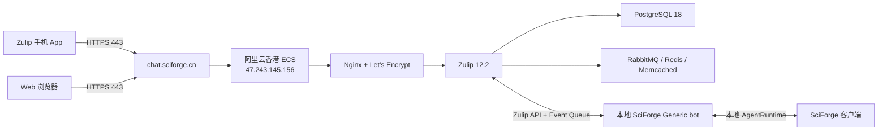

# SciForge 阿里云香港 ECS 与 Zulip 部署、使用和运维手册

> 状态日期：2026-08-14（Asia/Shanghai）
>
> 适用规模：约 6 名用户
>
> 服务地址：`https://chat.sciforge.cn`
>
> 本文不保存管理员密码、Bot API key、SSH 私钥、SMTP 密码或其他凭据。

## 1. 目标与当前结论

本部署使用阿里云中国香港 ECS 运行自托管 Zulip Server，使团队成员可以通过网页和手机访问 `chat.sciforge.cn`，并让本地 SciForge 客户端通过 Generic bot 收发 Zulip 消息。

当前可用状态：

| 能力 | 状态 | 说明 |
| --- | --- | --- |
| ECS 与公网访问 | 已验证 | 香港 ECS 正常运行，22/80/443 已由阿里云安全组放行 |
| DNS | 已验证 | `chat.sciforge.cn` 指向 `47.243.145.156` |
| HTTPS | 已验证 | Let's Encrypt 证书可信，certbot 自动续期 timer 正常 |
| Zulip Web/API | 已验证 | Zulip 12.2，组织 `SciForge` 已创建 |
| Zulip Bot | 已验证到身份识别 | Generic bot `sciforge-bot@chat.sciforge.cn` 已被本地 SciForge 识别 |
| `SciForge` channel | 已验证 | Bot 已加入，客户端可以列出该 channel |
| 双向消息 | 待端到端验证 | 旧 `general · #sciforge` 绑定已暂停；新 Session 绑定尚未完成最终发送/接收测试 |
| SMTP | 未配置 | 邀请、确认、找回密码和邮件通知不可依赖 |
| 手机登录 | 待验证 | HTTPS/API 已满足登录条件；需要用户在手机 App 实测 |
| 手机后台推送 | 未启用 | 安装时使用了 `--no-push-notifications` |
| 应用备份 | 未配置 | 尚无定时 Zulip backup 和异机副本 |
| SSH 加固 | 部分完成 | 禁止密码登录，但仍允许 root 公钥登录；22 端口应限制来源 IP |

与“手机配对一台 SciForge 客户端、topic 投影本地 Session、消息双向同步”相关的目标设计见 [OpenSpec 提案](../../openspec/changes/pair-im-to-sciforge-sessions/proposal.md)。该提案是未来产品架构，不代表当前版本已经实现客户端级自动配对。

## 2. 实际资源清单

| 项目 | 实际值 |
| --- | --- |
| 云厂商 | 阿里云 ECS |
| 地域 / 可用区 | 中国香港 / D |
| 实例 ID | `i-j6c50cmxuzwo0u6jexr5` |
| 规格 | `ecs.e-c1m2.large`，2 vCPU / 4 GiB |
| 系统盘 | ESSD Entry 40 GiB |
| 操作系统 | Ubuntu 24.04 x86_64 |
| 公网 IPv4 | `47.243.145.156` |
| 带宽 | 5 Mbps，按流量计费 |
| 域名 | `chat.sciforge.cn` |
| Zulip | 12.2，官方单机生产安装 |
| PostgreSQL | 18.6 |
| TLS | Let's Encrypt；2026-08-14 签发，2026-11-12 到期 |
| 组织 | `SciForge` |
| 管理员显示名 | `gaozhangyang` |
| 管理员/系统联系邮箱 | `gaozhangyang@pjlab.org.cn` |
| Generic bot | `sciforge-bot@chat.sciforge.cn` |
| 目标 channel/topic | `SciForge` / `sciforge` |

2026-08-14 只读核查结果：根分区使用 9.8 GiB/40 GiB（27%），可用内存约 1.2 GiB，swap 4 GiB；Nginx、PostgreSQL、RabbitMQ、Redis、Supervisor、Memcached 及全部 Zulip worker 正常。当前根域组织有 1 个 active non-bot 账户（管理员），其余预计用户尚未创建。

## 3. 架构与网络路径



Zulip Server 位于公网香港节点；SciForge AgentRuntime 仍在本地 Mac 运行。只有本地 SciForge 在线并启用值守时，Bot 才能处理远端 Agent 消息。关闭 Mac、退出 SciForge、暂停绑定或本地断网后，Zulip 普通聊天仍可用，但远程 Agent 不会工作。

## 4. ICP 备案与地域说明

- 当前服务部署在阿里云中国香港节点，面向该节点提供服务通常不要求中国大陆 ICP 备案。
- 香港节点不等于中国大陆网络质量保证；大陆访问延迟和线路稳定性应实测。
- 若未来迁到中国大陆 ECS 并通过域名公开提供服务，需要通过实际接入商完成 ICP 备案。备案主体、域名实名和接入资源必须匹配。
- 备案本身通常不应向不明第三方购买“低价代备案”；需要付费的通常是满足接入条件的大陆云资源及可能的合规服务。
- ECS 不能在地域之间原地免费切换。上海与香港迁移应按“新建目标实例、备份恢复、切换 DNS、验证、再释放旧实例”的流程处理。

阿里云参考：

- [ICP备案准备与流程](https://help.aliyun.com/zh/icp-filing/basic-icp-service/user-guide/icp-filing-process)
- [ICP备案所需资料](https://help.aliyun.com/zh/icp-filing/basic-icp-service/user-guide/required-materials)

## 5. 凭据与安全原则

### 5.1 不得记录或传播的内容

- `sciforge-hk.pem` 私钥内容；
- Zulip 管理员密码；
- Generic bot API key；
- `/etc/zulip/zulip-secrets.conf` 内容；
- SMTP 密码、推送服务 key、数据库密码；
- Zulip backup 文件本体，因为官方 backup 包含配置和 secrets。

密码不得出现在聊天、Shell 命令参数、Shell history、文档或 Git 中。Bot API key 只粘贴到 SciForge“连接手机”面板，由本机 secret/config 路径保存。

### 5.2 当前高优先级风险

管理员密码曾通过非私密渠道暴露且尚未轮换，应视为已泄露凭据。建议在 Zulip 右上角齿轮 → **Personal settings** → **Account & privacy** → **Change password** 中立即更换，并退出其他会话。本文不记录旧值或新值。

### 5.3 本机私钥

当前私钥位置：

```text
~/Desktop/sciforge-hk.pem
```

权限必须是 `0600`：

```bash
chmod 600 ~/Desktop/sciforge-hk.pem
```

私钥应另存一份加密离线备份；不得提交到仓库、网盘公开目录或聊天系统。

## 6. 阿里云控制台配置

### 6.1 安全组

当前所需入方向规则：

| 协议 | 端口 | 来源 | 用途 |
| --- | --- | --- | --- |
| TCP | 22 | 推荐仅管理员固定公网 IP `/32` | SSH |
| TCP | 80 | `0.0.0.0/0` | ACME 与 HTTPS 跳转 |
| TCP | 443 | `0.0.0.0/0` | Zulip Web/API |

如实例启用公网 IPv6，再按同样原则配置 IPv6 规则。数据库、RabbitMQ、Redis、Memcached 和 Supervisor 管理端口不得向公网开放。

控制台建议：

- 开启实例释放保护；
- 为阿里云账号启用 MFA；
- 不共享主账号，日常操作使用 RAM 子账号；
- 重大升级前创建手工快照；
- 需要稳定公网地址时评估 EIP，停机/网络变更后始终复核公网 IP 和 DNS。

### 6.2 DNS

阿里云云解析记录：

| 记录类型 | 主机记录 | 记录值 | 线路 |
| --- | --- | --- | --- |
| A | `chat` | `47.243.145.156` | 默认 |

同名记录不得同时保留指向旧地址的 A、AAAA 或 CNAME。

验证：

```bash
dig +short chat.sciforge.cn A
dig @1.1.1.1 +short chat.sciforge.cn A
dig @8.8.8.8 +short chat.sciforge.cn A
dig @223.5.5.5 +short chat.sciforge.cn A
```

期望均返回 `47.243.145.156`。

## 7. SSH 登录

当前可用命令：

```bash
ssh -i ~/Desktop/sciforge-hk.pem root@47.243.145.156
```

首次连接核对 host key 指纹，不能无条件忽略警告。自动检查可使用：

```bash
ssh -o BatchMode=yes \
  -o ConnectTimeout=10 \
  -i ~/Desktop/sciforge-hk.pem \
  root@47.243.145.156 'hostnamectl --static && uptime'
```

当前 SSH 状态：`PasswordAuthentication no`、`PubkeyAuthentication yes`、`PermitRootLogin yes`。非 root 管理员切换方案见“安全加固”。

## 8. Zulip 安装记录

### 8.1 安装方式

使用 Zulip 官方单机生产安装器，不使用 Docker、宝塔或第三方面板。实际安装包：

- 版本：12.2
- SHA-256：`1738e4415d0b87d71c2818690c89486a292b356c8b43c84d82ff9fcbc7de7a7c`

实际命令：

```bash
cd "$(mktemp -d)"
curl -fLO https://download.zulip.com/server/zulip-server-12.2.tar.gz
echo '1738e4415d0b87d71c2818690c89486a292b356c8b43c84d82ff9fcbc7de7a7c  zulip-server-12.2.tar.gz' \
  | sha256sum -c -
tar -xf zulip-server-12.2.tar.gz
./zulip-server-12.2/scripts/setup/install \
  --no-push-notifications \
  --certbot \
  --email=gaozhangyang@pjlab.org.cn \
  --hostname=chat.sciforge.cn
```

服务器所有者在安装时阅读并接受 Let's Encrypt Subscriber Agreement。不得由自动化流程在未获得所有者明确同意时接受外部条款。

官方安装文档：[Install a Zulip server](https://zulip.readthedocs.io/en/latest/production/install.html)。

### 8.2 Let's Encrypt 证书修复记录

初次签发后，Nginx 仍引用安装阶段的自签证书；执行官方 deploy hook 后切换为 Let's Encrypt：

```bash
ZULIP_DOMAIN=chat.sciforge.cn \
  /etc/letsencrypt/renewal-hooks/deploy/020-symlink.sh
nginx -t
systemctl reload nginx
certbot renew --dry-run --no-random-sleep-on-renew
```

当前链接：

```text
/etc/ssl/certs/zulip.combined-chain.crt -> /etc/letsencrypt/live/chat.sciforge.cn/fullchain.pem
/etc/ssl/private/zulip.key            -> /etc/letsencrypt/live/chat.sciforge.cn/privkey.pem
```

`certbot.timer` 当前为 `enabled` 且 `active`。

### 8.3 组织初始化

安装完成后通过一次性组织创建链接建立：

- 组织名：`SciForge`
- 管理员显示名：`gaozhangyang`
- 管理员/系统联系邮箱：`gaozhangyang@pjlab.org.cn`

一次性创建链接和密码不得写入本文。

## 9. 用户、channel 与 Bot 配置

### 9.1 团队 channel

已创建 `SciForge` channel。建议保持为私有 channel，并只添加需要远程使用本地 SciForge 的 6 名成员。

创建/维护路径：Zulip 右上角齿轮 → **Channel settings** → 选择或创建 `SciForge` → **Subscribers**。

官方帮助：

- [Create a channel](https://zulip.com/help/create-a-channel)
- [Subscribe users to a channel](https://zulip.com/help/subscribe-users-to-a-channel)

### 9.2 Generic bot

Bot 信息：

| 字段 | 值 |
| --- | --- |
| 类型 | Generic bot |
| 邮箱 | `sciforge-bot@chat.sciforge.cn` |
| 预期显示名 | `SciForge Agent` |
| 订阅 channel | `SciForge` |

管理路径：齿轮 → **Personal settings** → **Bots**。API key 只从 Bot 管理页面复制到本地 SciForge，不在聊天中传递。

若 API key 疑似泄露，在 Bot 管理页面重新生成，然后立即更新本地 SciForge；旧 key 应失效。

### 9.3 没有 SMTP 时创建用户

推荐优先完成 SMTP，再通过邀请流程创建用户。临时没有 SMTP 时，可以在服务器交互式创建账户：

```bash
ssh -i ~/Desktop/sciforge-hk.pem root@47.243.145.156
su - zulip
cd /home/zulip/deployments/current
./manage.py list_realms
./manage.py create_user -r ''
```

根域单组织的 realm string ID 是空字符串 `''`。命令会交互式请求邮箱、姓名和密码。不要使用 `--password` 把密码放在进程列表或 Shell history 中；如需非交互流程，阅读 `./manage.py create_user --help` 并使用权限严格的临时 `--password-file`。

官方管理命令说明：[Management commands](https://zulip.readthedocs.io/en/latest/production/management-commands.html)。

## 10. SMTP 邮件配置

SMTP 当前未配置。没有 SMTP 时，邀请确认、密码找回和邮件通知不能可靠工作。对于 6 人团队，建议使用单位 SMTP 或事务邮件服务，并为 `sciforge.cn` 配置 SPF、DKIM 和 DMARC。

在 `/etc/zulip/settings.py` 的 “Outgoing email (SMTP) settings” 段填写非敏感配置，例如 STARTTLS 587：

```python
EMAIL_HOST = "smtp.example.com"
EMAIL_HOST_USER = "zulip@sciforge.cn"
EMAIL_PORT = 587
EMAIL_USE_TLS = True
NOREPLY_EMAIL_ADDRESS = "noreply@sciforge.cn"
```

SMTP 密码只写入 `/etc/zulip/zulip-secrets.conf`：

```ini
email_password = <仅在服务器本机填写，不复制到文档或聊天>
```

如果供应商使用隐式 TLS 465，使用 `EMAIL_PORT = 465` 和 `EMAIL_USE_SSL = True`，不要同时启用 STARTTLS。

测试和重启：

```bash
su zulip -c '/home/zulip/deployments/current/manage.py send_test_email gaozhangyang@pjlab.org.cn'
su zulip -c '/home/zulip/deployments/current/scripts/restart-server'
tail -n 100 /var/log/zulip/send_email.log
```

确认收到测试邮件后再邀请其他用户。完整说明：[Outgoing email](https://zulip.readthedocs.io/en/latest/production/email.html)。

## 11. 当前版本的 SciForge 连接步骤

本节描述当前代码实际行为；未来客户端级配对提案实现后，本节需要更新。

1. 在本地 SciForge 打开目标 Project/Session。
2. 点击左下角 **连接手机**，选择 **Zulip**。
3. 填写：
   - Zulip 服务器：`https://chat.sciforge.cn`
   - Bot email：`sciforge-bot@chat.sciforge.cn`
   - Bot API key：从 Zulip Bot 管理页复制，仅粘贴到本机
4. 点击 **保存并识别 Bot**；应显示 `SciForge Agent`。
5. Stream 选择 `SciForge`，Topic 使用稳定 ASCII 名 `sciforge`。
6. Agent profile 使用 `SciForge Agent`。
7. 点击 **测试发送 / 启用接收**。
8. Zulip 的 `SciForge / sciforge` 中应出现：`SciForge Zulip Bot 已连接。`
9. 在 Zulip 发送 `/where`、`/help`，确认 Bot 返回当前项目、thread 和命令列表。
10. 发送一条无副作用测试消息，例如“只回复：手机到桌面已连通”，确认桌面 thread 出现用户消息且 Zulip 收到 Agent 回复。
11. 再从桌面同一 thread 发送“只回复：桌面到手机已连通”，确认 user message 和最终回复都镜像到 Zulip。

当前已知状态：

- API key 已在本机配置，Bot 已识别；
- `SciForge` stream 已可选；
- 旧 `general · #sciforge` / `scireasoner` 绑定已暂停；
- 新绑定的双向测试仍待执行；
- 当前实现必须有一个默认工作区，建议使用 `/Applications/workspace/ailab/research/app/SciForge`。

### 11.1 当前远程命令

| 命令 | 作用 |
| --- | --- |
| `/help` | 显示完整命令帮助 |
| `/where` | 查看 provider、channel、Project、thread、模型、模式与队列 |
| `/projects` | 列出当前已知 Projects |
| `/use project <编号或名称>` | 切换当前远端上下文的 Project |
| `/threads` | 列出当前 Project 的 Sessions/threads |
| `/use thread <编号或名称>` | 切换本地 thread |
| `/new <标题>` | 在当前 Project 新建并绑定 thread |
| `/attach current` | 显式绑定当前桌面 thread；不会持续跟随桌面焦点 |
| `/jobs` | 查看运行、排队、失败和完成状态 |
| `/summary` | 查看当前远端会话摘要 |
| `/detach` | 解除当前 thread 绑定 |

同一 Zulip topic 是团队共享上下文；其中一人切换 Project/thread 会影响其他成员的后续消息。未来设计将改为一个 topic 稳定投影一个 Session。

## 12. 手机端登录与验证

1. 从 iOS App Store 或 Google Play 安装官方 **Zulip** App。
2. 选择添加账户/登录到其他服务器。
3. Server URL 填写 `https://chat.sciforge.cn`。
4. 使用个人 Zulip 邮箱和个人密码登录；不要共用管理员账号。
5. 打开 `SciForge` channel 和 `sciforge` topic。
6. 按第 11 节执行双向测试。
7. 在 Wi-Fi 与蜂窝网络各测试一次。

管理员应为每位用户创建独立账号，以便审计发送者身份和及时停用离职/失窃账户。

## 13. 移动推送通知（可选，当前未启用）

手机登录和主动打开 App 不依赖后台推送；锁屏/后台及时提醒则需要 Zulip Mobile Push Notification Service。Zulip 12.0+ 与新版手机 App 支持端到端加密推送，但仍需向 Zulip 服务注册并接受其条款。

本组织预计 6 人，低于官方文档所述“超过 10 个用户需要升级计划”的阈值。启用前由服务器所有者亲自阅读并接受 Zulip 的服务条款与隐私政策：

1. 确认 `/etc/zulip/settings.py` 中 `ZULIP_ADMINISTRATOR` 是有效联系邮箱。
2. 设置：

   ```python
   ZULIP_SERVICE_PUSH_NOTIFICATIONS = True
   # 如不希望提交可选使用统计：
   ZULIP_SERVICE_SUBMIT_USAGE_STATISTICS = False
   ```

3. 重启：

   ```bash
   su zulip -c '/home/zulip/deployments/current/scripts/restart-server'
   ```

4. 由所有者在交互终端运行并阅读注册数据与条款：

   ```bash
   su zulip -c '/home/zulip/deployments/current/manage.py register_server'
   ```

5. 注册成功后，每名已经登录的手机用户退出 App 账号并重新登录。
6. 按官方测试流程验证锁屏通知。

自动化不得代替所有者接受条款。官方说明：[Mobile push notification service](https://zulip.readthedocs.io/en/latest/production/mobile-push-notifications.html)。

## 14. 日常健康检查

从本机检查公网与 API：

```bash
curl -fsS https://chat.sciforge.cn/api/v1/server_settings \
  | python3 -c 'import json,sys; d=json.load(sys.stdin); print(d["zulip_version"])'
```

服务器检查：

```bash
supervisorctl status
systemctl is-active nginx postgresql rabbitmq-server redis-server supervisor memcached
nginx -t
systemctl status certbot.timer --no-pager
df -h /
free -h
```

期望：

- API 返回 `12.2`；
- 所有 systemd 服务为 `active`；
- 所有 Supervisor 条目为 `RUNNING`；
- `nginx -t` 成功；
- 根分区长期低于 80%；
- 内存无持续 OOM，swap 不持续快速增长。

### 14.1 TLS 检查

```bash
openssl s_client -connect chat.sciforge.cn:443 \
  -servername chat.sciforge.cn </dev/null 2>/dev/null \
  | openssl x509 -noout -subject -issuer -dates

certbot renew --dry-run --no-random-sleep-on-renew
```

证书续期失败时查看：

```bash
journalctl -u certbot.timer --since '7 days ago' --no-pager
journalctl -u nginx --since '24 hours ago' --no-pager
```

## 15. 启停、重启与日志

优先使用 Zulip 自带脚本：

```bash
su zulip -c '/home/zulip/deployments/current/scripts/restart-server'
su zulip -c '/home/zulip/deployments/current/scripts/stop-server'
su zulip -c '/home/zulip/deployments/current/scripts/start-server'
```

常用日志：

```bash
tail -n 200 /var/log/zulip/errors.log
tail -n 200 /var/log/zulip/server.log
tail -n 200 /var/log/zulip/send_email.log
journalctl -u nginx --since '1 hour ago' --no-pager
journalctl -u postgresql --since '1 hour ago' --no-pager
```

排障前记录时间、错误、影响用户和最近变更；不要把完整 secrets 或包含敏感消息的日志复制到公开位置。

## 16. 备份策略

### 16.1 推荐策略

| 层次 | 周期 | 保留 | 说明 |
| --- | --- | --- | --- |
| Zulip 官方 backup | 每日 | 至少 14 天 | 数据库、上传和 `/etc/zulip` 配置；必须异机保存 |
| 阿里云 ECS 快照 | 每周及升级前 | 4–8 份 | 快速整机回退；不能替代应用备份 |
| 恢复演练 | 每季度 | 记录结果 | 在不同测试域名/隔离实例恢复验证 |

### 16.2 手工应用备份

首次创建受限目录：

```bash
install -d -o zulip -g zulip -m 0700 /srv/zulip-backups
```

执行备份：

```bash
backup_file="/srv/zulip-backups/zulip-$(date -u +%F-%H%M%S).tar.gz"
su zulip -c "/home/zulip/deployments/current/manage.py backup --output=$backup_file"
sha256sum "$backup_file"
ls -lh "$backup_file"
```

将 backup 和单独记录的 SHA-256 复制到加密异机存储。backup 包含 Zulip secrets，访问权限应等同于生产凭据。不要只把备份留在同一 ECS 系统盘。

本机拉取示例：

```bash
scp -i ~/Desktop/sciforge-hk.pem \
  root@47.243.145.156:/srv/zulip-backups/<备份文件名> \
  <本机加密备份目录>/
```

官方说明：[Backups, export and import](https://zulip.readthedocs.io/en/latest/production/export-and-import.html)。

### 16.3 恢复原则

官方 backup 要求目标环境与备份具有相同 Zulip migrations，且 PostgreSQL 版本相同。当前基线是 Zulip 12.2、PostgreSQL 18.6。

隔离恢复流程：

1. 新建相同基础 OS 的测试 ECS；
2. 安装相同 Zulip 和 PostgreSQL 版本到官方恢复前置阶段；
3. 不要让测试实例直接接管生产 DNS；
4. 以 root 执行：

   ```bash
   /home/zulip/deployments/current/scripts/setup/restore-backup /path/to/backup.tar.gz
   ```

5. 若使用不同测试域名，更新 `EXTERNAL_HOST`、证书和 DNS；
6. 验证登录、消息、上传、Bot、SMTP、证书和手机；
7. 记录恢复耗时和缺失项。

恢复会改写目标 Zulip 状态，只能在明确的空白/灾备实例上执行。

## 17. Zulip 升级

不要自动追随 `latest`。每次升级：

1. 阅读当前版本到目标版本的全部 release/upgrade notes；
2. 创建 Zulip 官方 backup 并复制到异机；
3. 创建阿里云手工快照；
4. 在测试恢复实例演练；
5. 选择低峰维护窗口并通知用户；
6. 下载官方 release tarball，并按官方发布信息校验；
7. 运行：

   ```bash
   /home/zulip/deployments/current/scripts/upgrade-zulip <release-tarball>
   ```

8. 复核 API 版本、Supervisor、所有 systemd 服务、TLS、登录、Bot、SMTP 与手机；
9. 记录新版本、校验值、迁移耗时和异常。

官方升级文档：[Upgrade Zulip](https://zulip.readthedocs.io/en/latest/production/upgrade.html)。

若新部署失败，Zulip 通常保留 `/home/zulip/deployments/last`；是否执行旧版本 `restart-server` 必须结合数据库 migration 和官方 rollback 说明判断，不能盲目回滚。

## 18. SSH 与主机安全加固

当前 root 公钥登录可用，密码登录已关闭。建议建立非 root sudo 用户后再禁用 root SSH；必须先在第二个终端验证新用户，避免锁死。

### 18.1 建立管理用户

在 root 会话执行：

```bash
adduser --disabled-password --gecos '' sciforge-admin
usermod -aG sudo sciforge-admin
install -d -o sciforge-admin -g sciforge-admin -m 0700 /home/sciforge-admin/.ssh
install -o sciforge-admin -g sciforge-admin -m 0600 \
  /root/.ssh/authorized_keys \
  /home/sciforge-admin/.ssh/authorized_keys
```

保持 root 会话不要关闭，在本机新终端验证：

```bash
ssh -i ~/Desktop/sciforge-hk.pem sciforge-admin@47.243.145.156
sudo -n true
```

如果 `sudo -n true` 失败，先确认 sudo 策略；不要继续禁用 root。

### 18.2 验证后禁用 root SSH

仅在新用户 SSH 与 sudo 都成功后创建 `/etc/ssh/sshd_config.d/99-sciforge-hardening.conf`：

```text
PermitRootLogin no
PasswordAuthentication no
PubkeyAuthentication yes
```

验证并 reload：

```bash
sshd -t
systemctl reload ssh
```

再次用新终端验证 `sciforge-admin`，确认后才关闭旧 root 会话。

### 18.3 其他建议

- 阿里云安全组将 22 端口限制为管理员公网 IP；
- 定期安装 Ubuntu 和 Zulip 官方支持的安全更新；
- 不直接手工修改 Zulip 管理的 Nginx、PostgreSQL、Redis 等配置，升级时遵循 Zulip 文档；
- `ufw` 当前 inactive。若启用双层防火墙，先明确允许当前 SSH 来源和 80/443，再启用并从第二个会话验证；
- 每月检查登录用户、管理员、Bot、API key 使用和异常日志。

## 19. 故障处理速查

### 19.1 域名打不开

```bash
dig +short chat.sciforge.cn A
curl -vkI https://chat.sciforge.cn/
```

检查 DNS 是否仍是 `47.243.145.156`、ECS 是否运行、安全组是否允许 80/443、Nginx 是否 active。

### 19.2 HTTPS 证书错误

```bash
nginx -t
readlink -f /etc/ssl/certs/zulip.combined-chain.crt
readlink -f /etc/ssl/private/zulip.key
certbot certificates
```

若 Certbot 已签发但 Nginx 未引用：

```bash
ZULIP_DOMAIN=chat.sciforge.cn \
  /etc/letsencrypt/renewal-hooks/deploy/020-symlink.sh
nginx -t
systemctl reload nginx
```

### 19.3 Web 可用但 Bot 不回复

依次确认：

1. 本地 Mac 和 SciForge 客户端在线；
2. “连接手机”中 pairing/binding 处于“值守中”；
3. Bot 仍订阅 `SciForge` channel；
4. 消息发在绑定的精确 topic；
5. Bot API key 未轮换或失效；
6. `/where`、`/jobs` 是否返回错误；
7. 本地 SciForge 日志和远程 channel 错误；
8. Zulip API/Event Queue 是否可达。

暂停后必须显式恢复；桌面焦点变化不会自动改变远端绑定。

### 19.4 服务异常

```bash
supervisorctl status
systemctl --failed
tail -n 200 /var/log/zulip/errors.log
df -h /
free -h
```

不要第一时间重装。先保存错误、日志时间段和最近变更，再决定 restart、回滚或恢复。

### 19.5 邮件失败

```bash
su zulip -c '/home/zulip/deployments/current/manage.py send_test_email gaozhangyang@pjlab.org.cn'
tail -n 200 /var/log/zulip/send_email.log
tail -n 200 /var/log/zulip/errors.log
```

检查 SMTP host/port/TLS、发件地址授权、SPF/DKIM、阿里云出方向限制和 secret 中的 `email_password`。

## 20. 例行维护清单

### 每周

- [ ] `https://chat.sciforge.cn` 可登录；
- [ ] API、systemd、Supervisor 和 Nginx 检查通过；
- [ ] 根分区低于 80%，无持续 OOM；
- [ ] 最近一次应用 backup 成功且已复制到异机；
- [ ] 证书剩余时间正常；
- [ ] Bot 测试 topic 可双向收发。

### 每月

- [ ] 查看 Zulip 与 Ubuntu 安全更新；
- [ ] 审核组织管理员、成员、Bot 和 channel subscribers；
- [ ] 检查阿里云安全组 22 端口来源；
- [ ] 检查 SMTP、证书续期和推送状态；
- [ ] 检查阿里云账单、流量、快照和释放保护；
- [ ] 轮换已泄露或人员变更涉及的凭据。

### 每季度

- [ ] 在隔离实例完成一次 backup restore 演练；
- [ ] 验证手机重新登录、推送和 Bot 双向链路；
- [ ] 复核本文资源、版本、联系人和恢复目标；
- [ ] 删除已停用账号，归档不再使用的 Bot/channel/topic。

## 21. 尚待完成的部署工作

按优先级排序：

1. 轮换已暴露的管理员密码；
2. 完成 `SciForge / sciforge` 与本地 Session 的双向消息测试；
3. 用个人账号在手机 App 完成 Wi-Fi/蜂窝登录验证；
4. 配置 SMTP 并验证测试邮件；
5. 建立每日应用 backup、异机复制和季度恢复演练；
6. 创建非 root 管理员、验证后禁用 root SSH，并限制安全组 22 来源；
7. 由所有者决定是否接受并启用 Zulip Mobile Push Notification Service；
8. 实现 [客户端级配对 OpenSpec](../../openspec/changes/pair-im-to-sciforge-sessions/proposal.md) 后更新第 11 节。

## 22. 官方参考

- [Install a Zulip server](https://zulip.readthedocs.io/en/latest/production/install.html)
- [Outgoing email](https://zulip.readthedocs.io/en/latest/production/email.html)
- [Mobile push notification service](https://zulip.readthedocs.io/en/latest/production/mobile-push-notifications.html)
- [Backups, export and import](https://zulip.readthedocs.io/en/latest/production/export-and-import.html)
- [Upgrade Zulip](https://zulip.readthedocs.io/en/latest/production/upgrade.html)
- [Management commands](https://zulip.readthedocs.io/en/latest/production/management-commands.html)
- [Zulip help center](https://zulip.com/help/)
