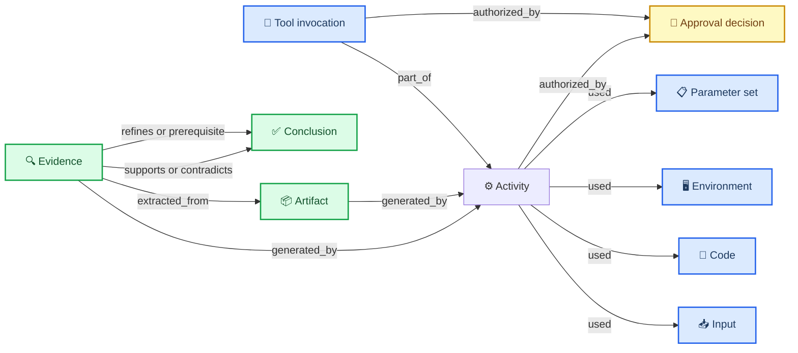
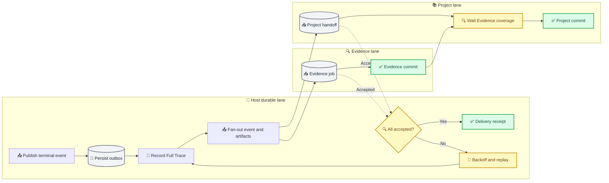

# SciForge 可复跑 DAG v3 实现说明

_基于 `local/latest-20260805` 的当前实现与回归基线，更新于 2026-08-07_

---

## 🎯 目标与实现边界

可复跑 DAG v3 把一次科研工作流的“结论、证据与执行条件”固化为同一条可验证链路，当前实现完成三项核心目标：

- 从一个 `Conclusion` 反向取得全部支持、反对、限定和前置 Evidence，并继续闭包到生成这些 Evidence 的运行、输入、代码、环境、参数、工具、审批和 Artifact；
- 从 committed Evidence Snapshot 导出唯一的 `sciforge.rerun.v1`，由 Create Loop 解析、校验并在存在本地可信来源锚时执行“一键复跑”；
- 对 baseline 与 candidate 分别保存可观察差异、比较器结论和 `reasonCodes`，使同一输入下的相同结果、容差内变化、环境变化及随机性都能被解释。

实现遵循以下边界：Create Loop 拥有工作流执行；Evidence DAG 拥有 session 或 synthetic execution scope 内的来源事实；Project DAG 只消费 committed Evidence 引用并编译项目派生视图；Host 只提供通用终态事件的持久化、Full Trace 写入和 Artifact fan-out。

> 📌 **状态语义：** “可导出”不等于“可执行”，“已声明”也不等于“已独立语义验证”。外部 Evidence/Project 规范即使结构完整，也不能绕过 Create Loop 的本地可信导出登记；阻塞条件会写入 breakpoint；没有模型评分的 canonical executor 结论保持 `fragile`。

### 约 200 字工作简介

本次在现有 Evidence DAG 与 Project DAG 上补齐 Input、Code、Environment、Parameter、Tool、Approval、Artifact、Evidence、Conclusion 九类语义节点及来源边。结论现可反向闭包到全部证据和执行条件，并导出统一复跑规范。Create Loop 固化输入、代码、环境和输出指纹，重跑后分别报告一致性、容差结果与差异原因；Host 提供终态事件持久化、重放和唯一性保护。对抗审核进一步修复跨工作区、部分批次、快照篡改、受限数据泄漏、审批复用及秘密回显。另提供 14 节点复杂应用演示、离线报告、说明文档和视频。

## 📋 修改总览

| 范围 | 主要修改 | 用户可见结果 |
| --- | --- | --- |
| Shared SDK | 新增 canonical `sciforge.rerun.v1`、跨语言 digest 和验证器 | Create、Evidence 与 Project 使用同一种复跑规范 |
| Create Loop | 固化 workflow/input/spec/context/node/output 指纹，新增导出、复跑、fresh approval 与差异比较 | 运行历史可导出规范、按规范复跑并解释 differences |
| Evidence DAG | 新增九类语义节点、来源边、Conclusion closure、rerun projection 和 canonical bundle 摄取 | 从结论可追到全部证据及执行条件，并显示 coverage/breakpoint |
| Project DAG | 改为 immutable EvidenceRef、显式 captured scope 与跨快照 provenance resolver | 项目结论可回到原 Evidence snapshot，而不复制事实 |
| Host / Full Trace | 新增 durable terminal-event outbox、幂等 fan-out 和恢复队列 | Create 完成后 Evidence/Project 可异步补写且可重放 |
| Demo / 文档 | 新增 14 节点复杂样例、离线 demo、真实应用记录和视频 | 可直接在 SciForge 中展示分支、Artifact、Evidence、审批与 Conclusion |

主要入口包括 [Shared schema](../packages/domain-sdk/src/reproducibility.ts)、[Create rerun](../packages/domains/create-loop/src/rerun.ts)、[Evidence lineage](../packages/domains/evidence-dag/python/evidence_dag/lineage.py)、[Project provenance](../packages/domains/project-dag/python/project_dag/provenance.py) 和 [Host terminal service](../src/main/services/domain-execution-event-service.ts)。

## 📚 两套 DAG 与事实所有权

### Evidence DAG

Evidence DAG 以一个 runtime-qualified thread 或 Create Loop synthetic execution scope 为边界。它保存认识关系、执行来源关系、Artifact Registry、ArtifactVersion、SourceAnchor、assessment 以及不可变 Evidence Snapshot。正常更新只处理 committed watermark 之后的新 trace；provisional graph 不会替换最后一个 committed snapshot。

### Project DAG

Project DAG 以项目为边界，只接收 `threadId + snapshot digest` 组成的 `evidenceVector`。编译器读取并验证对应 committed Evidence Snapshot，将原生 Evidence `Conclusion` 提升为项目 `claim_type=conclusion`，同时保存 typed immutable EvidenceRef 和 origin path，而不是复制 Evidence 图的事实所有权。

| 维度 | Evidence DAG | Project DAG |
| --- | --- | --- |
| 范围 | 单 session 或 execution scope | 显式 captured project scope |
| 输入 | runtime trace、terminal bundle | committed `evidenceVector` |
| 事实所有者 | Evidence、run、Artifact 与 lineage | Goal、跨 session claim 与派生关系 |
| 快照 | immutable Evidence Snapshot | immutable Project Snapshot |
| 复跑规范 | 生成 canonical spec | 保存引用并通过 resolver 返回原规范 |

```mermaid
flowchart LR
    accTitle: Two DAG Durable Pipeline
    accDescr: Create Loop terminal events pass through the Host durable lane into a committed Evidence snapshot, then an explicitly captured scope compiles the Project snapshot while rerun specifications loop back to Create Loop

    create_loop[⚙️ Create Loop run] --> terminal_event[📤 Terminal event]
    terminal_event --> host_outbox[(💾 Host outbox)]
    host_outbox --> full_trace[(📝 Full Trace)]
    full_trace --> artifact_fanout[📤 Artifact fan-out]
    artifact_fanout --> evidence_queue[(📥 Evidence queue)]
    evidence_queue --> evidence_snapshot[✅ Evidence snapshot]
    artifact_fanout --> project_handoff[(📥 Project handoff)]
    evidence_snapshot --> project_handoff
    project_handoff --> project_snapshot[✅ Project snapshot]
    evidence_snapshot --> rerun_spec[📦 Rerun spec]
    rerun_spec --> create_loop

    classDef durable fill:#f3f4f6,stroke:#6b7280,stroke-width:2px,color:#1f2937
    classDef committed fill:#dcfce7,stroke:#16a34a,stroke-width:2px,color:#14532d
    classDef action fill:#dbeafe,stroke:#2563eb,stroke-width:2px,color:#1e3a5f

    class host_outbox,full_trace,evidence_queue,project_handoff durable
    class evidence_snapshot,project_snapshot committed
    class create_loop,terminal_event,artifact_fanout,rerun_spec action
```



## 🔗 节点与边模型

v3 原生增加 `parameter_set`、`tool_invocation`、`approval_decision`、`workflow_run` 和 `conclusion`。Input 与 Code 复用既有科研对象类型，并通过 `semanticRole=input|code` 标明角色，避免维护第二套重复本体。

| 业务节点 | Evidence 表达 | 最小可复跑信息 |
| --- | --- | --- |
| Input | Artifact、DatasetVersion、Observation 等，`semanticRole=input` | identity、版本或 digest、locator |
| Code | SoftwareVersion 或 Artifact，`semanticRole=code` | commit、SWHID、entrypoint、content digest |
| Environment | `environment` | platform、architecture、runtime/lock/container digest |
| Parameter | `parameter_set` | canonical values、digest、可选 random seed |
| Tool | `tool_invocation` | provider/action/version、参数与结果 digest、seed 能力 |
| Approval | `approval_decision` | subject、mode、actor、observed decision；复跑要求 fresh decision |
| Artifact | `artifact` 与 Registry 中的 ArtifactVersion/SourceAnchor | 字节 digest、版本、媒体类型、受控 locator |
| Evidence | SourceAssertion、Finding、Observation 等，`semanticRole=evidence` | statement、trace ref、grounding 或 ArtifactVersion |
| Conclusion | 原生 `conclusion`，也接受 claim-like 根节点 | statement、状态、认识关系与 snapshot identity |

Activity 是上述九类节点之间的来源枢纽，具体为 `experiment_run`、`analysis_run`、`workflow_run`，必要时也可以是 `tool_invocation`。



核心边方向如下：

| Edge | 方向 | 作用 |
| --- | --- | --- |
| `used` | Activity → Input/Code/Environment/Parameter | 记录执行依赖 |
| `part_of` | ToolInvocation → Activity | 将工具调用归入运行 |
| `authorized_by` | Activity/Tool → ApprovalDecision | 记录治理依据 |
| `generated_by` | Artifact/Evidence → Activity | 回到生成运行 |
| `extracted_from`、`derived_from` | 派生对象 → 来源对象 | 回到精确来源 |
| `supports`、`contradicts`、`refines`、`prerequisite` | Evidence → Conclusion | 认识关系 |
| `rerun_of` | candidate Activity → baseline Activity | 标记复跑身份 |
| `replicates`、`fails_to_replicate` | candidate Activity → baseline Activity | 保存经比较后的复现判断 |

来源与推导关系保持无环；`contradicts`、身份和复现关系可以有科研上有意义的环，因此存储层按 edge family 施加约束，而不是把所有关系强行塞进一个严格 DAG。

## 🔍 Conclusion 到全部 Evidence 的闭包

`conclusion_lineage` 对一个绑定 committed snapshot 的 conclusion-like 根节点执行确定性闭包：

1. 沿入边递归收集 `supports`、`contradicts`、`refines` 和 `prerequisite`，保留支持证据、反例、限定条件和前提；
2. 从每个 Evidence 沿 `generated_by`、`used`、`derived_from`、`extracted_from`、`part_of` 和 `authorized_by` 回到 Activity 及其完整依赖；
3. 对 baseline 纳入指向它的 `rerun_of`、`replicates` 和 `fails_to_replicate` attempt，但不会从一个 rerun 穿过 baseline 吸收无关 sibling attempts；
4. 收集相关 Artifact、ArtifactVersion、SourceAnchor 和 assessment，并按九类组件生成 coverage；
5. 对缺失 Evidence grounding、不可验证 ArtifactVersion、缺失审批或尚未观察的新审批生成结构化 breakpoint，而不猜测缺失事实。

返回值包含 `root`、`nodes`、`edges`、`artifactRegistry`、`assessments` 和 `coverage`。其中 `coverage.components` 分组列出 inputs、code、environment、parameters、tools、approvals、artifacts、evidence、conclusions 和 activities；只有存在 Evidence 且没有阻断断点时，`coverage.complete` 才为 `true`。

Project resolver 不自行重算该闭包。它先验证 Project Snapshot、EvidenceRef、`evidenceVector` 和 Evidence Snapshot digest，再调用 Evidence 的 `conclusion_lineage`，最后把 project origin edge 与 Evidence closure 组合为跨 DAG 只读结果。

## 📦 `sciforge.rerun.v1` 与一键复跑

唯一公共规范定义在 [`@sciforge/domain-sdk/reproducibility`](../packages/domain-sdk/src/reproducibility.ts)。Evidence 可以从 Conclusion 闭包导出规范；Create Loop 也可以从 run history 导出同一 schema。Project DAG 不定义第二种复跑格式，只保存 immutable reference 并通过 provenance resolver 返回 Evidence 生成的原规范。

| 字段 | 作用 |
| --- | --- |
| `source` / `target` | 绑定 snapshot、Conclusion 或 Activity |
| `activities` | executor、输入、代码、环境、参数、工具、审批和预期输出 |
| `dependencies` | 多 Activity 的无环执行依赖 |
| `secretSlots` | 声明运行时应重新注入的秘密，不保存秘密值 |
| `breakpoints` | 解释 executor、lineage、随机性或安全缺口 |
| `executionReady` | 有 blocking breakpoint 时严格为 `false` |
| `reproducibility` | `controlled`、`uncontrolled` 或 `incomplete` |

`specDigest` 对排除 `specDigest` 自身后的 canonical JSON 计算 SHA-256。TypeScript 与 Python 都拒绝非有限数字和孤立 UTF-16 surrogate，并保持对象键和数组顺序的统一规则。Create Loop 解析时还会校验：

- schema、`specDigest`、Activity dependencies 和 target identity；
- `sciforge.create-loop.executor.v1` 整体 `workflowDigest`；
- executor 内 baseline 的 workflow/input/spec/context fingerprint；
- node target 不得绕过原 workflow 的 human-approval topology；
- `executionReady`、blocking breakpoint 和 secret resolver 条件。

Create Loop run history 提供“导出可复跑规范（JSON）”和“按此规范复跑”。一键复跑先走 canonical export，再调用 `runRerun`；导出失败时不会启动执行。实际执行还要求 spec digest、source snapshot、workflow 和 baseline run 命中当前 Create Loop 实例的可信导出登记，并能回读同一个本地 run；Evidence/Project 生成的规范可以跨语言解析和审阅，但没有 Host attestation 或等价可信登记时保持不可执行。Conclusion 规范含多个可执行 Activity 时必须显式选择 `activityId`。复跑完成后，新 manifest 会写入 `rerunOfRunId`、spec digest、comparison，并发布新的 terminal event。

## 🔄 同一输入的比较与差异解释

比较结果使用 `sciforge.rerun-comparison.v1`，把“观察到变化”与“是否复现”分开：

- `sameInput`、`sameSpec`、`sameExecutionContext` 判断解释条件是否一致；
- `resultMatch` 与 `comparisonVerifiable` 表示显式 comparator 能否验证以及是否命中；
- `differences` 保存 input、spec、context、approval、node、Artifact 和 output 的 digest 或值变化；
- `reasonCodes` 给出机器可读原因，例如 `same_input`、`input_fingerprint_changed`、`execution_spec_changed`、`execution_context_changed`、`approval_decision_changed`、`uncontrolled_randomness` 和 `explicit_comparator_match_with_observed_change`。

比较前会从 candidate 的 workflow、input、context、output、approval、node result 和 attempt receipt 正文重新计算全部指纹，并重新验证 Activity dependency 有向边集。只修改正文而保留旧 digest、删除或反转依赖边、交换 Activity 输入，都会得到 `candidate_manifest_integrity_invalid` 或 `dependency_graph_changed`，并降为 `inconclusive`；系统不会把自报指纹当成复现证明。

默认 comparator 是 `exact-digest`；只有规范明确声明时才采用 `numeric`、`table` 或 `json-structural` 容差。显式 comparator 是结果等价性的权威，底层 digest 变化仍保留为 difference，但不会推翻一个容差内 match。

| 条件 | `replicationStatus` | 关系 |
| --- | --- | --- |
| 同 input/spec/context，比较器命中 | `matched` | `replicates` |
| controlled，比较器可验证且不命中 | `failed` | `fails_to_replicate` |
| input/spec/context 改变 | `inconclusive` | 仅保留 `rerun_of` |
| uncontrolled 或 incomplete 且不命中 | `inconclusive` | 仅保留 `rerun_of` |
| 输出缺失或比较器不可验证 | `inconclusive` | 仅保留 `rerun_of` |

因此，同一输入重跑并不保证字节摘要相同；系统可以同时报告“数值结果在容差内复现”和“输出 Artifact digest 已变化”。未设 seed 或工具不可设 seed 的随机运行不会因为一次 mismatch 被错误标记为 `fails_to_replicate`。

## 🔐 敏感信息与审批安全

安全模型采用 fail-closed：

- Create Loop 持久化 workflow snapshot 前递归抽取 secret env、credential 字段和敏感 header，将值替换为 `secretSlots` placeholder；executor、manifest、Evidence 和 Project payload 不保存 API key、token 或 secret value；
- 当前没有安全 secret resolver 时，只要存在 required secret slot，规范仍可导出，但复跑会被阻止；
- 历史审批只解释 baseline，所有 workflow human approval、capability confirmation 和 policy gate 都固定 `freshDecisionRequired=true`；
- 每次复跑重新发起审批并产生新的 approval fingerprint，旧 decision ID 不能被当作运行授权；
- canonical digest、executor digest、workflow topology 和 target identity 任一不一致都会在执行前失败；
- Evidence 与 Project 的 graph、lineage、PROV、analysis、audit、event、status、review 和 snapshot 等读取出口统一继承访问策略。受限结果采用显式 allowlist，只返回不透明标识、状态、存在性和 `access_restricted` breakpoint，不返回 statement、question、rationale、actor、locator、参数、环境、输出或下载入口；
- Host outbox、Evidence queue 和 Project handoff 使用私有目录与文件权限、原子替换、有界容量和错误长度限制。

## 🛡️ 对抗性审核与修复

本轮在 happy-path 回归之外，按“伪造输入、跨 workspace、部分提交、持久化篡改、权限降级、崩溃重放和秘密回显”逐项构造了负向用例。主要修复如下：

| 攻击或故障场景 | 修复后的行为 |
| --- | --- |
| `1/4`、`2/4` partial batch 被误当成已覆盖 watermark | 只有完整 `n/n` 或更高 Host sequence 才能推进，乱序合并取 canonical maximum |
| 手工 session 或 producer 自报 workspace | Agent thread 反查 authoritative workspace；package execution 要求 Host `capability-caller` binding、三方 workspace 一致且 sequence 匹配 |
| 伪造 canonical event/manifest/spec 或拆换 artifact | 严格校验 marker 全字段、producer/run/execution/scope、正文指纹，并核对 terminal event 与展开 artifact 的规范化 multiset |
| 修改 Project/Evidence snapshot payload 或串换 row | 读取时重算 digest，并核对 project/thread、version、vector、compiler/status 与 ArtifactVersion 绑定；失败即拒绝 |
| 受限 graph 的旁路字段或旁路 HTTP endpoint | 所有 Engine 投影使用同一 allowlist；assessment、review、goal、node metadata、status 与 audit 不再原样直出 |
| 最新 Project 已撤销访问，但显式读取旧 public snapshot | snapshot、claim 与 provenance 先服从最新项目访问状态，历史 digest 不能绕过撤销 |
| 首次 restricted Evidence update 尚未形成 Project snapshot | 从 pending immutable Evidence vector 计算临时访问边界，status/history/receipt 与 mutation 回执先行脱敏 |
| Candidate 新增节点、漏节点或只提交声明 digest | 节点集合变化 hard-fail；逐项验证 required output，声明 digest 不再被当成内容证明 |
| Candidate 修改正文但保留旧 workflow/input/context/output/approval digest | 从清单与节点回执正文重算所有比较指纹；完整性不一致固定为 `inconclusive` |
| 多 Activity 删除、反转依赖边或交换输入 | 用跨运行稳定 owner identity 规范化有向 dependency graph；拓扑变化不能得到 `replicates` |
| Comparison 缺少或伪造 `resultMatch` / `matches` | `resultMatch` 必须为布尔值，兼容字段 `matches` 若存在必须同值；否则只保留 `rerun_of` |
| 两个 Activity 使用歧义的 required-output owner | 整份规范要求稳定 owner identity 全局唯一，歧义直接 fail-closed |
| Bearer、URL userinfo 或结构化 credential 被错误、receipt、event 回显 | run-scoped secret registry 在落盘和事件发布前递归清洗；required secret 仅保留 slot |
| 审批并发 resolve/timeout 或历史审批复用 | 审批 token 原子 claim；每次复跑 fresh approval；失败或拒绝时对话框不提前关闭 |
| Host completed-turn 重启后才解析出 workspace | 只允许 previously-unbound durable intent 一次性绑定 authoritative workspace，并与 fan-out 原子落盘 |
| delivery receipt 淘汰后忘记唯一终态 | 永久保存紧凑 terminal identity；索引满时 fail-closed，不因 receipt pruning 接受冲突终态 |
| 旧 v2 receipt 缺 execution tuple | 仅用 Host Full Trace 中 eventId、producer、完整 intent digest 一致的事件恢复；无法恢复则保留 exact retry 并按 producer 阻断新终态 |
| 旧 Project handoff 没有 Host binding | v1/v2 文件私有隔离为 legacy 副本，不安全重放，也不阻断新 v3 队列启动 |
| UI 把结构闭包写成科学充分 | 改为“结构血缘闭合、模式与路径检查通过”，semantic verification 与 human review 独立显示 |

这些检查把“同一输入复跑”拆成三层：输入与执行条件是否一致、结果比较器是否命中、证据与治理状态是否足够。任一层缺少可信事实，都不会被绿色 UI 或一个 digest 悄悄提升为“已复现”或“已批准”。

## 💾 Durable terminal event、outbox 与 queue

`run_completed` 和 `run_failed` 都先进入 Host-owned durable acceptance outbox；producer 在事件成功落盘后即可得到接受结果，不需要等待 Evidence 或 Project 编译。



Host 使用稳定 `eventId` 将终态事件写入 Full Trace，然后 fan-out `[event, ...event.artifacts]`。只有所有 consumer 接受后才将 pending record 转成 delivery receipt；部分失败会保存清洗后的错误、attempt 和 `nextAttemptAt`，重启后继续退避重放。receipt 可吸收 producer 重复提交，但相同 ID 的不同 intent 会被拒绝。

Delivery receipt 可以有界淘汰，terminal identity 不会随之遗忘。Host 为 `(producer, executionId, runId)` 保存永久紧凑 tombstone 和单调 acceptance sequence，从而在很久以后仍拒绝相反 phase 或新 eventId 的冲突终态。v2 receipt 缺少 tuple 时，升级过程只接受 Full Trace 中 `eventId + producer + intentDigest` 完全一致的记录来重建；无法重建时保留 exact retry，并对该 producer 的新终态 fail-closed。当前本机遗留数据已做只读核验，10/10 个 receipt 均能精确恢复。

Evidence consumer 将 payload 原样 `structuredClone` 到 package-owned durable queue，按稳定 execution/thread scope 合并 watermark，并保存 batch cursor、连续无进展失败次数与最后 committed snapshot。Project consumer 使用独立 durable handoff 等待相应 Evidence committed coverage，再提交精确 `evidenceVector + capturedScope`；Project graph、snapshot 和 durable receipt 在同一 SQLite 写事务提交。

Agent completed-turn Artifact 走相同 consumer 合同，但 Host 先持久化由 runtime/thread/turn 派生的 intent，再读取一次线程并固化不可变 payload，避免重启重试时重新读取已变化的线程。

## ⚙️ Canonical bundle 的确定性摄取

Create Loop terminal event 已携带结构化 `sciforge.create-loop.run-manifest`、`sciforge.repro-spec` 和 manifest `outputJson` 中的 `evidenceLineage`。这类事实不应依赖模型重新解释。

Evidence `Engine.update` 仅在一批增量 trace 全部属于 canonical execution bundle，且确定性 parser 实际取得 lineage envelope 时启用 `declared-execution-lineage`：

1. 直接建立临时 `ThreadGraph` 并调用 `ingest_trace_lineage`；
2. 从 terminal event 的嵌套 artifacts 和同批次平铺 artifacts 中读取 manifest/spec，以 canonical 内容去重；
3. 不调用 extraction LLM、support-edge NLI verifier 或 A2 reviewer；
4. 将 `semanticVerification.status` 和 `adversarialReview.status` 记为 `deferred`；
5. 保持 `SUPPORTS` 边未评分，声明型 Finding/Conclusion 最多提升为 `fragile`，不会冒充 independently supported；可信终端 SourceAssertion 仍按既有 grounded-terminal 规则处理。

一旦 trace 混入 user message、未知对象或其他需要语义理解的内容，就回到原 LLM extraction、verification 和 review 路径。这个分流修复了“显式 lineage 尚未摄取，模型先因 unsupported model 返回 400”的真实运行问题，同时没有让混合 trace 绕过语义审查。

样例中的 Evidence 还会显式声明 `generated_by → $execution`。`$execution`、`$activity` 和 `$workflowRun` 是 canonical execution bundle 内的保留目标别名，只负责在运行 ID 分配后绑定真实 Activity；没有这条显式 relation 时，摄取器不会因为 Evidence 与运行共享 trace ref 就推断来源关系。这样既能让 Conclusion 闭包回到真实 WorkflowRun，也不会凭空制造科学语义边。

## 🧪 复杂真实应用 demo

### 工作流结构

应用演示视频：[`demo/reproducible-dag-v3-app-demo.mp4`](./demo/reproducible-dag-v3-app-demo.mp4)。

真实应用使用 [`reproducible-dag-v3.loop.json`](../packages/domains/create-loop/samples/reproducible-dag-v3.loop.json)，不是单独绘制的示意图。导入后的工作流包含 14 个节点和 16 条边，固定输入为 `controlled-sample-A`、基线分数 `100`、观测分数 `99.96`、容差 `0.1`，默认走 `tolerance` 分支。

```mermaid
flowchart LR
    accTitle: Complex Reproducible DAG Demo
    accDescr: Fourteen-node SciForge workflow that freezes execution inputs, routes exact or tolerance comparison, creates matched or deviation artifacts, binds evidence, requests fresh approval, and publishes a traceable conclusion

    subgraph frozen_context ["📥 固化执行条件"]
        fixed_input[📥 固定 Input] --> fixed_parameters[📋 固定 Parameter]
        fixed_parameters --> frozen_environment[⚙️ 冻结 Environment]
        frozen_environment --> code_snapshot[📝 Code 快照]
    end

    subgraph comparison_path ["🔧 路由与比较"]
        code_snapshot --> comparison_strategy{🔍 比较策略}
        comparison_strategy -->|精确| exact_tool[🔧 精确 Tool]
        comparison_strategy -->|容差| tolerance_tool[🔧 容差 Tool]
        comparison_strategy -->|回退| tolerance_tool
        exact_tool --> comparison_merge[⚙️ 合并比较结果]
        tolerance_tool --> comparison_merge
        comparison_merge --> quality_gate{🔍 质量门}
    end

    subgraph evidence_package ["📦 产物与证据"]
        quality_gate -->|通过| matched_artifact[📦 匹配 Artifact]
        quality_gate -->|不通过| deviation_artifact[📦 差异 Artifact]
        matched_artifact --> evidence_binding[🔗 绑定 Evidence]
        deviation_artifact --> evidence_binding
    end

    subgraph governed_release ["🔐 治理与发布"]
        evidence_binding --> fresh_approval[🔐 Fresh Approval]
        fresh_approval --> traceable_conclusion([✅ Conclusion])
    end

    classDef dependency fill:#dbeafe,stroke:#2563eb,stroke-width:2px,color:#1e3a5f
    classDef decision fill:#fef9c3,stroke:#ca8a04,stroke-width:2px,color:#713f12
    classDef result fill:#dcfce7,stroke:#16a34a,stroke-width:2px,color:#14532d
    classDef governance fill:#ede9fe,stroke:#7c3aed,stroke-width:2px,color:#3b0764

    class fixed_input,fixed_parameters,frozen_environment,code_snapshot,exact_tool,tolerance_tool,comparison_merge dependency
    class comparison_strategy,quality_gate decision
    class matched_artifact,deviation_artifact,evidence_binding,traceable_conclusion result
    class fresh_approval governance
```



这条工作流同时展示两条比较路径和两条 Artifact 路径。默认输入产生 `delta=0.04`，满足 `0.04 ≤ 0.1`，因此进入匹配 Artifact；把 `comparisonMode` 改成 `exact`，或把观测值移出容差，即可走另一条路径。默认路径实际执行 12 个节点，未选中的 exact 与 deviation 节点保持未执行。Evidence 节点会把四条语义 Evidence 显式绑定到当前 execution，审批节点则保证 baseline 与每次复跑都产生独立决策。

### 实际应用运行记录

实际演示工作流为 `workflow-bb7dcf7b-259d-483c-aacd-df2a9294b1f2`，名称为“DAG v3 复杂可复跑演示 (2)”。本轮没有启动第三次运行：一次 baseline 成功，一次 candidate 复跑因等待新的审批而超时结束。

| 观察项 | Baseline | Candidate 复跑 |
| --- | --- | --- |
| Run ID | `d1c64606-1930-4517-8517-176ffb013fd5` | `b8e3edb2-aab8-4653-afaf-0e9c2e4eada7` |
| 状态 | `success` | `error`，`Workflow timed out` |
| 触发 | `manual` | `rerun` |
| 时间 | `11:26:35Z` 至 `11:34:46Z` | `11:37:31Z` 至 `12:07:49Z` |
| 输入指纹 | `sha256:764c40e1…` | 与 baseline 相同 |
| 工作流指纹 | `sha256:121f13f1…` | 与 baseline 相同 |
| 规范指纹 | `sha256:e83a7299…` | 与 baseline 相同 |
| 上下文指纹 | `sha256:69e22fce…` | 与 baseline 相同 |
| 节点结果 | 默认路径 12 个节点完成 | 10 个节点完成，审批与输出缺失 |
| 审批 | 用户已批准 | fresh approval 仍为 `pending` |
| 运行内比较 | `delta=0.04`，`within_tolerance` | 审批前的节点结果相同 |
| 输出 / Artifact | `sha256:9219fa…d3422` / `sha256:40d20e…63de1` | 未发布最终 Conclusion |
| 最终比较 | baseline，不适用 | `output_changed`、`inconclusive` |

复跑 manifest 保留了完整解释，而不是把超时简化成一个错误字符串：

- `node_missing`：`demo-approval` 和 `demo-output` 未形成终态结果；
- `approval_decision_changed`：baseline 已批准，candidate 是新的 pending decision；
- `output_fingerprint_changed`：candidate 没有发布最终 Conclusion，因此最终输出指纹不同；
- `same input/spec/context`：输入、工作流、规范和执行上下文指纹保持一致，排除了这些解释条件的变化。

`replicationStatus=inconclusive` 是预期的 fail-closed 结果：审批没有完成时，系统不能宣称 matched 或 failed。此前同一复杂拓扑的真实应用复跑 `742b3fb9-…` 已得到 `classification=match`、空 differences 和 `all_fingerprints_match`；它发生在 lineage execution-alias 修复前，只证明 Create Loop 的 match 路径。本轮更新后的样例验证的是完整 Evidence execution 绑定以及中断差异解释，不能借用旧运行冒充更新后复跑成功。

### Evidence 与 Project 验收

成功 baseline 进入 Evidence DAG 后生成 v2 committed snapshot：

| 项目 | 实际结果 |
| --- | --- |
| Thread | `sciforge.create-loop:workflow:workflow-bb7dcf7b-…` |
| Snapshot digest | `sha256:e392aa714bf8a021990e2753b0fcdb3e1d9264bb34974fddb7972aa4acffe105` |
| 图规模 | 44 nodes、63 edges |
| 语义节点 | 14 Evidence、9 Activities、2 Conclusions |
| Conclusion closure | 两个 Conclusion 均完整 |
| Evidence grounding | `4/4`，grounding ratio `100%` |
| 主结论 closure | 44 nodes、63 edges |
| 九类 coverage | Input 2、Code 7、Environment 2、Parameter 9、Tool 7、Approval 1、Artifact 11、Evidence 4、Conclusion 2、Activity 9 |
| Rerun spec | `executionReady=true`、`controlled` |
| 执行计划 | 1 个 top-level Activity、0 dependencies、0 breakpoints |
| 主结论 spec digest | `sha256:093849a9…ffae3` |
| 证据包结论 spec digest | `sha256:39d435e0…1dc0` |

主 Conclusion“该结论可追溯到完整执行证据并可按规范重跑”可以闭包到 Input、Code、Environment、Parameter、Tool、Approval、Artifact、Evidence 和 Activity；证据包完整 Conclusion 作为 `prerequisite` 被一并纳入。该结果证明的是确定性 lineage 与 rerun 规范完整，不等于独立科学审查已经通过。

Project DAG 随后提交 v13 项目快照，聚合 3 个实际 Evidence sessions：

| 项目 | 实际结果 |
| --- | --- |
| Project digest | `project:e1ea68d75b98556c50c6002eb71f9ed43f12dcac738a8ba99be6314ae24a6413` |
| 项目图规模 | 63 nodes、153 relations |
| Session | 3 |
| Evidence | 52 |
| Claim | 8，其中 5 Conclusion、3 Finding |
| Relation 组成 | 145 graph edges、8 claim origins |
| Entity / Goal | 0 / 0 |
| Review attention | 109 items |

Project 只保存 committed Evidence 引用及 origin path。`109 items` 是人类检查热图的待关注项，不应解读成 109 个运行错误，也没有在 demo 中被自动标记为已审结。

> ⚠️ **治理状态：** 更新后的 Evidence closure 已达到 `4/4 grounded` 且 rerun spec 可执行；但被审批中断的 candidate 使严格 L4 human review 仍保留 A0 run-manifest 检查项，human review 为 pending/blocked，semantic verification 与 adversarial review 为 `deferred`，两个 Conclusion 仍为 `fragile`。因此文档只声明“闭包与复跑规范完整”，不声明“科学结论已独立批准”。

### 应用验收路径

真实应用内的验收路径如下：

1. 在 Create Loop 导入样例，绑定实际 workspace，使用默认固定输入执行 baseline；
2. 在 human-approval 节点完成本次审批，等待 output Artifact、manifest、rerun spec 与 terminal event 产生；
3. 在运行历史导出 `.sciforge-rerun.json`，或点击“按此规范复跑”；复跑必须重新审批；
4. 查看 candidate manifest 的 comparison、differences 和 `reasonCodes`，确认同一输入与差异解释同时可见；
5. 等待 terminal outbox 将 canonical bundle 交给 Evidence queue，在 Evidence DAG 打开 Conclusion，检查九类 coverage、完整 lineage 和 rerun spec；
6. Project 演示读取 workflow synthetic execution scope 对应的 committed Evidence Snapshot，并将 immutable `threadId + digest` 收入项目 `evidenceVector`；
7. 从该 Project Conclusion 调用 resolver，验证它返回绑定同一 committed snapshot 的 Evidence closure 和 canonical rerun spec。

## 📦 确定性离线 demo

离线 demo 不访问网络、不调用模型，使用公开事实层 API 构建 baseline `100` 和 candidate `100.05`：

```bash
npm run demo:v3 --prefix packages/domains/evidence-dag -- \
  --output /tmp/sciforge-dag-v3-demo
```

当前回归确认九类 coverage 均为 `1/1`，`sameInput=true`，`|Δ|=0.05 ≤ 0.1`；输出 digest 变化被保留，同时 `resultMatch=true`、`replicationStatus=matched`、关系为 `replicates`。输出包含两份 rerun spec、lineage、comparison、人类报告、SVG 和自包含 HTML。

## ✅ 测试矩阵

下表记录当前 worktree 已完成的最终回归；focused test 是完整套件的子集，不应与总数相加计算。

| 范围 | 命令或套件 | 结果 |
| --- | --- | --- |
| Shared SDK | typecheck + Node tests | 通过，81/81，15 suites |
| Create Loop | typecheck + Node tests | 通过，51/51 |
| Evidence Desktop | typecheck + `desktop:test` | 通过，64/64 |
| Evidence Python | `python3 -m unittest discover` | 通过，268/268 |
| Project Desktop | typecheck + `desktop:test` | 通过，55/55 |
| Project Python | `python3 -B -m unittest discover` | 通过，90/90 |
| Full Trace | exact-id streaming recovery + package tests | 通过，20/20 |
| Host durable delivery | execution outbox + turn handoff + Agent Host | 通过，147/147 |
| Domain composition | `domain-packages:check` | 通过，13 packages |
| Capability governance | `capability:check` | 通过，124 actions，无 architecture bypass |
| Root | `npm run typecheck`、`npm run build` | 均通过 |
| Diff hygiene | `git diff --check` | 通过 |

回归覆盖的关键行为包括：跨语言 canonical JSON/digest、完整 Conclusion closure、ArtifactVersion grounding、secret canary、fresh approval、防 topology/digest 篡改、exact/numeric/table/JSON comparator、controlled/uncontrolled 分类、terminal outbox replay、Evidence queue 恢复、Project immutable EvidenceRef、captured scope、访问脱敏和 v2 → v3 单向迁移。

## ⚠️ 当前限制与治理边界

- 被审批中断的 candidate 只证明 fresh approval 与差异解释按预期工作，不是一次 matched 复跑；没有启动额外第三次运行；
- 严格 L4 human review 仍有 A0 run-manifest 待检查，不能把 `4/4 grounded` 写成独立科学批准；
- required `secretSlots` 在安全 resolver 落地前保持不可执行；
- Evidence/Project 导出的规范目前没有独立 Host attestation，Create Loop 只执行当前实例登记过且可回读 baseline 的本地可信导出；跨实例可移植规范因此是“可审阅、可交换”，不是自动授权；
- canonical bundle 的 `deferred/fragile` 表示保留 executor 声明而没有独立模型验证，不能对外描述为科学结论已经被证明；
- durable 文件的权限、摘要与 Host binding 防止误接线、普通 producer 自报和非一致篡改，但不宣称抵抗已经取得同一用户权限并能同时改写 Host、Full Trace 与 package 数据的本地攻击者；该级威胁需要 OS keychain、签名/MAC 与包进程隔离形成新的系统级 trust root；
- Artifact Registry HTTP 只接受本机 Host 持有的 sidecar bearer，并在 Evidence 层执行 workspace 路径 containment；当前公共调用契约没有把 caller principal 与 authoritative workspace binding 传入 sidecar，因此更强的跨主体 workspace 授权需由后续 Host 契约扩展承载；
- Project v13 的 109 个 attention items 需要后续人类治理，本次 demo 不自动消除这些待关注项。

## 🔗 相关实现

- [总体设计](./reproducible-dag-v3.zh-CN.md)
- [Evidence / Project DAG 设计](./evidence-project-dag-design.zh-CN.md)
- [离线演示说明](./reproducible-dag-v3-demo.zh-CN.md)
- [Shared reproducibility schema](../packages/domain-sdk/src/reproducibility.ts)
- [Create Loop rerun implementation](../packages/domains/create-loop/src/rerun.ts)
- [Evidence lineage implementation](../packages/domains/evidence-dag/python/evidence_dag/lineage.py)
- [Evidence rerun projection](../packages/domains/evidence-dag/python/evidence_dag/rerun.py)
- [Evidence compiler orchestration](../packages/domains/evidence-dag/python/evidence_dag/service.py)
- [Project provenance resolver](../packages/domains/project-dag/python/project_dag/provenance.py)
- [Host terminal event service](../src/main/services/domain-execution-event-service.ts)
- [Host terminal outbox](../src/main/services/domain-execution-event-outbox.ts)
