# SciForge 可复跑 DAG v3

_总体设计与验收边界，更新于 2026-08-06_

---

完整实现清单、真实应用记录与治理边界见[实现说明](./reproducible-dag-v3-implementation.zh-CN.md)，实际 SciForge 操作见[演示视频](./demo/reproducible-dag-v3-app-demo.mp4)。

## 🎯 目标

本设计在 Create Loop、线程级 Evidence DAG 与项目级 Project DAG 之间建立一条可验证的复现链：

- 从一个 `Conclusion` 回溯到所有支持、反对、限定和前置 Evidence；
- 继续回溯到生成 Evidence 的运行、工具、输入、代码、环境、参数、审批和产物；
- 导出唯一的 `sciforge.rerun.v1` 规范，并由 Create Loop 直接校验和执行；
- 对同一输入的重跑分别记录“观察到了哪些差异”和“是否复现”，不把随机波动或环境变化误报成复现失败。

## 🔗 端到端链路

```mermaid
flowchart LR
    accTitle: Reproducible DAG Durable Pipeline
    accDescr: Create Loop publishes terminal execution facts through the Host durable lane into Evidence and Project snapshots, while the canonical rerun specification returns to Create Loop for validated execution

    create_loop[⚙️ Create Loop run] --> execution_event[📤 Execution event]
    execution_event --> host_outbox[(💾 Host outbox)]
    host_outbox --> full_trace[(📝 Full Trace)]
    full_trace --> artifact_fanout[📤 Artifact fan-out]
    artifact_fanout --> evidence_dag[🔍 Evidence DAG]
    evidence_dag --> project_dag[📚 Project DAG]
    evidence_dag --> rerun_spec[📦 Rerun spec]
    project_dag --> immutable_ref[🔗 Immutable spec ref]
    immutable_ref --> rerun_spec
    rerun_spec --> create_loop

    classDef durable fill:#f3f4f6,stroke:#6b7280,stroke-width:2px,color:#1f2937
    classDef result fill:#dcfce7,stroke:#16a34a,stroke-width:2px,color:#14532d
    classDef action fill:#dbeafe,stroke:#2563eb,stroke-width:2px,color:#1e3a5f

    class host_outbox,full_trace durable
    class evidence_dag,project_dag,immutable_ref result
    class create_loop,execution_event,artifact_fanout,rerun_spec action
```

Create Loop 是可执行工作流及运行观察的所有者；Evidence DAG 是完整来源谱系和可复跑规范的事实层；Project DAG 只聚合不可变 Evidence 引用，不复制或重新定义复跑 schema。Host 只拥有通用执行事件的持久化和 fan-out：终态事件先被有界原子 outbox 接受，producer 此时即可确认提交；Host 再以同一稳定事件 ID 写入 Full Trace，随后才对 consumer 可见，只有全部 consumer 成功后才生成 delivery receipt。任一阶段失败都会按退避策略重试，Host 重启后继续重放；receipt 还能吸收 producer 在崩溃或包升级后的重复提交。

Agent 完成 turn 使用同一条通用 Artifact stream，但采用两阶段持久化：Host 先保存由 `runtimeId + threadId + turnId` 派生的确定性意图，再读取一次线程并固化不可变 Artifact event，最后 fan-out。线程读取失败与 consumer 部分失败都保留原阶段重试；已固化的 payload 不会在重启后重新读取可变线程。

## 📚 Evidence 节点与边

v3 新增原生 `parameter_set`、`tool_invocation`、`approval_decision`、`workflow_run` 和 `conclusion`。输入、代码和 Evidence 继续复用既有节点类型，并用 `semanticRole=input|code|evidence` 表达角色，避免维护重复本体。

标准边方向如下：

| 关系 | 方向 | 含义 |
| --- | --- | --- |
| `used` | Activity → Input/Code/Environment/ParameterSet | 执行实际依赖 |
| `part_of` | ToolInvocation → Activity | 工具调用属于某次运行 |
| `authorized_by` | Activity/ToolInvocation → ApprovalDecision | 执行受该决策授权 |
| `generated_by` | Artifact/Evidence → Activity | 产物或证据由运行生成 |
| `supports/contradicts/refines/prerequisite` | Evidence → Conclusion | 认识关系 |
| `rerun_of` | rerun Activity → baseline Activity | 重跑身份 |
| `replicates/fails_to_replicate` | rerun Activity → baseline Activity | 经过比较后的复现判断 |

`conclusion_lineage` 先沿认识关系收集全部 Evidence，再沿来源关系闭包遍历到运行及其完整依赖。返回值包含节点、边、Artifact Registry、assessment、按组件分组的覆盖情况与结构化 breakpoint。缺失来源、不可验证 ArtifactVersion 或缺失审批不会被猜测，而是显式中断覆盖率。

## 📦 唯一复跑规范

`@sciforge/domain-sdk/reproducibility` 定义唯一的 `sciforge.rerun.v1`：

- `source` 和 `target` 将规范绑定到不可变 snapshot、Conclusion 或最小 Activity；
- `activities` 保存 executor、输入、代码、环境、参数、工具、fresh approval requirements 和预期输出；
- `dependencies` 描述多 Activity 的无环依赖；
- `secretSlots` 只声明运行时需要重新注入的秘密，不保存秘密值；当前没有安全 resolver 时，任何必需 secret slot 都生成阻塞 breakpoint，禁止以空值代跑；
- `breakpoints` 逐项说明缺失或不可控条件；
- `executionReady=false` 时仍允许导出规范，但执行必须 fail closed；
- `reproducibility` 只可能是 `controlled`、`uncontrolled` 或 `incomplete`。

规范使用 RFC 8785/JCS 兼容的 canonical JSON 计算 `specDigest`，唯一排除字段是 `specDigest` 本身。对象键按 UTF-16 code unit 排序，数组顺序保留，数字使用 ECMAScript JSON 表示，非有限数和孤立 UTF-16 surrogate 被拒绝。TypeScript 和 Python 使用同一组跨语言测试向量。

Create Loop executor 的 `workflowDigest` 校验整个 `sciforge.create-loop.executor.v1` payload；payload 内的 `baseline.workflowFingerprint` 再独立校验嵌套工作流。这样输入、上下文或 baseline 被修改时不能借由只重算工作流 digest 绕过校验。

## 🔐 审批与秘密

历史审批只用于解释 baseline，不具有运行授权能力。每次重跑必须重新经过 Runtime/Workflow 审批，规范中的每条要求固定为 `freshDecisionRequired=true`。审批 ID、actor、决定和 rationale 作为运行观察进入谱系，但任何 capability token、API key 或 secret value 都不得进入 executor、manifest、Evidence 或 Project payload。正常执行可以在内存中读取原工作流的 secret，持久化快照必须先抽取为 slot 并脱敏；导入规范中的必需 slot 在安全注入通道落地前一律 fail closed。

## 🔄 差异与复现判断

系统把两件事分开保存：

1. `differences` 记录 workflow、input、spec、context、node、artifact、approval 和 output 的可观察变化；
2. `replicationStatus` 只回答 `matched | failed | inconclusive`。

默认比较器是 `exact-digest`。只有规范显式声明时，才使用 `numeric`、`table` 或 `json-structural` 容差；显式比较器是结果等价性的权威，底层 node receipt 或 Artifact digest 变化仍保留为差异解释，但不能覆盖一个已命中的显式结果比较。

| 条件 | 结果 |
| --- | --- |
| 输入/spec/context 等解释条件变化 | `inconclusive` |
| 显式比较器命中且解释条件一致 | `matched` |
| controlled 且显式比较器不命中 | `failed` |
| uncontrolled 且比较器不命中 | `inconclusive` |
| 缺少可比较值或 comparator 无法验证 | `inconclusive` |

因此，未设 seed 或工具本身不可设 seed 的随机运行可以重跑，但永远不能仅凭一次 mismatch 生成 `fails_to_replicate`。Evidence DAG 只在 `matched` 时写 `replicates`，只在受控且明确失败时写 `fails_to_replicate`；其他情况只保留 `rerun_of` 和原因码。

## 📚 Project DAG 边界

Evidence 的原生 `Conclusion` 在 Project 中提升为 `claim_type=conclusion`。Project Snapshot 只保存 `thread_id + snapshot_digest + node_id + node_type` 的 typed immutable EvidenceRef。详情 resolver 在请求时读取并验证对应 committed Evidence Snapshot，返回完整 `conclusion_lineage` 和 Evidence 生成的 canonical rerun spec。

受限 provenance 只返回不可逆 digest、存在性和 breakpoint，不返回 executor、locator、参数值或下载入口。非受限路径可以下载原样 `.sciforge-rerun.json`。数据库以单向事务执行 v2 → v3 迁移；运行时不维护 v2/v3 双写或兼容旁路。

## ✅ 验收基线

- Create Loop baseline → 导出 → 解析 → 重跑 → comparison → terminal event 完整闭环；
- terminal event 先进入 durable acceptance outbox，再以稳定 ID 幂等写入 Full Trace，最后尝试每个 DAG consumer；进程重启后可以补写 Trace 并重放尚未被全部 consumer 确认的事件；
- Create Loop 生成的共享规范与 Evidence 再导出的规范保持 executor、`secretSlots`、breakpoint 语义和 digest 一致；
- Conclusion lineage 包含全部九类组件，并能指出任何缺口；
- Project Conclusion 能跨 snapshot 回溯完整 Evidence closure，但不复制 Evidence 所有权；
- exact/numeric/table/json comparator、controlled/uncontrolled、fresh approval、secret canary、JCS 跨语言、v2 → v3 迁移和访问脱敏均有回归测试。
