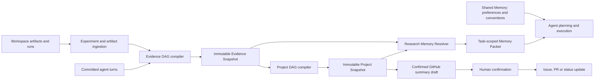
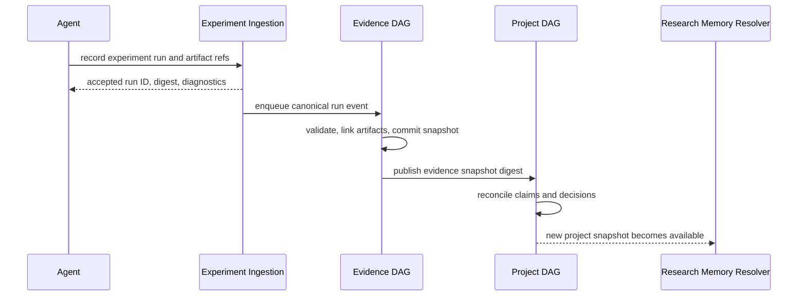

# SciForge Research Memory 与 DAG 融合架构设计

Last updated: 2026-07-10

## 文档状态

本文提出 SciForge Research Memory 的目标架构，用于替代“独立 Research Memory 事实库”方案，并作为后续设计评审、实现拆分和验收的基线。

本文只定义架构与行为，不代表当前代码已经实现。本文不修改 [`Evidence DAG 与 Project DAG 设计`](./evidence-project-dag-design.zh-CN.md) 中已经确认的证据、审计、自治与发布治理原则；发生冲突时，以该文档的项目级证据模型为准。

规范用语：

- “必须”表示实现不可缺少的行为。
- “应该”表示默认采用的行为，除非存在明确理由。
- “可以”表示可选扩展。

## 结论

Research Memory 不建立独立的科研事实数据库，也不拥有第二套 claim、evidence、review 或 project status。

目标架构由四个职责清晰的层组成：

1. **Evidence DAG** 拥有 session 内的来源、Artifact、ExperimentRun、Observation、Claim、Finding 和可追溯关系。
2. **Project DAG** 拥有跨 session 的项目级 Claim、Hypothesis、Decision、冲突、审核、失效与 supersession 状态。
3. **Research Memory Resolver** 从确定的 DAG snapshot 派生面向 agent 的上下文包，回答“下一步工作前应该记住什么”，但不成为事实源。
4. **Shared Memory** 只保存用户偏好、工作习惯和运行约定，不保存需要科研证据治理的结论。

Experiment Ledger 是 Evidence DAG 的结构化写入与查询视图，不是第五个存储系统。GitHub Research Memory 是经过确认的协作导出层，不是本地事实源。

一句话原则：

> DAG 决定什么成立、为什么成立以及何时失效；Research Memory 只决定在当前任务中应该带入哪些已经治理过的信息。

## 背景与问题

PR [#40](https://github.com/AGI4Sci/SciForge/pull/40) 提出了 project-scoped Research Memory extension，包含实验账本、SQLite 存储、证据门禁、反思、审核、上下文召回和 snapshot。该方案证明了以下产品需求真实存在：

- 记录训练、评测、调试和分析运行。
- 在下一轮实验前召回 baseline、失败路线和方法选择。
- 区分稳定结论、候选判断和待验证假设。
- 让 agent 引用证据，而不是只凭会话印象规划下一步。

但独立实现也会与现有系统形成平行事实链：

- Evidence DAG 已经表示 ExperimentRun、Artifact、SourceAnchor、Claim、Finding 和 provenance。
- Project DAG 已经负责跨 session 合并、冲突、Hypothesis、Decision、review、assessment 和 supersession。
- Shared Memory 已经提供 user/workspace/project 范围的持久化召回。
- 现有 Research Memory skill 与 GitHub 模板已经定义协作确认和 evidence level 边界。

如果继续维护独立的 `memory_item`、`evidenceRefs`、review event 和 snapshot，同一结论会拥有多套 ID、状态和失效逻辑。系统无法可靠回答哪一套是当前真相。

## 已确认的架构决策

1. Research Memory 是派生层，不是独立事实源。
2. ExperimentRun 的 canonical owner 是 Evidence DAG。
3. 项目级 Claim、Hypothesis、Decision、review 和 supersession 的 canonical owner 是 Project DAG。
4. Research Memory Packet 必须绑定一个确定的 Project Snapshot digest；不能从多个不一致时点拼接项目事实。
5. Research Memory 不使用自由格式字符串作为权威证据引用；权威引用必须指向 canonical DAG node、edge、artifact、anchor 或 snapshot ID。
6. Research Memory 不实现跨 project 自动 fallback。没有目标项目数据时返回空结果和诊断。
7. Research Memory 的召回结果可以缓存，但缓存必须由 snapshot digest 定址，不能拥有独立更新状态。
8. Shared Memory 不保存科研结论、实验判断或证据状态；这类内容必须进入 DAG。
9. GitHub 同步继续遵循草稿、确认、再发布的边界，不能由后台反思自动发布。
10. Research Memory 功能不依赖自动加载工作区 JavaScript 扩展。若采用 extension 形态，默认只能是随应用签名和注册的 builtin extension。
11. 自动 reflection 只能产生 proposal、Finding、Hypothesis 或待审核 Decision，不得绕过 DAG 编译和治理直接制造稳定知识。
12. 指标名启发式、关键词匹配和模型总结只能参与候选生成或排序，不能单独将结论提升为已支持状态。

## 目标与非目标

### 目标

- 在开始新任务、跨线程继续研究或规划下一轮实验前，向 agent 提供小而可靠的项目上下文。
- 优先呈现当前 baseline、已知失败路线、方法决策、适用约束、未解决冲突和待验证假设。
- 让每条进入计划的记忆都可以回溯到 Project Claim、session evidence 和原始 Artifact。
- 在证据变化、Artifact 失效、review 决策或 Project Snapshot 更新后自动失效旧上下文。
- 复用 DAG 的 assessment、scope、权限、审计和 supersession 机制。
- 保持主 agent 非阻塞；DAG 更新滞后时明确返回 snapshot freshness，而不是伪装成最新状态。
- 为未来的实验工作流、GitHub 协作摘要和 UI 关键节点视图提供稳定读取合同。

### 非目标

- 不建立另一套 project knowledge base。
- 不复制 Evidence DAG 或 Project DAG 的节点和边作为 Research Memory 主存储。
- 不使用一个 `confidence` 数字代替 provenance、evidence status 和 assessment ledger。
- 不把所有历史记录都塞进模型上下文。
- 不自动把表现最好的一次 run 定义为稳定 baseline。
- 不自动把表现最差的一次 run 定义为可泛化的 negative result。
- 不通过 Research Memory 绕过 Runtime 工具权限、文件权限、发布门禁或人工确认策略。
- 不在第一阶段建设独立 Research Memory UI。
- 不把 GitHub issue、PR 或状态页当成本地事实源。

## 总体架构



Research Memory Resolver 主要读取 Project Snapshot。只有当需要展示具体 run、Artifact、anchor 或 provenance path 时，才沿 Project Claim 的 origin 读取对应 Evidence Snapshot。

Resolver 不能直接扫描整个工作区并自行判断项目真相。工作区文件必须先通过 artifact ingestion 进入 Evidence DAG，或者作为明确标注的“未摄取输入”返回，不能伪装成已治理证据。

## 职责与数据所有权

| 能力或对象 | Canonical owner | Research Memory 行为 |
| --- | --- | --- |
| 原始文件、数据、日志、checkpoint | Workspace / Artifact store | 只返回引用和访问状态 |
| `ExperimentRun`、`AnalysisRun` | Evidence DAG | 生成实验账本视图 |
| 参数、seed、环境、软件版本 | Evidence DAG provenance | 为复现和比较提供摘要 |
| session Claim、Finding、Observation | Evidence DAG | 通过 origin path 回溯 |
| 项目级 Claim | Project DAG | 选择与当前任务相关的 claim |
| Hypothesis | Project DAG | 单独分组，永不伪装成已确认结论 |
| baseline 或 method choice | Project DAG `Decision` | 输出当前有效决策及适用范围 |
| negative result | Project DAG Claim/Finding + evidence | 输出失败条件、scope 与反例 |
| 冲突和 supersession | Project DAG | 过滤失效项并返回重要警告 |
| assessment 和 review | Project DAG assessment ledger / DecisionEvent | 展示状态，不另存 review |
| 用户偏好、语言、工具习惯 | Shared Memory | 与科研上下文并列注入 |
| 面向任务的上下文包 | Research Memory Resolver | 临时派生，可按 digest 缓存 |
| GitHub 协作摘要 | Skill + templates + human confirmation | 从 snapshot 派生草稿 |

### Experiment Ledger

Experiment Ledger 是 `ExperimentRun`、输入、输出和 provenance 的产品视图与写入 API。它可以提供方便的 `record_experiment` 接口，但写入结果必须进入 Evidence DAG 的统一 ingestion 和 snapshot 链路。

Experiment Ledger 不得拥有独立的：

- claim 状态；
- evidence level；
- review 状态；
- project-level baseline；
- supersession 关系。

一个 run 被记录后，至少应产生或关联：

- 稳定的 `ExperimentRun` ID；
- project、workspace 和 session scope；
- command 或 protocol；
- code/software version；
- dataset version；
- parameters、seed 和 environment；
- metrics 与单位或 metric definition；
- log、output Artifact 和 manifest；
- 创建时间、执行主体和 provenance edges；
- ingestion digest 与完整性诊断。

相同 run ID 和相同内容 digest 的重复写入必须幂等。相同 run ID 但内容不同必须产生新版本或冲突诊断，不能静默覆盖旧记录。

### Research Memory Resolver

Resolver 是只读应用服务。其输入至少包括：

```ts
type ResolveResearchContextInput = {
  workspaceId: string
  projectId: string
  query: string
  taskType?: 'experiment_plan' | 'analysis' | 'debug' | 'writing' | 'review'
  goalIds?: string[]
  includeHypotheses?: boolean
  budget?: {
    maxChars?: number
    maxItems?: number
  }
  snapshotDigest?: string
}
```

如果调用方没有指定 `snapshotDigest`，Resolver 使用当前已提交的最新 Project Snapshot，并在输出中返回实际 digest 与新鲜度。它不能读取处理中间状态。

Resolver 输出一个临时 `ResearchMemoryPacket`：

```ts
type ResearchMemoryPacket = {
  workspaceId: string
  projectId: string
  projectSnapshotDigest: string
  generatedAt: string
  freshness: 'current' | 'lagging' | 'stale' | 'unavailable'
  baselines: MemoryEntry[]
  methodDecisions: MemoryEntry[]
  negativeResults: MemoryEntry[]
  relevantFindings: MemoryEntry[]
  hypotheses: MemoryEntry[]
  openQuestions: MemoryEntry[]
  conflicts: MemoryEntry[]
  constraints: MemoryEntry[]
  warnings: string[]
}
```

每个 `MemoryEntry` 必须保留 canonical 身份和证据路径：

```ts
type MemoryEntry = {
  nodeId: string
  nodeType: 'claim' | 'finding' | 'hypothesis' | 'decision' | 'experiment_run'
  statement: string
  role: 'baseline' | 'method_decision' | 'negative_result' | 'finding' |
    'hypothesis' | 'open_question' | 'conflict' | 'constraint'
  status: string
  applicability?: Record<string, unknown>
  assessmentSummary: {
    evidenceStatus: string
    provenanceStatus: string
    reviewStatus: string
  }
  evidencePaths: Array<{
    evidenceSnapshotDigest: string
    nodeIds: string[]
    artifactIds?: string[]
    anchorIds?: string[]
  }>
  supersedes?: string[]
  supersededBy?: string[]
  stale: boolean
}
```

这里的 `status` 和 assessment summary 来自 Project DAG，不由 Resolver 重新计算或落库。

## 召回与裁剪流程

Resolver 必须按以下顺序工作：

1. **严格 scope**：按 workspace、project 和访问策略选择唯一 Project Snapshot。
2. **目标绑定**：优先选择与当前 Goal、Question、Hypothesis 或 task type 相连的节点。
3. **状态过滤**：默认排除 rejected、invalidated 和 superseded 节点；conflicted 节点进入 warnings 或 conflicts，不能静默作为约束使用。
4. **候选检索**：结合结构化图邻接、全文检索和语义检索产生候选。
5. **证据展开**：为候选恢复最短或最有代表性的 provenance path。
6. **策略排序**：综合 task relevance、Goal relevance、evidence status、applicability、recency 和 blast radius 排序。
7. **类别保留**：为 negative results、conflicts、hypotheses 和 method decisions 预留预算，避免普通 finding 占满上下文。
8. **权限裁剪**：移除调用方无权查看的 Artifact 内容，同时保留“存在受限证据”的诊断。
9. **预算裁剪**：按完整 entry 裁剪，不能截断到失去 status、scope 或 evidence identity。
10. **输出绑定**：返回实际使用的 Project Snapshot digest 和 Evidence Snapshot digests。

只依赖关键词包含匹配可以作为 fallback，但不能成为唯一检索策略。模型 rerank 可以提高相关性，但不得改变 canonical status。

### 默认召回策略

| Task type | 默认优先内容 |
| --- | --- |
| `experiment_plan` | 当前 baseline、method decision、negative result、可检验 hypothesis、固定条件 |
| `analysis` | 相关 Finding、数据版本、分析假设、冲突、metric definition |
| `debug` | 失败 run、已知 root cause、环境差异、修复 Decision、未解决异常 |
| `writing` | 可引用 Claim、证据路径、适用范围、冲突、发布门禁 |
| `review` | load-bearing Claim、assessment、冲突、override、证据缺口 |

## 写入流程

### 记录实验



主 agent 不等待 Evidence DAG 或 Project DAG 编译。若下一步计划发生在新 snapshot 提交之前，Resolver 必须返回 `lagging` 并指出尚未纳入的 run ID。

### 提出 insight 或 hypothesis

Agent 可以提出候选 insight，但写入形式必须是 DAG ingestion event：

- 有证据支持的陈述进入 session Claim/Finding 候选；
- 尚待验证的解释进入 Hypothesis；
- 方法选择进入 Decision proposal；
- 用户明确作出的选择进入带 actor 的 DecisionEvent；
- 任何 proposal 都不能直接创建“active memory”。

Evidence 和 Project compiler 根据 provenance、assessment 与项目策略计算最终状态。

### 反思实验或线程

`reflect_experiments` 和 `reflect_thread` 可以保留为 agent 工作流，但它们只产生结构化 proposal：

- 候选 Claim；
- 候选 negative result；
- Hypothesis；
- Decision proposal；
- evidence gap；
- follow-up experiment suggestion。

反思器必须引用实际输入 snapshot 和 run IDs。重复反思同一输入 digest 时应幂等，或明确记录新 reflection 版本，不能无限复制语义相同的结论。

### 审核与修正

Research Memory 不提供独立 `review_item` 状态机。审核动作统一写成 Project DAG `DecisionEvent` 或 assessment：

- `endorse`
- `challenge`
- `reject`
- `invalidate`
- `supersede`
- `request_evidence`
- `mark_hypothesis`
- `override`

AI 和人的 decision 都必须记录 actor、rationale、目标 snapshot、证据路径和自治模式。人的决定可以 supersede AI 决定，但不能删除历史。

## Baseline、负结果与假设的语义

### Baseline

Baseline 是 Project DAG `Decision`，不是“当前指标最好的 run”的同义词。

成为 baseline 至少需要：

- 明确目标指标与方向；
- 可比较的数据集、split、seed policy 和环境；
- 适用 Goal 或 Hypothesis；
- 参与比较的 run 集合；
- 选择理由和 Decision actor；
- 对应 Project Snapshot digest。

自动比较可以产生 baseline proposal，但不能仅根据指标名猜测 higher/lower is better 后直接生效。

### Negative result

Negative result 必须描述失败条件和适用范围。例如“配置 X 在数据版本 D、seed policy S 和指标 M 下未改善目标”，不能压缩成“不要再用 X”。

它必须保留：

- 被测试的 Hypothesis 或方法；
- run 和 Artifact 证据；
- 失败定义；
- 已排除和未排除的替代解释；
- 是否被复现；
- 可否推广到其他数据、环境或目标。

### Hypothesis

Hypothesis 始终单独展示。除非后续 Decision 明确变更其类型，否则不能因为 confidence 上升而静默变成 Claim。

将 Hypothesis 带入下一轮计划时，agent 必须用“待验证”“建议测试”等语言，并同时给出可检验条件。

## 与 Shared Memory 的边界

Shared Memory 保存不要求科研 provenance 的稳定偏好和运行约定，例如：

- 用户偏好中文输出；
- 默认先运行小规模 sanity check；
- 常用计算集群或代码风格；
- 用户明确要求长期保留的交互习惯。

以下内容不得只写入 Shared Memory：

- 某个模型优于另一个模型；
- 某条实验路线失败；
- 某个数据集存在偏差；
- 当前项目 baseline；
- 论文 claim、指标解释或可发布结论；
- 需要 Artifact、run 或 review 支持的任何判断。

如果用户说“记住实验 X 失败了”，agent 应将其路由到 DAG claim/hypothesis/decision 流程，而不是创建无证据的 Shared Memory 文本。可以在 Shared Memory 中保留一个非事实性的交互偏好，例如“规划实验时主动检查历史失败路线”，但不能复制具体科学结论。

## 与 GitHub Research Memory 的边界

GitHub 是协作摘要和 review 表面，不是 canonical storage。现有 [`research-memory` skill](../.codex/skills/research-memory/SKILL.md) 与 [`docs/templates/research-memory`](./templates/research-memory/) 继续承担草稿、确认和同步规范。

GitHub 输出必须：

- 绑定 Project Snapshot digest；
- 包含 Artifact ID 或 canonical DAG node ID；
- 明确 evidence level、claim scope 和未解决风险；
- 在发布前经过用户确认；
- 避免暴露本地路径、敏感数据和完整内部日志。

GitHub 上的后续 review 应作为外部输入重新摄取为 SourceAssertion、ReviewItem 或 Decision proposal，不能直接改写本地 DAG。

## 安全与权限边界

### Extension 加载

本架构不要求扫描并自动执行工作区中的 `extensions/*/dist/index.js`。

如果 Research Memory Resolver 采用 extension 实现，必须满足：

- 随应用打包、签名并由 builtin registry 注册；
- 不依赖用户项目复制扩展代码；
- builtin extension 可以由 feature flag 启用，但不能与同名 workspace extension 混淆；
- workspace extension 默认禁用；
- 首次加载 workspace extension 前必须完成 workspace trust 和明确授权；
- 授权应绑定 extension ID、代码 digest、权限和 workspace；
- 代码 digest 变化后必须重新授权；
- manifest 声明的工具集合必须与实际暴露工具精确匹配；
- activation 条件必须被执行，而不只是解析。

### Tool 权限

建议的权限分类：

| 行为 | Tool kind | 默认策略 |
| --- | --- | --- |
| resolve context | read-only | auto |
| 查询 run/provenance | read-only | auto |
| record experiment event | persistent mutation | 按 runtime policy |
| propose claim/hypothesis | persistent mutation | 按 autonomy mode |
| review/override Decision | governance mutation | on-request 或项目策略 |
| 导出 snapshot 文件 | file change | 遵循文件写入审批 |
| GitHub 发布 | external side effect | 必须用户确认 |

`auto` 不能使工具绕过 workspace file policy、敏感数据策略或项目权限。

### 项目隔离

- 每次读取和写入必须带 canonical workspace ID 与 project ID。
- project ID 不能由自由文本静默推断后跨项目 fallback。
- 未找到目标项目时返回空结果，不搜索“唯一可用的其他项目”。
- cache key 必须包含 project ID、snapshot digest、访问主体和权限策略版本。
- 受限 Artifact 的存在可以被诊断，但其内容不能因上下文聚合而扩大可见范围。

## 新鲜度、失效与缓存

Research Memory Packet 是 snapshot-derived view。以下任一变化都可能使旧 packet 失效：

- 新 Evidence Snapshot 提交；
- Project DAG 重新编译；
- Artifact 内容 digest、位置或访问策略变化；
- Claim 被 challenge、invalidate 或 supersede；
- Hypothesis 状态变化；
- Goal、scope 或 baseline Decision 变化；
- assessment 或 audit Finding 更新。

Resolver cache 应使用以下逻辑 key：

```text
projectId
+ projectSnapshotDigest
+ query/taskType/goalIds
+ includeHypotheses
+ budget
+ principal/accessPolicyDigest
+ resolverVersion
```

旧 cache 不需要原地修改；snapshot digest 变化后自然不可命中。返回 packet 时必须包含 freshness 和生成时间。

## 失败模式与降级

| 场景 | 必须行为 |
| --- | --- |
| 没有 Project Snapshot | 返回 `unavailable`，不从其他项目借用记忆 |
| Project DAG 落后于新 run | 返回 `lagging` 和 pending run IDs |
| Evidence path 断裂 | 降低 provenance status，加入 warning |
| Artifact 缺失或内容变化 | 标记 stale，不能继续作为稳定依据 |
| Claim conflicted | 放入 conflicts，不作为无条件 planning constraint |
| Resolver rerank 失败 | 降级到结构化图检索和确定性排序 |
| budget 太小 | 优先保留 status、scope、negative result 和 evidence identity |
| 无权读取证据 | 隐藏内容，保留受限证据诊断 |
| GitHub 不可用 | 保留本地草稿，不影响 DAG 和 agent 主流程 |

## #40 能力映射

| #40 能力 | 目标架构处理方式 |
| --- | --- |
| `research_memory_record_experiment` | 保留交互语义，改为 Evidence DAG ExperimentRun ingestion |
| `research_memory_propose_insight` | 改为 Claim/Hypothesis/Decision proposal event |
| `research_memory_reflect_experiments` | 保留为 proposal generator，不直接写 active memory |
| `research_memory_reflect_thread` | 复用 Evidence DAG turn compiler，必要时生成补充 proposal |
| `research_memory_resolve_context` | 保留并重写为 snapshot-bound Resolver |
| `research_memory_review_item` | 合并到 Project DAG DecisionEvent/assessment |
| `research_memory_snapshot` | 改为 Project/Evidence Snapshot 的派生导出 |
| `experiment_run` SQLite 表 | 映射为 Evidence DAG ExperimentRun 与索引 |
| `memory_item` SQLite 表 | 删除，不建立平行 claim store |
| `memory_review_event` | 映射为 Project DAG DecisionEvent |
| `reflection_run` | 可保留为 AnalysisRun/provenance event |
| 自由格式 `evidenceRefs` | 替换为 canonical typed IDs 和 provenance path |
| active/candidate/hypothesis gate | 由 DAG node type、assessment 和项目策略表达 |
| 关键词 context ranking | 仅作为 fallback/ranking signal |
| 独立 Research Memory skill | 与现有同名 skill 合并为唯一协议 |

## 明确拒绝的方案

以下方案不进入目标架构：

1. 在 `.sciforge/research-memory/research-memory.sqlite` 中维护独立 claim 真相。
2. 同时保留 DAG review 和 Research Memory review 两套状态机。
3. 使用 `artifact:path`、`metric:run:key` 等未解析字符串作为权威证据关系。
4. 目标 project 无数据时自动读取其他 project。
5. 仅根据指标名猜测方向并自动确定 baseline。
6. 仅根据最差指标自动生成可泛化 negative result。
7. 每次 thread reflection 都新增语义重复的 memory item。
8. 两个同 ID、行为相反的 `research-memory` skill 同时生效。
9. 为启用 Research Memory 自动执行未受信任工作区中的 JavaScript。
10. 将 snapshot 文件写入伪装成无副作用的 auto tool。

## 分阶段实施建议

### Phase 1：只读 Resolver

- 基于当前 Project DAG snapshot 实现只读上下文解析。
- 首先覆盖 baseline Decision、negative result、Hypothesis、conflict 和 provenance path。
- 输出 snapshot digest、freshness 和 warnings。
- 不新增独立数据库，不新增写入工具。

验收重点：同一 snapshot 上结果确定、project scope 严格、失效节点不被召回、每个 planning constraint 可回溯。

### Phase 2：Experiment ingestion

- 为 agent 提供结构化 ExperimentRun 录入入口。
- 写入 Evidence DAG 统一 ingestion queue。
- 补齐参数、seed、环境、dataset version、metric definition 和 Artifact provenance。
- 实现幂等、版本冲突和 pending snapshot 诊断。

验收重点：重复写入不复制 run，Artifact 变化可检测，主 agent 不等待 DAG 编译。

### Phase 3：Reflection proposal

- 基于确定 snapshot 生成 Claim、Hypothesis、Decision 和 evidence-gap proposal。
- 复用 Project DAG reconcile、assessment 和 review。
- 增加语义去重和反思 provenance。

验收重点：反思器不能直接制造稳定知识，重复反思可解释且不污染 Project DAG。

### Phase 4：Agent planning integration

- 在 experiment plan、debug、analysis、writing 和 review 任务前按策略调用 Resolver。
- 在输出中引用 node ID、snapshot digest 和 evidence path。
- 监控召回命中、过期 packet、token budget 和计划引用质量。

验收重点：agent 能主动避开已知失败路线，同时不会把 Hypothesis 当成已确认事实。

### Phase 5：协作导出与可选 UI

- 从 Project Snapshot 生成 GitHub issue、PR、status update 草稿。
- 保持用户确认和敏感信息检查。
- 只有真实使用证明需要时，再增加关键节点、baseline 或实验账本 UI。

## 验收标准

### 数据一致性

- 一个项目级 claim 只有 Project DAG 一个 canonical 状态来源。
- 一个 ExperimentRun 只有 Evidence DAG 一个 canonical identity。
- Research Memory Packet 不持久化独立状态，或只以 snapshot digest 定址缓存。
- Claim invalidation 或 supersession 后，旧 packet 不再命中当前 snapshot。

### 可追溯性

- 每个 baseline、negative result 和 planning constraint 都能回溯到 Project node 和至少一条 Evidence path。
- Artifact 缺失、变化或无权访问时有明确诊断。
- GitHub 摘要可以记录其来源 Project Snapshot digest。

### 安全性

- 打开未受信任 workspace 不会自动执行其中的 extension 代码。
- 跨 project 查询不会 fallback 或泄漏。
- 文件导出、治理决定和外部发布遵守各自权限策略。

### Agent 行为

- planning 默认考虑历史 negative results 和当前 method Decision。
- Hypothesis 与 conflicted Claim 使用明确的不确定语言。
- Resolver 不可用或落后时，agent 明确说明上下文状态。
- 自动反思不绕过 DAG assessment 和 DecisionEvent。

### 性能与可靠性

- Resolver 读取 immutable snapshot，不与编译中间状态竞争。
- cache 由 snapshot digest 自然失效。
- DAG 更新、普通审计和 Research Memory 生成不阻塞主 agent turn。
- 在预算不足时仍保留最关键的状态、scope 和证据身份。

## 待后续实现阶段确认的问题

以下问题不影响本文的职责划分，但需要在具体实现前确认：

1. Resolver 放在 Kun core service，还是作为签名 builtin extension 交付。
2. ExperimentRun ingestion 复用现有 Evidence DAG worker 接口，还是增加 runtime-neutral adapter。
3. Project Snapshot freshness 的产品阈值和 UI 表达。
4. 语义检索索引由 Project DAG 维护，还是由 digest-bound read model 维护。
5. Memory Packet 的默认 token/字符预算和各类别保留比例。
6. GitHub review 回流到 DAG 时的 actor identity 与权限映射。

这些选择必须保持本文确定的核心约束：不增加平行事实库、不跨项目 fallback、不绕过 DAG 治理、不自动执行未受信任扩展。
