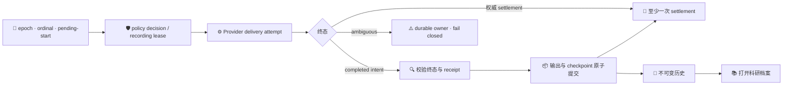

# SciForge 产物版本与研究 Checkpoint

_面向使用者、维护者和 PR 审核者的架构与验证说明，更新于 2026-08-15。_

---

本文介绍 Artifact Versions、Research Checkpoints 和科研档案的最终边界。它同时是使用说明、架构约束和合并前审核清单。

## 📋 解决了什么问题

SciForge 能把新对话中的研究叙述和受信任产物保存为不可变版本，并通过“科研档案”查看精确历史、比较和恢复。系统不会给所有文件变化贴上“可信”标签：只有 Host 能证明 producer 因果关系和精确字节时才建立产物 lineage；证据不足时继续诚实标记为 `untracked` 或 `incomplete`。

用户侧的主要变化：

- 自动策略独立于 recording，默认 `{ enabled: true, policyRevision: 0 }`；Dossier Start/Stop 使用 expected revision，普通聊天不显示控制。
- waiting Stop 在尚无 recording 时返回 `recording: null`；disabled attempt 持久为 replay-stable `skipped`，Start re-enable 后下一 completed turn 才创建 checkpoint v1。
- 主聊天只显示一个中性、系统风格的“打开科研档案”入口，不展示大型版本卡、产物预览、内部 ID、未追踪警告或 composer 状态条。
- 科研档案优先显示研究结论、修改原因、来源、产物、版本位置和需要研究员处理的限制；UUID、SHA-256、receipt、原始状态码等放在折叠的“技术详情”中。
- 同一逻辑产物保持稳定 Artifact ID，每次可信更新产生新的不可变 Version；旧版不会被覆盖。

## 🔍 Owner 与调用边界

### Artifact Versions

Artifact Versions 是唯一版本底座，负责：

- 稳定 Artifact ID、不可变 Version ID、父版本和 current 指针；
- 内容寻址 CAS、精确 digest/byte length 校验；
- 多候选原子提交、乐观并发和幂等重放；
- 精确读取、范围读取、物化、比较、restore-as-new；
- Bundle 校验、导入/导出和访问策略；
- 生命周期事件与容量统计。

它不判断科学结论是否正确，也不自证可复现性或 Evidence L4。

### Research Checkpoints

Research Checkpoints 只拥有自动记录策略、turn boundary lease、对话记录绑定和 producer journal。Host 的 Turn Artifact Outbox V4 是 delivery attempt 的 durable owner，Research Checkpoints 只按它的完整 owner snapshot reconciliation。每个成功完成且处于 enabled policy 下的新 turn 转成一个 `ResearchCheckpointManifestV1`，符合可信边界的输出作为独立 Artifact Versions 一起原子提交。Artifact 字节、版本 current、比较、恢复和 Bundle 仍由 Artifact Versions 拥有。

Checkpoint 和它的多个可信输出处在同一事务中：要么全部成为可见版本，要么没有任何 current 被推进。响应丢失时使用同一幂等身份恢复，不生成重复版本。

### 科研档案

科研档案是只读组合视图，不拥有数据库或 current 指针。它只按精确 Artifact Version ref 和 digest 请求 owner 数据，不会退回 `latest`。owner 缺失时可以降级次要区块；scope、ref、digest、media 或访问策略不一致时必须 fail closed。

### Package-scoped capability invoker

Host 根据生成式 package composition 的权威 package identity，为每个 domain runtime 创建独立 scoped invoker。domain 不自报 caller，也不共享一个全局 `domain-runtime` 身份。

需要 caller-selected Artifact/Version identity 的调用通过 Domain SDK 定义的通用 capability grant 授权。Artifact Versions 以 provider contribution 注册 grant；consumer lifecycle 只能在 manifest 中请求。Host 在任何 runtime 激活前对权威 installed composition 交叉验证，再由 scoped invoker 携带签发结果，Artifact Versions 按 grant 检查而不识别 Research Checkpoints 的具体 domain ID。application core 也不为某个 domain/action 建立专用分支。这样既保留最小权限，也允许新 domain 通过统一 manifest/composition 路径接入。

## 🔄 数据流



## 🧭 Before-turn lease 生命周期

required boundary 由 Host delivery owner 与 Research Checkpoints lease 共同组成：

- Host 持久化 installation `issuerEpoch`，为每次 provider delivery attempt 分配该 epoch 内单调 ordinal 和随机 `deliveryAttemptId`；`boundaryLeaseId` 绑定该 attempt，不由 `clientDirectiveId` 哈希派生；
- delivery 前先把 workspace-bound pending-start owner 持久化到 Turn Artifact Outbox V4，再建立 boundary decision；任一步失败都不 delivery provider；
- Research Checkpoints 在一个原子 store mutation 中复查 policy、确定/创建 `recordingId`，并把 `open` lease、recording 与 exact binding snapshot 一起持久化；
- Outbox V4 持久拥有 pending-start、provider-accepted watch、completed intent 与 terminal settlement；settlement 至少一次重试到 consumer receipt 落盘；
- completed intent/settlement 使 lease 成为 `consumed`；权威 failed/cancelled/rejected settlement 使其成为 `released`；
- provider delivery 或终态 ambiguous 时保留 durable owner 与 `open` lease，fail closed 等待 reconciliation，绝不误判 rejected；
- pending-start 不扫描文本、latest turn 或 history 自动绑定；只有 provider accepted handle 自动绑定。ambiguous start 只能经 generic governed list/resolve/release，验证 runtime/thread/workspace scope，resolve 还要验证 exact turn/user-message item；
- 启动时只使用 Host 完整 snapshot：验证 epoch、next ordinal、exact retired ranges 与 owners。已签发 ordinal 必须仍有 owner/receipt 或在 exact range；gap、冲突或 retired-open lease 都 fail closed；
- lifecycle 与 artifact delivery 双 ACK 且无 live owner 后，有界 receipts 才进入同 epoch 的 exact retired ranges；不使用 Bloom 或时间 cutoff；
- scope、owner phase 或重复 settlement 冲突时 fail closed，幂等重放不能改变既有 disposition。

Outbox retry 按 runtime/thread 隔离；一个 pending gap 只阻塞其所属 thread，不影响其他 thread 的 settlement 或 artifact fan-out。

连续 turn 不必等待前一 Artifact commit：如果前一输出已在本地通过稳定 operation identity 和 exact bytes/ref 验证，下一 lease 会把它冻结为 pending deterministic predecessor overlay；未精确验证时不进入 overlay，也不回退陈旧 current 冒充连续 lineage。

## ⏯️ 自动记录策略

自动记录策略与当前 recording 生命周期分开：

- 尚无 recording 时 canonical status 为 `waiting + enabled` 并带 `policyRevision: 0`；
- Start/Stop 必须携带 status 的 `expectedPolicyRevision`，stale 请求在 mutation 前拒绝，成功 receipt 返回新 revision；
- `stop` 持久写入 `disabled`；若有 active recording 则关闭，没有 recording 时 receipt 返回 `recording: null`；
- disabled attempt 仍按 Host exact attempt identity 持久为 `skipped`，不绑定 recording/snapshot；同 attempt response-loss replay 即使策略后来 enabled 仍保持 skipped；
- disabled 期间的 turn 不生成 checkpoint，永久保持 unrecorded；
- `start` 持久恢复 `enabled`，但不立即生成 checkpoint Version；下一 accepted/completed turn 才创建 v1；
- disabled 期间的历史不会被追溯补录，既有 recording 和版本链不会删除。

Research Dossier 在 control 成功或 owner 明确报错后都会重新读取 canonical
status，而不是仅凭按钮或 receipt 本地推进策略。

普通聊天和 composer 不放置记录控制。Research Dossier 的记录状态区始终按
canonical policy 提供明确的“停止自动记录”或“开启自动记录”入口，并在操作
完成后重新读取 owner status；尚无 recording 时也可以在首条科研记录生成前
持久 opt-out，之后再显式开启。

这保证功能默认开箱即用，同时让用户在首轮前后都拥有明确、跨重启有效的 opt-out。

## 🔐 可信归因边界

自动可信文件归因只覆盖 Codex Host 收到的成功 executor receipt，且必须同时满足：

- tool 为 `apply_patch/fileChange`，call ID、executor sequence、runtime/thread/turn 身份完整；
- `add` 包含有界完整内容；`update` 包含按序 raw unified hunks；
- 更新从 before-turn 冻结的精确父版本严格重放；
- 重放结果与终态独立捕获的 digest 和 byte length 完全一致；
- 路径位于 workspace 内，非敏感、非 symlink，且事件顺序无歧义。

任何不匹配都会隔离或记为限制，不会为了消除警告而升级为可信。外部 Terminal、IDE、后台进程、普通 PTY、`exec_command`、未托管脚本、文件 watcher、递归扫描、Git diff、mtime/time window、stdout、退出码或事后 hash 继续是 `untracked/incomplete`。

## 🔄 版本、比较和恢复语义

- 保存新版本不会修改旧版本。
- 多方竞争使用 expected-current CAS；stale base 会拒绝，而不是自动合并。
- `restore-as-new` 从旧版创建一个新的 current Version，保留完整历史；它不是 Git/workspace 全量回滚。
- 下一 turn 以恢复出的新版本为父，不会继续错误的旧分支。
- Bundle V1 保持原有 wire 兼容并要求显式非空 Artifact/Version 选择；目录 Bundle 使用独立 V2 action，不能用空选择器表达“导出全部”。

## 🔐 隐私与导出

新 checkpoint 和 research output 默认：

```text
visibility = workspace
allowExport = false
```

持久化前执行两层净化：结构化规则移除 private key、Bearer/Basic/JWT、provider key、凭据赋值和敏感 URL 参数；Host sanitizer 再用当前 opaque settings secret 做跨字段净化。URL 会移除 userinfo 和 fragment，并遮蔽 AWS、Google、SAS 及常见 token/signature 参数。journal 中的标题、修改原因、manifest、Git ref、attempt/terminal/restore 错误也经过同一 Host 净化。

这是凭据和已知 opaque secret 的 redaction，不是任意正文的完整 DLP。旧不可变版本不会被静默重写；历史未净化记录必须作为 legacy 风险处理，并在显式迁移或发布流程中创建新版本。

## 💾 容量与持久化策略

默认硬预算：

- Artifact index：64 MiB；
- Artifact CAS：每 workspace 4 GiB；
- active staging：512 MiB；
- 80% 时提供 usage warning；
- Research Checkpoints store：64 MiB，并在写前 fail closed。

所有容量门都在发布新 index/current 前检查；超限时旧状态保持不变。系统不会为腾空间自动删除已提交的不可变研究历史，只会清理不再引用的 staging/orphan。Checkpoint journal 在 commit 后只保存最小 summary/ref，精确 manifest 从 Artifact Versions owner 读取。enabled lease 与 `recordingId`/exact snapshot 原子绑定，disabled attempt 保存无绑定的 `skipped` decision；有 Outbox owner 或 ambiguous delivery 的 `open` lease 不静默清理。终态 receipts 仅在双 ACK 后压缩为 exact retired ordinal ranges。

## 🔗 包版本与安装边界

- `@sciforge/domain-sdk` 使用 `0.2.0` 承载 package-scoped invoker/grant 等新公共契约。
- `@sciforge/domain-artifact-versions` 使用 `1.1.0` 承载保留 V1 的增量 V2 公共契约，避免既有 `1.0.0` domain package 身份倒退。
- Research Checkpoints 与其他消费者分别依赖匹配的 Artifact Versions `^1.1.0` 和 Domain SDK `^0.2.0`，package metadata、npm lock 和生成式 composition 必须一致。
- 合并前必须对这些包执行 `npm pack`，在空临时项目中安装 tarball 并验证公共 export 与最小 production composition；workspace symlink 通过不能替代发布边界验证。
- 测试不得相对导入其他 domain 的私有 `src`，也不得注入一个生产 composition 不会拥有的特权 caller。

## ⚠️ 非目标和限制

- 不是通用文件版本控制，不捕获或信任所有 workspace 修改。
- 不提供自动内容合并或多人冲突合并。
- 保存版本不等于可复现，不等于 Evidence L4，也不等于科学正确。
- 旧对话不会自动回填；显式导入后永久为 `legacy/incomplete`。
- restore 只创建新版本，不恢复整个 workspace 或 Git 状态。
- CAS 是本机 userData 中的内容寻址存储，依赖文件权限但不提供静态内容加密。
- Scientific Compute controlled-script 不属于本变更；如果需要，应通过独立 OpenSpec change 和 PR 设计、实现与验证。

## ✅ 合并前验证矩阵

以下门禁已在最终 staged-equivalent source 上重新执行。历史包级或 Electron 结果未被用来替代最终验证。

| 范围 | 必须验证 |
| --- | --- |
| 安装 | 空 `node_modules` 下 `npm ci --ignore-scripts` 与 `npm run postinstall`；记录 audit 结果与处置 |
| 包发布 | Domain SDK、Artifact Versions、Research Checkpoints 执行 `npm pack`，在空项目中独立安装并跑公共 export/minimal composition smoke |
| 生产装配 | 真实 package-scoped invoker + authenticated `apply_patch/fileChange`，输出与 checkpoint 原子提交；无 privileged test injection |
| 生命周期 | issuer epoch/ordinal、pending-start/accepted watch/intent/settlement、至少一次 retry、双 ACK exact retirement、ambiguous 保持 open、ordinal gap fail closed、无 Bloom/time cutoff、thread 隔离 |
| 连续 turn | pending deterministic predecessor overlay 使用稳定 operation 与 exact bytes/ref；不等待 commit、不回退 stale current |
| 用户控制 | policy revision CAS、Dossier waiting Stop nullable recording、disabled attempt skipped/replay、Start 后下一 completed turn 创建 v1；普通聊天无控制 |
| 合约 | Artifact Versions V1/V2、Research Checkpoints、科研档案、Domain SDK package tests/typechecks |
| 仓库 | root `npm test`、`typecheck`、`build` 与 changed-file lint |
| 架构 | `domain-packages:check`、`capability:check`；无 core domain/action hard-code、无跨 domain 私有源码导入 |
| 桌面 | 真实 Electron source 与 packaged path，覆盖文件输出 checkpoint、精确 Dossier、失败终态和重启 |
| 卫生与合并 | diff、secret、绝对路径、运行态、大文件扫描及 GitHub server-side mergeability |

最终结果：根 Vitest 364 files/3227 tests、特性聚焦回归 501/501、完整 typecheck、build、source Electron、packaged Electron、tarball 独立安装、license、changed-file lint、composition/capability/version governance 与卫生检查均通过。`npm audit` 分开记录为全部依赖 14 项（4 moderate、10 high）、生产依赖 13 项（4 moderate、9 high）；OpenClaw 当前无修复版本，部分建议需要不兼容变更，因此未执行 `npm audit fix --force`。根 `npm run lint` 还存在未修改的独立 Next 文档站与根 ESLint 10 的规则 API 基线冲突，本 PR 的全部变更代码已单独 lint 通过。远端 mergeability/checks 在 PR #63 上单独记录。

测试 fixture 和脚本可以提交；`.codex-runtime`、`.sciforge-e2e`、`.sciforge`、SQLite、rollout、userData、截图和包含本机绝对路径的运行状态不得进入 PR。

## 🔍 审核顺序

1. package-scoped caller identity 与通用 capability grant；
2. Host issuer/ordinal/random attempt、accepted-handle/governed pending recovery、Outbox V4 双 ACK exact retirement 与 per-thread retry；
3. Artifact Versions 原子性、容量、V1 兼容与 V2 能力；
4. Research Checkpoints 原子 recording/lease snapshot、pending predecessor、Dossier waiting/active/stopped Start/Stop、journal 恢复和 exact owner read；
5. 科研档案与紧凑聊天 UI；
6. 包版本、packed install、真实 production composition 和最终回归证据。
