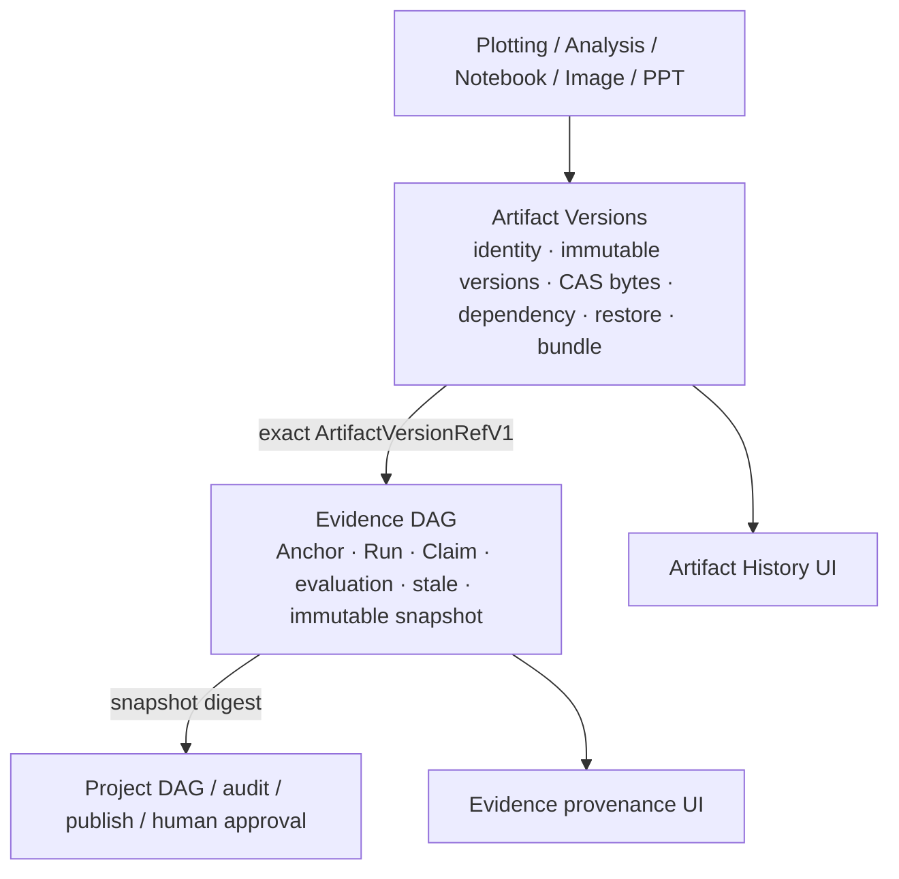

# Claude Science 版本化设计与 SciForge 落地矩阵

更新日期：2026-08-08

## 证据口径

本报告严格区分四类证据：

- **产品宣传**：公开产品页面中的能力声称。本次实现没有把宣传材料当作验收依据。
- **官方文档**：公开、可引用的产品或 API 文档。本次输入材料没有提供可独立核验的官方接口契约，因此相关项标为“未核验”。
- **静态实现证据**：SciForge 当前仓库中可定位的 contract、service、领域包和调用链。
- **Fixture 实测**：在本仓库测试中真实执行并检查的行为；它证明 SciForge 的实现，不外推为 Claude Science 的实测结果。

Claude Science 一列来自用户提供的《Claude Science 科学产物版本化管理调研报告》。该报告基于本地静态代码和只读数据库观察，不等价于官方承诺；其中本机实例没有多版本 artifact 和 dependency edge，因此报告中的复杂版本行为主要属于静态实现证据。

## 能力矩阵

| 能力 | 产品宣传 | 官方文档 | Claude Science 调研材料 | SciForge 静态实现证据 | SciForge fixture 实测 | 建议 |
| --- | --- | --- | --- | --- | --- | --- |
| 稳定 Artifact 身份与不可变 Version | 未作为依据 | 未核验 | `artifacts` 与 `artifact_versions` 分层，latest 指针指向具体版本 | `@sciforge/domain-artifact-versions` 的 `ResearchArtifactRecordV1`、`ArtifactVersionV1`、`ArtifactVersionRefV1` | 多次 save 追加版本，旧版本仍可读 | **adopt** |
| 父版本、历史与 current pointer | 未作为依据 | 未核验 | `parent_version_id` 和 `latest_version_id` | 原子 commit 同时维护 parent 与 current；既有产物要求 `expectedCurrentVersionId` | stale-base 被拒绝，restore 产生新版本 | **adapt**：采用 compare-and-swap，不采用仅告警后继续写入 |
| 相同 bytes 的存储策略 | 未作为依据 | 未核验 | 主文件通常完整落盘，不是全局 CAS；内容快照按 hash 去重 | SHA-256 内容寻址对象库；显式 save/rerun/restore 仍产生语义版本，bytes 只存一份 | 相同内容的两个显式版本具有不同 Version ID、相同 digest | **adapt**：保留完整语义历史，同时采用 CAS 去重 |
| 版本访问与导出策略 | 未作为依据 | 未核验 | 调研记录 artifact 访问字段，但未提供可核验的完整授权契约 | 不可变 Version 固定 workspace/restricted/public、principals 与 allowExport；Broker caller 贯穿 read/list/dependency/restore/compare/events/import/export | 非 principal 读取、覆盖、依赖引用和比较被拒；bundle 闭包任一版本禁止导出则整包失败；system 仅由宿主签发 | **adapt**：授权随精确版本固定，所有能力共用一条 Broker 路径 |
| 原子多产物提交 | 未作为依据 | 未核验 | 文件写入与数据库事务存在孤儿文件边界 | 一个 `ArtifactCommitTransactionV1` 原子提交 recipe、派生数据、figure、manifest、log | 绘图测试验证五个 candidate 一次提交及依赖边 | **adapt**：避免文件与 Registry 分离提交 |
| 精确输入、代码、环境与运行溯源 | 未作为依据 | 未核验 | version 可关联 dependencies、execution、lineage/environment snapshots | 结构依赖留在版本底座；Run、Environment、Software、Claim 留在 Evidence DAG | Evidence 测试验证固定 `ArtifactVersionRefV1`，不读取 latest | **adopt** 语义，**adapt** ownership |
| 固定 Snapshot 的科研证据导出 | 未作为依据 | 未核验 | 调研包含 PROV/RO-Crate/DataCite 方向，但不构成官方接口承诺 | `evidence-dag.export-snapshot-products` 对调用方指定 digest 生成 PROV-JSON、RO-Crate、DataCite、L0 audit 与 reproduction report，并用一次 Artifact commit 保管 | 未知/不匹配 Snapshot、缺 DataCite 身份、source ref/bytes 不符和提交失败均 fail closed；五产物原子提交与 CAS 追加测试通过 | **adapt**：语义由 Evidence 生成，bytes/版本由统一底座拥有 |
| 异步 provenance 与 pending | 未作为依据 | 未核验 | lineage 可异步补充并通知前端 | Artifact commit 与 Evidence 编译分离；Plot 在 commit 后原子写 immutable pending outbox，Evidence exact-read 五个 refs 后幂等 enqueue，并只写 `enqueued` 回执；Snapshot/L4 仍是唯一完成真相 | Evidence backlog、服务失败、outbox 重启恢复、跨 workspace 拒绝和 pending L0 测试通过 | **adapt**：使用 durable event cursor、producer outbox 和幂等重试，不把 saved/enqueued 冒充完成 |
| 生命周期变化与 stale | 未作为依据 | 未核验 | checksum 可用于漂移检测 | moved、missing、content-changed、restored 等 durable events；Evidence 消费后生成新状态 | missing/content/current change 传播 stale；moved 进入 needs-review；旧 snapshot 不改写 | **adapt** |
| 通用恢复 | 未作为依据 | 未核验 | 调研未发现通用一键 restore，通常读取旧版本后另存 | `restore-as-new` 是公共 capability，记录 restored-from | 恢复后 current 前进，历史版本未覆盖 | **adopt** SciForge 扩展 |
| 可验证 bundle | 未作为依据 | 未核验 | 输入报告未证明通用 clean-room bundle | export 必须显式选择 Artifact/Version；export/import/verify 覆盖精确版本依赖闭包、完整 canonical refs、线性历史、无环 parent/dependency 图和 snapshot object digest | treatment-response 从历史 Figure v1 导出、空目录导入后仅凭 CAS refs 精确复跑；重算外层 digest 的伪造 ref 与循环图仍被 verify/import 拒绝 | **adopt** SciForge 扩展 |
| 图表数据来源与统计定义 | 未作为依据 | 未核验 | 输入报告只覆盖通用 artifact provenance | `DataSourceRef`、`DerivedTableReceiptV1`、`ScientificPlotTransformationV1`、`StatisticalDefinitionV1` | treatment-response fixture 验证数据/统计不变而样式变更 | **adopt** SciForge 扩展 |
| 图表精确复跑与差异解释 | 未作为依据 | 未核验 | 输入报告未证明图表级 recipe 契约 | recipe 固定数据版本、转换、统计、样式、renderer、字体和环境；rerun 从 CAS 读取精确 Recipe/Figure/输入版本 | treatment-response 与 single-cell fixture 固定旧输入复跑；比较区分 data/source/style/statistics/environment/output | **adopt** SciForge 扩展 |
| 专业二进制格式 fail closed | 未作为依据 | 未核验 | 输入报告未覆盖绘图解析边界 | 绘图只消费领域工具生成的派生表；原始格式可登记为版本 | H5AD extractor 缺失或 hash 不符时不静默回退 | **adopt** |
| 精确版本 Visual Review | 未作为依据 | 未核验 | 输入报告未覆盖候选图审核事务 | candidate 绑定完整 ArtifactVersionRef；accept 追加 `reviewed-from`，并用 durable acceptance outbox 恢复 commit 后的本地中断 | digest/size/MIME 不匹配 fail closed；preflight 失败不 commit；部分写入可幂等恢复且不产生重复 Version | **adopt** SciForge 扩展 |
| 自动多用户版本合并 | 未作为依据 | 未核验 | 调研明确未实现自动合并 | 当前 contract 只提供乐观并发和显式 parent | stale-base 测试只验证拒绝与重试 | **reject（首期）**：不把内容合并塞入通用底座 |
| 旧 Evidence Registry 一次性迁移 | 不适用 | 不适用 | 不适用 | 新底座只读旧 Registry，保留 Artifact/Version ID、digest、current 和 parent，写入持久 migration receipt 后不再双写 | 真实两版本迁移、远程 reference、缺 digest/坏链 fail-closed 测试通过；旧文件保持不变 | **adopt** 一次性 ownership 切换，**reject** 长期兼容双写 |

## 合并后的 ownership

Artifact Versions 是唯一的 Artifact identity、Version、bytes、current pointer 和 lifecycle owner。Evidence DAG 不再维护 live Registry 写入口；它只保存精确版本投影并继续拥有科学语义。绘图是首个完整 producer，一次正式保存把派生表、recipe、PNG、manifest 和日志作为一个版本事务提交。

## SciForge fixture 实测记录

| Fixture | 实际执行链 | 核验结果 |
| --- | --- | --- |
| Evidence–Project 版本与生命周期 | 精确 ArtifactVersion 投影 → SourceAnchor/Claim → immutable Evidence Snapshot；随后模拟 moved、missing、content/current change，并跨重启消费分页 lifecycle outbox | cursor 只在所有受影响线程 durable enqueue 后推进；missing/content/current 标记 stale，moved 标记 needs-review；失败页阻塞后页且重启幂等续跑；旧 Snapshot 不改写 |
| `treatment-response.csv` 实验处理图 | Dataset v1 → 统计/派生表 → box/violin Figure v1 → 仅样式变化 Figure v2 → 历史 v1 bundle 导出 → 空 workspace 导入 → CAS 精确复跑 | 数据与统计 digest 在 v1/v2 间保持一致；Figure 历史不覆盖；clean-room 输出分类为 `replicates`；原路径文件删除后仍可复跑 |
| 单细胞 marker heatmap | 原始矩阵精确版本 → Omics AnalysisRun/`marker-summary.tsv` → Recipe/Figure v1；原始矩阵更新 v2 后分别生成/复跑 | 历史图继续固定矩阵 v1，新图使用 v2；依赖差异可见；extractor 缺失或 hash 不符时 fail closed，不回退到 latest |

这些结论来自仓库内自动化 fixture，而不是对 Claude Science 产品实例的黑盒实测。测试口径只覆盖被断言的行为；例如 `replicates` 表示固定环境下输出 digest 一致，不自动等价于科学结论已达到 L4。

## 输入、输出与证据格式

| 边界 | 关键输入 | 正式输出 | 完整性与失败语义 |
| --- | --- | --- | --- |
| Artifact commit | intent、idempotency key、每个既有 Artifact 的 expected current、snapshot/reference bytes、access/retention、精确依赖 | 一次事务的 Artifact/Version/ref 回执与 lifecycle events | stale-base、依赖无效或任一 bytes 失败时整批不提交；显式 save/rerun/restore 即使同 bytes 也保留语义版本 |
| Evidence compile | runtime trace、固定 ArtifactVersionRef 投影、lifecycle page、workspace scope | SourceAnchor、Run、Claim、关系、评估与 immutable Evidence Snapshot digest | 每个外部 ref（含预置 ready 投影）先在当前 workspace exact-read 并核对完整 canonical ref 与 bytes；失败不进入 lifecycle identity；不读 latest，不冒充 L4 |
| Evidence products | runtime/thread、明确 Snapshot digest、显式 DataCite DOI/creator/publisher/year/project、可选既有输出 Artifact CAS targets | PROV-JSON、RO-Crate JSON-LD、DataCite JSON、L0 audit JSON、reproduction report JSON 的五个 ArtifactVersion refs | 先重建并校验固定历史 Snapshot，再 exact-read 所有 source refs；五文件一次原子 commit；复现不完整时 `level=null` 并列出 breakpoints |
| Scientific plot save | caller-owned operationId、数据版本/selector、转换步骤、StatisticalDefinition、resolved style/Matplotlib 参数、renderer/environment、review 状态、可选 Evidence runtime/thread | 派生表、ScientificPlotRecipe、PNG、render manifest、log 的一次版本事务、prepared operation receipt 及 immutable Evidence outbox | operationId 冲突、prepared bytes 变化、重复聚合、SD/SEM/CI、缺失值、seed 和显著性依据均 fail closed；review 未接受不产生正式 Figure Version；`enqueued` 不等于 Snapshot/L4 完成 |
| Exact rerun | 新 operationId、Recipe Version ref、baseline Figure Version ref、expected current | 新 AnalysisRun/Figure Version 与 `replicates` 或 `fails-to-replicate` | 只读 CAS 精确版本；输入、权限、extractor、hash 或环境缺失时返回类型化 provenance breakpoints，显式失败且不回退到 latest |
| Portable bundle | 显式非空 Artifact/Version IDs、目标 bundle path | manifest、精确记录与 CAS objects | 只含选定版本、必要 parent 和递归精确依赖；导入前校验完整 refs、线性历史、无环 DAG 和每个 digest，失败不部分安装 |

## 失败案例与设计决定

1. **同路径内容变化**：创建新版本并发出 content-changed；旧 Claim 进入 stale，旧 Evidence Snapshot 仍解析旧版本。
2. **文件移动或暂时缺失**：底座只更新 observation/lifecycle，不改写不可变 Version；Evidence 分别标记 needs-review 或 stale。
3. **Evidence 暂不可用**：Artifact 版本可已保存，但 provenance 状态保持 pending/failed；不得显示完整 L4。
4. **统计语义含糊**：重复行不能静默平均；SD、SEM、CI 必须区分；显著性必须绑定统计结果版本。
5. **历史复跑输出变化**：创建新 Run 和新 Version，并明确记录 `replicates` 或 `fails_to_replicate`，不覆盖旧输出。
6. **专业格式 extractor 缺失**：保留原始文件版本和 provenance breakpoint，禁止退化为未经声明的输入。
7. **旧 Registry 记录损坏**：缺 digest、无法确定 byteLength、跨 Artifact 父链或循环历史会使该迁移整批失败；不会生成部分新索引，也不会改写旧 Registry。
8. **审核提交后本地落盘中断**：Visual Review 在正式 commit 前保存 prepared receipt 与原始备份，commit 后先持久化新 Version ref；重试只完成尚未完成的本地步骤，不重复提交版本，也不允许在“可能已提交”状态下 reject。
9. **绘图 commit 响应丢失**：同一 caller-owned operationId 固定 plotVersion、prepared digests 和 Artifact commit key；重试校验并复用原 bytes，Artifact receipt 幂等回放，不创建第二组版本。
10. **绘图已保存但 Evidence 暂不可用**：producer pending outbox 保持不变；Evidence 服务恢复后 exact-read refs、幂等 enqueue 并另写 `enqueued` 回执。只有新的 committed Evidence Snapshot 才能提升复现状态。
11. **外部 ref 或 bundle manifest 被伪造**：Evidence 必须通过当前 workspace 的权威读取重新核对完整 ref 与 bytes；bundle 即使重算外层 digest，也必须通过完整 dependency ref、线性历史和联合 DAG 校验，否则 verify/import 失败。

## 首期结论

建议采用 Claude Science 调研中“稳定身份 + 版本快照 + 精确依赖 + 运行溯源”的核心思想，但不照搬其完整文件重复存储、非原子文件/元数据提交和 stale-base 仅告警行为。SciForge 的统一底座通过 CAS、原子多产物提交、公共 capability、durable lifecycle 和不可变 Evidence Snapshot，把通用版本事实与科学判断分开。

首期明确不实现自动版本合并，也不让版本底座判断 Claim 可信度、统计正确性或 L0–L4；这些仍由 Evidence DAG 和领域 producer 负责。绘图的 `saved`、outbox `pending` 与 Evidence `enqueued` 均是中间状态，不作为完整可复现声明。

## 最终实现验证

- capability governance 对 173 个注册 action 和 18 条迁移策略通过，16 个领域包的生成式 composition 保持最新，源码中没有架构旁路。
- Artifact Versions 21/21、Evidence desktop 95/95 与 Python 260/260、Project DAG desktop 55/55 与 Python 90/90、Scientific Plotting 领域 fixture 10/10、Visual Review 39/39 均通过。
- 根仓 TypeScript 检查通过；完整 `npm test` 通过全部领域包回归，根 Vitest 358 个测试文件、3125/3125 通过；production build 通过。
- source/out 与 packaged/unpacked Electron 烟测均通过同一 capability path，实际到达 Artifact Versions、Evidence DAG、Scientific Plotting 与 Visual Review。
- 两个遗留绘图 smoke 已改走领域 capability：style smoke 在缺少可选论文素材时仍完成资产无关的五产物版本提交探针；AlphaFold 3 smoke 的首轮绘图通过 capability 生成，Scientific Plotting MCP 仅保留非领域业务辅助工具。
