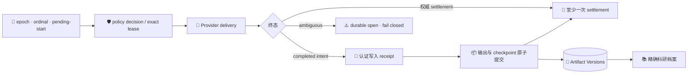

# 研究产物版本、自动 Checkpoint 与科研档案

_为 SciForge 增加可验证、可恢复、可明确关闭的研究产物版本链，并将研究过程组织为面向研究员的科研档案。_

---

## 📋 实现概览

本次变更为 SciForge 增加统一的 **Artifact Versions V2**、默认启用的 **Research Checkpoints**，以及面向研究员的 **科研档案**。每次 provider delivery 前，Host 先把 `issuerEpoch`、单调 ordinal、随机 `deliveryAttemptId` 和 workspace-bound pending-start owner 持久化到 Turn Artifact Outbox V4，再建立 boundary decision；能够证明来源和精确字节的研究产物，会与当轮 checkpoint 在同一个原子事务中保存。

自动策略独立于 recording，canonical status 带 `policyRevision`，Start/Stop 使用 expected revision。首轮前 waiting Stop 可返回 `recording: null`；disabled attempt 持久为 `skipped`，同 attempt response-loss replay 仍 skip。`start` re-enable 后下一 accepted/completed turn 才创建 v1。普通聊天不显示记录控制。

研究员可以从主聊天中的“打开科研档案”进入精确版本视图，查看本轮研究内容、独立产物、来源、版本历史、比较、恢复和需要关注的可信度限制。主聊天不再承载大型 checkpoint 卡片、内部 ID、产物预览或常驻记录状态条。

### 核心能力

| 能力 | 本次实现 |
| --- | --- |
| 研究产物版本 | 稳定 Artifact ID、不可变版本、父版本链、current 指针、CAS 内容存储与精确摘要校验 |
| 原子提交 | 多个研究输出与当轮 checkpoint 一次提交；任一候选失败时不发布部分结果 |
| 精确读取 | 按 Version ID、digest、长度、媒体类型、访问策略和 owner scope 读取，不回退到 latest/current |
| 版本操作 | 历史列表、内容范围读取、文本/表格/图像预览、版本比较、Bundle 导入导出与 `restore-as-new` |
| 自动 Checkpoint | Host issuer epoch + monotonic ordinal + random attempt；enabled lease 原子绑定 recording/exact snapshot，disabled attempt 持久 skipped |
| 用户控制 | Dossier waiting/active/stopped Start/Stop 使用 policy revision CAS；普通聊天无控制；waiting Stop nullable recording |
| 故障恢复 | Outbox V4 accepted-handle ownership、governed ambiguous recovery、至少一次 settlement、双 ACK exact retirement、pending predecessor overlay |
| 最小权限 | 每个 domain 使用 package-scoped invoker；caller-selected identity 由通用 Broker grant 授权 |
| 科研档案 | 研究摘要、关键产物与来源、版本历史、复现信息、可行动限制和折叠的技术详情 |
| 隐私与容量 | 持久化前文本/URL 净化、默认禁止导出、索引/CAS/staging/journal 硬容量门 |

## 👤 用户体验

### 主聊天

- 每个已提交的 research checkpoint 只显示一个中性、系统风格的“打开科研档案”入口
- 不在聊天中展示内部 UUID、SHA-256、版本徽章、修改原因、输入输出列表或未追踪警告
- 不显示“正在记录研究 / 当前 vN”等 composer 状态条
- pending、stale、failed 或无法精确绑定的记录不会伪装成可打开的成功记录

### 自动记录

- 新 workspace/runtime/thread 的 automatic policy 独立存在并默认 `waiting + enabled + policyRevision 0`
- Start/Stop 提交 `expectedPolicyRevision`，stale 请求先拒绝，成功 receipt 返回新 revision
- Research Dossier 从 owner canonical status 在 waiting/active/stopped 显示 Start/Stop；普通聊天和 composer 无控制
- 尚无 recording 时 waiting Stop 返回 `recording: null`；后续 attempt 与重启保持 disabled，turn 永久 unrecorded
- disabled attempt 持久为无 recording/binding 的 `skipped`；同 attempt response-loss replay 即使后来 Start 也仍 skip
- `start` re-enable 但不立即生成 checkpoint Version；下一 accepted/completed turn 创建 v1
- 既有 checkpoint 与 Artifact history 始终保留

### 科研档案

科研档案默认回答：

1. 本轮研究做了什么，为什么修改
2. 产生了哪些可查看的研究产物
3. 使用了哪些真实来源，来源是否固定
4. 当前结果有哪些可信度或复现限制
5. 可以查看、比较或恢复到哪个精确版本

内部 Version ID、digest、turn scope、Git/receipt 标识和原始技术记录统一放入“技术详情”。普通 Artifact 没有声明的 Compute、Evidence 或 Review 能力不会显示为“不可用”风险；真正的摘要不匹配、owner scope 错误、访问拒绝、blocking breakpoint 和复现失败仍会 fail closed。

## 🏗️ 数据与信任链



### Package-scoped caller 与通用 grant

Host 从生成式 package composition 的权威 package identity 为每个 domain runtime 创建 scoped invoker。Broker 根据 Domain SDK 的通用 grant 决定调用者能否指定 Artifact/Version identity。

Artifact Versions 不硬编码 `sciforge.research-checkpoints`，application core 不为某个 domain/action 添加专用分支。缺少 grant 的调用在进入 owner handler 前拒绝，并且不会产生部分状态。

### Durable delivery owner 与 lease reconciliation

Host 持久化 installation `issuerEpoch`，为每次 provider delivery attempt 分配单调 ordinal 和随机 `deliveryAttemptId`；`boundaryLeaseId` 绑定该 attempt，而不是从 `clientDirectiveId` 派生。Outbox V4 持久拥有 pending-start、provider-accepted watch、completed intent 与 terminal settlement，settlement 至少一次重试到 durable consumer receipt。Research Checkpoints 对 enabled policy 在一个原子 mutation 中把 `open` lease、`recordingId` 与 exact binding snapshot 一起持久化；disabled attempt 保存 `skipped` decision。

pending-start 不通过文本/history/latest turn 自动恢复；只有 provider accepted handle 自动 bind。ambiguous start 只能经 generic governed list/resolve/release，验证 runtime/thread/workspace scope，resolve 还要验证 exact provider turn/user-message item。completed intent/settlement 使 lease 成为 `consumed`；权威 terminal settlement 使其成为 `released`，ambiguity 保持 durable open。

Host snapshot 包含 epoch、next ordinal、exact retired ranges 与 owners。已签发 ordinal 必须仍有 owner/receipt 或在 exact range；gap、冲突、retired-open lease fail closed。lifecycle 与 artifact delivery 双 ACK 后有界 receipts 才退休为 exact ranges，不用 Bloom/time cutoff。retry 按 runtime/thread 隔离，一个 pending gap 不阻塞其他 thread。

连续 turn 若前一输出已本地精确验证但 Artifact commit 未完成，下一 lease 以稳定 operation identity 和 exact bytes/ref 冻结 pending deterministic predecessor overlay；未精确验证则 fail closed，不回退 stale current。

### 可信归因边界

自动可信文件归因只接受满足完整 Host 约束的成功 executor receipt：

- runtime、thread、turn、directive、call 和 executor sequence 精确匹配
- 工具是认证的 `apply_patch/fileChange`
- patch、声明路径和 turn 终态 workspace 字节一致
- symlink、路径穿越、敏感路径、并发外部修改、超限或歧义写入全部 fail closed

普通 Terminal、PTY、IDE、`exec_command`、后台进程和未托管脚本继续标记为 `untracked/incomplete`，不会因为时间窗口、文件监听、Git diff、mtime 或成功退出而升级为可信。

## 📦 Artifact Versions

### 不可变版本模型

- Artifact 使用稳定身份；每次保存生成新的不可变 Version
- 版本记录父版本、sequence、intent、媒体类型、字节长度、SHA-256、依赖和访问策略
- 内容写入 CAS，索引通过原子替换发布
- stale current、requested identity 冲突和幂等键内容冲突均在发布前拒绝
- `restore-as-new` 从历史版本创建新的 current，不倒拨指针、不改写历史，也不等同于 Git/workspace 全量回滚

### V1/V2 兼容

既有 Artifact Versions V1 wire contract 保持原有严格形状和语义。requested identity、staged object、range read、rich list/describe 和 directory Bundle 通过显式 V2 action 提供。V1 Bundle 仍要求显式非空 selector，不会把缺省 selector 解释为导出整个 workspace。

## 🔒 隐私、完整性与容量

Checkpoint narrative、change reason、未追踪摘要、错误文本和来源 URL 在进入 journal/CAS 前经过 Host opaque-secret sanitizer 与结构化净化。新 checkpoint/output 默认：

```text
visibility = workspace
allowExport = false
```

Artifact index、workspace CAS、active staging 与 Research Checkpoints store 均有写前硬边界。超限保留原索引和历史，不为腾空间删除已提交版本。enabled lease 与 recording/exact snapshot 原子绑定，disabled attempt 持久 skipped；仍有 Outbox owner 或 ambiguous delivery 的 `open` lease 不静默清理，终态 receipts 只在双 ACK 后进入 exact retired ranges。

## 📦 包版本与发布验证

- `@sciforge/domain-sdk`：`0.2.0`
- `@sciforge/domain-artifact-versions`：`1.1.0`（V1 保留、V2 增量扩展）
- Research Checkpoints 等消费者：分别依赖 Artifact Versions `^1.1.0` 与 Domain SDK `^0.2.0`

package metadata、npm lock 与 generated composition 必须保持一致。合并前应使用 `npm pack` 生成 tarball，在空临时项目中安装并验证公共 exports 与最小 composition；workspace symlink 不能替代独立安装验证。Checkpoint 集成测试应通过公开 Broker/composition contract，不得相对导入 Artifact Versions 私有 `src/main/service`。

## 🧪 最终验证要求

原 PR 的包级与 Electron 结果只作为历史基线。以下项目已在修复后的最终 staged-equivalent source 上重新运行：

- [x] production composition：真实 package-scoped invoker + authenticated `apply_patch/fileChange`，输出与 checkpoint 原子提交
- [x] lifecycle：issuer/ordinal、accepted-handle bind、governed pending recovery、至少一次 settlement、双 ACK exact retirement、ambiguous open、ordinal gap fail closed、per-thread isolation；无 Bloom/time cutoff
- [x] predecessor：连续 turn 的 pending deterministic predecessor overlay 使用稳定 operation 与 exact bytes/ref，不等待 commit、不回退 stale current
- [x] policy：status revision + Start/Stop expected revision、waiting Stop nullable recording、disabled skipped/response replay、Start 后下一 completed turn 创建 v1；普通聊天无控制
- [x] packed install：Domain SDK、Artifact Versions、Research Checkpoints 等相关 tarball 独立安装并实际 import 全部公共 exports
- [x] package tests/typechecks、root `npm test`、`typecheck`、`build`、changed-file lint
- [x] domain composition、capability governance、无 domain/action core hard-code、无跨 domain 私有源码导入
- [x] 真实 Electron source 与 packaged path
- [x] diff、secret、绝对路径、运行态和大文件卫生扫描
- [x] npm audit 处置与 GitHub server-side mergeability 分别记录

最终根 Vitest 通过 364 个文件、3227 个测试；特性聚焦回归 501/501；19 个 domain composition fresh、195 个 action 且无 architecture bypass。`npm audit` 为全部依赖 14 项（4 moderate、10 high）、生产依赖 13 项（4 moderate、9 high），没有执行破坏性的自动强制修复。根 `npm run lint` 仍会因未修改的独立 Next 文档站与根 ESLint 10 的插件 API 基线冲突在规则加载阶段失败；`origin/gui...HEAD` 的全部变更 TS/TSX/JS/MJS 已通过 ESLint。

## ⚠️ 已知限制与非目标

- 普通 Terminal、PTY、IDE、`exec_command` 和未托管脚本写入仍是 `untracked/incomplete`
- 保存版本不代表科学正确、正式执行、可复现或 Evidence L4
- restore 只创建新版本，不恢复整个 workspace 或 Git 状态
- credential redaction 不是通用内容 DLP；普通文件正文仍需要研究员审查
- Scientific Compute controlled-script beta 已移出本 PR，若继续推进应使用独立 OpenSpec change 和 PR
- 依赖 audit 的具体数量与处置必须以最终 clean install 为准，不沿用历史结果冒充最终验证

## 🔍 建议审阅顺序

1. package-scoped invoker 与通用 capability grant
2. Host issuer/ordinal/random attempt、accepted-handle/governed pending recovery、Outbox V4 双 ACK exact retirement 与 per-thread retry
3. Artifact Versions 的 V1 兼容、V2 原子提交、CAS 与容量门
4. Research Checkpoints 原子 recording/lease snapshot、pending predecessor、Dossier waiting/active/stopped Start/Stop、journal 恢复与 exact owner read
5. 科研档案的信息架构、错误态和主聊天紧凑入口
6. 0.2 包版本、packed install 与 production-composition/Electron 验证

## 📚 相关文档

- [产物与版本管理设计说明](./artifact-versioning-and-research-checkpoints.zh-CN.md)
- [Artifact Versions README](../../packages/domains/artifact-versions/README.md)
- [Research Checkpoints README](../../packages/domains/research-checkpoints/README.md)
- [科研档案 README](../../packages/domains/research-dossier/README.md)
- [OpenSpec change](../../openspec/changes/add-chat-research-checkpoints/proposal.md)
