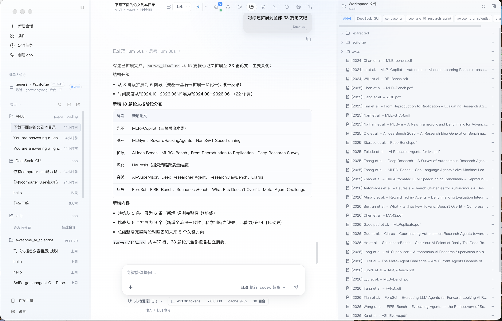
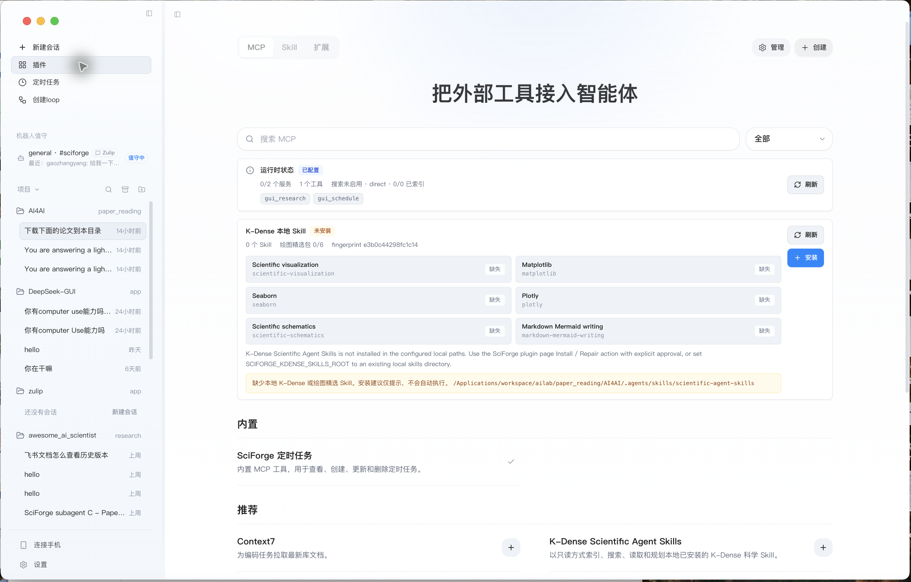
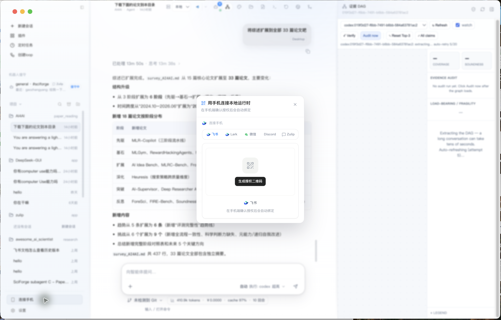
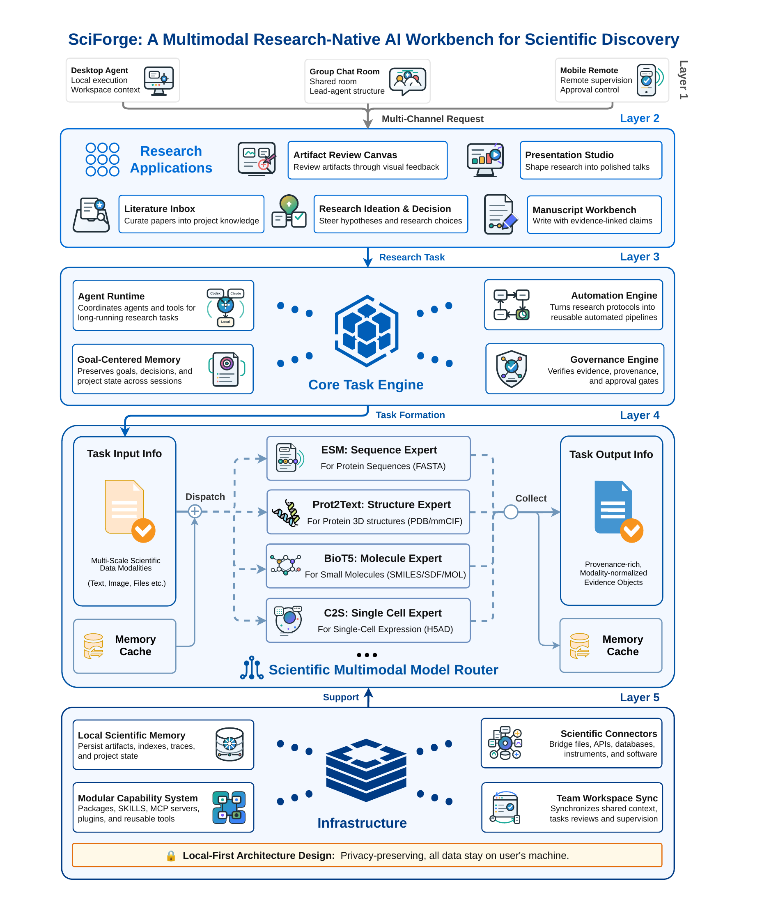

# SciForge 领导汇报简版

> 目的：用一页半到三页的方式说明 SciForge 是什么、现在已经做到什么，以及它和 Anthropic Claude Science 的差异化机会。

## 一句话定位

SciForge 是一个面向科研与复杂工程的本地 AI 工作台：把代码、论文、数据文件、长任务、写作、插件/worker、证据图谱和团队监督放在同一个桌面环境里，让 AI 不是只回答问题，而是在真实工作区持续推进研究任务。

与 Claude Science 相比，SciForge 不应被定位成“另一个 Claude Science 界面复刻”。更准确的定位是：

**Claude Science 更像 Anthropic 生态内的科学研究助手产品；SciForge 更像一个开放、本地优先、可插拔、多模型、证据治理导向的科研智能体操作系统。**

## 真实运行截图

下面截图来自当前本地运行中的 SciForge dev/Electron 界面，不是 README 插画。

### 长任务工作台：会话、产物、文件和成本可见

这张图体现了 SciForge 的基本产品形态：

- 左侧是多项目、多会话管理，可以在不同科研/工程工作区之间切换。
- 中间是长任务执行记录，包含耗时、思考时长、阶段性结果和可继续对话的上下文。
- 右侧直接绑定本地 Workspace 文件，能看到论文 PDF、提取文本、综述文件等研究产物。
- 底部显示 token、缓存命中和成本信息，支撑长会话的成本可观测。

### 插件/worker 管理：科研能力不是硬编码在 UI 里

SciForge 的重要差异是把科研能力拆成可配置、可审计、可替换的 worker / MCP / Skill：

- 科研检索、定时任务、K-Dense 科学 Skill、Scientific Plotting、Image Generation、VisualDocument、ppt-master 等能力都可以作为外部工具接入。
- 这让 SciForge 可以逐步扩展，而不是把所有能力写死在单一客户端里。
- 对机构部署更友好：哪些工具可用、哪些需要审批、哪些只读、哪些能写入，都可以在边界上治理。

### 移动/IM 监督：不是单人桌面孤岛

SciForge 已经有手机/IM 连接入口，支持飞书、Lark、微信、Discord、Zulip 等通道。这一点适合讲“团队治理”和“长任务监督”：PI 或团队成员不一定守在桌面前，可以通过 IM/手机处理状态查看、审批和任务交接。

## SciForge 的系统主线

结合 `paper/sciforge-report.tex` 和当前项目代码，SciForge 的主线可以概括为五层：

1. **用户交互与协作层**：桌面工作台、机器人值守、Connect Phone、团队消息通道。
2. **研究能力模式层**：文献收集、科研写作、图表审改、报告/PPT、研究任务规划。
3. **核心引擎层**：Agent Runtime、Workflow/Automation、Goal/Plan、Evidence DAG、审批和治理。
4. **科学模型路由层**：统一 Model Router，面向文本、视觉和科学模态文件做路由。
5. **基础设施层**：本地工作区、本地记忆、插件/worker、MCP、外部数据库/服务连接。

架构图如下，建议放在正式 PPT 的第二或第三页，作为“系统不是单点功能”的说明。

## 和 Claude Science 的关键对比

Anthropic 在 2026-06-30 发布 Claude Science beta，官方描述其为面向科学家的 AI workbench。官方资料强调：本地 macOS/Linux、SSH/HPC login node、Modal 按需 GPU、超过 60 个 curated scientific skills/connectors、原生科学 artifact、可复现实验产物、reviewer agent 检查引用和计算。参考：[Anthropic 发布页](https://www.anthropic.com/news/claude-science-ai-workbench)、[Claude Science 产品页](https://claude.com/product/claude-science)。

| 维度 | Claude Science | SciForge 的独特性 |
| --- | --- | --- |
| 产品基座 | Anthropic/Claude 生态内的科学工作台，产品完成度和生态资源强。 | 开源/本地优先的科研智能体工作台，面向多模型、多 runtime、多 worker。 |
| 模型策略 | 以 Claude 为中心，通过技能、连接器和 specialist/reviewer agents 扩展能力。 | Model Router 抽象 OpenAI/Anthropic/DeepSeek/本地模型等不同协议，避免锁死单一模型族。 |
| 科学模态 | 强调原生展示 proteins、structures、molecules、genome tracks 等 artifact。 | 强调 **translate-then-reason**：FASTA/PDB/SMILES/single-cell 等先由专业 translator 生成带 provenance 的证据，再交给主 agent 推理。 |
| 可审计性 | 每个 artifact 关联代码、环境、描述和消息历史；reviewer agent 检查引用和计算。 | Evidence DAG 把会话中的 claim、source、reasoning、tool result 组织成线程级证据图，支持 PROV-JSON、audit runs、fragility/load-bearing 分析和高影响动作 gate。 |
| 执行环境 | 本地、SSH、HPC、Modal，强调计算资源调度。 | 本地 workspace + worker/MCP + 可替换 runtime；更适合做机构内可控部署、国产模型/私有模型接入、细粒度工具治理。 |
| 协作方式 | 官方强调研究环境、可复现和团队计划；协作更多围绕 Claude 产品形态。 | IM/手机/机器人值守是一级入口，适合把 PI 审批、团队讨论、长任务监督做成跨设备流程。 |
| 扩展机制 | 60+ 预置科学 skills/connectors，生态广度强。 | worker/插件/MCP/Skill 都是项目内一等边界，能力可独立测试、替换、审计和本地化。 |
| 成本与可控性 | 依赖 Claude 订阅/企业计划与 Anthropic 生态。 | 支持本地 Runtime、DeepSeek cache-aware 成本显示、工具上下文按需加载，更强调长任务 token ROI。 |
| 当前成熟度 | 商业 beta，品牌、模型和连接器优势明显。 | 产品仍在快速工程化阶段，但在“开放可控 + 证据治理 + 多模型路由”上有独特技术路线。 |

## 领导需要记住的差异化

### 1. SciForge 的核心不是聊天，而是研究状态管理

普通 AI 工具关注“这一轮答得好不好”。SciForge 更关注“一个研究项目跨多天、多文件、多模型、多任务之后，证据、决策、产物是否还能被追踪”。这对科研团队更关键，因为论文、图表、实验脚本、数据处理和最终 claim 之间必须能回溯。

### 2. SciForge 的 Model Router 是战略控制点

Claude Science 的优势来自 Claude 生态。SciForge 的机会在于反过来做“模型中立层”：

- 同一工作台可接 Anthropic、OpenAI、DeepSeek、本地模型和机构私有模型。
- 科学文件不直接丢给通用 LLM，而是先路由到专门的科学 translator。
- 未来可以按任务选择最便宜、最快、最强或最合规的模型组合。

### 3. Evidence DAG 是区别于 reviewer agent 的更底层能力

Claude Science 有 reviewer agent 检查引用和计算，这是很实用的产品能力。SciForge 应该把差异点讲成更底层的“证据治理基础设施”：

- 每个线程可以形成 claim-evidence 图，而不是只在最终 artifact 上做检查。
- 审计结果可以进入审批、导出、提交、候选方案晋级等高影响动作的 gate。
- 这对科研场景尤其重要：不是只问“这段话有没有引用”，而是问“这个结论依赖哪些数据、脚本、模型输出和人工决策，删除某个证据后是否仍然成立”。

### 4. SciForge 更适合机构内科研工作流本地化

对高校、医院、药企、研究院，真正的障碍往往不是“有没有一个强模型”，而是：

- 数据不能随意出域。
- HPC/内网数据库/实验记录系统/本地脚本各有边界。
- 团队需要审批和责任链。
- 模型供应商和成本策略可能会变化。

SciForge 的本地工作区、worker 边界、MCP/Skill、Model Router 和 Evidence DAG，天然更适合做机构级部署和定制。

## 当前可展示能力

| 能力 | 当前证据 |
| --- | --- |
| 长任务研究工作台 | 真实截图显示 33 篇 AI4AI 论文整理、综述扩展、文件列表和成本/cache 信息。 |
| 本地 workspace 操作 | 会话和文件树绑定真实目录，可读写论文、Markdown、CSV、提取文本等。 |
| 插件/worker 接入 | 插件页显示定时任务、K-Dense Skill、Scientific Plotting、Image Generation、Canvas、ppt-master 等入口。 |
| 手机/IM 协作 | Connect Phone 弹窗显示飞书/Lark/微信/Discord/Zulip 授权入口。 |
| 科学 worker 架构 | 代码中已有 `model-router`、`sci-modality-router`、`evidence-dag`、`paper-radar`、`scientific-plotting`、`ppt-master`、`canvas` 等 worker。 |
| 研究案例 | 报告中的 scenario-01 research sprint 记录了长周期研究闭环：132 stages、约 199 commits、文献、候选基因、结构验证、图表与手稿包。 |

## 需要诚实说明的短板

1. **Claude Science 的生态和产品完成度更强。** 它已经有 Anthropic 官方背书、Claude 模型、商业 beta、60+ 科学数据库/连接器和合作伙伴。
2. **SciForge 需要继续打磨证据图谱的大线程稳定性。** 长会话 Evidence DAG 需要分块 ingest、增量审计和更稳的 UI 状态，避免大线程触发请求体/耗时问题。
3. **科学模态 translator 的覆盖和授权需要工程化。** Esm2Text、Prot2Text、BioT5、C2S 等专家模型路线清晰，但实际部署要处理权重、许可证、GPU 和推理服务稳定性。
4. **科研可视化和文件预览还要从“入口可见”走向“端到端可演示”。** 插件/worker 边界已有，下一步要把分子、组学、生物影像、图表审改做成稳定 demo。

## 建议的对外表述

> SciForge is a local-first, model-neutral AI workbench for scientific research. It turns papers, code, datasets, scientific files, figures, writing, long-running agents, and team decisions into one auditable research state. Unlike single-provider science assistants, SciForge emphasizes pluggable model routing, translate-then-reason scientific modality handling, Evidence-DAG governance, and mobile/team supervision over local research workspaces.

中文版本：

> SciForge 是一个本地优先、模型中立的科研 AI 工作台。它把论文、代码、数据、科学文件、图表、写作、长任务智能体和团队决策组织成一个可审计的研究状态。区别于单一模型厂商的科学助手，SciForge 更强调可插拔模型路由、科学模态先翻译再推理、Evidence DAG 证据治理，以及围绕本地科研工作区的团队/移动监督。

## 未来 90 天建议

1. **做一个稳定的领导演示包。** 用 scenario-01 或 AI4AI 文献综述作为主线，展示从问题、文献、文件、综述、图表到证据审计的完整闭环。
2. **补齐 Evidence DAG 大线程工程。** 优先做 chunked ingest、增量图谱、失败恢复和审计摘要，让“证据治理”成为可现场演示的核心卖点。
3. **做科学模态最小闭环。** FASTA/PDB/SMILES 各选一个 demo：上传文件 -> translator 生成证据 -> 主 agent 基于证据回答 -> 证据进入 DAG。
4. **强化插件市场的科研叙事。** 把 Scientific Plotting、Canvas、ppt-master、Paper Radar 做成“论文到汇报”的组合链路。
5. **准备和 Claude Science 的差异化话术。** 不正面比谁的模型更强，而是强调“开放可控、多模型、本地部署、证据治理、团队监督”。

## 参考来源

- 本项目报告：[`paper/sciforge-report.tex`](../paper/sciforge-report.tex)
- 项目 README：[`README.en.md`](../README.en.md)
- Anthropic 官方发布：<https://www.anthropic.com/news/claude-science-ai-workbench>
- Claude Science 产品页：<https://claude.com/product/claude-science>
