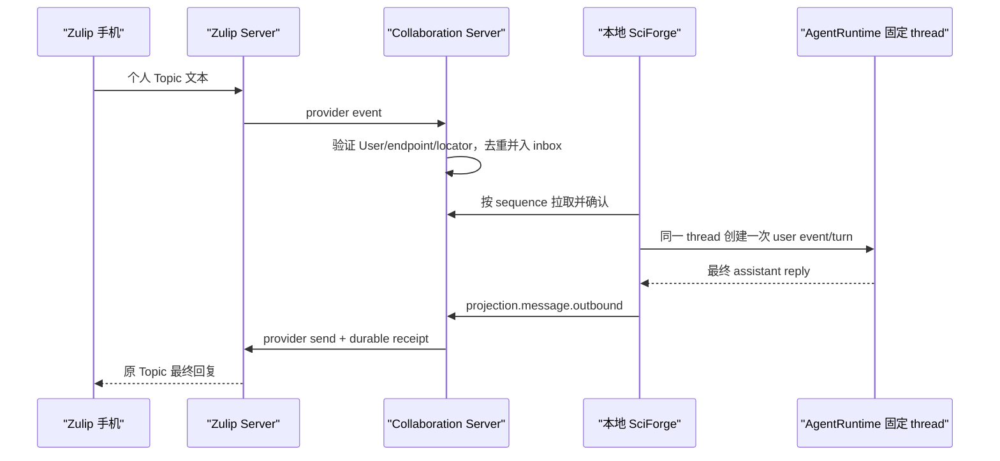

# SciForge 手机 Zulip 与统一协作架构

> 本文描述当前统一协作目标架构。规范性需求以
> [`openspec/changes/unify-user-device-collaboration`](../openspec/changes/unify-user-device-collaboration/proposal.md)
> 为准；用户步骤见 [手机与多人协作使用手册](./collaboration-user-guide.zh-CN.md)。

## 1. 目标

SciForge 需要同时解决两类问题：

1. 用户从手机继续自己电脑中一个固定 Session；
2. 多名用户让各自 Agent 围绕一个 Project 分工协作。

两类场景共用稳定 `UserPrincipal`，但个人 Session 与 Project 使用不同路由。系统不再把手机账号、
安装实例或 Topic 文本当作隐式用户，也不再由同一 Topic 的命令静默切换桌面 Project/thread。

## 2. 参与者与权威来源

| 组件 | 负责 | 不负责 |
| --- | --- | --- |
| Zulip | 登录、手机/网页聊天、channel、Topic、历史、未读与通知 | Agent 所有权、Project/Task 状态、本机权限 |
| Collaboration Server | User、端点绑定、Agent ownership、projection、Project/Task、共享记录、inbox、receipt 与授权 | 模型推理、本地工具、完整私人 transcript |
| SciForge 协作领域 | Agent 注册、固定 Session 映射、本地 durable queue、AgentRuntime 执行、协作 UI | 保存 Bot 服务凭据、猜测跨用户路由 |
| 本地 AgentRuntime | 个人 Session 上下文、turn、模型和工具执行 | 多人 Project 的共同事实 |

云端 PostgreSQL 是协作事实源；本地 AgentRuntime thread 是个人 Session 上下文事实源；Zulip Server
是远端聊天展示历史的事实源。任何组件都不能建立可独立冲突的第二套状态。

## 3. 身份模型

一个协作个体由三部分组成：

- 稳定 `userId`；
- 已验证 `HumanEndpointBinding`，由 `(provider, realmId, providerUserId)` 唯一标识；
- 用户明确选择的 primary `AgentNode`。

显示名、邮箱、channel 和 Topic 都是可变元数据，不是内部身份。手机 challenge 只在短期内有效，
成功后立即消费。同一 provider 身份不能同时属于两个 active User。

每台 SciForge 使用稳定 `agentId` 和独立设备凭据。重启恢复同一 Agent；所有权转移、撤销和凭据轮换
必须显式且可审计。多台 Agent 不按“最近在线”自动替代。

身份与授权分开判断：同一用户的手机端点通常是 `verified`，Agent 设备是 `device`，高风险操作可能
仍要求桌面或更强保证级别。

## 4. 两种消息空间

### 4.1 个人 Session Topic

`RemoteSessionProjection` 固定引用 owner user、Agent、runtime、thread、human endpoint 与 provider
locator。Topic 改名、桌面焦点切换或 Project 切换不改变这些引用。

默认只有 owner 可发送可执行消息。显式共享时维护 user allowlist，并在桌面持续显示实际执行 Agent
及其 owner；发送者变化不会分叉出隐藏 Session。

### 4.2 Project Topic

Project Topic 是 `ProjectInput` 和人类通知的远端投影。每条输入先保存 `projectId`、`senderUserId`、
source endpoint 和 remote message ID，经成员权限校验后通知唯一 Coordinator。

Coordinator 可以回答、澄清、创建 Task 或拒绝。Project Topic 不直接写入任何成员的私人 thread，
也不向全部 Worker 广播执行指令。

## 5. 个人消息路径

桌面发起时，本地 thread 先接受 user message，再通过同一 projection outbox 把用户消息与最终回复
投影到手机。不同入口共享同一逻辑 transcript。

## 6. 顺序、去重与离线恢复

- 每个 projection 有独立 durable ordered queue；同一 projection 同时最多运行一个 turn。
- provider event 用稳定消息 ID 去重，不依赖短期内存缓存或 event queue ID。
- 所有云端写操作带 actor + idempotency key；相同请求返回既有 receipt。
- 状态变化、audit 和 InboxMessage 在同一 PostgreSQL 事务提交。
- WebSocket 只发送 `inbox.available`，客户端仍按 sequence 拉取并 ack。
- Agent、云端或 Zulip 重启后从持久 cursor、receipt 和本地 active turn 恢复，不重新执行已接受工作。
- 投递结果不确定时先对账，再重试；Bot 自回声被过滤。

首期只同步 append-only 文本、最终 assistant reply、明确系统状态、HumanNeeded 和 HumanAnswer。不让
编辑、删除、reaction、流式 delta 或附件修改本地 Agent 历史。

## 7. 多人 Project

Project 用 `memberUserIds` 表达成员，用 `coordinatorAgentId` 表达当前 Project Coordinator。Task Offer 指向 `workerUserId`；Cloud 向该 User 的合格 Agent/Device Runtime 广播，并在首次原子 claim 后才为 Task Execution 记录 `assigneeAgentId` 与 Device。
每个 Project 同时只有一个 active Coordinator；Coordinator/Worker 是 Project/Task 关系，不是账号类型。

正式协作是星形结构：

1. Coordinator 维护计划并创建结构化 Task；
2. Worker 只接受分配给自己的当前 revision；
3. Worker 提交进度、结果、观察或子任务建议；
4. Coordinator 或有权真人接受正式 decision/summary；
5. 超过 Task、轮次或重试预算时明确失败或创建 HumanNeeded。

Coordinator 转交是原子、显式操作。旧 Coordinator 后续计划写入被拒绝；首期不自动选主。

## 8. 真人问题与通知

`HumanNeeded` 必须有 `targetUserId`、Project/Task/request revision 和 required assurance。系统只向该
用户的 active primary endpoint 投递；无可用端点时保留 user inbox 并在桌面显示。

`HumanAnswer` 记录回答 user、endpoint、assurance、时间和关联 revision。非目标用户、重复事件或
过期请求不能改变 Task。Zulip adapter 只把来自该 Project Topic 的严格
`sciforge-answer <humanRequestId> <revision> <answer>` 命令解析为回答事件；云端仍会再次核对来源
endpoint、唯一 active Project binding、目标用户、assurance、revision 与有效期。

手机只接收：

- 个人 Session 消息和最终回复；
- 需要本人处理的问题；
- 策略明确允许的批准；
- 重要失败、阶段摘要和最终结果。

心跳、普通进度、工具日志、内部推理和机器协调消息不产生手机通知。

## 9. 权限与数据最小化

每次操作分别验证 actor user、endpoint、assurance、资源角色和 capability policy。Project membership
或手机身份不自动批准文件写入、命令、外部发布或凭据使用。

| 数据 | 保存位置 |
| --- | --- |
| User、端点、Agent、Participant | Collaboration Server PostgreSQL |
| Project、Task、Record、Inbox、cursor、receipt | Collaboration Server PostgreSQL |
| Zulip 消息与显示历史 | Zulip Server |
| 完整个人 Session、工作区关系、详细工具日志 | 所属 SciForge |
| 模型、工具、SSH 与本地数据凭据 | 本机或机构 secret store |
| Zulip Bot 服务凭据 | 云端受限 secret 文件/secret manager |

普通设置、日志、诊断、二维码、文档和 Git 不得包含密码、API key、私钥、长期 token、一次性 challenge
或可逆凭据片段。

## 10. 软件与部署边界

- `@sciforge/collaboration-contracts`：严格、provider-neutral 合同；
- `@sciforge/collaboration-server`：一个 Node 服务和一个独立 PostgreSQL 数据库/schema；
- `@sciforge/domain-collaboration`：一个版本化领域包，分别提供 main/renderer 入口；
- `@sciforge/collaboration-provider-zulip`：通过 manifest/generated composition 安装的 provider adapter。

仓库只维护一个长期 `gui` 分支。桌面端、云端服务、共享合同和当前手机 Zulip 入口必须从同一个精确
commit 构建与测试；各端通过目录、package、版本和发布产物隔离，不建立永久的 desktop/cloud/mobile
源码分支。桌面端发布 Electron 安装包，香港 ECS 只部署版本匹配的 contracts/provider/server tarball，
当前手机端直接使用官方 Zulip App。未来增加原生手机应用时，应放入独立目录并继续合入 `gui`。

Host 只依赖通用 Domain SDK。协作领域和 provider 不导入 Host-private main/renderer/shared 路径，也不
增加 provider 专属 IPC、MCP、Runtime 或重复镜像路径。

香港 ECS 复用 `chat.sciforge.cn` 的 TLS 与 Nginx，公开路径为
`https://chat.sciforge.cn/collaboration/`；Nginx 将前缀剥离后反代到 loopback 服务。Zulip 与协作服务
使用独立进程、配置、权限和数据库；协作服务只调用 Zulip 公开 API，绝不读写 Zulip 内部数据库。

## 11. 故障语义

| 故障 | 预期行为 |
| --- | --- |
| 手机离线 | Zulip 保留消息/未读，HumanNeeded 仍在 user inbox |
| Agent 离线 | 消息与 Task 等待；不会改投其他 Agent |
| 云端重启 | 从数据库恢复 binding、inbox、cursor 和 receipt |
| Zulip 重投 | 同一逻辑消息只创建一个 turn |
| Topic 改名/移动 | 更新 locator 显示元数据；projection/project ID 不变 |
| Coordinator 离线 | 已授权 Task 可按策略继续；新计划暂停直到恢复或转交 |
| endpoint/Agent 撤销 | 旧凭据立即不能创建新状态；未完成工作进入可见待处理状态 |

## 12. 验收边界

最低端到端验收必须同时覆盖：

1. 六名用户分别绑定自己的手机端点和 Agent；
2. 两个个人 Topic 分别固定进入正确本地 Session；
3. 手机到桌面、Agent 回复到手机、桌面到手机都恰好一次且顺序一致；
4. 离线与进程重启后恢复，不重复执行；
5. 一个 Project Topic 保留不同发送者身份；
6. 两个 Worker 并行处理不同 Task；
7. HumanNeeded 只投递目标用户，其他成员不能代答；
8. Coordinator 转交后旧 Coordinator 写入被拒绝；
9. 高风险手机操作仍等待本地批准；
10. 中文 Topic 重命名不改变稳定身份。

Fake provider/server/runtime 集成测试不能替代真实 Zulip、真实桌面 Session 和真实手机验收。
