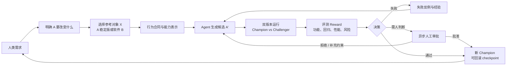

# A+X：SciForge 持续软件自进化

目标：ICLR 2027（算法系统方向）

## 项目目标

让人类只需要提出高层软件需求，SciForge 就能在后台持续完成需求分析、代码修改、运行验证和版本迭代；人类只在高风险或关键方向节点异步把控。

目标软件记为 **A**。对于每个需求，系统先判断 A 需要改变什么，再选择合适的参考对象 **X**：

- 如果需求涉及架构重构，选择 A 的稳定版本作为 X，用来保护已有功能；
- 如果需求希望吸收外部优秀能力，选择软件 B 作为 X，用来提取和迁移功能；
- 第一阶段默认允许访问 X 的源码、测试和历史，以降低能力迁移难度。

因此，A+A 和 A+B 可以统一抽象为 A+X，但 X 是需求执行过程中的参考来源，最终被修改、验证和晋级的始终是目标软件 A。

核心目标是：

```text
人类需求
  ↓
理解 A 要改变什么，并选择参考对象 X
  ↓
生成候选版本 A'
  ↓
自动运行、比较和评测
  ↓
修复、晋级、回滚或请求人工审批
  ↺
```

## 为什么重要

现在的 coding agent 通常完成的是：

```text
Issue → 代码修改 → 测试 → Pull Request
```

它们擅长一次性完成任务，但仍然缺少长期软件进化能力：

- 不能可靠地判断大规模重构是否破坏了隐含功能；
- 不能系统地从其他软件迁移优秀能力；
- 通常只优化单次任务成功率，而不考虑多轮版本累积后的回归和技术债；
- 需要人类持续盯住每个执行过程，难以 24 小时运行。

本项目希望把人类从连续操作员变成关键节点的决策者：Agent 自动运行低风险循环，人类只处理高风险、高不确定性或产品方向性决策。

## 核心 Loop



图中只表达主循环：人类需求决定目标软件 A 要改变什么，X 提供行为或能力证据，Agent 生成候选版本，候选与稳定版本隔离运行并接受评测；失败结果回流到下一轮，成功候选成为新的 Champion。

## 方法

### 1. 行为合同

从稳定版本或参考对象中提取可观察行为：

- 用户工作流和 UI 状态；
- API、文件、数据库和事件变化；
- 错误处理和恢复路径；
- 延迟、资源和权限边界。

将其分为：

- **Invariant Envelope**：必须保持的行为；
- **Change Envelope**：本次任务允许改变的行为。

这样，开发版本可以在代码和架构上完全不同，但不能越出声明的行为边界。

### 2. A+X 能力迁移

第一阶段默认允许访问 X 的源码、测试和历史，以降低难度。系统从 X 中提取 `Capability IR`，描述能力的目标、前置条件、操作、反馈和约束，再让 Agent 在 A 的架构中独立实现。

```text
X 的源码 / 测试 / 轨迹
        ↓
Capability IR
        ↓
A 的候选实现
```

这比简单复制文件更通用，也为未来只访问 X 的运行轨迹或二进制的黑盒蒸馏留下接口。

### 3. 双版本 rollout 与 Reward

同一任务分别运行稳定版本和候选版本，比较：

- 用户任务是否完成；
- 输出、UI、数据状态和 API 是否符合合同；
- 性能、资源、权限和安全是否改善或退化；
- 新功能收益是否抵消新增风险。

Reward 不使用单一测试通过率，而是使用带证据的多目标结果：

```text
功能收益 + 兼容性 + 性能 + 可维护性
- 回归风险 - 安全风险 - 复杂度成本
```

硬门禁失败时直接拒绝；通过硬门禁后，候选进入 Pareto archive，再决定是否自动晋级或请求人工判断。

### 4. 失败学习与主动评测

失败不只记录为日志，而是压缩成最小反例：

```text
操作序列 → 违反的不变量 → 相关 patch → 修复结果
```

下一轮优先运行最能区分 Champion 与 Challenger 的测试，避免每次都执行相同的完整测试集。长期积累的反例、能力和评测策略构成 Experience Memory。

## 研究问题

1. 如何从代码、测试和真实交互中抽取稳定可靠的行为合同？
2. 如何把 X 中的能力迁移到 A，而不把 X 的内部耦合和不适用设计一起复制？
3. 如何在两个架构完全不同的版本之间进行语义差分？
4. 如何把测试、轨迹、性能和人工反馈归因到具体 patch？
5. 如何用最少的人类审批维持长期运行的安全性和产品方向？
6. 如何避免 Agent 修改测试、过拟合公开用例或利用评测器漏洞获得虚假 Reward？

## 对 SciForge 的价值

1. **支持激进重构**：稳定版本成为行为基线，Agent 可以重写内部架构而不轻易破坏用户功能。
2. **吸收外部能力**：X 不再只是参考文档，而是可以被解析为可迁移的能力资产。
3. **形成 24 小时开发循环**：任务、实现、评测、修复和晋级可以由 Schedule、Workflow 和 AgentRuntime 持续运行。
4. **减少人工盯守**：人类只需要处理不可逆、高风险或证据冲突的节点。
5. **让“越用越好”可测量**：可以观察回归率、独立完成率、人工介入次数、迁移成功率和长期维护成本是否改善。

## 学术定位

本项目不是“第一个自动 coding agent”，也不是简单地把 Agent 接入 CI。它研究的是：

> **A+X Behavior-Constrained Continuous Software Evolution**：在任意可访问参考对象 X 的帮助下，让目标软件 A 进行可验证、可回滚、长期持续的行为约束进化。

本次检索到的学术工作分别覆盖局部问题，但尚未看到一个同时统一以下设定的完整系统：

```text
A + 任意参考对象 X
+ 行为合同
+ 双版本 rollout
+ 主动评测与证据 Reward
+ 失败经验回流
+ 自动晋级、回滚和异步人类门控
```

## 相关学术工作

### 候选程序进化

**AlphaEvolve** 将 LLM 生成的程序变体放入进化式搜索框架，由自动 evaluator 运行、验证和评分，再保留优秀候选继续搜索。它最接近本项目的“候选程序—自动评测—选择”范式，但主要面向目标函数明确的算法发现，而不是长期维护的完整应用。[AlphaEvolve: A coding agent for scientific and algorithmic discovery](https://arxiv.org/abs/2506.13131)

### Agentic RL for 软件工程

**Training Long-Context, Multi-Turn Software Engineering Agents with Reinforcement Learning** 和 **Agentic Reinforcement Learning for Real-World Code Repair** 都把真实软件环境中的工具调用、构建、测试和修复建模为 RL 过程。它们主要优化 Agent policy，而不是目标软件版本的长期演化和参考对象迁移。[Long-context SWE RL](https://arxiv.org/abs/2508.03501)、[Real-world code repair RL](https://arxiv.org/abs/2510.22075)

### Agent 自我改进与经验库

**A Self-Improving Coding Agent** 研究 Agent 自己修改其代码和工具配置；**CODESKILL** 研究从 coding-agent 轨迹中提炼和维护可复用 skill。它们适合作为本项目 Experience Memory 和 Agent Policy Evolution 的基线，但学习对象主要是 Agent，而非 A 的版本晋级。[Self-Improving Coding Agent](https://arxiv.org/abs/2504.15228)、[CODESKILL](https://arxiv.org/abs/2605.25430)

### 长周期软件演化评测

**SWE-EVO**、**EvoClaw** 和 **SWE-Cycle** 分别从长周期、多 milestone 和完整 issue-resolution cycle 评测 coding agent，说明孤立任务成绩不能代表长期维护能力。它们主要是 benchmark 和评测框架，不是完整的在线候选生成与自动晋级方法。[SWE-EVO](https://arxiv.org/abs/2512.18470)、[EvoClaw](https://arxiv.org/abs/2603.13428)、[SWE-Cycle](https://arxiv.org/abs/2605.13139)

### 行为保持重构

**SWE-Refactor** 建立了真实项目中的行为保持重构 benchmark；**RefAgent** 研究多 Agent 自动识别、规划、执行和验证重构；行为保持重构的系统性综述总结了形式化验证、程序变换和动态分析等路线。这些工作支撑 `X = A_stable` 的 A+X 特例，但还没有扩展到通用参考对象、长期 rollout 和自动版本晋级。[SWE-Refactor](https://arxiv.org/abs/2602.03712)、[RefAgent](https://arxiv.org/abs/2511.03153)、[Behavior-preserving refactoring survey](https://arxiv.org/abs/2106.13900)

## 参考文献

1. AlphaEvolve Team. (2025). [AlphaEvolve: A coding agent for scientific and algorithmic discovery](https://arxiv.org/abs/2506.13131).
2. Golubev et al. (2025). [Training Long-Context, Multi-Turn Software Engineering Agents with Reinforcement Learning](https://arxiv.org/abs/2508.03501).
3. Zhu et al. (2025). [Agentic Reinforcement Learning for Real-World Code Repair](https://arxiv.org/abs/2510.22075).
4. Robeyns, Szummer, and Aitchison. (2025). [A Self-Improving Coding Agent](https://arxiv.org/abs/2504.15228).
5. Li et al. (2026). [CODESKILL: Learning Self-Evolving Skills for Coding Agents](https://arxiv.org/abs/2605.25430).
6. [Self-Evolving Multi-Agent Collaboration Networks for Software Development](https://proceedings.iclr.cc/paper_files/paper/2025/hash/39af4f2f9399122a14ccf95e2d2e7122-Abstract-Conference.html). ICLR 2025.
7. Thai et al. (2025). [SWE-EVO: Benchmarking Coding Agents in Long-Horizon Software Evolution Scenarios](https://arxiv.org/abs/2512.18470).
8. Deng et al. (2026). [EvoClaw: Evaluating AI Agents on Continuous Software Evolution](https://arxiv.org/abs/2603.13428).
9. Guan et al. (2026). [SWE-Cycle: Benchmarking Code Agents across the Complete Issue Resolution Cycle](https://arxiv.org/abs/2605.13139).
10. Xu, Yang, and Chen. (2026). [SWE-Refactor: A Repository-Level Benchmark for Real-World LLM-Based Code Refactoring](https://arxiv.org/abs/2602.03712).
11. Oueslati, Lamothe, and Khomh. (2025). [RefAgent: A Multi-agent LLM-based Framework for Automatic Software Refactoring](https://arxiv.org/abs/2511.03153).
12. AlOmar et al. (2021). [On Preserving the Behavior in Software Refactoring: A Systematic Mapping Study](https://arxiv.org/abs/2106.13900).
