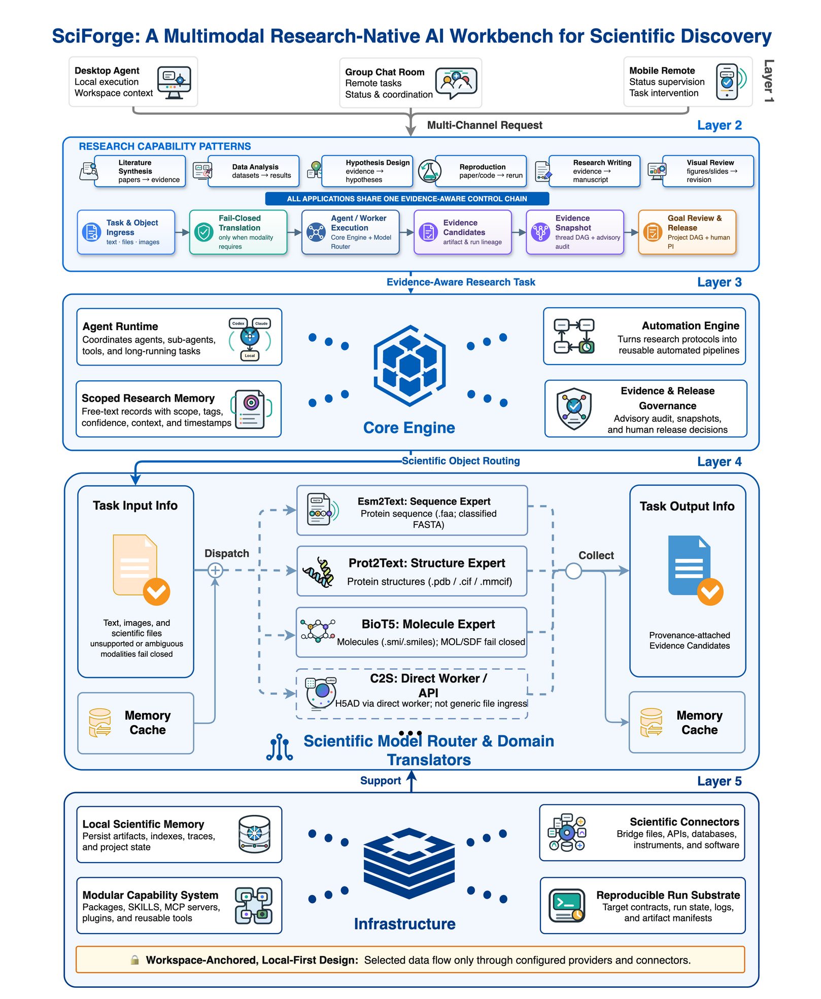
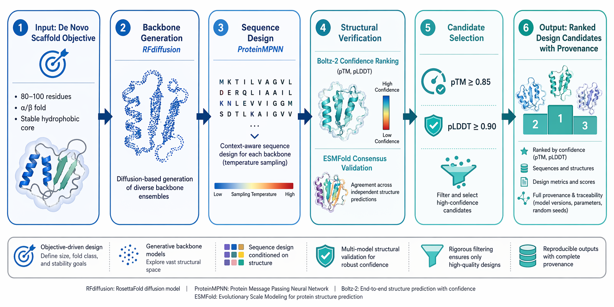
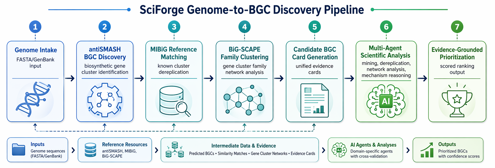

<!--
备选标题：
1. SciForge：面向科学研究的人机协同控制面与证据层
2. SciForge：构建可干预、可追踪、可复盘的科研 Agent 工作台
3. 从自动执行到证据治理：SciForge 的人机协同科研实践

封面图建议：
使用 paper/figures/sciforge-evidence-dag.png，裁切保留研究会话与 Evidence DAG，
叠加标题“SciForge：科研 Agent 的人类控制面与证据层”。
-->

# SciForge：面向科学研究的人机协同控制面与证据层

随着大模型和 Agent runtime 的能力持续提升，人工智能已经能够参与论文检索、代码编写、实验执行、数据分析、科学对象理解和研究成果生成。然而，真实科研活动并不是一系列彼此独立的问答：一项结论可能同时依赖论文来源、原始数据、预处理脚本、模型参数、计算环境、可视化设置以及研究者对证据强度的判断。如何将这些对象和决策组织为连续、可审查的研究状态，正成为科研 Agent 从“能够执行任务”走向“能够参与研究”的关键问题。

SciForge 是面向科学研究的**人机协同控制面与研究状态、证据采集层**。它与 Codex、Claude Code 等成熟 Agent runtime 协作，由 runtime 在后台承担通用执行，SciForge 则提供科学对象处理、研究上下文组织、人类审阅界面和证据治理能力。研究者可以在目标确认、证据审查、风险处理和成果发布等关键节点介入，并将论文、数据、工具调用、运行结果、claim、provenance 和决策记录沉淀为可继续、可追踪、可复盘的研究过程。

SciForge 论文报告了 8 个端到端实战演示，覆盖 AI4AI 模型迭代、同行评审与 rebuttal、空间转录组论文复现、跨尺度细胞图谱、蛋白质设计、分子优化以及 Genome-to-BGC 发现等任务。这些案例不仅记录执行结果，也保留了指标未达标、验证协议不完整和 provenance mismatch 等真实边界，用于展示人类监督下的 Agent 如何参与复杂科研流程。

<!-- 配图 1：建议放在摘要之后，作为系统总览图。公众号发布时请上传原图。 -->

*图 1｜SciForge 系统框架。系统由交互与协作、研究能力模式、核心引擎、Scientific Model Router 和本地优先基础设施五层组成，并通过统一的证据感知控制链连接研究任务。*

## 背景：科研 Agent 面临四类关键问题

当前通用 Agent 已经具备较强的搜索、编程和工具调用能力，但科研工作对系统提出了不同于一般任务自动化的要求。

第一，科研目标需要跨越多轮对话、多个工具和多个执行阶段持续存在。研究者不仅要提出任务，还需要明确评价指标、实验约束、停止条件和成果发布标准。

第二，科学数据具有显著的多模态特征。蛋白序列、三维结构、小分子记录和单细胞表达矩阵不能简单作为普通文本处理，需要经过领域模型或专业工具转换为可供主 Agent 推理的结构化观察。

第三，科学结论必须能够返回证据。论文中的 claim 应当与来源文献、数据、代码、参数、模型运行和人工决策建立联系，并在证据不足、相互矛盾或来源不一致时接受审查。

第四，自动执行不能替代科学判断。研究者仍需决定问题是否值得研究、结果是否满足预设标准、异常是否影响结论，以及某项成果能否进入下一轮实验或正式发布。

SciForge 的设计目标不是让研究者同步监督 Agent 的每一个动作，而是让自动执行在后台进行，并将需要人类判断的节点清晰地呈现在前台。

## 体系设计：将执行、证据与人类判断连接起来

SciForge 采用五层架构组织科研活动。

**交互与协作层**提供桌面端、群组入口和移动监督界面。GUI 主要用于证据审阅、图表批注、候选产物比较和发布决策；搜索、解析、执行和生成等操作由后台 runtime 与模块化服务完成。

**研究能力层**覆盖文献综述、创意生成、实验设计、实验执行、分析迭代和科学传播六类常见科研环节。这六类能力并非固定的线性流程，研究者可以从任意环节进入，并在实验、分析和假设之间反复迭代。

**核心引擎层**连接 Agent Runtime、Workflow Engine、研究记忆和证据治理。Codex 是默认 runtime，研究者也可以在设置中选择 Claude Code。重复性任务可以组织为可复跑工作流，长期任务则可以保留运行状态、日志和产物记录。

**Scientific Model Router**负责模型调用和科学模态路由。当前系统支持四类科学对象入口：蛋白序列、蛋白结构和小分子采用 translate-then-reason 路径，由专业 translator 先生成带 provenance 的结构化观察，再交给主 Agent 结合研究目标进行推理；单细胞转录组通过 Cell2Sentence（C2S）的 direct-worker 路径处理。相关输出属于证据候选，并不自动等同于经过验证的科学事实。

**本地优先基础设施层**将论文、数据、索引、模型输出、运行记录和产物缓存锚定在研究 workspace 中，同时支持显式配置的模型服务、SSH/HPC 环境和科学连接器。研究数据是否流向远程服务，由用户或机构根据实际配置决定。

在证据治理方面，SciForge 使用两个相互衔接的层级。会话级 **Evidence DAG** 将来源、推理、claim、支持或矛盾关系和节点 provenance 组织为可审阅图谱；项目级 **Project DAG** 汇集多次会话中的目标、证据快照、审查状态和发布决策。审计结果用于提示缺少依据的 claim、尚未解决的矛盾和较弱来源，但最终科学判断仍由研究者完成。

<!-- 配图 2：建议放在 Evidence DAG 与 Project DAG 介绍之后。 -->

*图 2｜SciForge 会话级 Evidence DAG。研究者可以从对话中的 claim 返回来源、推理路径、支持或矛盾关系，并检查节点级 provenance。*

## 实战结果：四类代表性研究流程

### AI4AI：ESMC-6B ContactProbe 接触预测与超参数搜索

AI4AI 案例考察 Agent 是否能够读取既有代码和研究协议，围绕明确的模型接口持续开展设计、训练和评估。任务使用蛋白语言模型 ESMC-6B 的注意力特征训练 ContactProbe，以预测氨基酸残基之间的长程接触。

实验为每轮训练设置固定的 7 分钟预算，使用 20 个蛋白样本训练，并在 3 个蛋白单体上评估。主要指标为 `eval_long_P@L`，即序列距离不小于 24 个残基的长程接触在前 L 个预测中的精确率。Agent 只能修改 `train.py` 中的模型结构、超参数、训练循环和优化器；负责特征提取、接触标签构建与固定评估逻辑的 `prepare.py` 保持不变，从而将可优化部分与评估契约分离。

在 24 轮自主迭代中，Agent 搜索了 ESMC 注意力层、线性或单隐藏层 MLP、隐藏层维度、dropout、batch size、学习率、weight decay 和训练轮数等组合。每次实验均通过 Git 记录，并在 `results.tsv` 中标记为 `KEEP`、`DISCARD` 或 `CRASH`，同时保存数值指标和蛋白接触图。

该案例展示了由协议约束、指标反馈和版本记录共同构成的模型研究循环。其结果仍属于单次 overnight pilot：目前只在一个 GPU 平台和 3 个蛋白单体上评估，尚未建立跨随机种子稳定性，也未验证对多链复合物、膜蛋白或标准接触预测数据集的泛化能力。

<!-- 配图 3：建议放在 AI4AI 案例之后。 -->

*图 3｜ESMC-6B ContactProbe 的主要指标迭代轨迹。每个点对应固定训练预算下的一次实验，Agent 根据结果继续调整模型结构、注意力层和超参数。*

### 空间转录组论文复现

论文复现案例以 MCFST 空间域识别方法为对象。SciForge 从论文及补充材料中提取模型结构、训练参数、数据处理和评估协议，生成独立 Python 实现，并在包含 3798 个 spot 和 20 个空间域的 Human Breast Cancer Visium 数据集上执行训练。独立验证脚本对保存的预测结果重新计算 Adjusted Rand Index（ARI），同时记录数据统计、运行环境和评估结果。

实验最佳 ARI 为 **0.7007**，略高于论文报告的 **0.693**。但 25 次独立运行的 ARI 分布为 0.126—0.701，全部运行的平均值为 0.4879±0.1803；0.05 的成功阈值在实验后确定，5 次入选运行的选择规则没有预先注册，验证报告中的运行计数也与实际预测数量不一致。

因此，该案例被界定为 prototype demonstration，而不是正式完成的独立复现。后续仍需预注册选择规则、统一运行计数，并由第三方重新执行。该结果说明，在论文复现任务中，仅比较最佳指标并不足以支持结论；运行分布、选择口径和验证协议同样需要进入证据记录。

### AI 引导的蛋白质设计

蛋白质设计案例串联 RFdiffusion、ProteinMPNN、Boltz-2 和 ESMFold，形成“骨架生成—序列设计—结构预测—候选筛选”流程。系统首先生成 3 个 80—100 个残基的蛋白骨架，再为每个骨架设计 5 条候选序列，并对排名靠前的候选进行结构预测。演示使用 5 个 GPU slot，约 5 分钟完成，保留了骨架 PDB、序列表、置信度 JSON、预测结构和 Agent—工具调用记录。

两条候选序列获得了较高的结构预测置信度，但独立质量审查发现，序列的氨基酸多样性有限，且 Agent 最终叙述引用的 ProteinMPNN 分数与实际提交给 Boltz-2 的序列不一致，形成 provenance mismatch。

这一案例表明，高置信度结构预测仍属于计算假设，不能替代表达、纯化、生物物理表征和实验结构测定；候选选择理由也必须与实际执行输入保持一致。

<!-- 配图 4：建议放在蛋白质设计案例之后。 -->

*图 4｜AI 引导的蛋白质设计流程。骨架、候选序列、预测结构和筛选指标被组织为可检查的设计与验证记录。*

### Genome-to-BGC 发现与优先级排序

Genome-to-BGC 工作流连接 antiSMASH、MIBiG、BiG-SCAPE 和多角色 Agent 分析，将基因组输入、BGC 区域发现、已知簇去重复、基因簇家族构建、机制分析和实验建议汇集为统一研究记录。

演示在 4 个数据集中处理了 **430 个 antiSMASH 预测 BGC region**，并为每个区域生成 Candidate BGC Card。其中 408 个候选被分配到基因簇家族。按照冻结版本的评分规则，23 个候选被标记为 `priority_for_followup`，111 个为 `promising_but_needs_dereplication`，211 个为 `retain_for_context`，85 个为 `low_priority_until_more_evidence`。

每项排序均引用证据卡片中的字段，并区分工具直接产生的观察与 Agent 的解释。23 个高优先级候选仍需通过结构、代谢组、遗传学或湿实验验证；评分权重和阈值也尚未经过专家共识或前瞻实验结果校准。

<!-- 配图 5：建议放在 Genome-to-BGC 案例之后。 -->

*图 5｜Genome-to-BGC 工作流。从基因组输入、BGC 发现、参考匹配和家族聚类，到证据卡片、多角色分析与候选优先级排序。*

## 八个端到端案例

除上述四项代表性案例外，SciForge 论文还报告了减数分裂基因发现、Reviewer / Rebuttal、跨尺度细胞图谱和分子优化流程。八项演示覆盖了从研究问题提出、实验执行和分析迭代，到同行评审、成果生成和候选发布的不同环节。

| 案例 | 主要研究环节 | 公开材料 |
| --- | --- | --- |
| Agentic Research Sprint | 多日减数分裂基因发现与 PI 控制的研究循环 | [公开仓库](https://github.com/AGI4Sci/scenario-01-research-sprint) |
| AI4AI：ESMC-6B ContactProbe | 模型结构与超参数自主迭代 | [公开仓库](https://github.com/BruthYU/autoresearch_base) |
| Reviewer / Rebuttal | claim—evidence 审查、审稿意见拆解与回复规划 | [公开仓库](https://github.com/maoxinjie/scenario-05-reviewer-rebuttal-vcbench) |
| MCFST 空间转录组论文复现 | 方法抽取、代码执行与独立指标核验 | [公开仓库](https://github.com/Winshion/sciforge-ai4ai-spacial-trans) |
| 跨尺度细胞图谱 | 多数据库整合与跨层证据组织 | [公开仓库](https://github.com/ShaysXIA/cross-scale-data-demo) |
| AI 引导的蛋白质设计 | 序列设计、结构预测与候选审查 | [公开仓库](https://github.com/kaiwinYao1/sciforge-de-novo-protein-demo) |
| AI 引导的分子优化 | 可追踪的 scaffold SAR 迭代 | [公开仓库](https://github.com/AGI4Sci/molclaw) |
| Genome-to-BGC Discovery | 430 个 BGC region 的证据化优先级排序 | [公开仓库](https://github.com/wenne-kwj/scenario-bgc-genome-discovery) |

这些演示保留了未达到预设指标和证据链不完整的结果。空间转录组复现的运行计数与选择规则仍需修订；蛋白质设计存在 provenance mismatch；分子优化的预注册主要成功指标未达标，并处于 docking 随机波动范围内；BGC 候选尚未经过实验验证。相关结果应被理解为可审查的研究轨迹，而不是由系统自动生成并认证的科学结论。

## 面向科学家征集真实科研需求

不同研究领域使用的数据、仪器、软件和验证标准差异显著。SciForge 希望从真实科研情境出发，将研究痛点转化为可拆解、可实现和可验收的 Agent 能力。

需求提交页面采用统一格式，重点收集以下信息：

1. 真实科研情境和当前痛点；
2. 希望 Agent 完成的工作及预期产物；
3. 必须由人确认或判断的环节；
4. 可检查的完成标准；
5. 计算资源、数据处理和安全方面的硬性边界。

提交内容将在用户确认后保存为公开 GitHub Issue，以便持续讨论和跟踪。请勿提交未公开研究数据、患者数据、个人信息、账号密钥或其他保密材料。

**[提交一项真实科研需求](https://agi4sci.github.io/SciForge/submit/)**

## 体验与了解 SciForge

- [GitHub 开源仓库](https://github.com/AGI4Sci/SciForge)
- [阅读 SciForge 论文](https://github.com/AGI4Sci/SciForge/blob/gui/paper/sciforge-report.pdf)

<!-- 官网 https://sciforge.ai 当前未通过 DNS 可用性检查，确认恢复后再加入发布版。 -->

SciForge 已开源。欢迎研究人员与 AI 从业者体验系统、审阅公开案例，并与我们共同探索更高效、更可信的人机协同科研方式。
