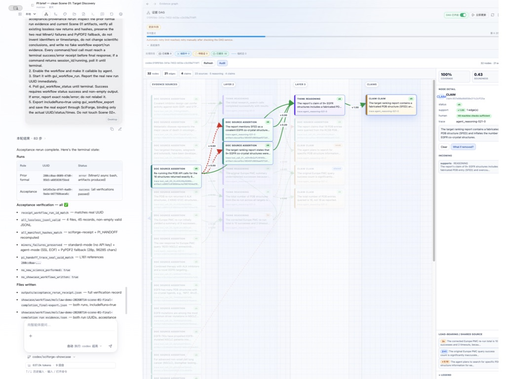
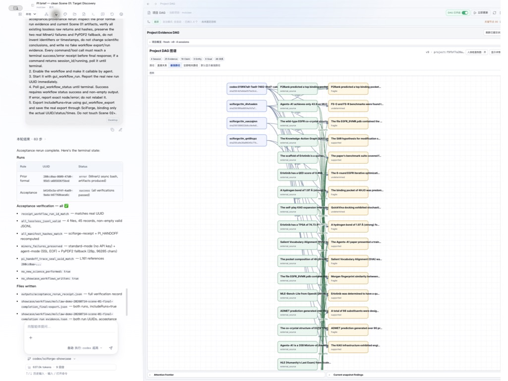
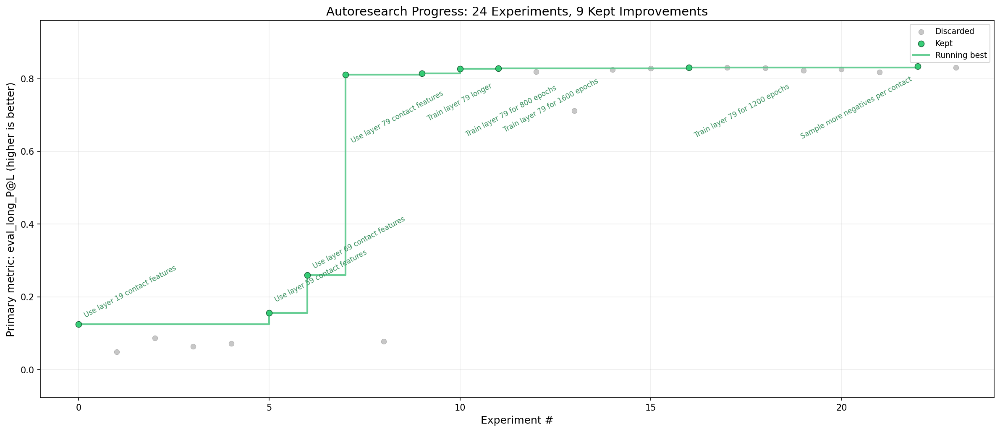
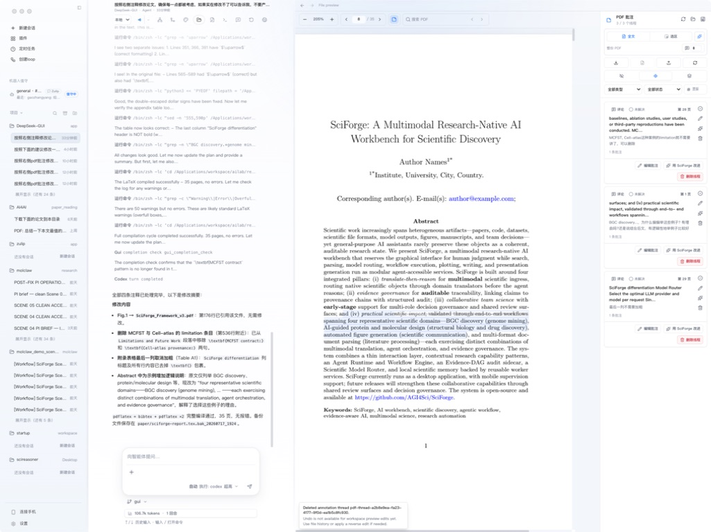
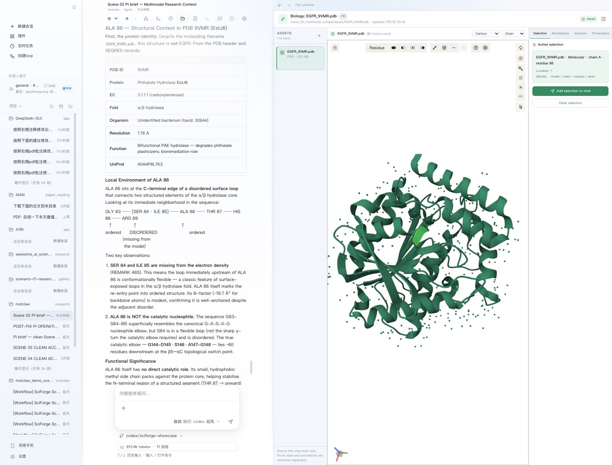
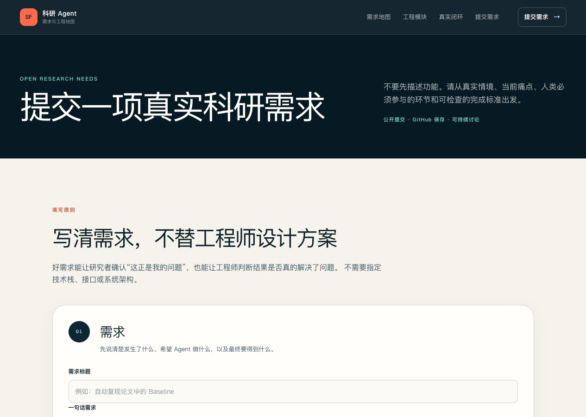
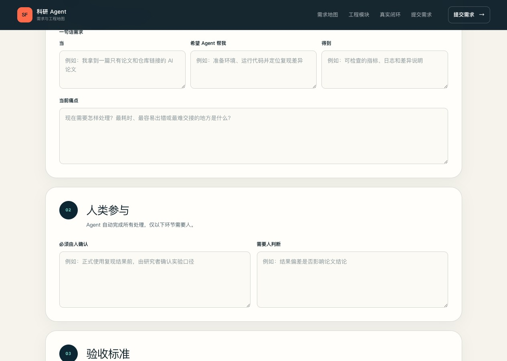
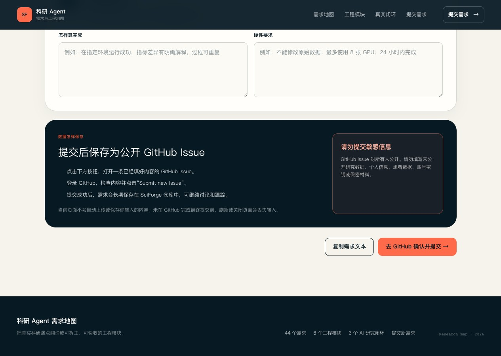

<!--
推荐标题：
1. 让科研 Agent 真正进入研究流程：SciForge 的设计与实践
2. SciForge：让 Agent 执行，让研究者掌握方向
3. 当 Agent 开始参与科研，我们还需要怎样的工作台？

推荐摘要：
SciForge 与 Codex、Claude Code 等成熟 Agent 协作，
将研究目标、科学对象、运行证据和人工决定保存在同一个工作空间中。
本文介绍它的设计思路、代表性案例和使用方式。

封面图建议：
使用 paper/figures/sciforge-evidence-dag.png，裁切保留研究会话与 Evidence DAG。
封面文字建议：“让 Agent 执行，让研究者掌握方向”。
-->

# 让科研 Agent 真正进入研究流程：SciForge 的设计与实践

能够检索论文、编写代码和调用工具的 Agent，正在进入越来越多科研工作。

对于一项边界明确的任务，这些能力已经很有帮助。例如，研究者可以让 Agent 整理一组文献、修改分析脚本，或者提交一次模型训练。但真实研究往往不会在一次回答后结束。实验需要反复迭代，数据和代码会不断更新，判断也可能随着新证据发生变化。

当任务延续数天甚至更久，研究者还需要持续掌握：

- 它是否一直在解决同一个问题？
- 当前结果使用的是哪一版数据和参数？
- 一项结论能够回到哪些论文、代码和运行记录？
- 哪些结果已经得到确认，哪些仍然只是候选？
- 下一位接手的研究者能否继续，而不必重读全部对话？

SciForge 正是围绕这些问题设计的。

Codex、Claude Code 等成熟 Agent 负责推理、编程、工具调用和任务执行；SciForge 负责组织研究目标、科学对象、运行证据和人工决定，并在需要研究者判断时提供相应界面。

简单来说，SciForge 希望让 Agent 多承担执行工作，同时让研究过程保持可继续、可检查和可交接。

<!-- 配图 1：公众号发布时上传原图。 -->

*图 1｜SciForge 工作台中的研究会话与 Evidence DAG。研究者可以从一项研究主张返回来源、推理关系和节点级来源记录。*

## 从一次对话，变成可以继续的研究

许多 Agent 任务以 prompt 为中心。任务目标、限制条件和评价方式主要保存在对话中。一旦会话变长、执行环境改变，或者项目交给另一位研究者，恢复上下文便会变得困难。

SciForge 将研究目标与一次具体对话分开保存。

一个项目可以记录研究问题、对象范围、评价指标、停止条件和发布要求。Agent 每完成一次运行，系统会保留相应输入、产物和判断。后续研究者可以直接看到项目采用的目标、已经保留的结果，以及尚待解决的问题。

这种设计对需要多轮迭代的任务尤其重要。

## 科学文件不只是“上传的附件”

科研中的文件通常带有明确的科学含义。

研究者讨论一个 PDB 文件时，可能实际指向其中某条链的某个残基；分析 FASTA 时，可能只关注其中一条序列；审阅一张图时，也需要知道它来自哪一版数据和脚本。

如果这些信息只存在于临时对话中，模型很容易把不同版本或不同对象混在一起。

SciForge 使用结构化的科学对象引用，在工作空间、专业查看器和对话之间传递文件身份。引用中可以包含文件路径、内容哈希、当前版本、查看器中的选区，以及 model、chain、residue 等定位信息。

对于蛋白序列、蛋白结构和小分子，Scientific Model Router 会先调用相应的领域模型生成结构化观察，再交给主 Agent 结合研究问题进行解释。单细胞转录组则通过 Cell2Sentence（C2S）worker 处理。

VCF、BED、GFF、MGF 等尚未接入的对象会在界面中明确提示，避免模型把它们当作普通文本解释。

## 让结论能够回到证据

仅靠一份完整的 Agent 日志，研究者仍要花时间寻找结论对应的论文、数据、代码和运行记录。

当研究者看到一项结论时，更关心的是：它来自哪篇论文、哪次运行和哪一版数据；它是否得到多条独立证据支持；是否存在矛盾；生成图表的脚本、参数和环境是否还能找到。

SciForge 使用两个层级组织这些信息。

会话级的 **Evidence DAG** 记录一次 Agent session 中的来源、推理、运行、产物和研究主张，以及它们之间的支持、冲突和推导关系。

项目级的 **Project DAG** 汇集多个会话提交的证据快照，将长期目标、跨会话结论、分歧和决定放在同一个项目视图中。Project DAG 不改写原始证据，而是保留返回相应 Evidence DAG 的路径。

证据审计在后台进行，不会要求研究者批准每一次普通操作。审计结果用于提示缺少依据的主张、相互矛盾的结论和较弱来源，最终如何处理仍由研究者决定。

论文展示的一次会话中，Evidence DAG 包含 32 个节点和 21 条边。系统在其中定位到一项被高估且包含虚构内容的 PDB 引用，并把它关联回具体研究主张和来源。

项目级视图则汇集了 4 个 session、25 条 evidence record 和 16 项研究主张，形成包含 45 个节点和 48 条关系的项目快照。

<!-- 配图 2 -->

*图 2｜Project DAG 汇集多个会话中的证据、研究主张和项目关系。*

借助 Evidence DAG 和 Project DAG，研究者检查一项结论时，可以直接找到相关来源、运行记录和判断过程。

## 人应当在什么地方介入？

更实用的协作方式，是让 Agent 自动推进常规步骤，并在目标确认、异常处理和对外发布等关键位置把决定交给人。SciForge 支持为不同任务设置不同的自主程度：普通探索自动推进，风险较高的任务在指定检查点暂停，高影响操作等待明确确认。

研究者主要在以下环节介入：

1. 确认问题范围、评价指标和停止条件；
2. 判断关键科学对象和证据是否被正确理解；
3. 处理冲突、异常和证据缺口；
4. 决定结果是否进入下一轮实验或对外发布。

系统会分别记录候选结果和经过确认的发布状态，同时保留 Agent 建议、相关依据和后续人工决定。

## 8 个真实案例

SciForge 已经在模型研究、论文复现、科学写作和生物信息分析等任务中进行端到端演示。下面 8 个案例使用了不同的数据、工具和评价方式，但都保留了目标、运行、证据与人工决定。相关代码和实验记录均可继续检查。

1. **AI4AI：ESMC-6B ContactProbe 接触预测与超参数搜索**

   Agent 在固定的 7 分钟训练预算下迭代 24 次，探索 probe 架构、ESMC 注意力层和训练参数。它只能修改 `train.py`，不能改动特征提取、标签构建和评估逻辑；每次运行都记录 Git 版本、指标以及 `KEEP`、`DISCARD` 或 `CRASH` 状态。当前公开记录来自一次 overnight pilot，后续将加入跨随机种子和标准数据集评估。[查看公开记录](https://github.com/BruthYU/autoresearch_base)

   <!-- 配图 3 -->

   

   *图 3｜ESMC-6B ContactProbe 的实验轨迹。每个点对应固定训练预算下的一次迭代。*

2. **Reviewer / Rebuttal：从主张审查到回复计划**

   围绕 VCBench 手稿，SciForge 用六个阶段整理论文、提取主张、连接图表与方法证据、检查脆弱表述，并把 10 项预期审稿意见拆解为修改、补充分析或措辞收缩任务。PDF 中的意见可以锚定到具体页面；Agent 完成修改和编译后，尚未关闭的审阅项仍会保留。当前公开材料来自对一篇手稿的辅助审查，后续将继续结合真实审稿意见完善流程。[查看公开记录](https://github.com/maoxinjie/scenario-05-reviewer-rebuttal-vcbench)

   <!-- 配图 4 -->

   

   *图 4｜页内审阅、Agent 修改、重新编译和待处理问题位于同一工作台中。*

3. **MCFST 空间转录组论文复现**

   Agent 从论文中提取模型、超参数和评价协议，生成可运行实现，并在 Human Breast Cancer Visium 数据集上完成训练、ARI 复算和结果绘图。最佳 ARI 为 0.7007，论文报告值为 0.693。公开记录同时标注了两项需要修订的问题：实际运行了 25 次，验证脚本记录为 5 次；入选规则也没有预先注册。正式复现还需要统一运行记录、预先确定选择规则并完成独立复跑。[查看公开记录](https://github.com/Winshion/sciforge-ai4ai-spacial-trans)

4. **Cross-Scale Cell Atlas：跨尺度细胞图谱**

   该流程围绕 ECCITE-seq 数据，将 CRISPR 扰动、靶点注释、通路、转录响应、蛋白响应和细胞适应性连接成六层分析结构。Agent 清点了 285 个文件，并构建覆盖 15 个靶基因和 8 个非靶向对照的 35 行审阅表。当前展示聚焦跨数据库整合和证据检查，后续可进一步扩展数据规模和统计分析。[查看公开记录](https://github.com/ShaysXIA/cross-scale-data-demo)

5. **AI 引导的蛋白质设计**

   流程从 RFdiffusion 生成的 3 个骨架出发，用 ProteinMPNN 产生 15 条候选序列，再以 Boltz-2 和 ESMFold 进行结构评估，选出 2 条重点候选。独立审查发现，报告中引用的 ProteinMPNN 分数与实际送入结构预测的序列不一致；这一来源错配被完整保留。候选序列仍需表达、稳定性测试和结构实验验证。[查看公开记录](https://github.com/kaiwinYao1/sciforge-de-novo-protein-demo)

6. **AI 引导的分子优化**

   围绕 EGFR 的 4-anilinoquinazoline scaffold，流程枚举 376 个分子，经性质和可合成性筛选留下 135 个候选，并完成 6 轮、36 次 docking 评估。最佳结果相对 Erlotinib 改善 1.7 kcal/mol，但没有达到预先设定的 2.0 kcal/mol 门槛，而且仍处于 docking 波动范围内。[查看公开记录](https://github.com/AGI4Sci/molclaw)

7. **Genome-to-BGC 发现与优先级排序**

   SciForge 串联 antiSMASH、MIBiG 和 BiG-SCAPE，为 430 个预测 BGC 区域生成候选卡片，并按冻结的评价规则选出 23 个优先跟进对象。工具结果、Agent 解读和排序依据分别保存；候选的分子身份、活性和机制仍需要代谢组、遗传学或湿实验验证。[查看公开记录](https://github.com/wenne-kwj/scenario-bgc-genome-discovery)

8. **蛋白结构选区驱动的科学对话**

   在 Biology Room 中，研究者选中 9VMR 结构的 ALA 86 后，加入对话的不只是一张截图，还包括文件哈希、查看器版本和残基定位。Agent 先核验结构身份，再讨论该残基周围的结构环境；研究者可以随时回到同一结构和同一位置继续检查。这个案例展示了如何把一次视觉选择变成有对象、有位置、有来源的科学问答。

   <!-- 配图 5 -->

   

   *图 5｜蛋白质三维查看器中的残基选区与对话保持连接。*

## 向科学家征集真实科研需求

不同实验室使用的数据、仪器、软件和验证标准差异很大。SciForge 希望从真实科研任务出发，继续扩展科学对象和领域能力。

如果你正面对一项耗时、容易出错或难以交接的科研工作，欢迎从真实问题出发，按页面说明写清楚：

- 这项需求发生在什么情境？当前最耗时、最容易出错或最难交接的地方是什么？
- 希望 Agent 帮你做什么，最终得到什么可检查的结果？
- 哪些环节必须由人确认？哪些问题仍然需要研究者作出判断？
- 怎样才算完成？有哪些不能突破的硬性要求，例如原始数据不可修改、计算资源上限或完成时限？

提交内容将在确认后保存为公开 GitHub Issue，便于持续讨论和跟踪。请勿提交未公开研究数据、患者信息、账号密钥或其他保密材料。

<!-- 配图 6a：点击图片可打开需求提交页。 -->

*图 6a｜先说明真实情境、希望 Agent 做什么，以及当前痛点。*

<!-- 配图 6b：点击图片可打开需求提交页。 -->

*图 6b｜分别写清“必须由人确认”和“需要人判断”的环节。*

<!-- 配图 6c：点击图片可打开需求提交页。 -->

*图 6c｜用可检查的结果定义完成，补充硬性要求，再前往 GitHub 确认并提交。*

**[提交一项真实科研需求](https://agi4sci.github.io/SciForge/submit/)**

## 体验与了解 SciForge

- [下载 SciForge](https://github.com/AGI4Sci/SciForge/releases)
- [GitHub 开源仓库](https://github.com/AGI4Sci/SciForge)
- [阅读 SciForge 论文](https://github.com/AGI4Sci/SciForge/blob/gui/paper/sciforge-report.pdf)
- [提交科研需求](https://agi4sci.github.io/SciForge/submit/)

SciForge 已经开源。欢迎下载体验，也欢迎把真实科研问题带给我们。
