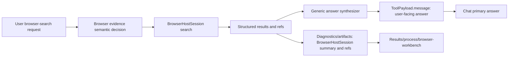

# Browser Search Answer Synthesis Design

## Goal

When a user asks SciForge to use the built-in browser for search, the main chat answer must contain useful synthesized content, not only a BrowserHostSession evidence summary or a list of links. BrowserHostSession still owns the live browser session, search results, screenshots, DOM, AX, logs, and refs-first evidence; the user-visible answer is a separate synthesis layer over that evidence.

## User Requirement

The default behavior for requests such as `通过内置浏览器搜索伊朗局势` is:

- Run the search through BrowserHostSession.
- Return a substantive answer in the user's language.
- Cite source URLs from the search results.
- Keep raw browser/search evidence available in process, artifacts, and refs.
- Avoid returning only links, raw result dumps, or `BrowserHostSession search:` as the primary answer.

The change must be generic. It must work for current-news, technical, product, factual, and broad exploratory browser-search requests without topic-specific keyword branches.

## Non-Goals

- Do not create a second browser owner or browser agent. BrowserHostSession remains the only live browser owner.
- Do not inline raw DOM, screenshots, logs, base64, or full page text into the chat answer.
- Do not hardcode topic-specific behavior for Iran, Hugging Face, OpenAI, or any other query.
- Do not claim certainty when search results are sparse, conflicting, stale, or only snippets are available.

## Architecture

Add a generic answer-synthesis boundary after BrowserHostSession search evidence is collected.

1. Intent routing decides whether browser evidence is needed.
2. BrowserHostSession executes the search and returns bounded structured results plus refs.
3. A generic search-answer synthesizer converts structured results into a user-facing answer.
4. The raw BrowserHostSession summary is folded into process diagnostics or artifacts.
5. ResultPresentation, claims, citations, object references, and browser-workbench projection preserve evidence for inspection.

This makes `message` represent the answer, while BrowserHostSession refs represent how the answer was grounded.

## Components

### BrowserHostSession Search Runtime

`src/runtime/browser-host-search-runtime.ts` should produce a ToolPayload whose `message` is a concise answer synthesized from `BrowserHostSearchOutput.results`. The existing `browserHostSearchSummary` output should move to an audit/process diagnostic artifact or diagnostic ref.

### Generic Search Answer Synthesizer

Create a small, deterministic helper near the browser search runtime. It should:

- Detect the user's likely language from the prompt.
- Summarize top results using title, snippet, URL, and search metadata.
- Produce source-linked bullets or paragraphs.
- Include an uncertainty sentence when evidence is limited.
- Preserve all source URLs used in citations.

The helper must not branch on specific topics. It may use generic request-shape signals such as "news/current situation", "latest version", "comparison", "how-to", "definition", or "broad research", but these must be treated as presentation styles, not routing truth.

### Agent Host Turn Loop

`src/runtime/codex/agent-host-turn-loop.ts` should keep forwarding the ToolPayload result, but its final `message` should now be the synthesized answer. Agent Host should continue carrying BrowserHostSession artifacts, execution units, claims, and evidence refs.

### UI Normalization

UI tests should require BrowserHostSession browser-search results to complete without `gui.present`, while also ensuring the primary chat content is not a raw search summary. Browser evidence belongs in process/results panes and references.

## Data Flow

## Error Handling

- If no search results are found, return a user-facing explanation and next-step suggestion, not a raw runtime failure.
- If BrowserHostSession fails, preserve the existing fail-closed diagnostic behavior.
- If results are present but snippets are thin, answer with a limited-evidence summary and cite the available URLs.
- If sources conflict, present the conflict explicitly and avoid a single overconfident conclusion.

## Testing

Focused tests should cover:

- Chinese request: `通过内置浏览器搜索伊朗局势` returns substantive Chinese answer text and source URLs, not a primary `BrowserHostSession search:` dump.
- English current-fact request returns a concise answer with citations.
- Broad exploratory request returns a summary plus "based on available search snippets" uncertainty.
- Empty-result output produces a readable partial answer and keeps repair-needed status.
- BrowserHostSession refs, search-result artifact, browser-workbench UI manifest, execution unit, and object references remain present.
- No topic-specific hardcoding: fixture queries should vary across news, software version, technical concept, and product query.

## Acceptance Criteria

- The main chat answer answers the user's information need after search.
- Search evidence remains refs-first and inspectable.
- No raw DOM, base64, private provider data, or full browser dumps appear in primary chat.
- Tests fail if the primary answer starts with or is dominated by `BrowserHostSession search:`.
- The implementation is generic and does not special-case the user's example topic.
