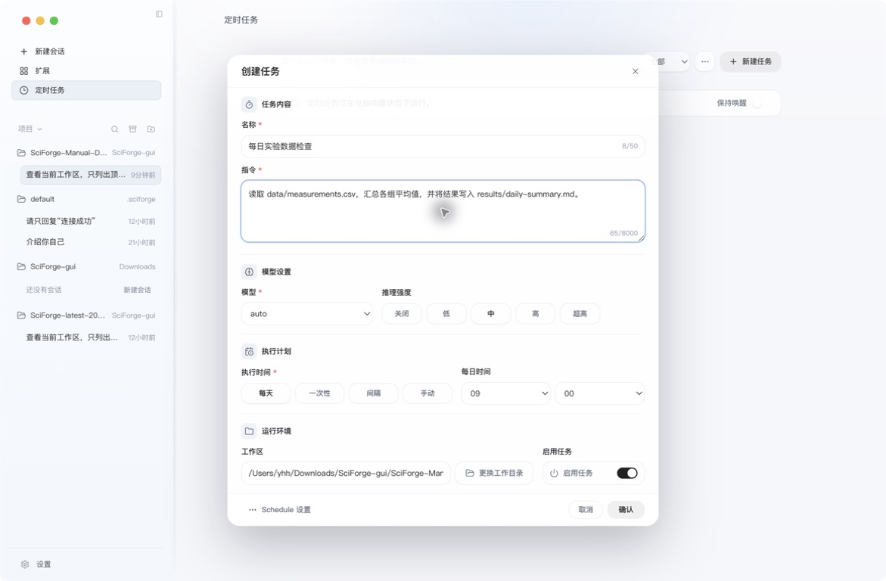
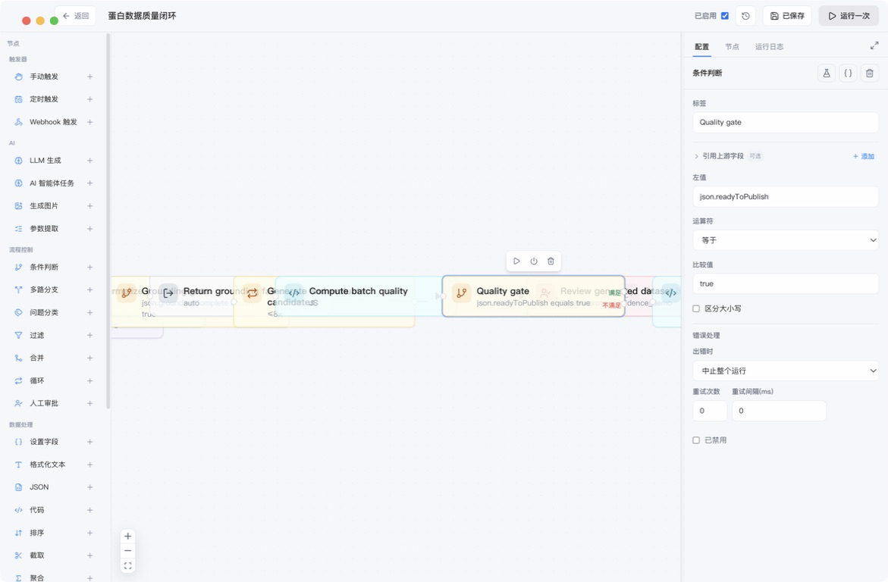

# 自动化

_让一次明确的任务按计划运行，或把多个步骤连接成可重复的 Loop。_

---

## 选择哪一种

| 需求 | 使用入口 |
| --- | --- |
| 每天、一次性或按间隔运行一条 AI 指令 | 定时任务 |
| 随时手动启动同一条任务 | 定时任务 |
| 把 AI 任务、条件判断和 HTTP 请求连接起来 | Create Loop |
| 通过定时、Webhook 或 AI 调用触发多步流程 | Create Loop |

先用普通会话验证任务可以正确完成，再把它改成自动化。

## 1. 创建定时任务

点击左侧的 **定时任务**，然后点击 **新建任务**。

*图 1：创建任务时集中填写名称、指令、模型、执行时间和工作区*

按顺序填写：

1. **名称**：用一句话说明任务用途。
2. **指令**：写清输入、操作和输出格式。
3. **模型与推理强度**：通常先保留 `auto`。
4. **执行时间**：选择每天、一次性、间隔或手动。
5. **工作区**：选择任务读取和写入的项目目录。
6. 保持“启用任务”开启，点击 **确认**。

一个适合定时运行的指令示例：

> 检查当前工作区中昨天新增的实验日志，生成三条以内的进展摘要，并把结果保存为 reports/daily-summary.md。

定时任务要求 SciForge 保持运行，并且电脑在触发时间处于唤醒状态。页面顶部的 **保持唤醒** 只会在任务已经运行时阻止应用挂起；它不会在计划触发前持续阻止系统睡眠，也不能唤醒已经睡眠的电脑。

## 2. 运行和查看任务

创建后，任务会出现在列表中。你可以：

- 等待计划时间自动运行
- 在需要时手动启动
- 暂停或重新启用任务
- 打开运行记录查看结果

修改指令前，先查看最近一次结果，避免把已经验证过的输入和输出约定丢失。

## 3. 创建 Loop

需要多步流程时，回到会话并点击顶部工具栏的 **创建 Loop**。

*图 2：Create Loop 画布连接处理节点；选中节点后可在右侧检查和修改条件*

最短使用方式：

1. 点击 **新建创建loop**。
2. 添加 AI 任务、条件判断或 HTTP 请求节点。
3. 连接节点并配置每一步的输入和输出。
4. 选择手动、定时或 Webhook 触发器。
5. 先手动运行一次，确认每个节点的结果。
6. 验证后再开启“启用”或“AI 可调用”。

也可以直接在对话中要求助手生成、校验或运行 Loop，但仍应先查看生成的节点和触发方式。

## 自动化完成标志

- 任务或 Loop 指向正确的工作区
- 指令中的输入与输出位置明确
- 手动测试能够得到预期结果
- 列表中可以看到启用状态和最近运行结果

## 下一步

- [科研工作流](./Scientific-Workflows.zh-CN.md)
- [研究档案与证据](./Intervention-and-Data.zh-CN.md)
- [Cloud 协同](./Cloud-Collaboration.zh-CN.md)
