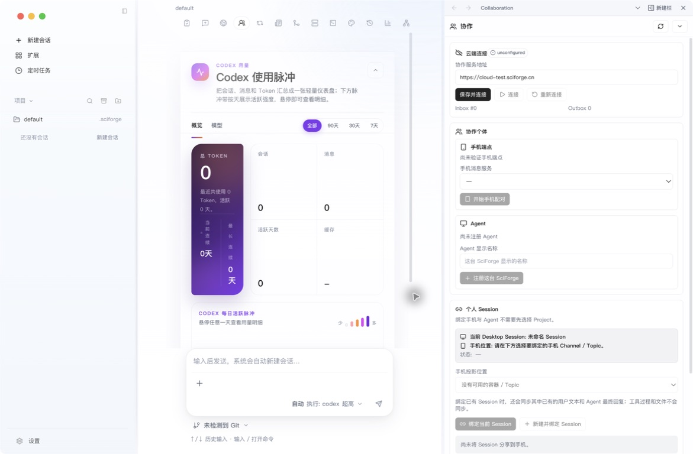
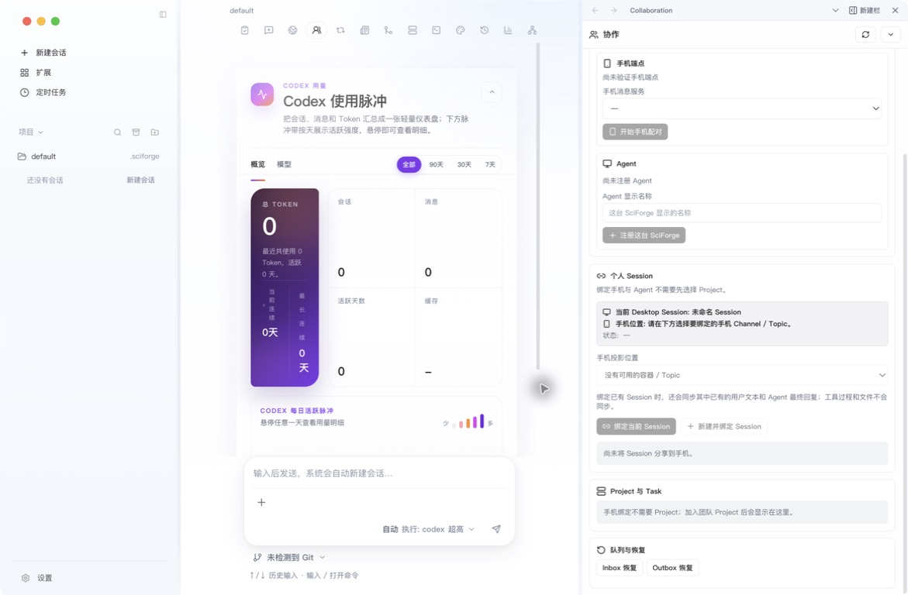

# Cloud 协同

_把固定的 Desktop Session 连接到手机 Topic，并在加入团队后处理 Project 与 Task。_

---

## 什么时候使用

需要离开电脑后继续同一个 Session，或让多人围绕 Project 分配和验收 Task 时，使用 Cloud 协同。它与远程工作区相互独立。

## 开始前

请先准备：

- 项目负责人提供的最新版正式 SciForge Desktop
- 正常的网络连接和可用的系统浏览器
- 管理员提供的 SciForge Cloud 地址和账号
- 官方 Zulip 手机 App 与个人账号
- 已经配置好的模型与 AI 助手
- 一个准备绑定的本地 Session

普通用户应使用正式 Desktop 程序完成登录，不要使用地址为 `127.0.0.1:5173` 的开发预览页面。

## 1. 完成统一登录

SciForge Desktop 统一登录确认两件事：当前登录的是哪个 SciForge Cloud 用户，以及当前这台 Desktop 是否已获得该用户的云端授权。

| 状态 | 作用 | 完成标志 |
| --- | --- | --- |
| 本地账户 | 在本机显示名称和归属标记 | Identity 中已经选中一个本地账户 |
| Cloud 登录 | 确认当前 SciForge Cloud 用户 | 顶部 Identity 显示已登录 |
| Desktop 注册 | 授权当前安装访问 Cloud 能力 | 显示“此 Desktop 已连接” |

本地账户不是云端账号，也不是安全认证。仅使用本地工作区、会话和工具时可以不登录 Cloud；Cloud 协同需要同时完成 Cloud 登录和 Desktop 注册。

### 打开 Identity

在工作台顶部点击 **Identity**，进入“本地账户”和“SciForge 云端”面板。

### 选择本地账户

如果系统提示先选择或创建本地账户：

1. 输入一个容易识别的显示名称。
2. 点击 **创建账户**，或选择已经存在的本地账户。

本地显示名称不需要与 SciForge Cloud 用户名相同。

### 使用浏览器登录

1. 在“SciForge 云端”中点击 **使用浏览器登录**。
2. 在系统浏览器输入自己的 SciForge Cloud 账号和密码。
3. 浏览器显示 `SciForge login completed` 后，关闭该标签页并返回 SciForge。

登录过程不需要手工配置 Token，也不要把账号密码或 Token 复制到 SciForge 中。

### 注册当前 Desktop

返回 Desktop 后，如果看到“此 Desktop 尚未连接”，点击 **注册这台 Desktop**。

当 Identity 面板同时显示已登录和“此 Desktop 已连接”时，统一登录才算完成。仅在浏览器中看到 `login completed`，还不能说明设备注册已经完成。

### 检查登录结果

确认以下状态：

- 顶部 Identity 显示已登录
- 页面不再显示“登录”或“重试登录”
- Identity 面板显示“此 Desktop 已连接”
- 页面没有红色错误提示

> **成功标志：** Identity 面板显示已登录，并显示“此 Desktop 已连接”。

## 2. 连接协同服务

打开一个 Session，在顶部点击 **协作**：

1. 在“协作服务地址”填写管理员提供的 SciForge Cloud 地址。
2. 点击 **保存并连接**。
3. 等待“云端连接”变为已连接。

*图 1：协作面板从云端连接开始，随后配置手机端点、Agent 和个人 Session*

协同服务地址必须与当前 Identity 使用的 SciForge Cloud 地址一致。

## 3. 配对手机端点

在“协作个体”中完成手机配对：

1. 选择手机消息服务。
2. 点击 **开始手机配对**。
3. 复制桌面生成的一次性配对指令。
4. 在官方 Zulip App 中按页面提示原样发送。
5. 返回桌面，等待“手机端点已验证”。

当前手机端使用官方 Zulip App，不需要安装单独的 SciForge 手机应用。

## 4. 准备这台 SciForge

1. 在本机配置并启动可用的 Agent Runtime。
2. 确认当前 OIDC User 与 ACTIVE Device 已就绪。
3. Identity 会自动为当前 Device ensure 或复用唯一 Agent，无需注册或选择主要 Agent。

个人 Session 会固定到建立投影时的当前 Device Agent；Project Task 则只选择 Worker User，由其某台合格 Device claim。

## 5. 准备私人受管 Channel

当面板出现“私人受管 Channel”后：

1. 创建或检查私人 Channel。
2. 在手机 Zulip 中为不同目标创建 Topic。
3. 回到 SciForge，点击 **刷新手机 Topic**。

一个 Channel 可以包含多个 Topic；建议一个 Topic 对应一个持续目标。

## 6. 绑定个人 Session

切换到要继续使用的 Desktop Session，然后：

1. 在“手机投影位置”选择 Channel / Topic。
2. 点击 **绑定当前 Session**；也可以点击 **新建并绑定 Session**。
3. 核对面板中的 Desktop Session 与手机位置。

绑定已有 Session 时会同步已有的用户文本与 Agent 最终回复。工具过程、执行状态和文件不会同步到手机。

## 7. 从手机完成一次测试

在刚绑定的 Topic 中发送一个简单任务，例如：

> 回复“Cloud 协同已连接”，不要读取或修改文件。

确认：

- 消息进入绑定的 Desktop Session
- 只触发一次 Agent 任务
- 最终回答回到原来的 Topic

需要另一个独立上下文时，新建 Session，并绑定到另一个 Topic。

## 8. 查看 Project 与 Task

加入团队 Project 后，“Project 与 Task”区域会显示共享目标、分工和验收状态。手机 Session 绑定不要求先加入 Project。

*图 2：个人 Session 映射、Project 与 Task、队列恢复位于同一个协作面板中*

常见分工是：

- Coordinator 维护计划、创建或改派 Task，并验收结果
- Coordinator 选择 Worker User；Cloud 向该 User 的合格 Device Agent 广播 Offer
- 首个 claim 的 Device 执行 Task；本机忽略不产生 User 全局拒绝

## 完成标志

- SciForge Cloud 已登录，Desktop Device 可用
- 协作面板显示云端已连接
- 手机端点已验证，Agent 已注册
- 一个 Topic 已绑定到固定 Session
- 手机测试消息在原 Topic 收到一次回复

## 日常登录管理

### 重启与重新认证

正常关闭并重新打开 SciForge 后，系统会自动恢复登录状态，一般不需要再次打开浏览器。如果 Identity 提示“重新认证”，点击该按钮并在系统浏览器重新登录。

### 退出登录与撤销 Desktop

| 操作 | 结果 | 什么时候使用 |
| --- | --- | --- |
| **退出云端登录** | 结束当前 Cloud 会话；本地功能仍可继续使用，通常不会删除设备注册 | 临时退出或准备切换账号 |
| **撤销这台 Desktop** | 当前设备失去云端授权 | 这台设备不再使用，或需要明确移除其访问权限 |

临时退出时通常只需要选择 **退出云端登录**，不需要撤销 Desktop。

### 切换 Cloud 账号

1. 点击 **退出云端登录**。
2. 确认系统浏览器中的旧账号已经退出。
3. 再次点击 **使用浏览器登录**。
4. 使用目标账号登录，并返回 Desktop 检查设备连接状态。

如果系统提示当前安装属于另一位用户，请使用独立的 Desktop 安装或独立用户配置，不要复制或覆盖原用户的会话与设备数据。

## 下一步

- [附录 A 工作区与会话](./Workspaces-and-Sessions.zh-CN.md)
- [自动化](./Automation-and-Scheduled-Tasks.zh-CN.md)
- [研究档案与证据](./Intervention-and-Data.zh-CN.md)

更完整的消息规则、映射管理和多人协作说明见 [手机与多人协作使用手册](../collaboration-user-guide.zh-CN.md)。

---

_最后验证：2026-08-27 · test_colab · macOS · SciForge 浅色模式_
