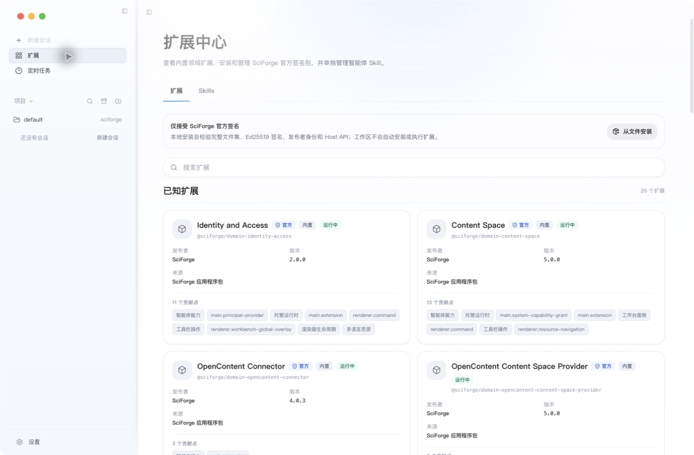
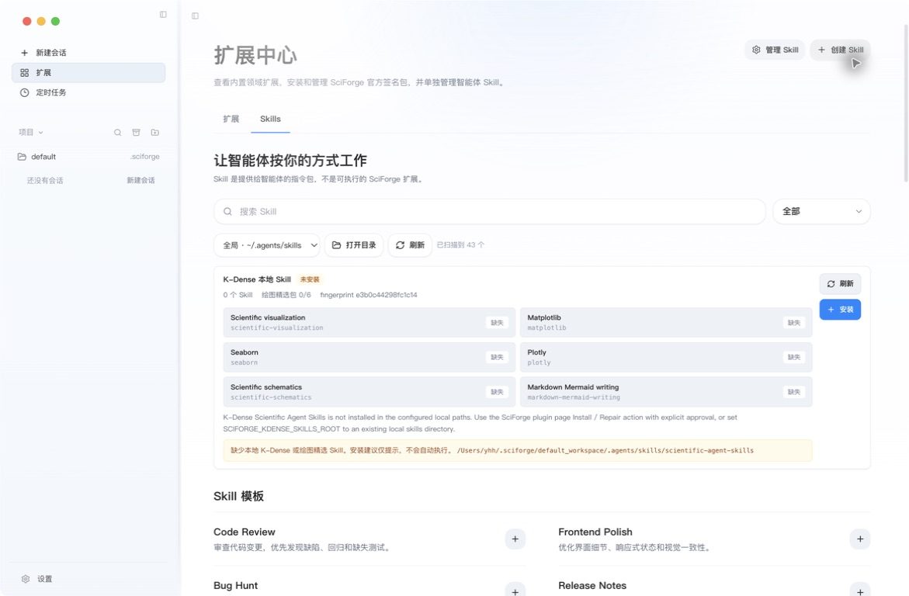

# 插件、Skills 与 MCP

_为 SciForge 增加新的界面、领域能力、工作方法和工具。_

---

## 三者有什么区别

| 类型 | 作用 | 例子 |
| --- | --- | --- |
| 插件（扩展） | 为 SciForge 增加面板、命令、预览器或托管能力 | Collaboration、Scientific Plotting、Computer Use |
| Skill | 告诉 AI 助手如何完成一类任务的指令包 | 代码审查、科学可视化、实验分析流程 |
| MCP | 把结构化工具提供给 AI 助手调用 | 科研搜索、绘图、定时任务、Computer Use |

SciForge 界面把插件称为“扩展”。普通用户主要在“扩展中心”管理扩展和 Skills；这里没有单独的 MCP 标签。由内置扩展提供的 MCP 工具会按当前运行时和工作区接入。

## 1. 查看插件

点击左侧的 **扩展**，进入“扩展中心”。

页面会列出当前可用的官方扩展。每张卡片显示发布者、版本、来源、运行状态和贡献能力。

1. 在搜索框中输入功能名称。
2. 确认扩展显示为“官方”“内置”“运行中”。
3. 回到会话，在顶部工具栏、右侧栏或命令入口中打开对应功能。

*图 1：当前版本的扩展中心显示 26 个可见的内置扩展，并列出每个扩展的版本、来源与贡献能力*

需要安装本地扩展包时，点击 **从文件安装**，选择 `.sciforge-plugin` 文件。SciForge 会在安装前校验官方签名；工作区中的文件不会自动成为扩展。

## 2. 管理 Skills

在扩展中心切换到 **Skills** 标签：

1. 选择 Skill 目录；打开工作区后默认使用 `<workspace>/.agents/skills`，未打开工作区时使用全局目录 `~/.agents/skills`。
2. 点击 **刷新**，重新扫描目录。
3. 使用搜索和筛选找到需要的 Skill。
4. 点击 **创建 Skill** 新建指令包，或从模板点击 **添加**。

*图 2：Skills 页面显示目录、扫描结果、K-Dense 状态、模板与已经添加的 Skill*

Skill 是给助手阅读的工作说明，不是 SciForge 扩展，也不会单独增加一个应用面板。

## 3. 使用 MCP 工具

MCP 工具通常由 SciForge、已启用扩展或当前 AI 助手托管。对话中直接描述任务，助手会在可用时选择对应工具，例如：

> 搜索最近 7 天关于 protein design 的论文，并按研究方向归类。

> 根据工作区中的 CSV 生成带置信区间的科研图表，并保存图表与数据说明。

要确认某类 MCP 是否可用，可以：

- 在扩展中心确认对应扩展处于“运行中”
- 在当前工作区新建会话，发送一个最小测试任务
- 查看任务过程是否出现预期的工具调用和结果

扩展中心没有独立的 MCP 安装页。需要使用外部 MCP 时，按当前 AI 助手的配置方式添加；需要确认 SciForge 内置 MCP 时，直接发送一个最小任务并查看执行过程。

K-Dense Scientific Agent Skills 的安装与高级配置见 [K-Dense Scientific Agent Skills 接入](../kdense-scientific-skills-mcp.zh-CN.md)。

## 4. 启用 Computer Use

如果任务需要操作桌面界面，先打开 **设置 → AI 助手 → Computer use**：

1. 开启 Computer Use。
2. 选择允许使用它的运行时。
3. 查看 Backend 状态。
4. 在 macOS 上确认辅助功能和屏幕录制均已授权。

*图 3：Computer Use 页面显示总开关、运行时接入、Backend 状态与系统权限*

然后在会话中明确说明要操作的应用、目标和停止条件。

## 选择哪一种方式

- 想增加一个 SciForge 面板或领域功能：使用**插件（扩展）**
- 想让助手长期遵循一套方法：使用 **Skill**
- 想让助手调用结构化外部工具：使用 **MCP**

## 下一步

- [科研工作流](./Scientific-Workflows.zh-CN.md)
- [自动化](./Automation-and-Scheduled-Tasks.zh-CN.md)
- [模型runtime](./Runtimes-and-Models.zh-CN.md)
