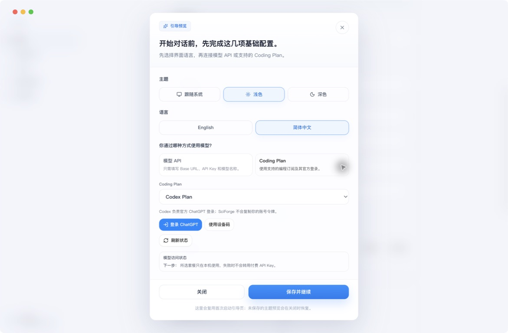
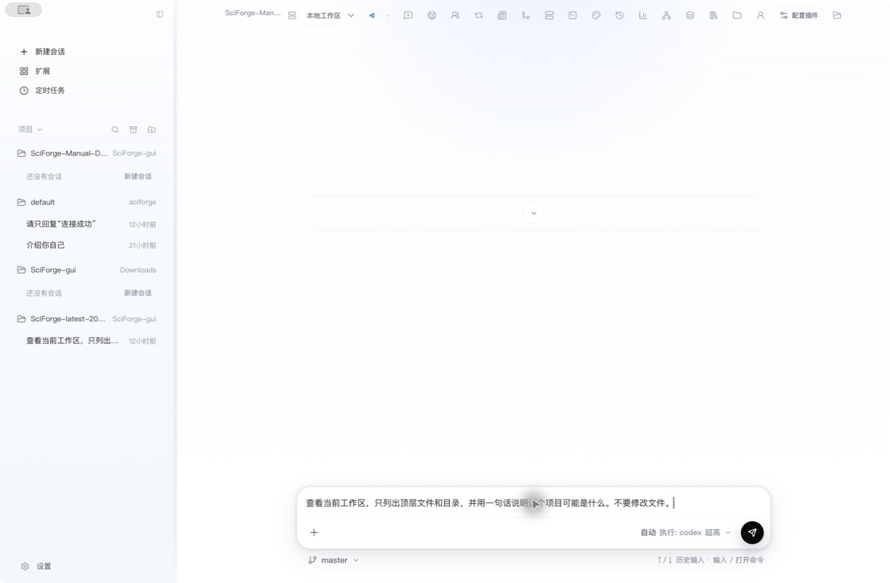
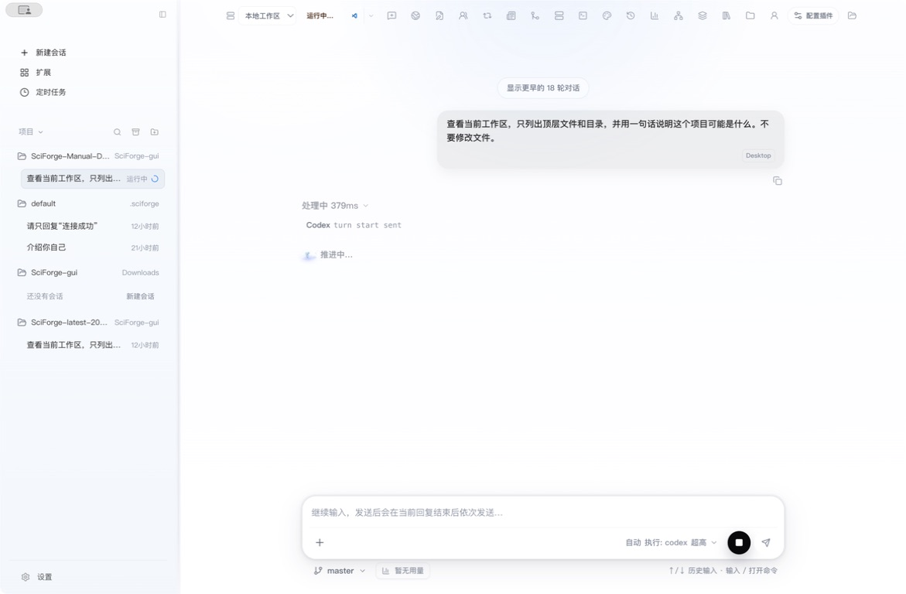
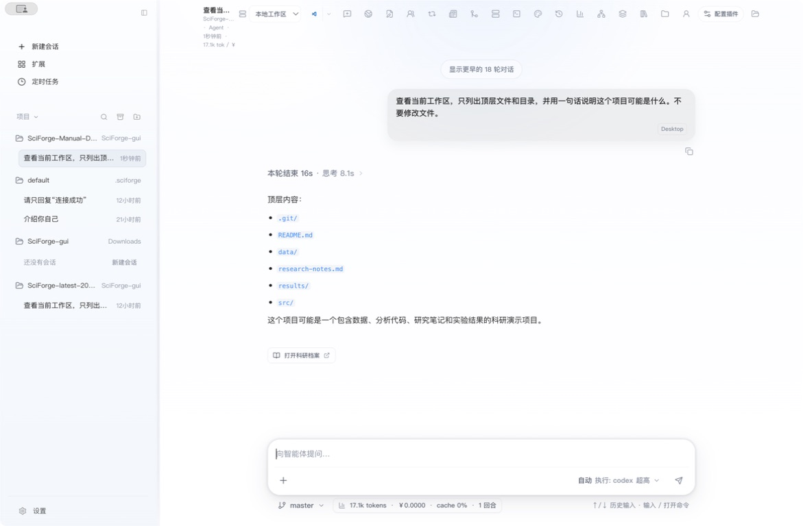

# 快速开始

_用大约 5 分钟连接模型，并在 SciForge 中完成第一个任务。_

---

## 什么是 SciForge

SciForge 是一个面向科学研究的本地 AI 工作台。Codex 或 Claude Code 负责执行任务；SciForge 负责组织工作区、展示执行过程，并把文件变更、研究记录和结果留在同一个项目中。

完成本页后，你将能够：

- 连接可用的模型服务
- 确认负责执行任务的 AI 助手
- 打开一个工作区并完成第一个只读任务
- 找到最终回答、文件和本次任务产生的变更

> **开始前：** 请先安装并打开 SciForge，同时准备好模型 API，或一个受支持的 Coding Plan。

## 1. 配置模型

第一次打开 SciForge 时，应用会显示基础配置向导。按偏好选择主题和语言，然后选择模型接入方式；本页配图使用浅色模式和简体中文。

*图 1：首次配置向导提供“模型 API”和“Coding Plan”两种接入方式*

### 使用模型 API

如果你通过 API 使用模型，请选择 **模型 API**，依次填写：

1. `Base URL`
2. 上游协议；不确定时保留“自动探测并协商”
3. `API Key`
4. 模型名称

点击 **检查配置**。检查通过后，点击 **保存并继续**。

*图 2：模型 API 需要填写 Base URL、API Key 和模型名称*

### 使用 Coding Plan

如果你通过编程订阅使用模型，请选择 **Coding Plan**：

1. 选择 `Codex Plan`
2. 点击 **登录 ChatGPT**，或选择 **使用设备码**
3. 登录完成后点击 **刷新状态**
4. 点击 **保存并继续**

> **成功标志：** SciForge 进入工作台，“新建会话”可以正常使用。

## 2. 选择 AI 助手

模型接入决定任务使用哪条模型链路；AI 助手决定任务由哪个运行时执行。

在输入框右下角打开运行时菜单，然后确认执行助手：

- 使用 `Codex Plan` 时，当前会话会绑定 `Codex`
- 使用模型 API 时，可以选择已经配置好的 `Codex` 或 `Claude Code`
- 推理强度可以保持默认值，稍后再根据任务复杂度调整

*图 3：运行时菜单显示模型路由、当前执行助手和推理强度*

> **成功标志：** 输入框右下角显示 `执行: codex` 或 `执行: claude`；输入任务后，发送按钮变为可用。

## 3. 完成第一个任务

### 打开工作区

工作区是 AI 助手读取和处理文件的项目目录。

你可以直接使用默认工作区，也可以点击左侧项目区域的 **更换工作目录**，选择自己的论文、代码或数据目录。选择后，工作区会出现在左侧项目列表中。

### 新建会话

选中工作区后，点击 **新建会话**。此时页面会显示输入框；SciForge 会在你发送第一条消息后创建会话，并根据这条消息生成会话名称。

*图 4：选中的工作区显示在左侧；第一条消息发送前，会话还没有正式创建*

### 发送任务

先从一个不会修改文件的任务开始。将下面的内容粘贴到输入框：

> 查看当前工作区，只列出顶层文件和目录，并用一句话说明这个项目可能是什么。不要修改文件。

确认输入框右下角显示了正确的执行助手，然后点击 **发送**。

*图 5：在发送前检查任务内容、执行助手和当前工作区*

### 查看执行过程

任务开始后，你会看到：

- 左侧会话状态变为“运行中”
- 页面中间持续显示执行步骤和工具结果
- 输入框旁出现 **停止** 按钮
- 当前任务结束前，新消息会进入发送队列

*图 6：任务运行时可以查看进度，也可以停止任务或排队发送下一条消息*

### 查看结果

任务结束后，最终回答会显示在会话中，输入框也会恢复为可发送状态。

*图 7：最终回答、会话名称和结果入口会保留在当前会话中*

完成后可以继续检查：

- **文件**：查看当前工作区中的文件
- **变更**：确认本次任务是否修改了文件
- **打开科研档案**：查看本次任务沉淀的研究记录

> **完成标志：** 你能看到最终回答，输入框恢复可用，左侧保留了自动命名的会话。对于本例，“变更”中应当没有文件修改。

## 下一步

你已经完成了 SciForge 的第一次任务。接下来可以根据需要阅读：

- [模型runtime](./Runtimes-and-Models.zh-CN.md)
- [科研工作流](./Scientific-Workflows.zh-CN.md)
- [研究档案与证据](./Intervention-and-Data.zh-CN.md)
- [插件、Skills 与 MCP](./Extensions-Skills-and-MCP.zh-CN.md)
- [自动化](./Automation-and-Scheduled-Tasks.zh-CN.md)
- [远程工作区](./Remote-Workspaces.zh-CN.md)
- [Cloud 协同](./Cloud-Collaboration.zh-CN.md)

如果希望进一步了解工作区、会话、文件引用和变更查看，请阅读 [附录 A 工作区与会话](./Workspaces-and-Sessions.zh-CN.md)。

---

_最后验证：2026-08-27 · macOS · SciForge 浅色模式_
