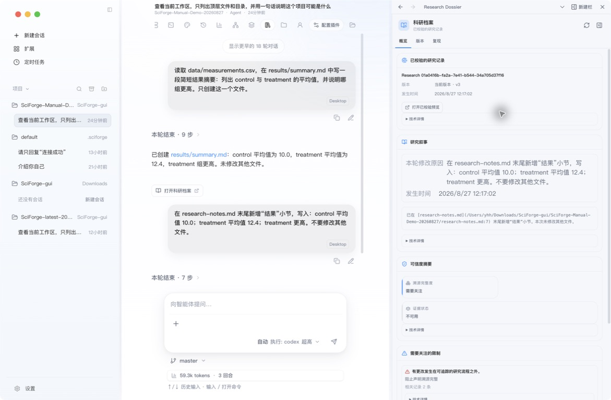

# 研究档案与证据

_把一次任务的结论、版本、来源和产物整理成可以继续使用的研究记录。_

---

## 什么时候使用

当一次会话产生了需要保留的分析、图表、实验结果或重要结论时，打开科研档案。它比单独保存一段最终回答更适合后续复查和继续研究。

| 入口 | 记录什么 |
| --- | --- |
| 科研档案 | 当前研究产物、版本和复现信息 |
| 证据 DAG | 主张、来源以及它们之间的支持关系 |
| 产物版本 | 图表、文件等产物的历史版本 |
| Git Checkpoints | 工作区代码与文件的阶段性状态 |

## 1. 打开科研档案

完成任务后，可以从两个位置进入：

- 最终回答下方的 **打开科研档案**
- 会话顶部工具栏的 **科研档案**

*图 1：科研档案详情同时显示研究叙述、当前版本、可信度摘要和需要关注的限制*

面板会显示最近的研究记录。点击一条记录后，可以查看当前内容、版本变化和复现信息。

## 2. 让记录更完整

发送任务时，直接说明需要保留的内容：

> 完成分析后，把研究问题、输入文件、使用的方法、关键参数、结果和局限整理到科研档案。

建议至少包含：

- 研究问题与范围
- 使用的文件、论文或其他来源
- 方法、命令和关键参数
- 主要结果与尚未确认的内容
- 生成的文件或图表位置

后续在同一会话继续任务时，科研档案会在同一个研究产物身份上迭代版本。

## 3. 查看证据关系

当任务产生带来源的主张时，打开 **证据 DAG**，然后点击 **更新**：

1. 找到缺少来源的结论。
2. 检查多个结论是否依赖同一份材料。
3. 发现冲突时，回到会话要求补充来源或调整表述。

证据 DAG 只在当前工作区和会话已经产生相应证据数据时显示内容。没有数据时，先让助手在任务中明确记录主张与来源。

## 4. 保存阶段性产物

不同内容使用不同入口：

| 你要保留的内容 | 使用入口 |
| --- | --- |
| 一次研究过程的叙述与结论 | 科研档案 |
| 结论与来源的对应关系 | 证据 DAG |
| 图表或其他生成产物的迭代 | 产物版本 |
| 代码和工作区文件的阶段状态 | Git Checkpoints |
| 当前会话实际修改的文件 | 变更 |

这些记录相互补充：会话说明“发生了什么”，档案说明“得到了什么”，证据和版本说明“依据与演变是什么”。

## 完成标志

一条可继续使用的研究记录应当能回答：

- 当时要解决什么问题？
- 使用了哪些输入和方法？
- 得到了什么结果？
- 结果对应哪些来源或文件？
- 下一次从哪里继续？

## 下一步

- [科研工作流](./Scientific-Workflows.zh-CN.md)
- [自动化](./Automation-and-Scheduled-Tasks.zh-CN.md)
- [Cloud 协同](./Cloud-Collaboration.zh-CN.md)
