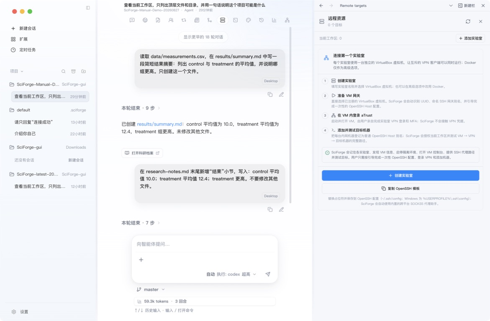

# 远程工作区

_把实验室 Linux 主机、GPU 节点或集群目录作为 SciForge 工作区使用。_

---

## 什么时候使用

当代码、数据或计算环境位于实验室网络中时，使用远程工作区。它解决的是计算位置问题，不要求开启 Cloud 协同。

## 1. 打开远程资源

在工作台顶部点击 **远程资源**，然后点击 **添加实验室**。


*图 1：远程资源向导依次配置实验室、VPN 虚拟机和 SSH 目标*

## 2. 添加实验室

按向导完成以下设置：

1. 填写实验室名称。
2. 选择独立的 VirtualBox 虚拟机作为 VPN 网关。
3. 按页面提示准备 VM 网关和 OpenSSH Host 配置。
4. 启动虚拟机，并由用户在其中完成 VPN 登录和 MFA。

SciForge 不会替你填写 VPN 密码或完成多因素认证。

## 3. 添加并测试 SSH 目标

在当前实验室下添加目标机器，然后点击连接测试。测试会依次检查：

```text
本机 SciForge → VPN 虚拟机 → SSH 目标
```

通过后，目标机器会出现在工作区位置菜单中。

## 4. 打开远程工作区

1. 在工作区位置菜单中选择远程目标。
2. 选择远端项目目录。
3. 确认顶部显示远程工作区。
4. 新建会话并先发送一个只读任务。

远程文件读取与保存、文本搜索、终端、Git 状态与差异查看，以及基础文件预览仍显示在 SciForge 桌面界面中，实际操作发生在远端目录。当前远程 Agent 首期使用 Codex，并要求模型 API 或 Model Router 已可用。

## 当前限制

- 远程 Git 目前只支持状态和差异查看，不支持列出、切换或创建分支。
- 远程工作区暂不支持创建、列出或恢复版本快照。
- 文件面板可以读取并保存已经打开的远程文件，但暂不支持直接创建、重命名、复制、移动或删除远程文件和目录。

## 完成标志

- 远程目标通过连接测试
- 远端目录可以作为工作区打开
- 文件面板可以读取目标目录
- 只读任务能够在远端工作区完成

## 下一步

- [附录 A 工作区与会话](./Workspaces-and-Sessions.zh-CN.md)
- [Cloud 协同](./Cloud-Collaboration.zh-CN.md)
- [科研工作流](./Scientific-Workflows.zh-CN.md)

更完整的架构与支持范围见 [Remote Workspace 说明](../remote-workspace.zh-CN.md)。
