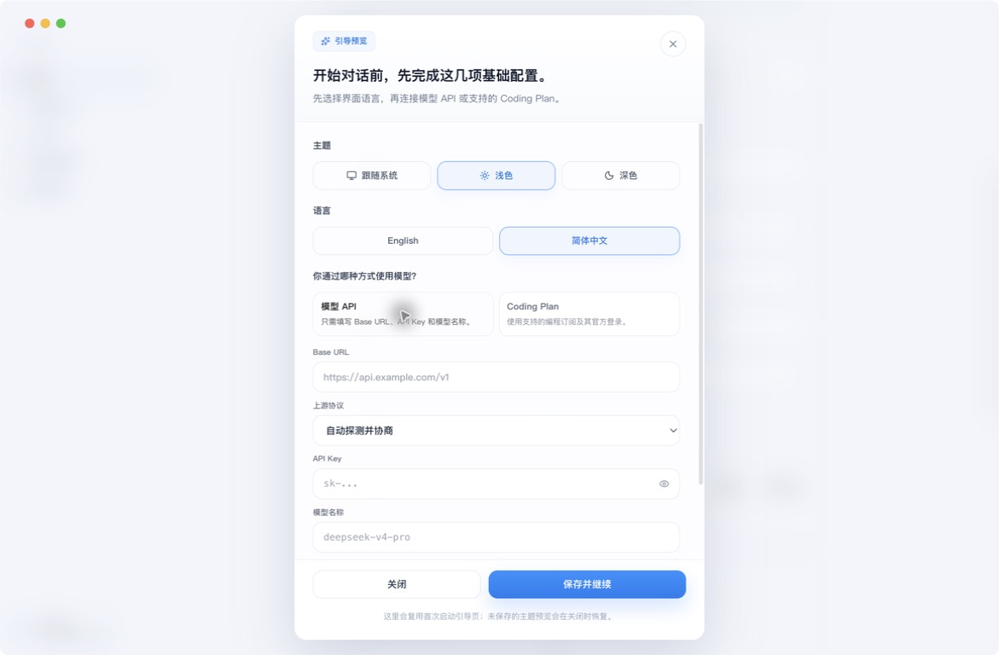
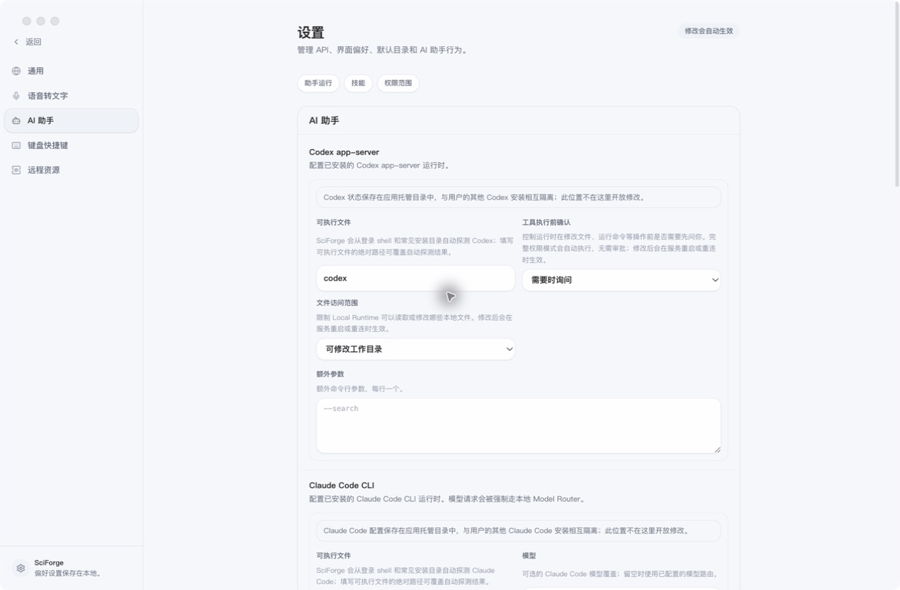
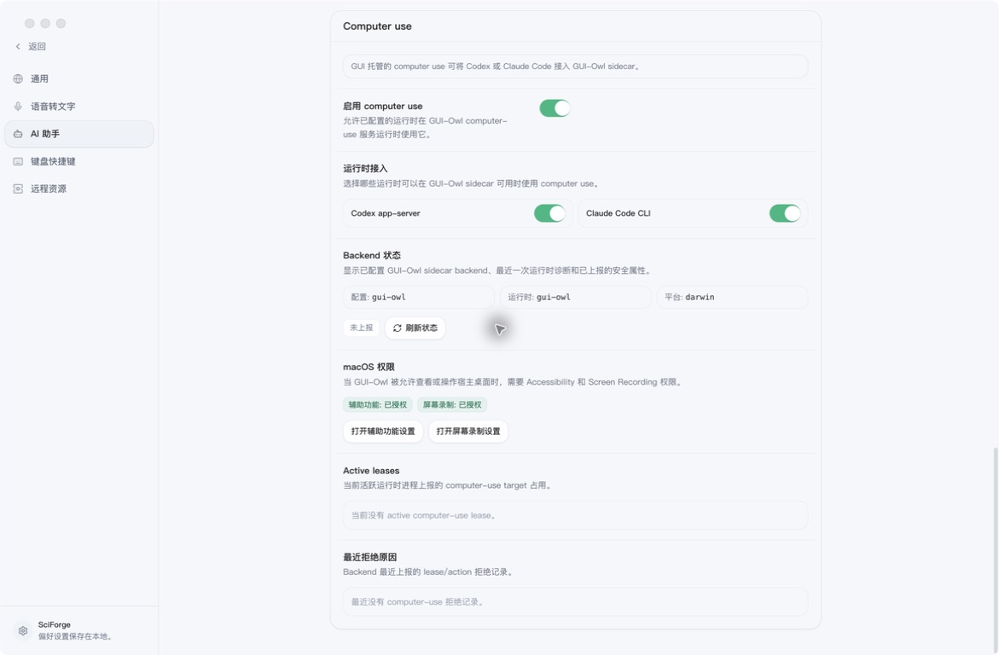
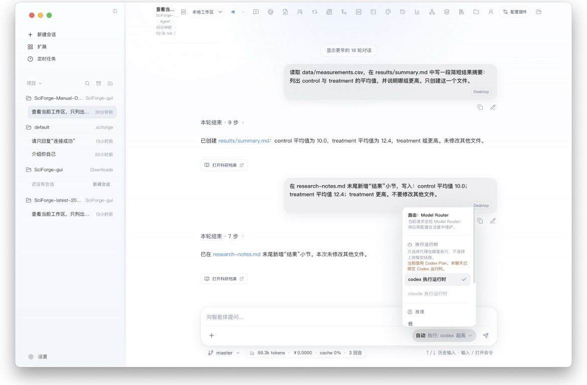

# 模型runtime

_配置 SciForge 使用的模型链路，并决定由 Codex 还是 Claude Code 执行任务。_

---

## 先分清两件事

| 配置 | 决定什么 | 在哪里设置 |
| --- | --- | --- |
| 模型接入 | 请求通过 API 还是 Coding Plan 访问模型 | **设置 → 通用 → 模型接入** |
| AI 助手 | 由 Codex 或 Claude Code 负责规划、调用工具和操作文件 | **设置 → AI 助手**，以及会话输入框右下角 |

模型接入和 AI 助手是两层配置。连接模型后，还需要确认当前会话使用哪个助手。

## 1. 选择模型接入

打开 **设置 → 通用**，在“模型接入”中选择一种方式。

### 模型 API

适合已有 OpenAI 兼容接口、私有模型网关或 SciForge Model Router 的用户。

1. 选择 **模型 API**。
2. 填写 `Base URL`、`API Key` 和模型名称。
3. 上游协议不确定时，保留“自动探测并协商”。
4. 点击 **检查配置**，通过后保存。

*图 1：模型 API 的最小配置项是 Base URL、API Key 和模型名称*

### Coding Plan

适合使用受支持编程订阅的用户。

1. 选择 **Coding Plan**。
2. 选择 `Codex Plan`。
3. 点击 **登录 ChatGPT**，也可以使用设备码登录。
4. 登录完成后点击 **刷新状态**。

Coding Plan 使用官方登录，不会在连接失败时自动改用模型 API。

## 2. 配置 AI 助手

打开 **设置 → AI 助手**。SciForge 支持两个执行运行时：

| 助手 | 适合的任务 | 默认命令 |
| --- | --- | --- |
| Codex | 通用代码、文件处理和工具任务；也是默认选择 | `codex` |
| Claude Code | 需要 Claude Code 工作方式的代码与研究任务 | `claude` |

通常保留默认命令即可，SciForge 会从登录 Shell 和常见安装目录自动探测。只有自动探测失败时，才填写可执行文件的绝对路径。

*图 2：AI 助手页面分别配置 Codex 与 Claude Code 的命令、确认方式和文件访问范围*

修改“工具执行前确认”“文件访问范围”或额外参数后，新配置会在运行时重启或重新连接时生效。

需要让助手操作桌面应用时，继续向下找到 **Computer use**。这里可以统一启用功能、选择允许使用它的运行时，并检查 Backend 与 macOS 权限状态。

*图 3：Computer Use 设置集中显示运行时接入、Backend 状态和 macOS 权限*

## 3. 为会话选择运行时

回到工作台，在输入框右下角打开运行时菜单：

1. 查看当前执行助手，例如 `执行: codex`。
2. 使用模型 API 时，可在已配置的 Codex 与 Claude Code 之间选择。
3. 使用 Codex Plan 时，会话绑定 Codex。
4. 推理强度可以先保留默认值；复杂分析再提高。

*图 4：运行时菜单同时显示执行助手、模型路由和推理强度*

这里切换的是“谁来执行”，上游模型仍由当前模型接入方式管理。

## 确认配置可用

完成配置后，新建一个会话并发送：

> 查看当前工作区，只列出顶层文件和目录。不要修改文件。

出现以下结果即表示链路可用：

- 任务进入运行状态
- 输入框右下角显示预期的执行助手
- 会话中出现最终回答

## 下一步

- [附录 A 工作区与会话](./Workspaces-and-Sessions.zh-CN.md)
- [科研工作流](./Scientific-Workflows.zh-CN.md)
- [插件、Skills 与 MCP](./Extensions-Skills-and-MCP.zh-CN.md)
