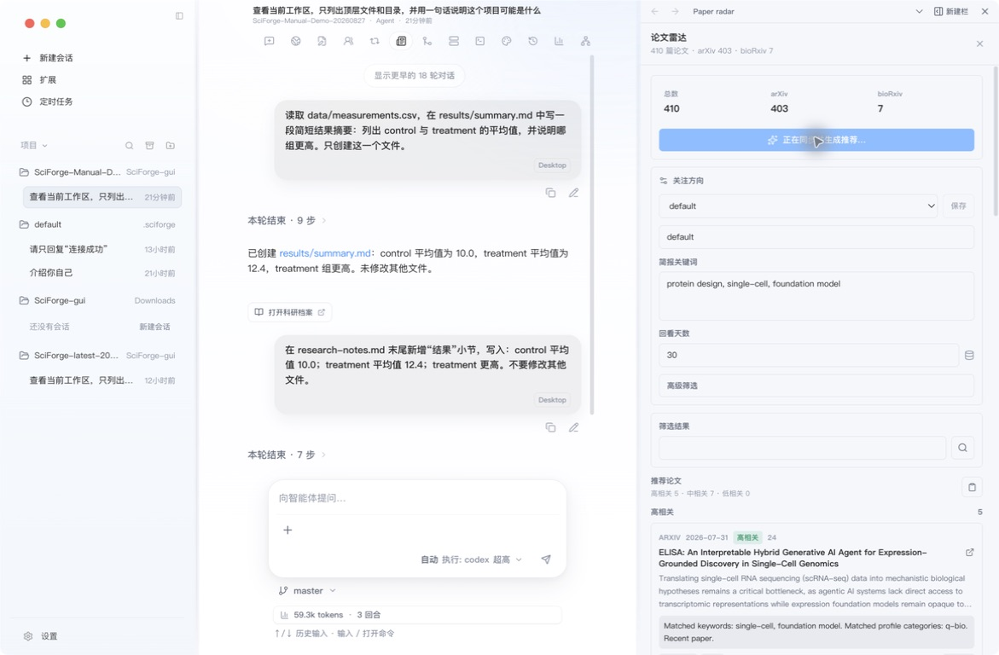

# 科研工作流

_把论文检索、代码复现、数据分析和图表制作组织成可继续、可检查的研究过程。_

---

## 一条通用流程

大多数科研任务都可以按下面五步完成：

1. **明确问题**：说明研究目标、输入和期望输出。
2. **收集材料**：打开论文、代码、数据或远程资源。
3. **分步执行**：先让助手给出计划，再运行分析或修改文件。
4. **检查结果**：查看消息、文件、变更、图表或终端输出。
5. **沉淀记录**：把关键结果保留到科研档案、产物版本或证据 DAG。

不需要一次启用所有功能。先完成最短闭环，再根据任务增加面板和扩展。

## 1. 跟踪论文

需要持续关注一个研究方向时，打开会话顶部的 **论文雷达**：

1. 在“简报关键词”中填写研究主题，多个词用逗号分隔。
2. 设置回看天数；第一次可以使用 7 天。
3. 点击 **保存**。
4. 点击 **检查结果**，再按相关度筛选和打开论文。

*图 1：论文雷达显示本地论文索引、关注关键词、筛选条件和推荐结果*

找到论文后，可以在会话中继续提问：

> 比较这几篇论文的研究问题、数据、方法和主要结论，并把无法从原文确认的内容单独列出。

## 2. 复现代码或实验

将论文代码仓库作为工作区，然后按阶段发送任务：

### 先读项目

> 阅读 README、依赖文件和实验入口，给出最短复现路径。先不要运行命令或修改文件。

### 再执行

> 按刚才的计划执行第一步。记录使用的命令、参数、输入和输出；遇到缺失条件就停下来说明。

任务运行时查看中间步骤；结束后打开 **变更** 和 **终端**，分别核对文件修改与命令输出。需要继续修正时，沿用同一会话。

## 3. 分析数据并制作图表

1. 在 **文件** 面板中找到数据文件，点击 **添加引用**。
2. 让助手先检查列名、单位、缺失值和样本量。
3. 明确分析方法与输出格式，再开始计算。
4. 使用 Scientific Compute 或 Scientific Plotting 生成结果和图表。
5. 在 **图片审改**、**图表溯源** 或 **产物版本** 中检查最终产物。

一个清晰的任务示例：

> 分析引用的 CSV。先给出数据概览，再比较两组均值并绘制带置信区间的图。把统计结果和图表分别保存到当前工作区。

## 4. 查看科学对象

处理结构、序列、组学或成像文件时，优先把原始文件留在工作区，通过预览和专用能力读取：

| 数据 | 推荐入口 |
| --- | --- |
| 蛋白结构、序列、小分子 | Life Science Preview、Biology Room |
| 表格和数值结果 | Scientific Compute、Scientific Plotting |
| 论文与网页资料 | 论文雷达、浏览器、Content Space |
| 图表和生成图片 | 图片审改、图表溯源、产物版本 |

如果某种文件没有对应预览，仍可以作为工作区文件引用，但要先确认助手是否具备合适的读取工具。

## 完成一次工作流

一个任务可以结束在这里：

- 会话中有清晰的最终回答
- 文件与变更符合预期
- 关键命令、参数和输入可以再次找到
- 需要复用的结论或产物已经进入科研档案

## 下一步

- [研究档案与证据](./Intervention-and-Data.zh-CN.md)
- [插件、Skills 与 MCP](./Extensions-Skills-and-MCP.zh-CN.md)
- [自动化](./Automation-and-Scheduled-Tasks.zh-CN.md)
