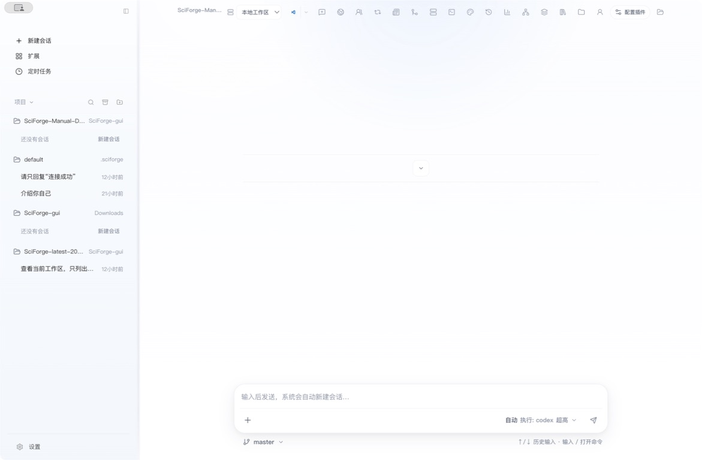
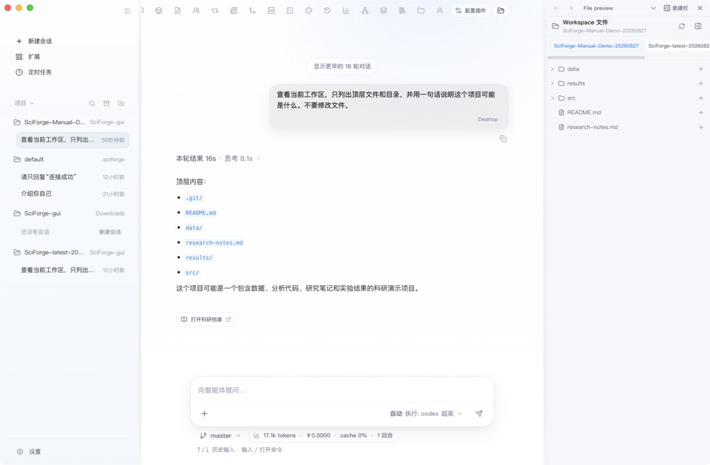
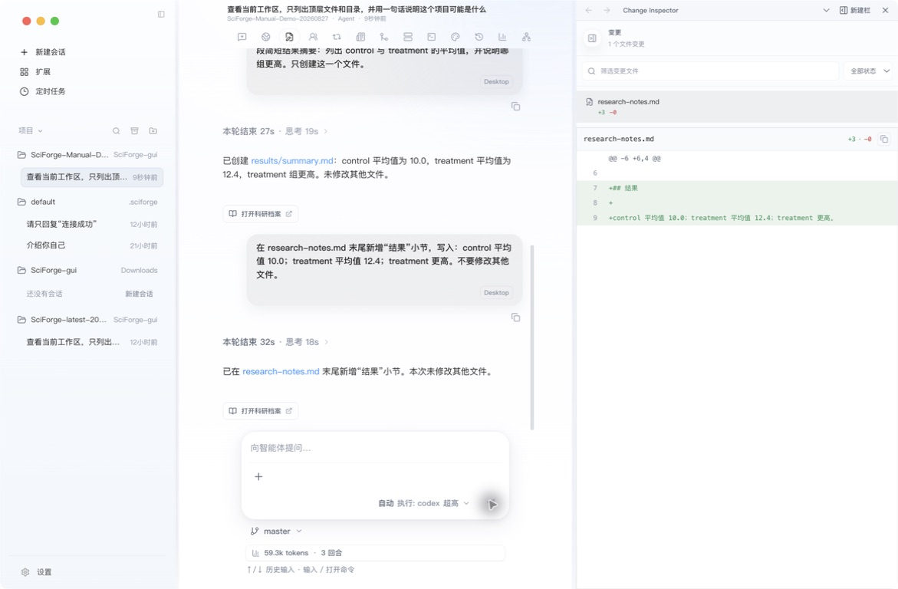

# 附录 A 工作区与会话

_用工作区确定 AI 可以处理的项目，用会话保存每一段连续任务。_

---

## 什么时候使用

当你准备处理一篇论文、一个代码仓库或一组实验文件时，先打开对应工作区，再为具体目标新建会话。

| 对象 | 作用 |
| --- | --- |
| 工作区 | 指向一个本地或远程项目目录，决定文件、Git 和终端的上下文 |
| 会话 | 保存消息、执行过程、最终结果，以及这次任务产生的文件变更 |

同一个工作区可以有多个会话。建议让一个会话只围绕一个清晰目标展开。

## 1. 打开工作区

1. 点击左侧项目区域的 **更换工作目录**。
2. 选择论文、代码或数据所在的目录。
3. 确认目录出现在左侧项目列表中。

首次启动时也可以使用 `~/.sciforge/default_workspace`。切换工作区不会复制项目文件，SciForge 直接在选中的目录中工作。

## 2. 新建和管理会话

选中工作区后，点击 **新建会话**。发送第一条消息后，SciForge 会创建会话并自动生成名称。

*图 1：左侧显示工作区与历史会话，中间区域用于发送第一条任务*

左侧会话列表可以完成常用管理：

- 点击会话名称继续之前的任务
- 使用搜索快速找到历史会话
- 归档暂时不需要的会话，并通过“查看归档会话”重新打开
- 删除不再需要的会话

开始新目标时新建会话；继续同一目标时沿用原会话，这样上下文更清楚。

## 3. 查看和引用文件

在会话顶部点击 **文件**，可以浏览当前工作区。点击目录展开内容，点击文件查看预览；需要让助手重点使用某个文件时，点击旁边的 **添加引用**。

*图 2：文件面板显示当前工作区内容，并可把文件或目录添加为任务引用*

引用文件比把大段内容复制到输入框更直接。发送任务前仍要确认顶部显示的是正确工作区。

## 4. 查看本次变更

任务可能修改文件时，完成后点击 **变更**：

1. 查看本次会话修改了哪些文件。
2. 打开具体差异，核对新增、删除和修改内容。
3. 如需继续调整，直接在原会话中说明要修改的文件和目标。

*图 3：变更面板列出本次修改的文件，并逐行显示新增、删除和修改内容*

工作区是项目范围，变更面板是本次会话范围；二者不要混淆。

## 一个好用的会话开头

第一条消息最好同时说明目标、范围和期望结果，例如：

> 阅读当前工作区的 README 和依赖配置，先给出运行测试的最短步骤。暂时不要安装依赖或修改文件。

这类任务可以先建立共同上下文，再决定是否进入执行阶段。

## 下一步

- [科研工作流](./Scientific-Workflows.zh-CN.md)
- [研究档案与证据](./Intervention-and-Data.zh-CN.md)
- [远程工作区](./Remote-Workspaces.zh-CN.md)
- [Cloud 协同](./Cloud-Collaboration.zh-CN.md)
