# SciForge Zulip 手机协作操作手册

这份手册面向普通用户，说明如何把一台 SciForge 电脑连接到自己的 Zulip、创建私人 Channel、绑定 Topic、收发消息和处理审批。

管理员部署、数据库备份、服务升级和故障恢复不在本文范围内，参见[香港 ECS 与 Zulip 运维手册](./operations/zulip-aliyun-deployment.zh-CN.md)。

截图来自 Windows SciForge、Zulip Android App 和 Zulip Web。不同系统或 Zulip 版本的按钮位置可能略有差异，但操作顺序相同。截图中的电脑名、Channel 和 Topic 只是示例，请换成自己的名称。

## 一分钟了解规则

- 手机端使用官方 Zulip App，不需要安装 SciForge 手机 App。
- 创建 Channel 必须使用 **Zulip Web**。原生手机 App 目前不能创建 Channel。
- Channel 必须是私人 Channel，并至少包含你本人和 SciForge Bot。
- 每台电脑使用自己独立的私人 Channel 和 Topic，不能接管另一台电脑的绑定。
- 一个电脑对话一旦绑定一个 Topic，就不能再换绑其他 Topic。
- 日常界面只有“暂停”和“恢复”，没有“解绑”。
- 可以在手机审批的操作只需点击卡片下已有的 👍 或 👎；不能手机审批的操作必须回电脑处理。

## 1. 注册并登录 Zulip 账户

### 1.1 获取注册入口

先向 SciForge 或 Zulip 管理员确认组织地址。当前部署示例为 `https://chat.sciforge.cn`。

注册方式由组织设置决定，通常有两种：

1. **管理员邀请**：管理员把邀请链接发送到你的工作邮箱。打开邀请链接后，按页面提示创建账户。
2. **开放注册**：直接打开组织地址，在登录页点击“注册”“创建账户”或类似入口。

如果登录页没有注册入口，说明组织没有开放自助注册。请联系管理员邀请或创建账户，不要尝试使用他人的账号。

### 1.2 完成注册

1. 使用你本人长期可访问的邮箱；
2. 填写别人能识别的显示名称；
3. 设置独立的高强度密码；
4. 如果收到验证邮件，打开邮件中的验证链接；
5. 返回 Zulip Web，确认能正常登录并看到组织首页。

不要在聊天、截图、文档或工单中发送密码、邮箱验证码、登录链接或浏览器 Cookie。忘记密码时使用登录页的“忘记密码”，或联系管理员重置。

### 1.3 登录官方 Zulip 手机 App

1. 从手机应用商店安装官方 **Zulip** App；
2. 点击“添加一个账号”；
3. Server / Organization URL 填写管理员提供的组织地址，例如 `https://chat.sciforge.cn`；
4. 使用刚注册的同一账户登录；
5. 确认手机 App 与 Zulip Web 显示的是同一个组织和同一个账号。

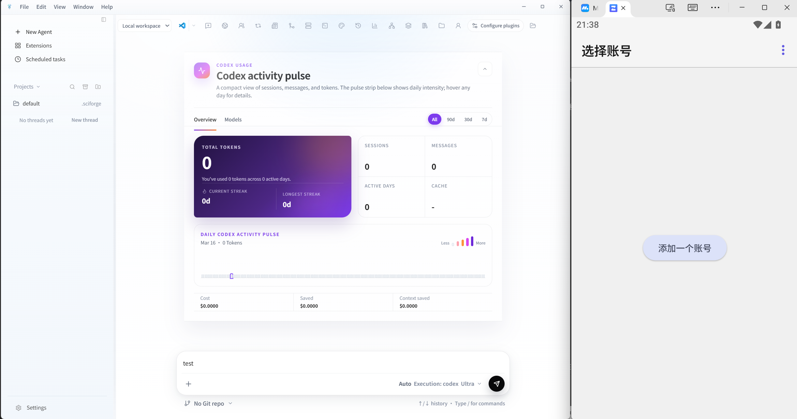

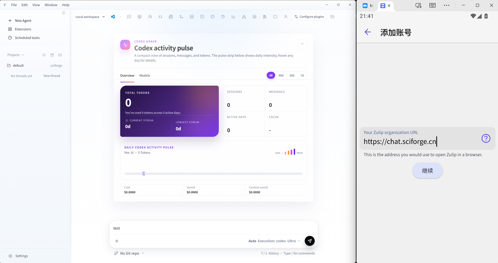

同一个 Zulip 账号可以登录多台手机，但系统仍把它们视为同一个用户。另注册一个账号、改显示名或换手机，都不会获得原账号的 SciForge 绑定权限。

## 2. 开始前准备

向管理员确认：

1. SciForge 桌面版已经安装并能正常打开；
2. 协作服务地址，例如测试环境的 `https://cloud-test.sciforge.cn`；
3. 你自己的 Zulip 账号可以登录组织；
4. Zulip 中能找到 SciForge Bot。

不要共用他人的 Zulip 账号。不要把密码、验证码、Token、API Key、私钥或配对指令发给其他人。

## 3. 连接 SciForge 云端

这里填写的是 SciForge Cloud 地址，不是 Zulip 组织地址：测试环境的 SciForge Cloud 是
`https://cloud-test.sciforge.cn`，Zulip Web 与手机 App 仍登录 `https://chat.sciforge.cn`。

1. 打开 SciForge，并进入准备与手机绑定的电脑对话。
2. 点击工具栏中的 **Phone Link**。
3. 展开 **Phone Link Setup**。
4. 在 **Cloud connection** 中填写管理员提供的协作服务地址。
5. 点击 **Save service address** 保存地址。

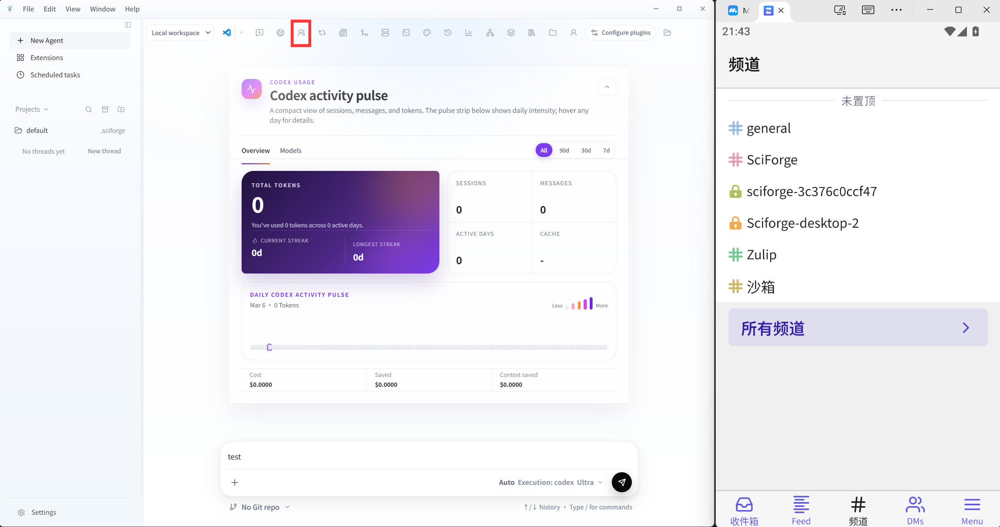

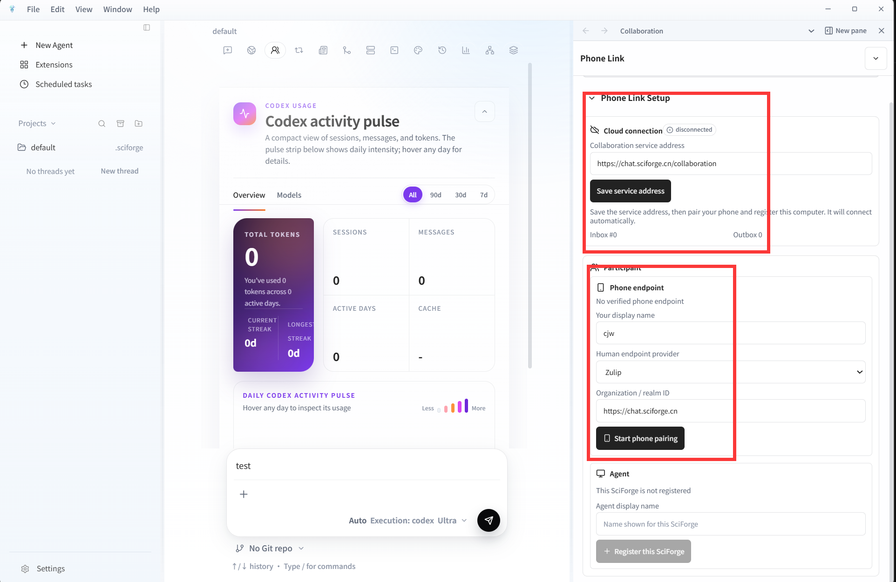

新电脑首次设置时暂时显示 `disconnected` 是正常的。继续完成手机配对和本机 Agent 注册后，SciForge 会自动连接；此时不需要反复点击 Connect。

第一次设置完成前，**Phone Link Setup** 会保持展开。完成后默认折叠，但仍可随时重新展开查看状态。

## 4. 配对自己的 Zulip 账号

1. 在 **Phone Link Setup** 中选择 Zulip。
2. 点击 **开始手机配对**。
3. 点击 **复制指令**，复制界面显示的完整一次性指令。
4. 在 Zulip 中打开与 **SciForge Bot 的私聊**。
5. 把整条指令原样粘贴并发送，不要删减、改写或分成多条消息。
6. 回到 SciForge，等待显示“手机端点已验证”。

在 Zulip 手机端，先进入底部的 **DMs / 私信**，再打开 **SciForge Agent**：

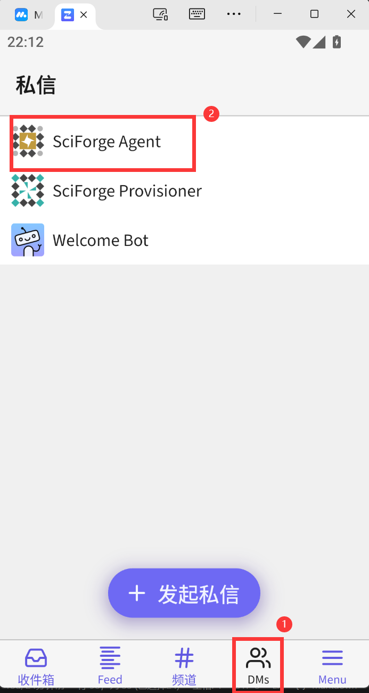

这条指令只能使用一次，而且会过期。若提示无效或已过期，请回到 SciForge 重新点击“开始手机配对”，不要重复发送旧指令。

为避免泄露设备凭据，本手册不展示任何真实一次性指令。不要把指令截图发给其他人，也不要粘贴到 Channel 或 Topic；只能原样发送给 SciForge Bot 私聊。

## 5. 注册这台电脑

手机验证成功后：

1. 点击 **注册这台 SciForge**；
2. 输入容易识别的电脑名称，例如“办公室电脑”或“SciForge-Desktop-2”；
3. 等待本机 Agent 显示在线。

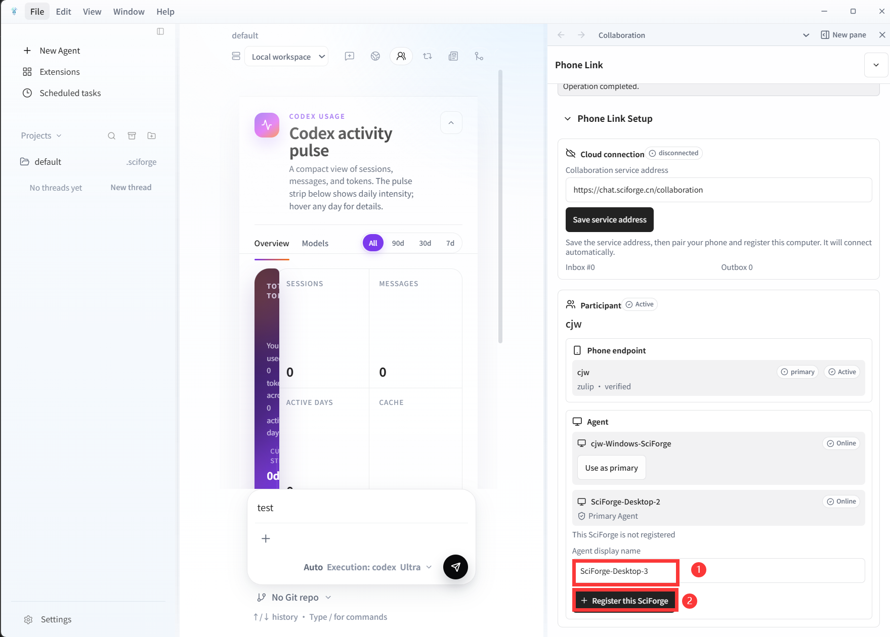

每台电脑有自己独立的 Agent。连接同一个 Zulip 账号，不代表两台电脑是同一个 Agent。

## 6. 在 Zulip Web 创建私人 Channel

### 6.1 打开 Zulip Web

可以使用电脑浏览器，也可以在手机浏览器中打开 Zulip Web。若手机页面只提示打开 App，可在浏览器菜单中选择“桌面版网站”。

登录与 Zulip App 相同的组织和账号。当前部署示例为 `https://chat.sciforge.cn`。

### 6.2 创建 Channel

不同 Zulip 版本的按钮位置可能略有差异，通常按以下路径操作：

1. 打开 Channel 列表或 Channel 管理页面；
2. 点击 **新建 Channel**；
3. 把可见性设为**私人**或**仅受邀成员可见**；
4. 加入你当前已验证的 Zulip 用户；
5. 加入 SciForge Bot；
6. 保存 Channel。

在 Zulip Web 右上角打开设置，进入 **频道设置**：

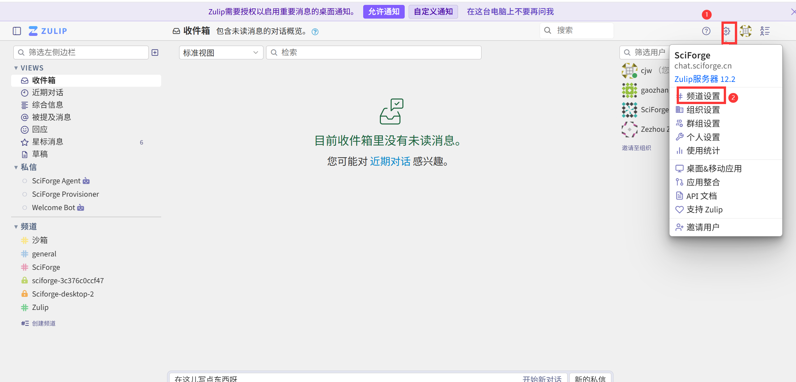

点击 **创建频道**：

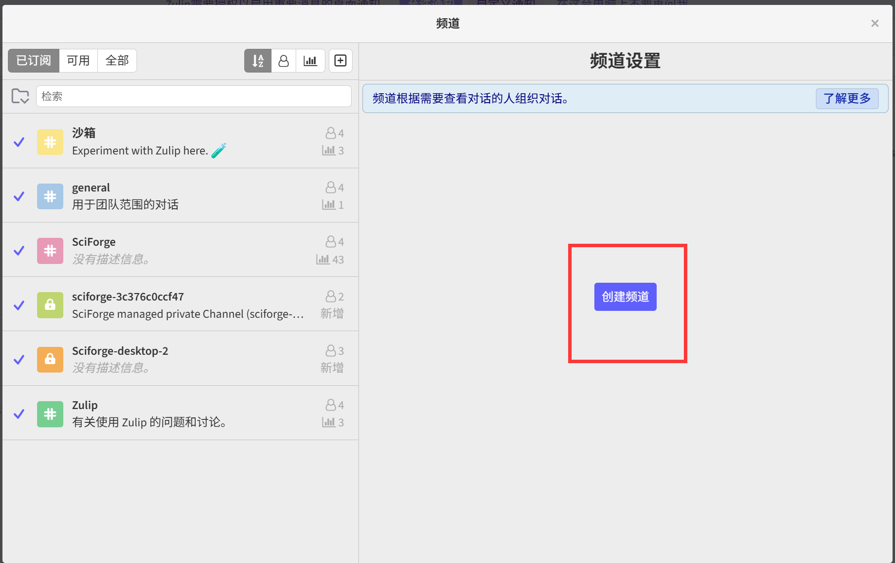

填写名称后，最重要的是确认：

1. “谁能访问此频道”必须选择 **私人**；
2. 订阅者至少包含你本人和 **SciForge Agent**；
3. 确认无误后再创建。

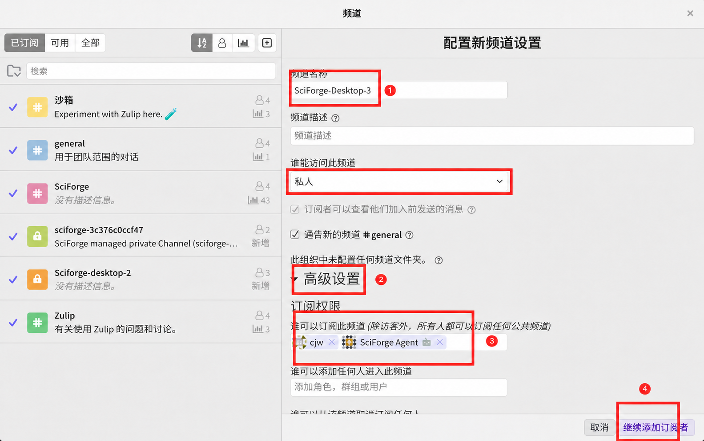

个人电脑协作建议只加入你本人和 SciForge Bot。私人 Channel 不是端到端加密，仍不要发送密码、密钥或其他敏感信息。

### 6.3 创建 Topic

进入刚创建的私人 Channel，新建一个 Topic，或发送第一条带 Topic 名称的无敏感内容测试消息。只有已经存在的 Topic 才能被 SciForge 发现。

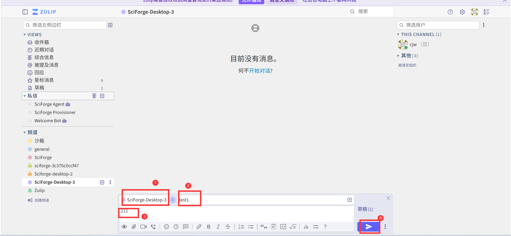

一台电脑可以拥有多个私人 Channel，也可以在同一个私人 Channel 中建立多个 Topic，但每个电脑对话只能固定绑定其中一个 Topic。

## 7. 选择 Channel / Topic

1. 回到 SciForge 的 **Phone Link**。
2. 点击 **Refresh Channels / Topics**。刚在 Zulip Web 新建 Channel 或 Topic 后，不需要重启 SciForge。
3. 在 **Channel / Topic** 中选择刚创建的位置。
4. 确认当前电脑对话正确，再点击 **Connect** 完成绑定。

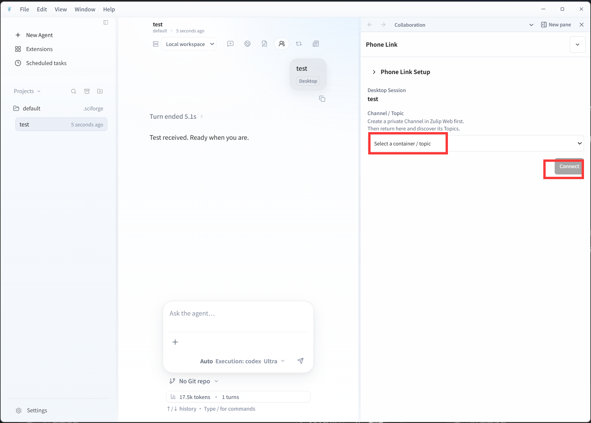

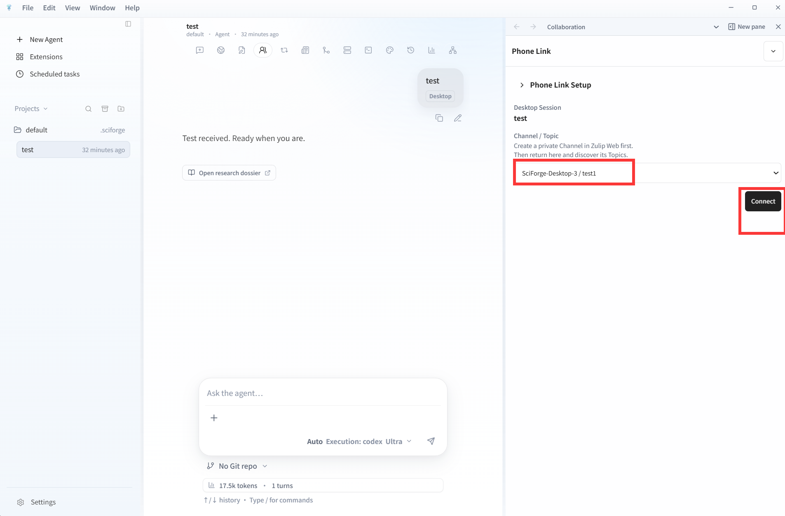

绑定成功后，界面显示可读的 Channel / Topic 名称，不需要查看任何长 ID。

绑定是永久的：

- 同一个电脑对话不能再绑定另一个 Topic；
- 暂停后也不能换绑；
- 换另一个手机或另一个 Zulip 账号不能覆盖原绑定；
- 系统不会提供解绑按钮。

如果需要新的上下文，请新建一个电脑对话，再绑定一个尚未使用的 Topic。

## 8. 日常收发消息

- 在已绑定 Topic 中发送消息，消息会进入固定的电脑对话。
- SciForge 的最终回复会回到原 Topic，默认直接显示。
- 中间进展默认折叠，可以手动展开。
- 模型推理、原始工具日志、敏感命令参数和本地文件不会发送到手机。
- 切换电脑上的其他对话，不会改变已经建立的 Topic 绑定。

网络暂时异常时不要连续重复发送同一句话。先等待恢复，避免人为制造多条不同消息。

绑定成功后，手机消息、电脑收到的消息和最终回复应各出现一次：

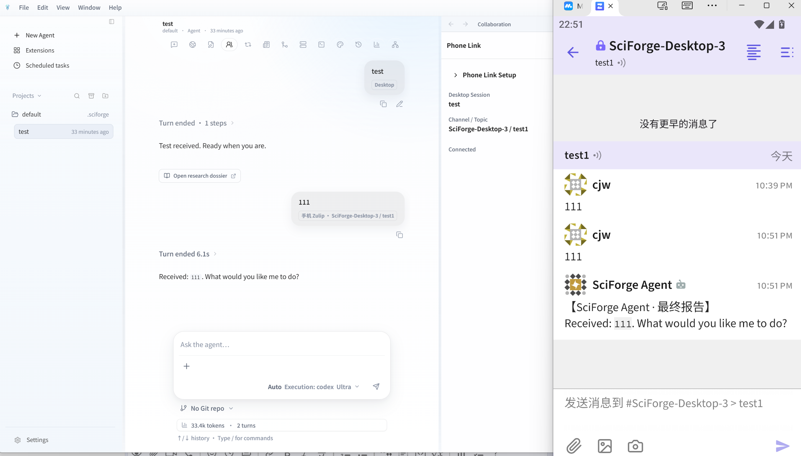

## 9. 手机审批

### 可以在手机审批

通知会简洁显示操作摘要，并在卡片下预置：

- 👍：仅本次允许；
- 👎：仅本次拒绝。

直接点击已有的 👍 或 👎 即可。只有第一项有效决定生效。

以下操作不会形成审批：

- 输入 `1`、`2`、`yes`、`allow` 或 `deny`；
- 添加其他 emoji；
- 删除已经添加的 reaction；
- 在其他消息或其他 Topic 下点击 reaction；
- 使用另一个未绑定的 Zulip 账号点击。

删除 reaction 不能撤销已经作出的决定，也不会让工具再次执行。

### 不能在手机审批

手机只会收到简洁通知，例如：

> 需在 SciForge 电脑端审批：〈安全摘要〉

这类通知不会提供有效的 👍/👎 审批入口。请回到 SciForge 电脑端选择允许或拒绝。

Desktop Capability Broker 始终是最终权限裁决者。手机只有被明确授予的一次性有限审批权。

## 10. 暂停与恢复

- 点击 **Pause / 暂停**：暂时停止新的手机消息进入电脑对话，不删除 Channel、Topic 或历史绑定。
- 点击 **Resume / 恢复**：继续接收新消息。

暂停不是解绑。重启 SciForge 或 Collaboration 服务后，原绑定仍应保持，不应重复发送卡片、reaction、回复或执行工具。

## 11. 换电脑或换手机

### 换电脑

新电脑需要重新完成：

1. 连接 Collaboration；
2. 配对 Zulip 账号；
3. 注册新电脑的本机 Agent；
4. 为新电脑创建新的私人 Channel 和 Topic；
5. 绑定新电脑上的电脑对话。

即使使用同一个 Zulip 账号，新电脑也不能复用旧电脑的 Channel、Topic、固定电脑对话或本地 Agent 凭据。

### 换手机，但仍登录同一个 Zulip 账号

Zulip 按账号识别用户，不按物理手机识别。登录同一个 Zulip 账号时，可以继续看到该账号有权访问的 Zulip 历史消息；但这不会改变任何电脑的绑定关系。

### 哪些信息会同步

- 会保留：Zulip 服务器上的 Channel、Topic 和消息历史，以及云端已登记的用户和 Agent 目录状态。
- 不会自动搬到新电脑：本地电脑对话、运行线程、本地文件、工具状态、密钥、设备凭据和旧电脑的固定绑定。

## 12. 常见问题

| 问题 | 处理方法 |
| --- | --- |
| 手机 App 找不到“新建 Channel” | 用手机浏览器或电脑浏览器打开 Zulip Web；必要时选择“桌面版网站” |
| 配对提示无效 | 确认是在 SciForge Bot 私聊中发送完整指令；回到 SciForge 生成新指令，不要复用旧指令 |
| 找不到刚创建的 Channel / Topic | 确认 Channel 为私人、包含你本人和 SciForge Bot，并且已经创建至少一个 Topic；然后点击 Refresh Channels / Topics，无需重启 SciForge |
| Topic 显示但不能选择 | 它可能已经被某个电脑对话永久绑定，或所属 Channel 已被另一台电脑占用 |
| 手机消息没有进入电脑 | 检查 Phone Link 是否暂停、本机 Agent 是否在线、消息是否发在正确 Topic，以及登录账号是否为已验证账号 |
| 第二个账号发消息没有反应 | 这是正常的安全隔离；Zulip 账号身份不匹配时，消息不会进入绑定的电脑对话 |
| 手机点击审批没有生效 | 确认点击的是原审批卡片下预置的 👍/👎、账号正确且卡片未过期；有些操作只能回电脑审批 |
| 想把电脑对话换到另一个 Topic | 不能换绑；请新建电脑对话并选择一个未使用的 Topic |

## 13. 完成后的快速检查

1. 手机在绑定 Topic 发送一条无敏感内容的测试消息；
2. 确认它只进入当前固定电脑对话一次；
3. 确认最终回复只回到原 Topic 一次；
4. 测试暂停和恢复；
5. 测试一个允许手机审批的无副作用操作，确认 👍 或 👎 只有第一次有效；
6. 测试一个只能电脑审批的无副作用操作，确认手机只收到简洁提示，工具在电脑决定前不执行。

测试时不要使用真实密码、Token、API Key、私钥、生产删除命令或其他破坏性操作。
