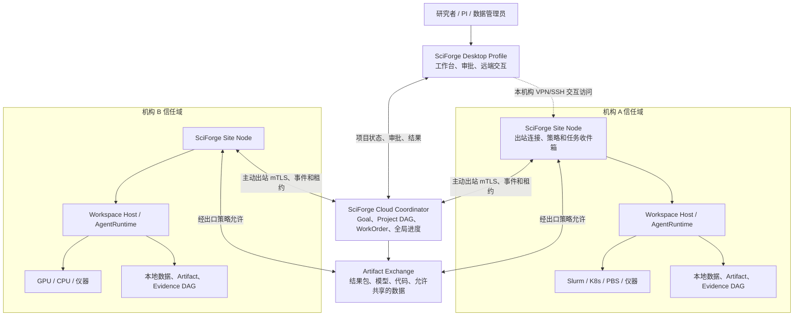
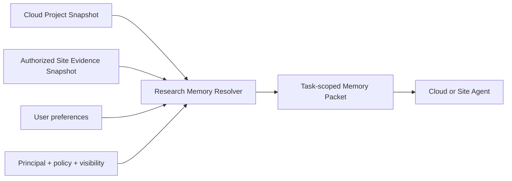

# 设计方案：SciForge 跨机构联邦科研协作网络

## 1. 给所有人的摘要

这套方案要解决的问题很直白：多个机构一起做科研时，项目需要一个共同的“总进度”，但每个
机构又必须保留自己的数据、GPU、VPN、审批制度和最终控制权。

方案把 SciForge 设计成一套可以运行在不同位置的科研协作系统：

- 云端像项目指挥部，知道项目目标、任务依赖、各机构进度和已经交付的结果。
- 机构站点像本地实验室负责人，知道本地数据、设备、GPU、排队情况和机构政策。
- 桌面客户端像研究者工作台，负责交互、调试、审阅、审批和查看全局进度。

三者运行同一套 SciForge 合同，但权限和数据不同。云端不能越过机构站点直接登录集群，机构
也不能静默修改整个项目的共同事实。

一句话原则：

> 统一 Agent 协作语言，不统一机构控制权；共享项目知识，不默认共享原始数据。

## 2. 一个具体例子

假设机构 A 负责总体算法，机构 B 有一批不能离开本地的临床数据和 A100 GPU，机构 C 负责独立
复现。

1. 机构 A 在云端 SciForge 项目中提出目标：“在两个独立机构验证模型 X”。
2. Cloud Coordinator 把目标拆成两个 WorkOrder，并发现 B、C 都公开了符合条件的计算能力。
3. B 的 Site Node 检查数据用途、参与者授权、容器镜像、GPU 配额和结果出口策略。
4. B 接受任务后，把它提交给本地 Slurm。原始数据始终留在 B。
5. 任务完成后，B 先在本地 Evidence DAG 中记录输入、代码、参数、环境、日志和输出。
6. B 的出口策略只允许共享指标、脱敏图表和复现 manifest，于是生成签名结果包并上传。
7. 云端把该结果编入 Project DAG，但只保存 B 允许公开的证据摘要和 Artifact 引用。
8. C 独立完成同一 WorkOrder。云端比较两个结果，将冲突或一致性展示给所有有权成员。

在整个过程中，机构 A 没有获得 B 的 VPN、SSH 或原始数据权限，B 也不需要把集群暴露给互联网。

## 3. 设计目标

- 所有参与方使用同一套 SciForge Agent、任务、结果和证据合同。
- 云端能够持续显示跨机构项目的真实进度，即使某位研究者电脑不在线。
- 每个机构保留资源准入、数据访问、任务执行和结果出口的最终决定权。
- 原始数据默认留在机构，优先采用“计算到数据”而不是“数据到计算”。
- 任务、结果和科研结论可追溯、可复现、可审计，并且只有一个 canonical owner。
- VPN、MFA 或网络中断后可以恢复，不产生重复任务和互相矛盾的状态。
- 复用现有 SciForge 的 AgentRuntime、Capability Broker、Workspace Host 和 DAG 架构。

## 4. 非目标

- 不建立一个可以直接 SSH 进入所有机构的云端超级管理员。
- 不让其他机构获得裸 GPU 登录权限或任意内部网络访问。
- 不把所有文件、聊天、日志和 embedding 上传到统一云向量库。
- 不在第一阶段实现任意机构之间的实时目录挂载或多人共同编辑同一文件。
- 不用 LLM 代替确定性的身份、权限、租约、计费、数据出口和审计判断。
- 不新增 SciForge 自定义模型 Runtime；Codex 和 Claude Code 继续使用现有 adapter。

## 5. 总体架构



### 5.1 三种部署角色，不是三套产品

| 角色 | 部署位置 | 主要职责 | 不拥有的内容 |
| --- | --- | --- | --- |
| Cloud Coordinator | 公共云、联盟云或牵头机构 | 项目目标、任务、Project DAG、资源匹配、结果接受 | 机构 SSH/VPN、私有原始数据、内部路径 |
| Institution Site Node | 每个机构的堡垒机、服务节点或私有 K8s | 本地策略、资源、Evidence DAG、任务执行、结果出口 | 整个项目的最终状态 |
| Desktop Console | 研究者电脑 | 交互、调试、审批、结果查看、Remote Workspace | 无人值守任务的唯一生命周期 |

所有角色来自同一代码库和版本化领域包。一个部署 profile 只激活与其职责相符的 contribution，
不会启动一份完整 Electron 应用再隐藏页面。

### 5.2 为什么生产环境必须有 Site Node

如果只有 Desktop 和 Cloud，云端要访问机构资源就必须依赖某个研究者保持电脑、VPN 和客户端
在线。这适合验证概念，不适合运行数小时或数天的任务。

Site Node 位于机构网络内部，主动通过常见出站端口连接 Cloud。它不要求 Cloud 能主动拨入
机构网络，也不把 VPN 凭据交给云端。Desktop 仍可在连接本机构 VPN 后打开 Remote Workspace，
但交互连接与无人值守任务互不冒充。

## 6. Agent 如何统一

SciForge 在联邦层暴露一个统一的 Agent 合同：

```text
discoverCapabilities
offerWork
reserveExecution
commitExecution
observeExecution
cancelExecution
publishResult
requestEvidence
```

底层执行者可以是 Codex、Claude Code、确定性脚本、Slurm Job、工作流引擎或实验仪器。联邦层
不关心它们的私有协议，只接收结构化状态和结果。

Agent 分为四种责任角色：

- Project Orchestrator：根据 Goal 和 Project DAG 提出任务分解与下一步建议。
- Site Coordinator Agent：结合本地数据、资源和政策形成机构内执行计划。
- Execution Agent：在具体 Workspace、容器、调度作业或设备旁执行。
- Verification Agent：独立检查结果、证据、复现信息和完成条件。

这些是责任角色，不要求四个永久进程。简单任务可以由同一个 Site Node 依次承担多个角色；高风险
或正式发布任务则可以要求执行与验证分离。

## 7. Federation Kernel：不能交给模型的部分

Agent 可以提出“在机构 B 的 GPU 上运行任务”，但以下判断必须由确定性代码完成：

- 调用者和工作负载身份是否可信；
- 项目是否允许该机构和数据参与；
- WorkOrder 是否重复、过期或已经被新版本替代；
- 资源是否仍在报价期内、配额是否足够；
- lease 是否有效、是否已经撤销；
- Artifact digest、签名和来源是否匹配；
- 结果是否允许离开机构；
- 外部写入是否需要人类批准；
- 事件是否已持久化和按序处理。

该内核是 Agent、UI 和自动化共同使用的唯一状态变更路径，继续通过 Capability Broker 执行。

## 8. 项目状态与科研证据的所有权

### 8.1 云端拥有项目协调事实

Cloud Coordinator 是以下对象的 canonical owner：

- Project、成员和角色；
- 根 Goal 与项目范围；
- 跨机构 WorkOrder 及其版本；
- 资源匹配和 ExecutionLease；
- 已接受的 ResultManifest；
- 跨机构 Project DAG、冲突和项目级 Decision；
- 对成员可见的协作审计记录。

### 8.2 机构拥有本地证据事实

Site Node 是以下对象的 canonical owner：

- 原始文件、数据集、内部数据库和设备输出；
- ExperimentRun、AnalysisRun、参数、seed、环境和详细日志；
- session 内 Claim、Finding、SourceAnchor 和 Artifact lineage；
- 机构内部路径、调度器 job ID 和私有队列状态；
- 数据访问决定和结果出口决定。

Cloud 不复制机构的完整 Evidence DAG。它只消费机构签名并经策略裁剪的 EvidenceCapsule。

### 8.3 一个结论只有一个正式状态链

科研事实不能同时存在于聊天历史、Shared Memory、云向量库和 DAG 四套独立状态中。机构内结论
先进入 Evidence DAG；跨机构项目结论由 Project DAG 基于 EvidenceCapsule 编译。聊天摘要和
向量索引只能作为按 snapshot digest 派生的读模型。

## 9. 分层长期记忆

### 9.1 三层记忆

| 层 | 保存什么 | 示例 |
| --- | --- | --- |
| Cloud Project Memory | 允许跨机构共享的项目事实 | Goal、任务、Decision、结果摘要、EvidenceCapsule |
| Site Scientific Memory | 机构私有科研事实 | 详细 run、原始数据、失败日志、本地 claim 和 provenance |
| Desktop Personal Memory | 不需要科研证据治理的偏好 | 输出语言、工作习惯、常用视图、未提交草稿 |

云端可以使用持久数据库和对象存储作为长期项目记忆，但本地 Agent 不能把它当成唯一记忆，更
不能直接获得一个不受范围限制的数据库或向量检索凭据。

### 9.2 Memory Resolver

Agent 开始工作前，由 Research Memory Resolver 生成一个任务范围的 Memory Packet：



Memory Packet 至少绑定：

```text
projectId
taskId
principalId
siteId
projectSnapshotDigest
evidenceSnapshotDigests
accessPolicyDigest
generatedAt
freshness
budget
```

它优先包含当前目标、方法 Decision、已知失败路线、冲突、未解决问题、适用条件和有权访问的
ArtifactRef。snapshot 或权限变化后，旧 packet 自然失效，不在原地修改为另一套事实。

## 10. 跨机构任务协议

### 10.1 核心对象

| 对象 | 用途 |
| --- | --- |
| AgentCapability | 一个站点愿意公开的任务、数据或工具能力 |
| ResourceOffer | 可共享资源的规格、策略摘要、配额、成本和有效期 |
| WorkOrder | 不可变任务版本、输入、输出、完成条件和预算 |
| Reservation | Site 对候选 WorkOrder 的短期预留 |
| ExecutionLease | Cloud 与 Site 共同确认的有限执行授权 |
| TaskEvent | 有序、幂等、可重放的任务状态变化 |
| ResultManifest | 输出引用、环境、执行者、时间、状态、摘要和签名 |
| EvidenceCapsule | 可向项目共享的 claim、证据摘要、visibility 和 snapshot identity |

### 10.2 WorkOrder 不是自由聊天消息

一个 WorkOrder 至少表达：

```text
taskId / version / idempotencyKey
projectId / goalRef / dependencyRefs
requestedCapability
input ArtifactRefs and access modes
runtime or container digest
resource requirements
expected outputs and acceptance criteria
budget and deadline policy
data egress policy
required approvals
required provenance and verification level
```

自然语言说明可以作为字段存在，但不能代替资源、输入、权限和完成条件等类型化字段。

### 10.3 状态机

```text
draft
  -> offered
  -> reserved | rejected
  -> leased
  -> queued_at_site
  -> running
  -> completed_locally
  -> export_review
  -> published
  -> accepted | disputed | superseded
```

取消是一个显式状态请求。已经进入调度器的任务可能需要一段时间才能停止，Cloud 不应把
“已请求取消”误报为“已经取消”。

## 11. GPU 与其他资源如何共享

共享对象是执行能力，而不是远程登录权限。

Site Node 可以发布一个经过裁剪的 ResourceOffer，例如：

```text
4 x A100 80GB
支持 CUDA 12.x 的签名容器
单任务最多 48 小时
只允许 project-X 成员
原始数据不能离开站点
输出需要本地审批
offer expires at ...
```

Cloud 先做候选匹配，Site 再做最终裁决。执行采用两阶段租约：

1. Cloud 发送 WorkOrder offer。
2. Site 检查本地策略和实时容量，返回 Reservation 或结构化拒绝。
3. Cloud 提交 ExecutionLease。
4. Site 才向 Slurm/Kubernetes/PBS 等本地调度器提交任务。

资源选择优先级默认是：数据与政策兼容性、可复现环境、资源满足度、队列时间、成本。不能为了
使用空闲 GPU 而把受限数据自动搬到其他机构。

## 12. VPN、网络与断线

- Site Node 主动通过 mTLS 连接 Cloud，Cloud 不需要主动访问机构内网。
- 研究者的 VPN/SSH 继续由 Remote SSH domain 管理，只用于交互工作区和本地管理。
- 每个 Site 保存 durable inbox/outbox 和最后确认事件序号；重连后按序补发。
- Cloud 下发的是 desired state，Site 回报 actual state；二者不使用跨网络数据库事务。
- 已获得有效 lease 且不需要新审批的任务可以在 Cloud 暂时断开时继续。
- lease 过期、权限撤销或需要新授权时必须等待或失败关闭。
- 站点之间默认不建立直接网络；允许的数据可以经 Artifact Exchange 中转。只有双方明确授权并
  已有可达拓扑时，才启用站点到站点传输。

## 13. 结果和 Artifact 交换

默认顺序是：

1. 计算到数据；
2. 交换派生 Artifact；
3. 在明确批准后交换原始数据；
4. 最后才考虑交互式跨机构工作区。

Artifact 使用稳定逻辑 ID、内容 digest 和版本，不能把 `/mnt/lab/private/a.csv` 之类本地路径
传播到云端。大文件使用内容寻址、分块传输和断点续传；Cloud 只发短期、有对象和操作范围的
访问授权。

ResultManifest 应记录：任务版本、执行站点、工作负载身份、代码/容器摘要、输入摘要、参数、
环境、开始/结束时间、退出状态、输出 ArtifactRef、Evidence Snapshot digest、日志摘要和签名。

项目归档可映射到 W3C PROV 的 Entity/Activity/Agent，并用 RO-Crate 表达可以交换或发表的研究
对象。数据引用可以借鉴 GA4GH DRS，批任务适配可以借鉴 GA4GH TES，但 SciForge 的项目、Agent、
审批和证据合同仍由 Federated Research 领域拥有。

## 14. 身份、授权与审计

系统区分三种身份：

- 人：研究者、PI、数据管理员、机构管理员和审阅者；
- 服务：Cloud Coordinator、Site Node 和调度适配器；
- 工作负载：某次 Agent、容器、Slurm Job 或仪器任务。

人的身份使用机构 OIDC 联邦和项目角色映射；服务/工作负载使用短期、可轮换的 mTLS 身份。
生物医学受限数据可选用 GA4GH Passport/Visa 表达已有数据访问批准。不同机构保持独立 trust
domain，跨机构只建立明确的信任关系，不共享一把全局私钥。

任何授权最终收敛为：

```text
actor + project + task + action + resource + purpose + expiry
```

Cloud 不保存机构 SSH 私钥、VPN 凭据、Slurm 管理账号、原始上游模型 key 或无范围限制的站点
token。所有结果接受、数据出口、Override 和正式发布都留下不可变审计事件。

## 15. 与当前 SciForge 的关系

| 现有模块 | 在目标架构中的职责 |
| --- | --- |
| AgentRuntime | 继续提供 Codex/Claude 中性执行合同；不承担项目联邦协议 |
| `@sciforge/multi-agent` | 继续处理一个 runtime/turn 内的本地子 Agent；不承载数天的跨机构任务 |
| Capability Broker | 所有 Agent、UI、自动化和外部写入的唯一能力入口 |
| Remote SSH | VPN、SSH、主机密钥、交互式远端工作区的唯一所有者 |
| Workspace Host | 靠近数据的文件、进程、Agent 和预览执行节点 |
| Evidence DAG | 机构/session 内科研证据的 canonical owner |
| Project DAG | 演进为跨站点项目协调和共享结论的 canonical owner |
| Research Memory Resolver | 从 snapshot 生成任务范围上下文，不建立新事实库 |
| Workspace Egress / Model Router | 无网 GPU 的受限网络和模型访问 |

Federated Research 应作为独立 domain package 拥有合同、Cloud/Site 后端、桌面 UI、Skills 和
资源。若当前 manifest 尚不能表达 Cloud/Site headless profile，应增加一个通用的、生成式发现
的 headless deployment contribution，而不是在应用核心维护具体领域 ID switch。

建议的逻辑包结构：

```text
@sciforge/domain-federated-research
├── contract/          # 纯 schema、ID、事件和错误
├── cloud/             # Cloud Coordinator contribution
├── site/              # Institution Site Node contribution
├── main/              # Desktop main contribution
├── renderer/          # 项目、站点、任务和审批 UI
├── skills/
└── assets/
```

## 16. 分阶段落地

### Phase 1：人类可见的跨机构协作

- 一个 Cloud Coordinator；
- 项目、成员、Goal、WorkOrder 和状态事件；
- 每个机构一个 Site Node 出站连接；
- 人工接受任务，人工或半自动上传 ResultManifest；
- 云端显示真实进度和结果审阅状态；
- 不自动共享 GPU，不传原始数据。

### Phase 2：机构内自动执行

- Site Node 接入一个 Slurm adapter；
- WorkOrder 转换为本地作业；
- durable inbox/outbox、断线重放和幂等；
- 本地 Evidence Snapshot 与签名 EvidenceCapsule；
- 结果出口审批。

### Phase 3：资源联邦

- ResourceOffer、Reservation 和 ExecutionLease；
- Cloud 数据局部性/政策优先的匹配；
- 配额、预算、撤销和 checkpoint；
- 多机构独立复现和 Verification Agent。

### Phase 4：Artifact 与受限数据互操作

- 内容寻址 Artifact Exchange；
- 分块和断点续传；
- 细粒度访问授权；
- DRS/TES/RO-Crate/PROV 映射；
- 经过明确治理的原始数据交换。

### Phase 5：规模化自治

- 多项目公平调度和成本核算；
- 项目级自治策略与发布门禁；
- 仪器和实验资源接入；
- 更多机构 profile 和合规策略。

## 17. 首个试点建议

选择两个机构、一个牵头项目和一种批任务：

- 机构 A 创建一个需要独立复现的 GPU 分析任务；
- 机构 B 经 Site Node 人工接受；
- B 在本地 Slurm 执行，原始数据不出站；
- B 上传一个派生图表、指标文件和签名 ResultManifest；
- Cloud Project DAG 更新任务状态；
- A 完成结果审阅并接受或提出争议；
- 测试运行期间主动断开 Desktop、VPN 和 Cloud 连接，验证恢复行为。

首个试点的价值不是展示多少 Agent，而是证明控制权、状态、证据和断线恢复边界成立。

## 18. 风险与缓解

| 风险 | 缓解方式 |
| --- | --- |
| 云端变成机构超级管理员 | 只接收出站连接、短期 lease 和不透明资源；Site 始终最终裁决 |
| 形成多个项目事实库 | Project/Evidence 各有唯一 owner；Memory 只从 snapshot 派生 |
| LLM 绕过政策 | 所有状态变更经过 Federation Kernel 和 Capability Broker |
| 用户电脑离线导致任务停止 | 生产使用常驻 Site Node；Desktop relay 明确标为 degraded |
| 断线后重复提交 GPU 任务 | WorkOrder version、idempotency key、durable inbox/outbox 和 scheduler receipt |
| 结果共享泄漏敏感信息 | 本地出口策略、内容检查、visibility、人工门禁和签名 manifest |
| 不同机构升级节奏不同 | 版本化协议和 capability negotiation；不兼容时显式失败，不走旧旁路 |
| 全局调度忽略数据位置 | 数据/政策兼容性高于空闲算力和成本 |
| 云端记忆过期或越权 | packet 绑定 snapshot、principal、policy digest 和 freshness |

## 19. 成功标准

- 研究者能在一个项目视图中看到每个机构任务的真实、可解释状态。
- 机构可以共享执行能力而不共享 SSH/VPN 凭据和裸内部网络。
- 原始数据不出站时仍能完成跨机构任务和独立复现。
- Cloud、Site 或 Desktop 短暂断开不会产生重复任务或丢失已提交结果。
- 任意接受的项目结论可以回溯到站点、任务、ResultManifest、Evidence digest 和 Artifact。
- Agent 获得的长期记忆有明确 snapshot、scope、权限和新鲜度，不依赖无限聊天历史。
- 新增机构、调度器或领域能力通过通用 manifest/contract 接入，不修改核心机构 ID switch。

## 20. 相关现有设计与外部标准

- [Remote Workspace 架构](../../../docs/remote-workspace.zh-CN.md)
- [领域 Package 与扩展架构](../../../docs/domain-package-architecture.zh-CN.md)
- [Evidence DAG 与 Project DAG 设计](../../../docs/evidence-project-dag-design.zh-CN.md)
- [Research Memory 与 DAG 融合架构](../../../docs/research-memory-dag-architecture.zh-CN.md)
- [GA4GH Task Execution Service](https://www.ga4gh.org/product/task-execution-service-tes/)
- [GA4GH Data Repository Service](https://ga4gh.github.io/data-repository-service-schemas/preview/develop/docs/)
- [GA4GH AAI OIDC Profile](https://ga4gh.github.io/data-security/aai-openid-connect-profile)
- [SPIFFE Federation](https://spiffe.io/docs/latest/spiffe-specs/spiffe_federation/)
- [W3C PROV-O](https://www.w3.org/TR/prov-o/)
- [RO-Crate](https://www.researchobject.org/ro-crate/specification/1.3/index.html)
