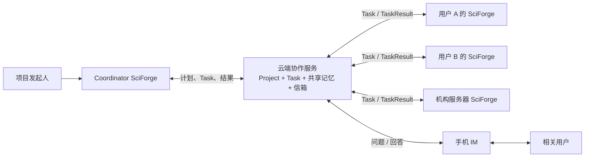
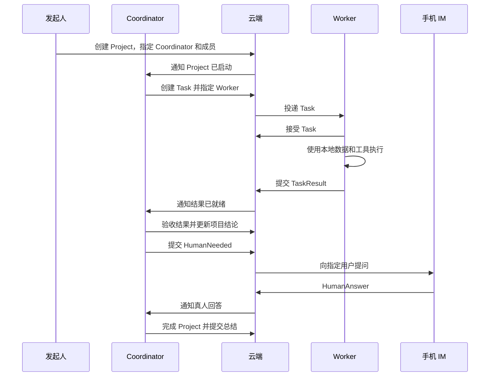

# SciForge 多用户端—云协同设计方案

## 1. 设计目标

多个用户各自运行一套 SciForge。任何用户都可以发起 Project，并由自己的 SciForge 调度其他
用户授权接入的 SciForge，共同完成复杂任务。

系统采用最简单的协作结构：

- **一台 Coordinator SciForge** 负责规划、分工和汇总；
- **多台 Worker SciForge** 负责执行具体任务；
- **一个云端协作服务** 保存共同状态并转发消息；
- **一个手机 IM** 处理需要真人回答的问题。

云端是共享账本和信箱，SciForge 是实际工作的 Agent。

## 2. 最小架构



所有跨用户协作都经过云端。Worker 只与自己的 Task 交互，Coordinator 统一维护 Project 计划。

这套机制已经接近多用户 PoC 的最小闭环，因为协作只依赖五件事：

1. Agent 注册：知道有哪些 SciForge 可以工作；
2. Project：保存共同目标和成员；
3. Task：明确谁负责什么；
4. 信箱：让在线和离线 Agent 都能收发消息；
5. Project Record：沉淀可以被所有成员继续使用的结论。

云端使用一个服务、一个 PostgreSQL 和一个 WebSocket 入口即可实现这些能力。

## 3. 三类角色

Coordinator 和 Worker 是同一种 SciForge 在 Project 中承担的不同角色，不需要部署两套产品。
一台 SciForge 可以在自己的 Project 中担任 Coordinator，同时在其他 Project 中担任 Worker。

### 3.1 Coordinator SciForge

每个 Project 同时指定一个 Coordinator。它负责：

- 读取 Project 目标和共享记录；
- 把目标拆成 Task；
- 根据 Agent 能力选择 Worker；
- 验收 TaskResult；
- 根据结果继续派发任务；
- 把关键结果写成项目结论；
- 把需要真人判断的问题发送给手机 IM；
- 生成最终总结。

Coordinator 是 Project 计划和正式结论的唯一写入者。

### 3.2 Worker SciForge

桌面、服务器或云机器上的 SciForge 都可以成为 Worker。它负责：

- 注册自己的能力，例如代码、检索、本地文件或 GPU；
- 接受适合自己的 Task；
- 在本地使用模型、工具、数据和网络资源执行任务；
- 返回结果摘要、证据引用和执行状态；
- 在缺少信息或授权时请求真人处理。

Worker 只更新自己承担的 Task。

### 3.3 云端协作服务

云端负责：

- 用户和 Agent 身份；
- Agent 能力、在线状态和信箱；
- Project、成员和 Coordinator；
- Task 分配、状态和结果；
- Project 共享长期记忆；
- 手机问题和真人回答；
- 消息幂等和 Task 版本控制。

模型推理、工具调用和科研计算均由 SciForge 节点执行。

## 4. 协作机制

一次 Project 按照下面的流程运行：



### 4.1 Project 单写者

Project 保存 `coordinatorAgentId` 和 `revision`。只有当前 Coordinator 可以修改计划、创建 Task、
确认正式结论和完成 Project。

### 4.2 Task 明确执行者

每个 Task 包含：

```ts
type Task = {
  id: string
  projectId: string
  revision: number
  title: string
  instruction: string
  assigneeAgentId: string
  status: 'offered' | 'running' | 'needs_human' | 'completed' | 'failed'
  result?: {
    summary: string
    evidenceRefs?: string[]
    artifactRefs?: string[]
  }
}
```

Worker 通过 `taskId + revision` 识别一次执行。Coordinator 改派或修改任务时增加 revision。

### 4.3 Agent 通过信箱收发消息

云端为每个 Agent 保存一个持久信箱。WebSocket 用于实时通知，数据库用于离线保存。Agent 重连
后从最后确认的消息继续读取。

PoC 只需要以下消息：

```text
project.started
task.offered
task.accepted
task.completed
task.failed
task.needs_human
human.answered
project.completed
```

每条消息带有唯一 `messageId`，云端只处理一次。

## 5. 云端与本地分别存什么

采用“双层记忆”：个人上下文留在本地，共同项目知识保存在云端。

| 信息 | 权威存储位置 | 用途 |
| --- | --- | --- |
| 用户、Agent 名称和公开能力 | 云端 | 身份识别和任务路由 |
| Project 目标、成员、Coordinator 和状态 | 云端 | 所有成员共享同一项目状态 |
| Task 指令、执行者、状态和 revision | 云端 | 跨节点任务协调 |
| TaskResult 摘要和证据引用 | 云端 | Coordinator 验收和后续任务使用 |
| 已确认的 observation、decision、summary | 云端 | Project 共享长期记忆 |
| Agent 收件箱、投递状态和真人回答 | 云端 | 离线协作和恢复 |
| 原始数据、实验文件和工作区 | 本地 | 由拥有访问权的 SciForge 使用 |
| 用户个人长期记忆和完整对话历史 | 本地 | 服务该用户自己的 Agent |
| 模型配置、API Key、VPN 凭据和工具授权 | 本地 | 控制本地运行环境和资源权限 |
| 工具执行日志和任务临时上下文 | 本地 | 执行、诊断和断线恢复 |
| 大型结果文件 | 本地或用户选择的对象存储 | 云端 Project 保存引用、摘要和校验信息 |

这里的“云端长期记忆”专指 **Project 共享记忆**，而不是每个用户 Agent 的全部长期记忆。

### 5.1 信息如何从本地进入云端

信息只有一条共享路径：

```text
本地数据或资源
  → Worker 执行 Task
  → 生成 TaskResult 摘要和引用
  → Coordinator 验收
  → 写入 Project Record
```

Project Record 只有三种类型：

- `observation`：Worker 得到的事实、实验结果或状态；
- `decision`：Coordinator 或真人确认的决定；
- `summary`：当前阶段或整个 Project 的总结。

本地完整记忆无需与云端双向同步。Agent 在接到 Task 时读取相关 Project Record，完成后只提交
与该 Task 相关的结果。

## 6. 权限和数据边界

系统按“谁拥有事实，谁拥有权限”划分边界：

| 边界 | 规则 |
| --- | --- |
| 项目状态 | 云端是 Project、Task 和共享记录的事实源 |
| 项目计划 | Coordinator 是计划、Task 创建和正式结论的唯一作者 |
| 本地资源 | SciForge 节点决定本地文件、工具、GPU 和网络资源的使用权限 |
| 真人授权 | 目标用户通过本地 SciForge 或手机 IM 作出确认 |
| 数据共享 | Worker 主动提交 TaskResult；提交内容决定进入云端的范围 |
| 机构网络 | 机构内 SciForge 主动连接云端，并在本地 VPN 环境中访问机构资源 |

远程 Task 是一份工作指令。真正访问文件、GPU、数据库或外部系统时，仍由 Worker 所在的
SciForge 按本地权限执行。

对于需要 VPN 的机构资源，运行方式是：

```text
云端投递 Task
  → 机构内 SciForge 收到 Task
  → SciForge 通过本机 VPN 访问资源
  → SciForge 在机构内完成计算
  → 向云端返回结果摘要或授权上传的产物
```

云端保存资源的描述和任务结果，机构内 SciForge 保存资源的真实访问能力。

## 7. 最小云端数据模型

```text
User
Agent
Project
ProjectMember
Task
ProjectRecord
InboxMessage
```

其中：

- `Agent` 保存所有者、能力和在线状态；
- `Project` 保存目标、Coordinator、状态和 revision；
- `Task` 保存指令、执行者、状态和结果；
- `ProjectRecord` 保存 observation、decision 和 summary；
- `InboxMessage` 保存面向 Agent 或真人的待处理消息及确认状态。

这七个对象足以完成 PoC。手机问题作为 `InboxMessage` 的一种类型，无需建立另一套协作系统。

## 8. 开会场景：先解决议题，再决定是否开会

### 8.1 发起 Project

五名同学正在共同推进一个科研项目。负责人在自己的 SciForge 中创建：

```text
Project：解决本周项目议题

目标：
1. 找到模型精度下降原因
2. 确认数据清洗进度
3. 判断是否切换训练方案
4. 形成下周任务分配
5. 判断是否需要真人会议

成员：负责人、A、B、C、D
Coordinator：负责人的 SciForge
```

云端保存 Project，并通知 Coordinator 开始工作。

### 8.2 Coordinator 分派任务

Coordinator 查询成员 Agent 的能力，创建三个 Task：

| Task | Worker | 工作内容 |
| --- | --- | --- |
| T1 | A 的服务器 SciForge | 通过机构 VPN 读取训练日志，分析精度下降原因 |
| T2 | B 的桌面 SciForge | 读取本地清洗记录，汇总完成度和剩余工作 |
| T3 | C 的 SciForge | 检索资料并比较两种训练方案的成本和风险 |

云端把 Task 放入三个 Worker 的信箱。三个 Worker 在各自环境中并行执行。

### 8.3 Worker 返回结果

三个 Worker 分别提交：

```text
T1：精度下降来自预处理配置变化，小规模复现实验支持该结论。
T2：数据清洗已完成 90%，剩余部分预计周四完成。
T3：方案 A 三天可恢复；方案 B 约需七天，长期扩展性更好。
```

原始训练日志和数据文件保存在各自机构或电脑中。云端保存 TaskResult 摘要、证据引用和结果文件
的授权链接。

Coordinator 验收三个结果，并把它们保存为 Project observation。

### 8.4 Coordinator 请求一次真人决定

技术事实已经清楚，剩余问题是负责人如何权衡时间与长期收益。Coordinator 生成一条
HumanNeeded，通过手机 IM 发给负责人：

```text
需要决定：本周采用哪种训练安排？

已经确认：
- 精度下降原因已经定位；
- 修复现有方案需要约 3 天；
- 切换新方案需要约 7 天；
- 新方案长期扩展性更好。

Agent 建议：本周修复方案 A，同时安排一个小规模方案 B 验证。

请选择：
1. 修复方案 A
2. 切换方案 B
3. 采用 Agent 建议
4. 需要多人讨论
```

负责人在手机上回答，云端保存 HumanAnswer 并通知 Coordinator。Coordinator 验收回答后，将其
写成 Project decision 并继续执行。

### 8.5 形成结果

如果负责人选择“采用 Agent 建议”，Coordinator 创建下周任务并完成 Project：

```text
已解决：精度下降原因、数据清洗进度、训练方案比较
已决定：修复方案 A，同时验证方案 B
需要召开会议：否
下一步：A 修复配置，B 完成清洗，C 验证方案 B
```

如果负责人选择“需要多人讨论”，Coordinator 生成最小会议包：

```text
会议议题：是否承担额外四天成本切换训练方案
建议参与人：负责人、A、C
会前材料：复现实验、方案对比、时间风险
会议目标：确定本周训练路线
建议时长：15 分钟
```

其他成员直接收到 Project 总结和自己的下一步 Task。

## 9. 最终设计结论

PoC 采用一套 SciForge、两种项目角色和一个云端协作服务：

- Coordinator SciForge 负责计划；
- Worker SciForge 负责执行；
- 云端负责共同状态和消息；
- 本地负责个人记忆、数据、工具和资源访问；
- 手机负责真人回答；
- Project Record 是跨用户共享的长期记忆。

这个结构既能完成多用户端—云协作，也能让每个机构继续通过自己的 SciForge 和 VPN 使用内部
资源。后续增加 GPU 调度或跨机构数据协作时，仍然沿用同一条链路：云端分配 Task，机构内
SciForge 执行，云端接收经过授权的结果。
