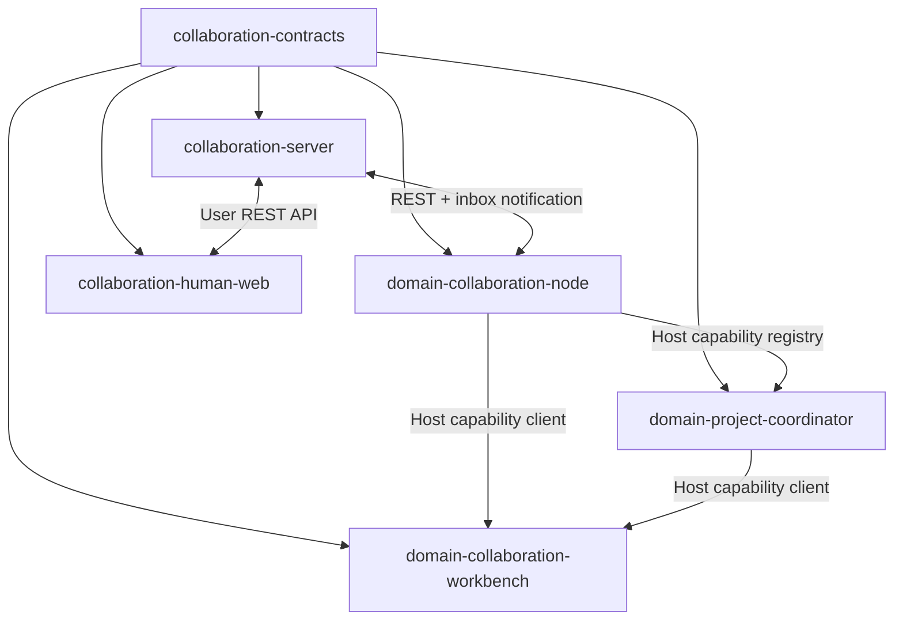

# SciForge 多用户协作：插件化工作包

## 1. 拆分结论

这套功能适合拆成独立、可版本化的包，但运行形态分为三种：

| 工作包 | 形态 | 建议负责人 |
| --- | --- | --- |
| `@sciforge/collaboration-server` | 独立云端服务 | A |
| `@sciforge/domain-collaboration-node` | SciForge 领域插件 | B |
| `@sciforge/domain-project-coordinator` | SciForge 领域插件 | C |
| `@sciforge/domain-collaboration-workbench` | SciForge 领域插件 | D |
| `@sciforge/collaboration-human-web` | 独立响应式 Web 应用 | E |

五个工作包共同依赖一个纯合同包：

```text
@sciforge/collaboration-contracts
```

合同包由五人第一天共同冻结，之后由 E 维护版本、fixtures 和兼容性测试。

三个 SciForge 领域插件都使用 `sciforge.domain.json` 声明，通过仓库已有的生成式 composition 安装。
它们只依赖 `@sciforge/domain-sdk` 和公共合同，不导入 SciForge Host 私有路径，也不直接导入其他
领域插件的实现。

## 2. 共享合同包

### 2.1 功能描述

`@sciforge/collaboration-contracts` 是所有模块唯一共享的协议来源，包含：

- User、Agent、Project、Task、ProjectRecord 和 InboxMessage schema；
- REST 请求和响应 schema；
- WebSocket 通知 schema；
- SciForge capability 的 input/output schema；
- 错误码、revision 和幂等规则；
- 会议场景 JSON fixtures。

合同使用 Zod 定义，并从 schema 推导 TypeScript 类型。

### 2.2 核心接口

```ts
type AgentSummary = {
  id: string
  ownerUserId: string
  displayName: string
  capabilities: string[]
  online: boolean
  lastSeenAt: string
}

type Project = {
  id: string
  goal: string
  memberUserIds: string[]
  coordinatorAgentId: string
  status: 'active' | 'needs_human' | 'completed' | 'failed'
  revision: number
}

type Task = {
  id: string
  projectId: string
  revision: number
  title: string
  instruction: string
  assigneeAgentId: string
  status: 'offered' | 'running' | 'needs_human' | 'completed' | 'failed'
  result?: TaskResult
}

type TaskResult = {
  summary: string
  evidenceRefs?: string[]
  artifactRefs?: string[]
}

type TaskDraft = {
  title: string
  instruction: string
  assigneeAgentId: string
}

type ProjectRecord = {
  id: string
  projectId: string
  type: 'observation' | 'decision' | 'summary'
  authorUserId: string
  authorAgentId?: string
  sourceTaskId?: string
  content: string
  createdAt: string
}

type ProjectRecordDraft = {
  type: 'observation' | 'decision' | 'summary'
  sourceTaskId?: string
  content: string
}

type HumanRequestDraft = {
  projectId: string
  taskId?: string
  targetUserId: string
  question: string
  facts: string[]
  options: Array<{ id: string; label: string }>
  recommendation?: string
}

type InboxMessage = {
  id: string
  sequence: number
  recipientType: 'agent' | 'user'
  recipientId: string
  projectId: string
  taskId?: string
  kind:
    | 'project.started'
    | 'task.offered'
    | 'task.completed'
    | 'task.failed'
    | 'task.needs_human'
    | 'human.answered'
    | 'project.completed'
  payload: unknown
  createdAt: string
  acknowledgedAt?: string
}
```

`InboxMessage.kind` 对应的 payload 也在合同包中定义为判别联合；Server 和客户端按 `kind` 使用
对应 schema 解析，业务代码只接收验证后的 payload。

所有写操作都携带：

```ts
type WriteContext = {
  idempotencyKey: string
  expectedRevision?: number
}
```

统一错误码：

```text
unauthenticated
forbidden
not_found
revision_conflict
idempotency_conflict
invalid_transition
agent_offline
```

### 2.3 验收标准

- [ ] 所有 schema 使用 `.strict()`，未知字段会被拒绝；
- [ ] Server、三个领域插件和 Human Web 都直接依赖同一个合同包；
- [ ] 每个消息和 API 都有成功、权限失败、revision 冲突和重复请求 fixture；
- [ ] 同一组 JSON fixtures 能同时通过 Server 和 SciForge TypeScript 测试；
- [ ] 合同包不包含数据库、网络、UI 或 Agent 执行逻辑；
- [ ] `npm test` 覆盖所有状态枚举、消息类型和错误码。

## 3. 工作包 A：云端协作服务

### 3.1 功能描述

包名：`@sciforge/collaboration-server`

负责共享事实和消息：

- 用户身份和 Agent 设备绑定；
- Agent 注册、能力、心跳和在线状态；
- Project、成员、Coordinator 和 revision；
- Task 状态机、assignee 和 TaskResult；
- ProjectRecord 共享长期记忆；
- Agent/User 持久信箱；
- HumanNeeded 和 HumanAnswer；
- 幂等、权限和断线恢复。

实现采用一个服务进程、一个 PostgreSQL 和一个 WebSocket 入口。

### 3.2 对外接口

状态查询和状态变更统一走 REST：

```text
POST /v1/agents/register
POST /v1/agents/heartbeat
GET  /v1/agents

POST /v1/projects
GET  /v1/projects/:projectId
GET  /v1/projects/:projectId/tasks
POST /v1/projects/:projectId/tasks
POST /v1/projects/:projectId/records
POST /v1/projects/:projectId/complete

POST /v1/tasks/:taskId/accept
POST /v1/tasks/:taskId/complete
POST /v1/tasks/:taskId/fail
POST /v1/tasks/:taskId/needs-human

GET  /v1/inbox?after=:sequence
POST /v1/inbox/:messageId/ack

GET  /v1/human-requests
POST /v1/human-requests/:requestId/answer
```

每个写请求使用：

```text
Authorization: Bearer <device-or-user-token>
Idempotency-Key: <unique-key>
If-Match: <expected-revision>  // 需要版本控制时
```

WebSocket：

```text
GET /v1/stream

server → client:
{
  "type": "inbox.available",
  "latestSequence": 42
}
```

WebSocket 只提供实时唤醒。客户端收到通知后使用 `/v1/inbox` 读取持久消息。

### 3.3 内部边界

- PostgreSQL 是 Project、Task、ProjectRecord 和 InboxMessage 的唯一事实源；
- 每个状态变化在同一事务中更新实体并写入信箱；
- Server 只引用合同包，不引用任何 SciForge 桌面实现；
- Agent 的模型、工具和工作区信息不进入 Server 数据模型。

### 3.4 验收标准

- [ ] 三个不同用户的 Agent 可以注册、心跳并被查询；
- [ ] 用户可以创建 Project、添加成员并指定 Coordinator；
- [ ] Coordinator 可以创建 Task，目标 Worker 离线时消息仍保存在信箱；
- [ ] Worker 重连后能从给定 sequence 获取缺失消息并确认；
- [ ] assignee 可以完成 Task，其他 Agent 得到 `forbidden`；
- [ ] 过期 revision 得到 `revision_conflict`；
- [ ] 相同 Idempotency-Key 重试返回相同结果且只产生一次状态变化；
- [ ] Coordinator 可以追加 decision/summary 并完成 Project；
- [ ] 服务进程重启后 Project、Task 和未确认信箱消息保持完整；
- [ ] 使用 Fake Agent 跑通一次会议场景 API 测试。

## 4. 工作包 B：SciForge 协作节点插件

### 4.1 功能描述

包名：`@sciforge/domain-collaboration-node`

模块 ID：`sciforge.collaboration-node`

这是每台 SciForge 与云端之间的唯一连接器，负责：

- 保存本机 `agentId` 和设备凭据；
- 配置云端地址并注册 Agent；
- 上报能力和心跳；
- 维护 WebSocket 和信箱 cursor；
- 接收 TaskOffer；
- 通过 Host 提供的 `DomainMainAgentExecutionHost.run()` 执行 Task；
- 上传 TaskResult 或 TaskFailure；
- 在本地保存活跃 `taskId + revision`；
- 向其他 SciForge 插件提供受治理的 collaboration capabilities。

### 4.2 Manifest 与入口

```json
{
  "contractVersion": 1,
  "kind": "trusted-compile-time",
  "packageName": "@sciforge/domain-collaboration-node",
  "publisher": { "id": "sciforge", "displayName": "SciForge" },
  "module": {
    "id": "sciforge.collaboration-node",
    "displayName": "Collaboration Node",
    "version": "1.0.0",
    "hostApi": { "minimum": "1.0.0", "maximumExclusive": "2.0.0" },
    "priority": 100
  },
  "entrypoints": [
    {
      "process": "main",
      "export": "./main",
      "contributions": [
        { "kind": "main.capability-factory", "id": "collaboration-node.capabilities" },
        { "kind": "main.runtime-lifecycle", "id": "collaboration-node.lifecycle" }
      ]
    }
  ]
}
```

### 4.3 提供的 Capability 接口

```ts
interface CollaborationNodeCapabilities {
  'collaboration.connection.status': {
    input: {}
    output: { connected: boolean; agent?: AgentSummary; lastSequence: number }
  }
  'collaboration.agents.list': {
    input: { projectId?: string }
    output: { agents: AgentSummary[] }
  }
  'collaboration.projects.create': {
    input: { goal: string; memberUserIds: string[]; coordinatorAgentId: string }
    output: { project: Project }
  }
  'collaboration.projects.read': {
    input: { projectId: string }
    output: { project: Project; tasks: Task[]; records: ProjectRecord[] }
  }
  'collaboration.tasks.create': {
    input: WriteContext & { projectId: string; tasks: TaskDraft[] }
    output: { projectRevision: number; tasks: Task[] }
  }
  'collaboration.records.append': {
    input: WriteContext & { projectId: string; records: ProjectRecordDraft[] }
    output: { projectRevision: number; records: ProjectRecord[] }
  }
  'collaboration.human.request': {
    input: WriteContext & HumanRequestDraft
    output: { requestId: string; projectRevision: number }
  }
  'collaboration.projects.complete': {
    input: WriteContext & { projectId: string; summary: string }
    output: { project: Project }
  }
}
```

所有 capability 使用合同包中的 Zod schema，通过 Host capability registry 注册。权限策略为：

| Capability | audience | effect | approval | idempotency |
| --- | --- | --- | --- | --- |
| connection.status、agents.list、projects.read | ui / agent / system | read | none | none |
| projects.create | ui | external-write | confirmation | required |
| tasks.create、records.append、human.request、projects.complete | system | external-write | none | required |

Coordinator 的自动写入由云端 `coordinatorAgentId`、Project revision 和幂等键共同授权；启动
Coordinator 由用户在 Workbench 中单独确认。

### 4.4 消费的 Host 接口

```ts
type CollaborationNodeMainHost = DomainMainHost

type CollaborationNodeLifecycleRequirements = {
  agentExecution: DomainMainAgentExecutionHost
  userDataDir: string
  signal: AbortSignal
  log(entry: DomainMainRuntimeLogEntry): void
}
```

`createDomainMainEntry()` 从 `DomainMainHost.getUserDataDir()` 创建本地状态服务；生命周期贡献从
`DomainMainRuntimeLifecycleContext` 取得 `agentExecution`、`signal` 和日志。插件启动时检查
`agentExecution` 可用，再开始领取任务。节点插件只使用 Domain SDK 公开 Host。

### 4.5 验收标准

- [ ] 插件通过 `sciforge.domain.json` 和生成式 composition 被发现；
- [ ] 使用 Fake Server 完成设备注册、心跳、断线和信箱续读；
- [ ] TaskOffer 能调用 Fake `DomainMainAgentExecutionHost.run()` 并上传 TaskResult；
- [ ] 相同 `taskId + revision` 重复投递只启动一次 Agent 执行；
- [ ] 新 revision 可以启动一次新的任务执行；
- [ ] 本地工作区路径、API Key、VPN 凭据和完整执行日志不会进入 TaskResult；
- [ ] 所有公开 capability 都通过合同 schema 验证输入输出；
- [ ] 包边界测试证明插件不导入 Host 私有路径；
- [ ] 两台真实 SciForge 通过云端完成一次 Task → TaskResult。

## 5. 工作包 C：Project Coordinator 插件

### 5.1 功能描述

包名：`@sciforge/domain-project-coordinator`

模块 ID：`sciforge.project-coordinator`

负责一个 Project 的规划循环：

- 读取 Project、Task 和 ProjectRecord；
- 调用本地 Agent Runtime 生成有限计划；
- 根据 Agent 能力选择 Worker；
- 通过 collaboration capabilities 创建 Task；
- 轮询并验收 TaskResult；
- 把结果提升为 observation；
- 创建 HumanNeeded；
- 收到 HumanAnswer 后形成 decision；
- 写入 summary 并完成 Project。

### 5.2 Manifest 与入口

```json
{
  "contractVersion": 1,
  "kind": "trusted-compile-time",
  "packageName": "@sciforge/domain-project-coordinator",
  "publisher": { "id": "sciforge", "displayName": "SciForge" },
  "module": {
    "id": "sciforge.project-coordinator",
    "displayName": "Project Coordinator",
    "version": "1.0.0",
    "hostApi": { "minimum": "1.0.0", "maximumExclusive": "2.0.0" },
    "priority": 100
  },
  "entrypoints": [
    {
      "process": "main",
      "export": "./main",
      "contributions": [
        { "kind": "main.capability-factory", "id": "project-coordinator.capabilities" },
        { "kind": "main.runtime-lifecycle", "id": "project-coordinator.lifecycle" }
      ]
    }
  ]
}
```

### 5.3 提供的 Capability 接口

```ts
interface ProjectCoordinatorCapabilities {
  'collaboration.coordinator.start': {
    input: {
      projectId: string
      limits?: { maxTasks: number; maxRounds: number; maxRetriesPerTask: number }
    }
    output: { runId: string; state: 'running' }
  }
  'collaboration.coordinator.status': {
    input: { projectId: string }
    output: ProjectCoordinatorStatus
  }
  'collaboration.coordinator.resume': {
    input: WriteContext & { projectId: string }
    output: { runId: string; state: 'running' }
  }
}

type ProjectCoordinatorStatus = {
  state: 'idle' | 'running' | 'waiting_tasks' | 'waiting_human' | 'completed' | 'failed'
  round: number
  activeTaskIds: string[]
  message?: string
}
```

Capability 策略：

| Capability | audience | effect | approval | idempotency |
| --- | --- | --- | --- | --- |
| coordinator.status | ui / agent / system | read | none | none |
| coordinator.start、coordinator.resume | ui / agent | external-write | confirmation | required |

### 5.4 消费的接口

- `DomainMainAgentExecutionHost.run()`：生成计划、验收结果和总结；
- `DomainMainSystemCapabilityInvoker`：调用 Node 插件提供的 Project、Task、Record 和 Human
  capabilities；
- `@sciforge/collaboration-contracts`：解析所有输入输出。

Coordinator 不直接访问 Server HTTP，也不导入 Node 插件实现。

### 5.5 验收标准

- [ ] 使用 Fake collaboration capabilities 即可独立运行；
- [ ] 输入会议 Project 后创建三个能力匹配的 Task；
- [ ] 两个以上 Task 可以同时处于运行状态；
- [ ] Worker 结果乱序到达时仍能形成正确 observation；
- [ ] 缺少真人判断时只生成一条结构完整的 HumanNeeded；
- [ ] HumanAnswer 到达后能够继续原 Project；
- [ ] 最终生成 decision、summary 和下一步 Task；
- [ ] `maxTasks`、`maxRounds` 和 `maxRetriesPerTask` 均被强制执行；
- [ ] 非当前 Coordinator 启动时得到 `forbidden`；
- [ ] 重启后可以根据云端 Project 状态恢复，不依赖内存中的完整对话。

## 6. 工作包 D：Project Workbench 插件

### 6.1 功能描述

包名：`@sciforge/domain-collaboration-workbench`

模块 ID：`sciforge.collaboration-workbench`

负责 SciForge 桌面端的项目入口：

- 配置云端地址和绑定当前 Agent；
- 查看连接状态和可用 Agent；
- 创建 Project、选择成员和 Coordinator；
- 启动 Coordinator；
- 查看 Task、Worker、ProjectRecord 和真人问题；
- 查看最终总结。

Workbench 只展示和调用公开 capability，自身不保存第二份 Project 状态。

### 6.2 Manifest 与入口

```json
{
  "contractVersion": 1,
  "kind": "trusted-compile-time",
  "packageName": "@sciforge/domain-collaboration-workbench",
  "publisher": { "id": "sciforge", "displayName": "SciForge" },
  "module": {
    "id": "sciforge.collaboration-workbench",
    "displayName": "Collaboration Workbench",
    "version": "1.0.0",
    "hostApi": { "minimum": "1.0.0", "maximumExclusive": "2.0.0" },
    "priority": 100
  },
  "contributionContracts": {
    "collaboration-workbench.panel": {
      "location": "workbench.right-panel",
      "title": "Collaboration",
      "resourceKind": "collaboration-project"
    },
    "collaboration-workbench.toolbar": {
      "location": "workbench.topbar",
      "commandId": "collaboration-workbench.open",
      "label": "Collaboration"
    }
  },
  "entrypoints": [
    {
      "process": "renderer",
      "export": "./renderer",
      "contributions": [
        { "kind": "renderer.workbench-right-panel", "id": "collaboration-workbench.panel" },
        { "kind": "renderer.command", "id": "collaboration-workbench.open" },
        { "kind": "renderer.workbench-toolbar-action", "id": "collaboration-workbench.toolbar" }
      ]
    }
  ]
}
```

### 6.3 消费的 Capability 接口

```text
collaboration.connection.status
collaboration.agents.list
collaboration.projects.create
collaboration.projects.read
collaboration.coordinator.start
collaboration.coordinator.status
collaboration.coordinator.resume
```

UI 通过 Host 的通用 capability client 调用这些 action，不新增领域专用 IPC。

### 6.4 UI 输入输出

```ts
type CreateProjectForm = {
  goal: string
  memberUserIds: string[]
  coordinatorAgentId: string
}

type ProjectViewModel = {
  project: Project
  agents: AgentSummary[]
  tasks: Task[]
  records: ProjectRecord[]
  coordinatorStatus?: ProjectCoordinatorStatus
}
```

### 6.5 验收标准

- [ ] 插件通过 renderer manifest contribution 出现在工作台；
- [ ] 使用 Fake capability client 可以独立开发和测试；
- [ ] 用户可以完成“输入目标 → 选择成员 → 选择 Coordinator → 创建 Project”；
- [ ] Project 页面能展示 Task 执行者、状态、结果摘要和 ProjectRecord；
- [ ] 页面刷新后从 capability 重新读取云端事实；
- [ ] `revision_conflict`、Agent 离线和权限错误有明确提示；
- [ ] Workbench 不直接访问数据库或 Server HTTP；
- [ ] Renderer 不导入 main、shared 或其他领域插件私有代码；
- [ ] source 和 packaged app 中的插件入口均可加载。

## 7. 工作包 E：Human Inbox Web

### 7.1 功能描述

包名：`@sciforge/collaboration-human-web`

这是面向手机浏览器的响应式 Web 应用，负责：

- 用户登录；
- 查看待回答的 HumanNeeded；
- 查看 Agent 已确认事实、推荐方案和选项；
- 提交 HumanAnswer；
- 查看 Project Briefing 和 FinalResult。

Human Web 直接使用 collaboration-server 的用户 API，与 Agent 信箱共用 InboxMessage 和
ProjectRecord 合同。

### 7.2 对外接口

```text
GET  /v1/human-requests?status=pending
GET  /v1/human-requests/:requestId
POST /v1/human-requests/:requestId/answer
GET  /v1/projects/:projectId
GET  /v1/projects/:projectId/records
GET  /v1/inbox?after=:sequence
POST /v1/inbox/:messageId/ack
GET  /v1/stream
```

提交回答：

```ts
type SubmitHumanAnswerInput = WriteContext & {
  requestId: string
  selectedOptionId?: string
  text?: string
}

type SubmitHumanAnswerOutput = {
  requestId: string
  status: 'answered'
  answeredAt: string
}
```

### 7.3 同时负责的集成资产

- 共享合同包的版本和 fixtures；
- Fake Server 和 Fake Agent；
- 五个工作包的一键启动环境；
- 完整会议场景 E2E；
- 断线、重复提交和进程重启测试。

### 7.4 验收标准

- [ ] 390px 宽度下可以完成查看问题、选择方案和提交回答；
- [ ] 待处理列表只展示当前用户有权处理的消息；
- [ ] HumanNeeded 页面展示问题、事实、建议、选项和关联 Project；
- [ ] 相同 Idempotency-Key 重复提交只产生一份 HumanAnswer；
- [ ] 回答完成后状态变为 answered，并能查看 Project 后续结果；
- [ ] FinalResult 能展示已解决事项、正式决定和下一步 Task；
- [ ] 使用 Fake Server 可以独立运行前端测试；
- [ ] E2E 能跑通三个 SciForge、一个 Coordinator 和一次手机回答；
- [ ] E2E 覆盖 Worker 断线恢复和 Server 重启恢复。

## 8. 依赖方向



依赖规则：

1. 合同包是唯一共享源码；
2. Server 是云端状态事实源；
3. Node 是 SciForge 访问 Server 的唯一适配器；
4. Coordinator 和 Workbench 通过 Host capability 使用 Node；
5. Human Web 通过用户 REST API 使用 Server；
6. 跨包测试使用 public contract 和 Fake，不读取其他包内部状态。

## 9. 五人并行启动条件

第一天共同交付：

- [ ] 冻结合同包 v1 的 schema 和错误码；
- [ ] 冻结 REST 路径、capability ID 和消息类型；
- [ ] 提供会议 Project、三个 TaskResult 和一个 HumanAnswer fixture；
- [ ] E 提供 Fake Server，A 提供 OpenAPI stub；
- [ ] 每个工作包建立独立 package、测试命令和公开 entrypoint。

第二天开始：

- A 使用 Fake Agent 开发 Server；
- B 使用 Fake Server 开发 Node；
- C 使用 Fake capabilities 开发 Coordinator；
- D 使用 Fake capability client 开发 Workbench；
- E 使用 Fake Server 开发 Human Web，并维护 E2E。

五个人可以在合同冻结后并行推进，首次真实集成只需要依次替换 Fake：Server → Node →
Coordinator → Workbench/Human Web。
