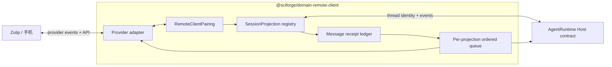

## Context

当前实现已经具备部分双向能力：远端消息能够以 `displayText` 写入 AgentRuntime thread，桌面 user message 与最终 assistant reply 也能够按 thread ID 镜像到 Zulip。但连接配置的事实源仍是 `RemoteChannelV1`：它同时承载 provider 凭据、远端 channel/topic、workspaceRoot、Agent profile、guard 所有权、thread 映射和最近消息。renderer 先选择 workspace，再创建 channel binding；main 进程按 provider 分别运行 Bot，并通过 Host 私有 IPC 与 renderer 交互。

这个聚合混合了五种不同生命周期：设备配对、远端账号认证、Session 投影、消息投递和 Agent 执行。可变 topic 名参与 channel config ID 生成，远端 topic 与本地 thread 也不是稳定的一一关系。

本设计只处理一台 SciForge 与其手机/IM 入口。它不替代跨客户端协作服务，不把 Zulip Server 变成 SciForge 的状态数据库，也不把远端用户变成本地工具权限主体。

## Goals / Non-Goals

**Goals:**

- 一次配对一台 SciForge 安装实例，不要求预选 Project。
- 让一个远端 topic 与一个本地 Session/thread 形成稳定的一一投影。
- 让桌面和手机看到同一条逻辑 user/assistant 消息流。
- 在网络重试、应用重启和 provider 重投事件下保持幂等和顺序。
- 允许同一 Project 具有多个并行 Session/topic。
- 保留发送者与来源审计，同时让同一 topic 的团队成员共享 Session。
- 用独立领域包统一拥有 backend、renderer、provider adapters 和持久合同。

**Non-Goals:**

- 持续捕获或远程复刻 SciForge 整个 GUI、鼠标焦点或右侧面板像素状态。
- 跨多台 SciForge 的 Project/Task 协作、Coordinator 选举或云端长期记忆。
- 同步流式 token、历史消息批量导入、编辑、删除、reaction 和任意附件。
- 通过 IM 绕过本地 capability broker 或自动批准高风险操作。
- 同时保留旧 workspace-channel binding 与新客户端配对两套运行路径。

## Architecture



Host 只提供通用 AgentRuntime、secret store、持久设置和领域 UI contribution。领域包拥有所有 provider 名称、远端 locator、消息 receipt 和连接管理 UI。

## Canonical Model

```ts
type RemoteClientPairing = {
  id: string
  installationId: string
  provider: string
  remoteAccountId: string
  secretRef: string
  ownerLease: { installationId: string; renewedAt: string }
  state: 'active' | 'paused' | 'revoked'
  createdAt: string
  updatedAt: string
}

type RemoteSessionProjection = {
  id: string
  pairingId: string
  runtimeId: string
  threadId: string
  workspaceRoot: string
  remoteContainerId: string
  remoteTopicLocator: string
  displayTitle: string
  state: 'active' | 'paused' | 'closed' | 'error'
  createdAt: string
  updatedAt: string
}

type RemoteMessageReceipt = {
  id: string
  projectionId: string
  origin: 'local' | 'remote'
  direction: 'user' | 'assistant'
  localItemId?: string
  localTurnId?: string
  remoteMessageId?: string
  senderId?: string
  senderName?: string
  contentHash: string
  state: 'accepted' | 'processing' | 'delivered' | 'failed'
  createdAt: string
  updatedAt: string
}
```

`secretRef` 只引用 secret store；序列化 settings 和诊断输出不能包含凭据。`RemoteSessionProjection.id` 使用随机稳定 ID，provider topic 名只是 locator，不参与内部身份生成。

## Decisions

### Pairing belongs to the installation

配对以 `installationId` 为本地身份，以 provider 账号/realm 为远端身份。创建 pairing 时只验证凭据、远端账号和所有权租约，不选择 workspace。一个 pairing 可以拥有任意数量的 Session projections。

这让“手机绑定一台 SciForge”成为事实，而不是从若干 channel bindings 反推客户端身份。

### Topic projects one Session, not one Project

Project 由 AgentRuntime thread 的 `workspaceRoot` 决定。topic 投影 thread，因此自然携带 Project 属性。同一 Project 可以有多个 topic 处理并行工作；同一 topic 不允许通过 `/new` 或 `/use project` 改指向另一个 thread。

首期命名建议使用 `<project-slug> · <session-title>`，但路由只使用 projection ID 与 provider locator。重命名是更新 locator/displayTitle，不改变 projection ID。

### Local thread is the execution and transcript authority

AgentRuntime thread 是 Agent 上下文、turn 和本地 transcript 的事实源。Zulip 保存远程副本和协作历史，但 provider 消息不会成为第二个 Agent 状态数据库。

- 桌面提交：先成功写入本地 thread，再创建 outbound receipt 并镜像 user message；turn 完成后镜像最终 assistant message。
- 远端提交：先按 `provider + remoteMessageId` 去重，再将发送者和来源元数据写入本地 user event，启动同一 thread 的 turn，最后发送 assistant reply。
- provider API 超时采用 at-least-once 重试；receipt 保证逻辑消息最多写入本地 thread 一次。

### Ordering is per projection

每个 projection 使用独立顺序队列。六名用户在同一 topic 中的消息按接收顺序执行，不并发修改同一个 thread。不同 topic/projection 可以并行执行。

队列状态和失败 receipt 持久化；进程重启后恢复未完成投递。失败不得静默丢弃，也不得通过创建第二个 thread 规避。

### Sender identity is metadata, not an implicit Session boundary

同一 topic 中的不同用户共享 thread。每条远端 user message 保存 provider user ID 和显示名，并注入 Agent 可见的来源元数据。若需要私人上下文，用户必须使用另一个受控远端容器/topic；系统不按 sender 暗中分叉。

### Session lifecycle is explicit

- `share/link session`：为现有 thread 创建 projection 和远端 topic。
- `new session`：先在选定 Project 中创建 thread，再创建新 topic/projection。
- `rename`：通过 projection 队列同步本地 thread 标题与远端 topic locator，并用 receipt 防止回环。
- `pause`：停止入站执行与出站镜像，但保留映射和历史。
- `close`：解除 projection；不删除本地 thread 或远端历史。
- `attach current`：显式将当前桌面 thread 链接为 projection；桌面焦点变化不会自动重绑。

### Message synchronization is append-only in the first release

首期只同步文本 user message、最终 assistant message和明确的系统状态。远端编辑/删除不会修改本地 Agent 历史；用户通过新消息更正。流式 delta 不发送到 provider，避免高频编辑、顺序竞争和 rate limit。

### Pairing does not expand authority

远端消息只能触发本地当前模型、模式和 capability broker 允许的行为。需要审批的能力在本地保持 pending；首期可向远端发送“需要桌面批准”状态，但不能从 Zulip 完成批准。管理员可配置允许使用 pairing 的远端用户/用户组；非允许用户的普通消息被忽略并审计。

### One domain package owns the canonical path

新建 `@sciforge/domain-remote-client`：

- `main` 入口拥有 pairing、projection、receipt、队列和 provider adapter runtime；
- `renderer` 入口贡献配对与 Session 分享 UI；
- `contracts` 入口导出严格 schema 和通用 provider adapter 接口；
- `sciforge.domain.json` 通过生成式 composition 注册入口。

Host 只依赖 domain SDK 合同。旧 Host Zulip runtime、remote channel runtime、provider IPC、ConnectPhone provider 分支和重复 settings 类型在迁移后删除，不保留 forwarding facade。

## Migration

本变更明确替换旧语义。升级时删除旧的手工 workspace-channel binding 读取路径，并在 UI 中提示用户：

1. 旧绑定已停用；
2. 重新验证本机 provider 凭据并创建客户端 pairing；
3. 选择需要共享的现有 Session，或从手机新建 Session；
4. 验证一次桌面到手机和手机到桌面的消息同步。

旧 API key 可以由 secret store 在用户确认后复用，但旧 channel config 不自动翻译为 projection，也不在运行时兼容读取。

## Risks / Trade-offs

- **Zulip topic 没有稳定独立 ID**：内部 projection ID 保持稳定，adapter 保存精确 locator 并处理 rename/move 事件；无法确认时进入 error 而不是猜测目标。
- **双向投递可能重复**：所有 provider 入站按远端 message ID 去重，所有出站按 receipt ID 重试，Bot 自己发送的事件直接过滤。
- **桌面与远端同时发送会竞争**：per-projection queue 串行化 turn；其他 projection 仍可并行。
- **一个 topic 多人共享上下文**：UI 明确显示共享状态和发送者；私人工作必须创建独立 projection。
- **离线期间 provider 历史可能很长**：adapter 使用游标和有界追赶策略；超过窗口时停止并要求人工确认，不批量执行陈旧指令。
- **领域迁移范围较大**：按合同、read-only projection、单 provider、双向同步、UI 和旧路径删除的顺序交付，但任何发布版本只保留一条生产路径。

## Verification Strategy

- 合同测试覆盖严格 schema、稳定 identity、凭据红线和 provider adapter fixtures。
- 使用 fake provider 与 fake AgentRuntime 验证入站、出站、重试、重启恢复、去重和 per-topic 顺序。
- Zulip 集成测试覆盖两名发送者共享一个 Session、两个 topics 并行、topic rename、Bot 自回声过滤和 API 失败。
- renderer 测试覆盖客户端级 pairing、Session 分享/解除、状态展示以及不要求 workspace 的初次配对。
- 架构测试禁止领域包导入 Host 私有路径，并禁止 Host 出现 provider ID/topic 分支或第二套镜像 IPC。
- 手工验收必须在桌面与手机各发一条消息，确认两端 transcript 的 user/assistant 顺序一致且没有重复。
